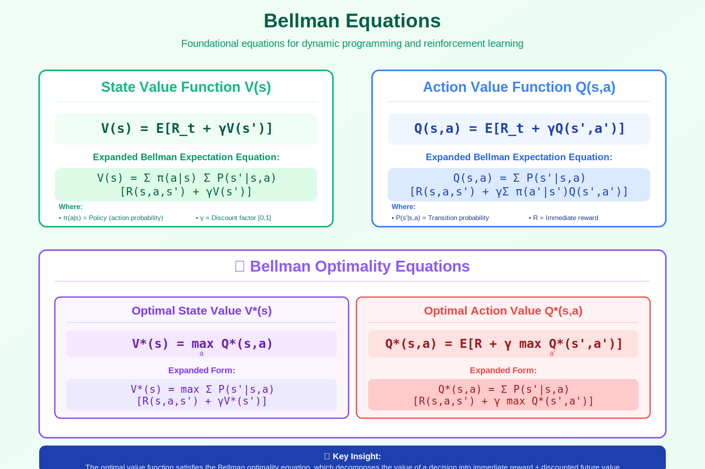

<!-- Animated Header -->
<p align="center">
  
</p>

<p align="center">
  
  
  
</p>


## 🔗 Navigation

⬅️ [Back: Value Methods](../) | ➡️ [Next: DQN](../02_dqn/)

---

## 🎯 Visual Overview



*Caption: Bellman equations express the value of a state as a function of successor state values. This recursive relationship is solved by Dynamic Programming (known dynamics) or Temporal Difference learning (unknown dynamics).*

---

## 📐 Core Definitions

### Value Function V(s)

```
Vπ(s) = Eπ[Gₜ | sₜ = s]
      = Eπ[Σₖ₌₀^∞ γᵏ rₜ₊ₖ | sₜ = s]

"Expected cumulative discounted reward starting from state s, following policy π"

Where:
• Gₜ = rₜ + γrₜ₊₁ + γ²rₜ₊₂ + ... (return)
• γ ∈ [0, 1] (discount factor)
• π(a|s) (policy: probability of action a in state s)

```

### Action-Value Function Q(s, a)

```
Qπ(s, a) = Eπ[Gₜ | sₜ = s, aₜ = a]

"Expected return starting from state s, taking action a, then following π"

Relationship:
Vπ(s) = Σₐ π(a|s) Qπ(s, a)  (V is expectation of Q over actions)
Qπ(s, a) = R(s,a) + γ Σₛ' P(s'|s,a) Vπ(s')

```

---

## 📐 Bellman Expectation Equations

### For V (State-Value)

```
Vπ(s) = Σₐ π(a|s) [R(s,a) + γ Σₛ' P(s'|s,a) Vπ(s')]
        ---------------------------------------------
        Expected immediate reward + discounted future value

Matrix form:
Vπ = Rπ + γ Pπ Vπ
Vπ = (I - γPπ)⁻¹ Rπ  (closed-form solution!)

```

### For Q (Action-Value)

```
Qπ(s, a) = R(s,a) + γ Σₛ' P(s'|s,a) Σₐ' π(a'|s') Qπ(s', a')
           ------------------------------------------------
           Immediate reward + expected Q of next state-action

```

---

## 📐 Bellman Optimality Equations

### Optimal Value Functions

```
V*(s) = maxₐ [R(s,a) + γ Σₛ' P(s'|s,a) V*(s')]
        ----------------------------------------
        Best action's expected value

Q*(s, a) = R(s,a) + γ Σₛ' P(s'|s,a) maxₐ' Q*(s', a')
           ------------------------------------------
           Immediate reward + max Q of next state

Relationship:
V*(s) = maxₐ Q*(s, a)
Q*(s, a) = R(s,a) + γ Σₛ' P(s'|s,a) V*(s')

```

### Optimal Policy

```
π*(s) = argmaxₐ Q*(s, a)

Once we have Q*, the optimal policy is to be greedy with respect to Q*.

```

---

## 📐 Solution Methods

### Dynamic Programming (Model-Based)

```
Value Iteration:
V_{k+1}(s) = maxₐ [R(s,a) + γ Σₛ' P(s'|s,a) Vₖ(s')]
Repeat until convergence.

Policy Iteration:
1. Policy Evaluation: Compute Vπ (solve linear system)
2. Policy Improvement: π'(s) = argmaxₐ Qπ(s,a)
Repeat until policy doesn't change.

```

### Temporal Difference (Model-Free)

```
TD(0) Update:
V(sₜ) ← V(sₜ) + α [rₜ + γV(sₜ₊₁) - V(sₜ)]
                   -------------------------
                        TD target - current estimate = TD error

Q-Learning:
Q(sₜ, aₜ) ← Q(sₜ, aₜ) + α [rₜ + γ maxₐ Q(sₜ₊₁, a) - Q(sₜ, aₜ)]

```

---

## 💻 Code Examples

```python
import numpy as np

def value_iteration(P, R, gamma=0.99, theta=1e-6):
    """
    Value iteration algorithm
    P: transition probabilities P[s,a,s'] 
    R: rewards R[s,a]
    """
    n_states, n_actions, _ = P.shape
    V = np.zeros(n_states)
    
    while True:
        V_new = np.zeros(n_states)
        for s in range(n_states):
            # Bellman optimality update
            Q_s = np.zeros(n_actions)
            for a in range(n_actions):
                Q_s[a] = R[s, a] + gamma * np.sum(P[s, a, :] * V)
            V_new[s] = np.max(Q_s)
        
        if np.max(np.abs(V_new - V)) < theta:
            break
        V = V_new
    
    # Extract policy
    policy = np.zeros(n_states, dtype=int)
    for s in range(n_states):
        Q_s = R[s, :] + gamma * np.sum(P[s, :, :] * V, axis=1)
        policy[s] = np.argmax(Q_s)
    
    return V, policy

def q_learning(env, n_episodes=1000, alpha=0.1, gamma=0.99, epsilon=0.1):
    """
    Q-Learning algorithm (model-free)
    """
    Q = np.zeros((env.n_states, env.n_actions))
    
    for episode in range(n_episodes):
        state = env.reset()
        done = False
        
        while not done:
            # ε-greedy action selection
            if np.random.random() < epsilon:
                action = np.random.randint(env.n_actions)
            else:
                action = np.argmax(Q[state])
            
            next_state, reward, done = env.step(action)
            
            # Q-learning update (Bellman optimality)
            td_target = reward + gamma * np.max(Q[next_state]) * (1 - done)
            td_error = td_target - Q[state, action]
            Q[state, action] += alpha * td_error
            
            state = next_state
    
    return Q

# TD Error for advantage estimation
def compute_td_error(V, states, rewards, next_states, dones, gamma=0.99):
    """
    δₜ = rₜ + γV(sₜ₊₁) - V(sₜ)
    Used in Actor-Critic methods
    """
    V_next = V(next_states) * (1 - dones)
    td_target = rewards + gamma * V_next
    td_error = td_target - V(states)
    return td_error

```

---

## 🌍 ML Applications

| Method | Bellman Equation Used | Application |
|--------|----------------------|-------------|
| **Q-Learning** | Bellman Optimality for Q | Classic RL |
| **DQN** | Q* with neural network | Atari games |
| **SARSA** | Bellman Expectation for Q | On-policy learning |
| **Actor-Critic** | Bellman for V (critic) | PPO, A2C |
| **Value Iteration** | Bellman Optimality for V | Planning |

---

## 📚 Resources

### 📖 Books

| Title | Author | Focus |
|-------|--------|-------|
| Sutton & Barto | [RL Book](http://incompleteideas.net/book/) | The RL bible |
| Bertsekas | Dynamic Programming | Theoretical foundations |
| David Silver Lecture 2 | [YouTube](https://www.youtube.com/watch?v=lfHX2hHRMVQ) | MDP & Bellman |
| 🇨🇳 贝尔曼方程详解 | [知乎](https://zhuanlan.zhihu.com/p/35261164) | 理论推导 |
| 🇨🇳 强化学习基础 | [B站](https://www.bilibili.com/video/BV1sd4y167NS) | 视频教程 |
| 🇨🇳 价值迭代算法 | [CSDN](https://blog.csdn.net/qq_30615903/article/details/80686611) | 代码实现 |

---

## 🔗 Where This Topic Is Used

| Topic | How Bellman Is Used |
|-------|---------------------|
| **Q-Learning** | Bellman optimality update |
| **DQN** | TD target = r + γ max Q |
| **A2C/A3C** | Advantage = TD error |
| **PPO** | GAE uses TD errors |
| **AlphaGo** | MCTS + value network |

---

⬅️ [Back: Value Methods](../) | ➡️ [Next: DQN](../02_dqn/)

---


<p align="center">
  
</p>
