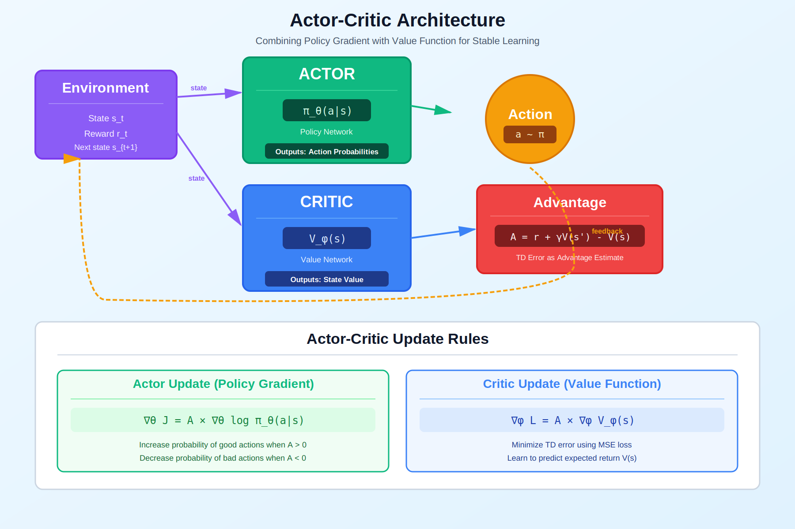

<!-- Animated Header -->
<p align="center">
  
</p>

<p align="center">
  
  
  
</p>


## 🔗 Navigation

⬅️ [Back: Policy Methods](../) | ➡️ [Next: Policy Gradient](../02_policy_gradient/)

---

## 🎯 Visual Overview



*Caption: Actor-Critic uses two networks: the Actor (policy) decides actions, while the Critic (value function) evaluates states. The advantage A = r + γV(s') - V(s) tells the actor which actions are better than average.*

---

## 📂 Overview

Actor-Critic methods combine the benefits of policy gradient (Actor) with value function estimation (Critic). The critic provides a baseline that dramatically reduces variance while maintaining unbiasedness in the policy gradient.

---

## 📐 Mathematical Foundations

### The Actor-Critic Framework

Actor-Critic algorithms maintain two parameterized functions:

```
Actor:  π_θ(a|s)  - Policy network (parameterized by θ)
Critic: V_ω(s)    - Value network (parameterized by ω)

```

### Policy Gradient with Baseline

The key insight is that we can subtract any baseline \( b(s) \) from the return without changing the expected gradient:

**Theorem (Baseline Invariance):**

```
∇_θ J(θ) = E_π[∇_θ log π_θ(a|s) · (Q^π(s,a) - b(s))]

Proof:
E[∇_θ log π_θ(a|s) · b(s)] = Σ_a π_θ(a|s) · ∇_θ log π_θ(a|s) · b(s)
                            = Σ_a ∇_θ π_θ(a|s) · b(s)
                            = b(s) · ∇_θ Σ_a π_θ(a|s)
                            = b(s) · ∇_θ 1 = 0

```

The optimal baseline that minimizes variance is \( b^*(s) = V^π(s) \).

### Advantage Function

The advantage function measures how much better an action is compared to the average:

```
A^π(s,a) = Q^π(s,a) - V^π(s)

Properties:
• E_a[A^π(s,a)] = 0  (zero mean)
• A^π(s,a) > 0 means action a is better than average
• A^π(s,a) < 0 means action a is worse than average

```

### TD Error as Advantage Estimate

The temporal difference (TD) error provides an unbiased estimate of the advantage:

```
δ_t = r_t + γV(s_{t+1}) - V(s_t)

Theorem: E[δ_t | s_t, a_t] = A^π(s_t, a_t)

Proof:
E[δ_t | s_t, a_t] = E[r_t + γV(s_{t+1}) | s_t, a_t] - V(s_t)
                  = Q^π(s_t, a_t) - V^π(s_t)
                  = A^π(s_t, a_t)

```

---

## 📐 Actor-Critic Update Equations

### Actor Update (Policy Gradient with Advantage)

```
∇_θ J(θ) = E_π[∇_θ log π_θ(a_t|s_t) · A_t]
         ≈ E_π[∇_θ log π_θ(a_t|s_t) · δ_t]

θ ← θ + α_θ · ∇_θ log π_θ(a_t|s_t) · δ_t

```

### Critic Update (TD Learning)

```
L_critic(ω) = E[(r_t + γV_ω(s_{t+1}) - V_ω(s_t))²]
            = E[δ_t²]

ω ← ω - α_ω · ∇_ω L_critic(ω)
  = ω + α_ω · δ_t · ∇_ω V_ω(s_t)

```

---

## 📐 A2C: Advantage Actor-Critic

A2C (Synchronous Advantage Actor-Critic) collects experiences from multiple parallel environments:

### Algorithm

```
Initialize policy π_θ, value function V_ω
For each iteration:
    # Collect n-step trajectories from N parallel environments
    For each environment i:
        Collect (s_t, a_t, r_t, s_{t+1}) for n steps
    
    # Compute n-step returns and advantages
    For each trajectory:
        G_t = r_t + γr_{t+1} + ... + γ^{n-1}r_{t+n-1} + γ^n V(s_{t+n})
        A_t = G_t - V(s_t)
    
    # Update networks
    L_actor = -E[log π_θ(a_t|s_t) · A_t]
    L_critic = E[(G_t - V_ω(s_t))²]
    L_entropy = -E[H(π_θ(·|s_t))]  # Entropy bonus
    
    L_total = L_actor + c_1 · L_critic + c_2 · L_entropy
    
    θ, ω ← θ, ω - α · ∇L_total

```

### N-Step Returns

```
G_t^{(n)} = r_t + γr_{t+1} + ... + γ^{n-1}r_{t+n-1} + γ^n V(s_{t+n})

Bias-Variance Tradeoff:
• n=1 (TD): Low variance, high bias
• n=∞ (MC): High variance, low bias
• Typical n: 5-20 steps

```

---

## 📐 A3C: Asynchronous Advantage Actor-Critic

A3C uses asynchronous parallel actors to decorrelate samples:

### Architecture

```
Global Network: θ_global, ω_global
Workers: N parallel threads, each with local θ_i, ω_i

Worker i:

1. Copy global params: θ_i ← θ_global

2. Collect trajectory in local environment

3. Compute gradients on local network

4. Apply gradients to global network (asynchronous!)

```

### Gradient Computation

```
∇_θ = Σ_t ∇_θ log π_θ(a_t|s_t) · A_t + β · ∇_θ H(π_θ(·|s_t))
∇_ω = Σ_t (G_t - V_ω(s_t)) · ∇_ω V_ω(s_t)

Apply to global: θ_global ← θ_global + α · ∇_θ

```

---

## 📐 Generalized Advantage Estimation (GAE)

GAE provides a principled way to trade off bias and variance:

```
Â_t^{GAE(γ,λ)} = Σ_{l=0}^∞ (γλ)^l δ_{t+l}

Where δ_t = r_t + γV(s_{t+1}) - V(s_t)

Expanding:
Â_t^{GAE} = δ_t + (γλ)δ_{t+1} + (γλ)²δ_{t+2} + ...

Special Cases:
λ = 0: Â_t = δ_t (TD(0), high bias, low variance)
λ = 1: Â_t = G_t - V(s_t) (Monte Carlo, low bias, high variance)

```

### Practical Computation

```python
def compute_gae(rewards, values, dones, gamma=0.99, lam=0.95):
    """
    Compute GAE advantages recursively:
    Â_t = δ_t + γλ(1-d_{t+1}) · Â_{t+1}
    """
    T = len(rewards)
    advantages = np.zeros(T)
    gae = 0
    
    for t in reversed(range(T)):
        if t == T - 1:
            next_value = 0
        else:
            next_value = values[t + 1]
        
        delta = rewards[t] + gamma * next_value * (1 - dones[t]) - values[t]
        gae = delta + gamma * lam * (1 - dones[t]) * gae
        advantages[t] = gae
    
    return advantages

```

---

## 📐 Variance Reduction Analysis

### REINFORCE vs Actor-Critic

```
REINFORCE:
    Var[∇_θ log π · G_t] = E[(∇_θ log π)² · G_t²] - E[∇_θ log π · G_t]²
    
    High because G_t = Σ γ^k r_{t+k} has high variance

Actor-Critic (with baseline V):
    Var[∇_θ log π · (G_t - V)] = E[(∇_θ log π)² · (G_t - V)²] - E[∇_θ log π · (G_t - V)]²
    
    Much lower because E[(G_t - V)²] << E[G_t²]

TD Actor-Critic:
    Var[∇_θ log π · δ_t] 
    
    Even lower because δ_t = r_t + γV(s') - V(s) has very small variance
    (only one random step vs entire trajectory)

```

---

## 💻 Complete Implementation

### Actor-Critic Network

```python
import torch
import torch.nn as nn
import torch.nn.functional as F
import torch.distributions as D
import numpy as np

class ActorCritic(nn.Module):
    """Actor-Critic with shared backbone"""
    
    def __init__(self, state_dim, action_dim, hidden_dim=128):
        super().__init__()
        
        # Shared feature extractor
        self.backbone = nn.Sequential(
            nn.Linear(state_dim, hidden_dim),
            nn.ReLU(),
            nn.Linear(hidden_dim, hidden_dim),
            nn.ReLU()
        )
        
        # Actor head (policy)
        self.actor = nn.Linear(hidden_dim, action_dim)
        
        # Critic head (value function)
        self.critic = nn.Linear(hidden_dim, 1)
    
    def forward(self, state):
        features = self.backbone(state)
        
        # Policy distribution
        logits = self.actor(features)
        policy = D.Categorical(logits=logits)
        
        # Value estimate
        value = self.critic(features)
        
        return policy, value
    
    def get_action(self, state):
        policy, value = self.forward(state)
        action = policy.sample()
        log_prob = policy.log_prob(action)
        return action, log_prob, value
    
    def evaluate(self, states, actions):
        policy, values = self.forward(states)
        log_probs = policy.log_prob(actions)
        entropy = policy.entropy()
        return log_probs, values.squeeze(-1), entropy

class A2C:
    """Advantage Actor-Critic algorithm"""
    
    def __init__(self, state_dim, action_dim, lr=3e-4, gamma=0.99, 
                 gae_lambda=0.95, value_coef=0.5, entropy_coef=0.01):
        self.model = ActorCritic(state_dim, action_dim)
        self.optimizer = torch.optim.Adam(self.model.parameters(), lr=lr)
        
        self.gamma = gamma
        self.gae_lambda = gae_lambda
        self.value_coef = value_coef
        self.entropy_coef = entropy_coef
    
    def compute_gae(self, rewards, values, dones, next_value):
        """Compute GAE advantages and returns"""
        T = len(rewards)
        advantages = torch.zeros(T)
        returns = torch.zeros(T)
        
        gae = 0
        for t in reversed(range(T)):
            if t == T - 1:
                next_val = next_value
            else:
                next_val = values[t + 1]
            
            delta = rewards[t] + self.gamma * next_val * (1 - dones[t]) - values[t]
            gae = delta + self.gamma * self.gae_lambda * (1 - dones[t]) * gae
            advantages[t] = gae
            returns[t] = gae + values[t]
        
        return advantages, returns
    
    def update(self, states, actions, rewards, dones, next_value):
        """Single A2C update step"""
        states = torch.FloatTensor(np.array(states))
        actions = torch.LongTensor(actions)
        rewards = torch.FloatTensor(rewards)
        dones = torch.FloatTensor(dones)
        
        # Get current values
        log_probs, values, entropy = self.model.evaluate(states, actions)
        
        # Compute advantages
        with torch.no_grad():
            advantages, returns = self.compute_gae(rewards, values.detach(), dones, next_value)
            advantages = (advantages - advantages.mean()) / (advantages.std() + 1e-8)
        
        # Actor loss (policy gradient with advantage)
        actor_loss = -(log_probs * advantages).mean()
        
        # Critic loss (value function regression)
        critic_loss = F.mse_loss(values, returns)
        
        # Entropy bonus (encourage exploration)
        entropy_loss = -entropy.mean()
        
        # Total loss
        loss = actor_loss + self.value_coef * critic_loss + self.entropy_coef * entropy_loss
        
        # Gradient update
        self.optimizer.zero_grad()
        loss.backward()
        torch.nn.utils.clip_grad_norm_(self.model.parameters(), 0.5)
        self.optimizer.step()
        
        return {
            'actor_loss': actor_loss.item(),
            'critic_loss': critic_loss.item(),
            'entropy': entropy.mean().item()
        }

```

### Training Loop

```python
def train_a2c(env, agent, n_episodes=1000, n_steps=5):
    """A2C training with n-step returns"""
    
    for episode in range(n_episodes):
        state = env.reset()
        episode_reward = 0
        done = False
        
        while not done:
            # Collect n-step trajectory
            states, actions, rewards, dones = [], [], [], []
            
            for _ in range(n_steps):
                state_tensor = torch.FloatTensor(state).unsqueeze(0)
                action, log_prob, value = agent.model.get_action(state_tensor)
                
                next_state, reward, done, _ = env.step(action.item())
                
                states.append(state)
                actions.append(action.item())
                rewards.append(reward)
                dones.append(done)
                
                episode_reward += reward
                state = next_state
                
                if done:
                    break
            
            # Bootstrap value for incomplete trajectories
            if done:
                next_value = 0
            else:
                with torch.no_grad():
                    _, next_value = agent.model(torch.FloatTensor(state).unsqueeze(0))
                    next_value = next_value.item()
            
            # Update networks
            metrics = agent.update(states, actions, rewards, dones, next_value)
        
        if episode % 100 == 0:
            print(f"Episode {episode}, Reward: {episode_reward:.2f}")

```

---

## 📊 Comparison of Actor-Critic Variants

| Method | Synchronization | Key Innovation | Use Case |
|--------|-----------------|----------------|----------|
| **A2C** | Synchronous | Simple, stable | General RL |
| **A3C** | Asynchronous | Decorrelated samples | Distributed |
| **GAE** | N/A (technique) | λ-returns for advantage | Variance reduction |
| **PPO** | Synchronous | Clipped objective | RLHF, robotics |
| **SAC** | Synchronous | Entropy regularization | Continuous control |

---

## 📊 Hyperparameter Guidelines

| Parameter | A2C | A3C | Notes |
|-----------|-----|-----|-------|
| Learning rate | 3e-4 | 7e-4 | Lower for stability |
| γ (discount) | 0.99 | 0.99 | Task dependent |
| λ (GAE) | 0.95 | 0.95 | Bias-variance tradeoff |
| n-steps | 5 | 20 | Longer for sparse rewards |
| Value coef | 0.5 | 0.5 | Balance with policy |
| Entropy coef | 0.01 | 0.01 | Encourage exploration |

---

## 📚 References

| Type | Title | Link |
|------|-------|------|
| 📄 | A3C Paper | [arXiv](https://arxiv.org/abs/1602.01783) |
| 📄 | GAE Paper | [arXiv](https://arxiv.org/abs/1506.02438) |
| 📄 | SAC Paper | [arXiv](https://arxiv.org/abs/1801.01290) |
| 📖 | Sutton & Barto Ch. 13 | [RL Book](http://incompleteideas.net/book/) |
| 🇨🇳 | Actor-Critic详解 | [知乎](https://zhuanlan.zhihu.com/p/26174099) |
| 🇨🇳 | A2C/A3C实现 | [CSDN](https://blog.csdn.net/qq_30615903/article/details/81275638) |
| 🇨🇳 | 强化学习AC方法 | [B站](https://www.bilibili.com/video/BV1sd4y167NS) |

## 🔗 Where This Topic Is Used

| Application | Actor-Critic |
|-------------|-------------|
| **A3C/A2C** | Parallel training |
| **PPO** | Clipped actor-critic |
| **SAC** | Soft actor-critic |
| **Robotics** | Continuous control |
| **RLHF** | PPO for LLM alignment |

---

⬅️ [Back: Policy Methods](../) | ➡️ [Next: Policy Gradient](../02_policy_gradient/)

---


<p align="center">
  
</p>
