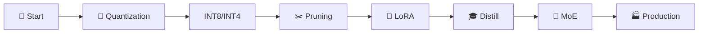
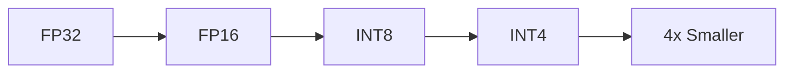
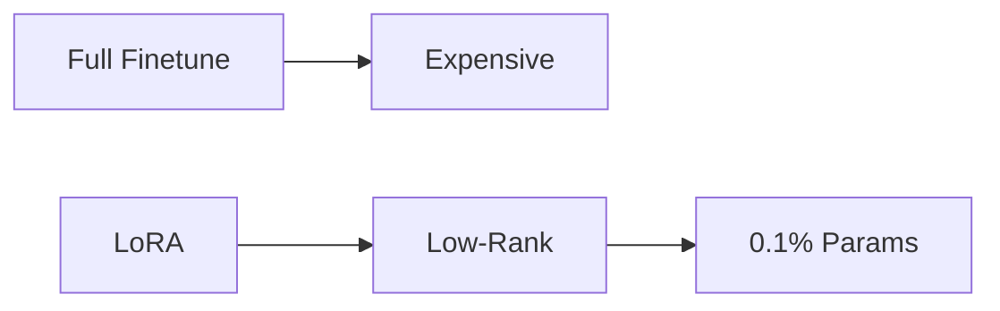
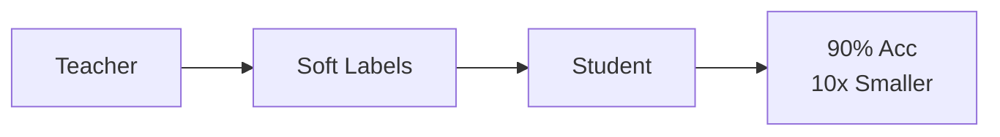
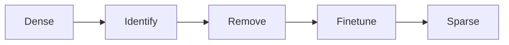
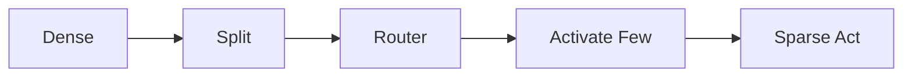
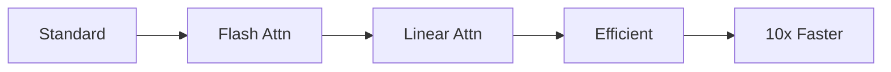
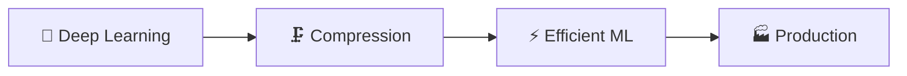

<p align="center">
  
</p>

<p align="center">
  
  
  
</p>

<p align="center">
  <a href="#-main-topics"></a>
  <a href="../09-efficient-ml/README.md"></a>
</p>

---

**✍️ Author:** [Gaurav Goswami](https://github.com/Gaurav14cs17) • **📅 Updated:** December 2024

---

## 📊 Learning Path



## 🎯 What You'll Learn

> 💡 From **175B parameters to your phone**: Compress models 4-10x with minimal accuracy loss

<table>
<tr>
<td align="center">

### 🔢 Quantization
4x smaller ⭐

</td>
<td align="center">

### 🔧 LoRA
0.1% params 🔥

</td>
<td align="center">

### 🎓 Distillation
10x smaller

</td>
</tr>
</table>

---

## 📚 Main Topics

### 1️⃣ Quantization ⭐⭐⭐

 



> ⭐ **4x memory reduction with <1% accuracy loss**

| Type | Compression | Use Case |
|:----:|:-----------:|----------|
| INT8 | 4x | ⭐ Production default |
| INT4 | 8x | Aggressive |
| GPTQ/AWQ | LLMs | 🔥 Hot |

<a href="./03-quantization/README.md"></a>

---

### 2️⃣ LoRA & PEFT 🔥🔥🔥

 



> 🔥 **Fine-tune LLMs with 0.1% parameters** - Industry standard

**Used in:** Stable Diffusion, LLaMA, every major LLM

<a href="./08-peft/README.md"></a>

---

### 3️⃣ Knowledge Distillation




**Example:** BERT → DistilBERT (40% smaller, 97% accuracy)

<a href="./04-knowledge-distillation/README.md"></a>

---

### 4️⃣ Pruning




**Core:** Magnitude Pruning, Lottery Ticket Hypothesis

<a href="./02-parameter-reduction/pruning/README.md"></a>

---

### 5️⃣ Mixture of Experts (MoE)




> Scale to **trillions of parameters** - Used in GPT-4 (rumored)

<a href="./06-sparsity/moe/README.md"></a>

---

### 6️⃣ Efficient Architectures




> ⚡ **Flash Attention in all modern LLMs**

<a href="./07-efficient-architectures/README.md"></a>

---

## 🔄 Comparison

| Technique | Compression | Accuracy Loss | Best For |
|:---------:|:-----------:|:-------------:|----------|
| **INT8** | 4x | <1% | ⭐ Production |
| **INT4** | 8x | 1-3% | Aggressive |
| **LoRA** | N/A | 0% | 🔥 Fine-tuning |
| **Distill** | 2-10x | 3-10% | Deployment |
| **Pruning** | 2-10x | 0-5% | Research |

---

## 💡 Key Formulas

<table>
<tr>
<td>

### 🔢 Quantization
```
x_quant = round(x/scale) + zero
x_dequant = (x_quant - zero) × scale
```

</td>
<td>

### 🔧 LoRA
```
W' = W + BA  (r << n,m)
Only train B, A
```

</td>
</tr>
</table>

---

## 🔗 Prerequisites & Next Steps



<p align="center">
  <a href="../06-deep-learning/README.md"></a>
  <a href="../09-efficient-ml/README.md"></a>
</p>

---

## 📚 Recommended Resources

| Type | Resource | Focus |
|:----:|----------|-------|
| 📄 | [LoRA Paper](https://arxiv.org/abs/2106.09685) | Low-Rank Adaptation |
| 📄 | [QLoRA Paper](https://arxiv.org/abs/2305.14314) | Quantized LoRA |
| 🛠️ | [PEFT](https://github.com/huggingface/peft) | LoRA library |
| 🛠️ | [bitsandbytes](https://github.com/TimDettmers/bitsandbytes) | Quantization |

---

## 🗺️ Quick Navigation

| Previous | Current | Next |
|:--------:|:-------:|:----:|
| [🎮 RL](../07-reinforcement-learning/README.md) | **🗜️ Compression** | [⚡ Efficient ML →](../09-efficient-ml/README.md) |

---

<p align="center">
  
</p>
