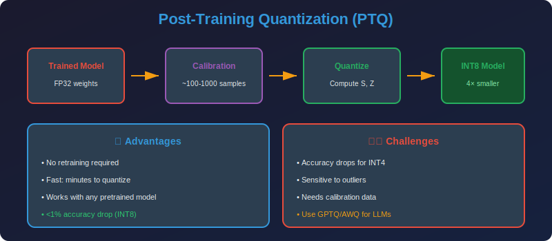

<!-- Animated Header -->
<p align="center">
  
</p>

<p align="center">
  
  
  
</p>


---

<p align="center">

</p>

# Post-Training Quantization (PTQ)

## 📐 Mathematical Theory

### 1. Problem Formulation

**Goal:** Quantize a pre-trained model without retraining.

Given trained weights $W$ and activations $X$, find quantized weights $\hat{W}$ that minimize output error:

```math
\min_{\hat{W}} \|WX - \hat{W}X\|_F^2
```

---

### 2. Layer-wise Quantization

#### 2.1 Per-Tensor Quantization

**Single scale for entire tensor:**
```math
W_q = \text{round}\left(\frac{W}{s}\right), \quad s = \frac{\max(|W|)}{2^{b-1}-1}
```

**Reconstruction:**
```math
\hat{W} = s \cdot W_q
```

**Error:**
```math
\|W - \hat{W}\|_F^2 = \sum_{i,j} (w_{ij} - \hat{w}_{ij})^2
```

#### 2.2 Per-Channel Quantization

**Separate scale per output channel:**
```math
W_q[c,:] = \text{round}\left(\frac{W[c,:]}{s_c}\right), \quad s_c = \frac{\max(|W[c,:]|)}{2^{b-1}-1}
```

**Theorem:** Per-channel achieves lower or equal MSE:
```math
\text{MSE}_{per-channel} \leq \text{MSE}_{per-tensor}
```

**Proof:**
Per-channel optimizes each $s\_c$ independently:
```math
s_c^* = \arg\min_{s_c} \sum_j (w_{cj} - s_c \cdot \text{round}(w_{cj}/s_c))^2
```

The per-tensor solution is a constraint of this: $s\_c = s \, \forall c$.
Removing constraints cannot increase the minimum.

---

### 3. Activation Quantization

#### 3.1 Dynamic Quantization

**Compute scale at runtime per batch/token:**
```math
s_{act} = \frac{\max(|X|)}{2^{b-1}-1}
```

**Pros:** Adapts to input distribution
**Cons:** Runtime overhead

#### 3.2 Static Quantization

**Pre-compute scale from calibration data:**
```math
s_{act} = \frac{1}{N}\sum_{i=1}^{N} \frac{\max(|X_i|)}{2^{b-1}-1}
```

**Calibration strategies:**
- Moving average of max values
- Histogram-based methods
- MSE minimization

---

### 4. Quantized Matrix Multiplication

#### 4.1 INT8 GEMM Derivation

**FP32:** $Y = XW^T$

**Quantized:**
```math
X = s_x(X_q - z_x), \quad W = s_w(W_q - z_w)
Y = XW^T = s_x s_w (X_q - z_x)(W_q - z_w)^T
```

**Expanding:**
```math
Y = s_x s_w \left[X_q W_q^T - z_w X_q \mathbf{1}^T - z_x \mathbf{1} W_q^T + z_x z_w n\right]
```

where $n$ is the inner dimension.

**Optimization:** Pre-compute bias terms:
- $z\_w X\_q \mathbf{1}^T = z\_w \cdot \text{rowsum}(X\_q)$
- $z\_x \mathbf{1} W\_q^T = z\_x \cdot \text{colsum}(W\_q)$

#### 4.2 Symmetric Simplification

With symmetric quantization ($z\_x = z\_w = 0$):
```math
Y = s_x s_w \cdot X_q W_q^T
```

Much simpler - only one rescaling operation!

---

### 5. Advanced PTQ Methods

#### 5.1 AdaRound (Adaptive Rounding)

**Problem:** Standard rounding $\lfloor \cdot \rceil$ may not be optimal.

**Idea:** Learn rounding direction per weight.

**Formulation:**
```math
\hat{W} = s \cdot \left(\lfloor W/s \rfloor + h(V)\right)
```

where $h(V) \in [0,1]$ is a learned soft indicator and $V$ is optimized.

**Objective:**
```math
\min_V \|WX - \hat{W}X\|_F^2 + \lambda \cdot \text{Reg}(h(V))
```

**Regularization:** Encourage $h(V) \to \{0, 1\}$:
```math
\text{Reg}(h) = \sum_{i,j} (1 - |2h_{ij} - 1|^\beta)
```

#### 5.2 BRECQ (Block Reconstruction)

**Process blocks of layers jointly:**
```math
\min_{\hat{W}_1, ..., \hat{W}_k} \|f_{1:k}(X; W) - f_{1:k}(X; \hat{W})\|_F^2
```

**Algorithm:**
1. Quantize first block, minimize reconstruction error
2. Use quantized output as input to next block
3. Repeat for all blocks

---

### 6. Hessian-based Weight Correction

#### 6.1 Second-Order Analysis

**Taylor expansion of loss around optimal weights:**
```math
\mathcal{L}(W + \Delta W) \approx \mathcal{L}(W) + \nabla \mathcal{L}^T \Delta W + \frac{1}{2}\Delta W^T H \Delta W
```

At optimum, $\nabla \mathcal{L} \approx 0$, so:
```math
\Delta \mathcal{L} \approx \frac{1}{2}\Delta W^T H \Delta W
```

#### 6.2 Optimal Weight Update (OBQ)

**When quantizing weight $w\_q$:**

The quantization introduces error $\delta\_q = \hat{w}\_q - w\_q$.

**Optimal correction to remaining weights:**
```math
\delta_{-q} = -\frac{\delta_q}{[H^{-1}]_{qq}} H^{-1}_{:,q}
```

**Proof:**
We minimize:
```math
\min_{\delta_{-q}} (\delta_q, \delta_{-q})^T H (\delta_q, \delta_{-q})
```

Taking derivative w.r.t. $\delta\_{-q}$ and setting to zero:
```math
H_{-q,-q} \delta_{-q} + H_{-q,q} \delta_q = 0
\delta_{-q} = -H_{-q,-q}^{-1} H_{-q,q} \delta_q
```

Using block matrix inversion, this simplifies to the formula above.

#### 6.3 Saliency for Quantization Order

**Quantize weights with lowest saliency first:**
```math
\text{saliency}_q = \frac{(\hat{w}_q - w_q)^2}{2[H^{-1}]_{qq}}
```

---

### 7. Practical PTQ Pipeline

```python
import torch
import torch.nn as nn

class PTQQuantizer:
    """Post-Training Quantization with calibration."""
    
    def __init__(self, model: nn.Module, bits: int = 8):
        self.model = model
        self.bits = bits
        self.scales = {}
        self.zero_points = {}
    
    def calibrate(self, dataloader, num_batches: int = 100):
        """Collect activation statistics."""
        self.model.eval()
        activation_ranges = {}
        
        # Register hooks to collect activations
        hooks = []
        def make_hook(name):
            def hook(module, input, output):
                if name not in activation_ranges:
                    activation_ranges[name] = {'min': [], 'max': []}
                activation_ranges[name]['min'].append(output.min().item())
                activation_ranges[name]['max'].append(output.max().item())
            return hook
        
        for name, module in self.model.named_modules():
            if isinstance(module, (nn.Linear, nn.Conv2d)):
                hooks.append(module.register_forward_hook(make_hook(name)))
        
        # Run calibration
        with torch.no_grad():
            for i, (inputs, _) in enumerate(dataloader):
                if i >= num_batches:
                    break
                self.model(inputs)
        
        # Remove hooks
        for hook in hooks:
            hook.remove()
        
        # Compute scales from statistics
        for name, ranges in activation_ranges.items():
            min_val = min(ranges['min'])
            max_val = max(ranges['max'])
            self.scales[name], self.zero_points[name] = self._compute_qparams(
                min_val, max_val
            )
        
        return self.scales, self.zero_points
    
    def _compute_qparams(self, min_val: float, max_val: float):
        """Compute scale and zero-point for asymmetric quantization."""
        qmin, qmax = 0, 2**self.bits - 1
        
        scale = (max_val - min_val) / (qmax - qmin)
        zero_point = qmin - round(min_val / scale)
        zero_point = max(qmin, min(qmax, zero_point))
        
        return scale, zero_point
    
    def quantize_weights(self):
        """Quantize all weights using per-channel quantization."""
        for name, module in self.model.named_modules():
            if isinstance(module, nn.Linear):
                W = module.weight.data
                # Per-channel (per output) quantization
                scales = W.abs().max(dim=1, keepdim=True)[0] / (2**(self.bits-1) - 1)
                W_q = torch.round(W / scales).clamp(-2**(self.bits-1), 2**(self.bits-1)-1)
                module.weight.data = W_q * scales
                self.scales[name + '.weight'] = scales
    
    def quantize_model(self, dataloader):
        """Full PTQ pipeline."""
        # 1. Calibrate activations
        self.calibrate(dataloader)
        
        # 2. Quantize weights
        self.quantize_weights()
        
        return self.model

class AdaRound:
    """Adaptive Rounding for PTQ."""
    
    def __init__(self, weight: torch.Tensor, scale: float, bits: int = 8):
        self.weight = weight
        self.scale = scale
        self.bits = bits
        self.qmin = -2**(bits-1)
        self.qmax = 2**(bits-1) - 1
        
        # Initialize V (soft rounding indicator)
        w_floor = torch.floor(weight / scale)
        w_frac = weight / scale - w_floor
        # Initialize to encourage rounding to nearest
        self.V = nn.Parameter(torch.log(w_frac / (1 - w_frac + 1e-8)))
    
    def soft_round(self, beta: float = 2.0):
        """Differentiable soft rounding."""
        h = torch.sigmoid(self.V)  # In [0, 1]
        w_floor = torch.floor(self.weight / self.scale)
        return self.scale * torch.clamp(w_floor + h, self.qmin, self.qmax)
    
    def regularization(self, beta: float = 2.0):
        """Regularization to push h towards {0, 1}."""
        h = torch.sigmoid(self.V)
        return (1 - (2*h - 1).abs().pow(beta)).sum()
    
    def optimize(self, X: torch.Tensor, num_iters: int = 1000, lr: float = 1e-3):
        """Optimize rounding using block reconstruction."""
        optimizer = torch.optim.Adam([self.V], lr=lr)
        
        # Target output
        Y_target = X @ self.weight.T
        
        for i in range(num_iters):
            optimizer.zero_grad()
            
            W_q = self.soft_round()
            Y_q = X @ W_q.T
            
            # Reconstruction loss + regularization
            loss = ((Y_target - Y_q) ** 2).mean()
            loss += 0.01 * self.regularization()
            
            loss.backward()
            optimizer.step()
        
        # Return hard-rounded weights
        h = (torch.sigmoid(self.V) > 0.5).float()
        w_floor = torch.floor(self.weight / self.scale)
        return self.scale * torch.clamp(w_floor + h, self.qmin, self.qmax)
```

---

### 8. Comparison of PTQ Methods

| Method | Accuracy | Speed | Complexity |
|--------|----------|-------|------------|
| **Naive PTQ** | Poor | Fast | Low |
| **MinMax + Per-Channel** | Good | Fast | Low |
| **MSE Calibration** | Better | Medium | Medium |
| **AdaRound** | Good | Slow | High |
| **BRECQ** | Best | Very Slow | High |

---

## 📚 References

| Type | Title | Link |
|------|-------|------|
| 📄 | AdaRound | [arXiv](https://arxiv.org/abs/2004.10568) |
| 📄 | BRECQ | [arXiv](https://arxiv.org/abs/2102.05426) |
| 📄 | ZeroQ | [arXiv](https://arxiv.org/abs/2001.00281) |
| 📄 | LAPQ | [arXiv](https://arxiv.org/abs/1911.07190) |
| 🇨🇳 | PTQ后训练量化详解 | [知乎](https://zhuanlan.zhihu.com/p/548174416) |
| 🇨🇳 | 模型量化PTQ实战 | [CSDN](https://blog.csdn.net/qq_40243750/article/details/128762857) |
| 🇨🇳 | AdaRound论文解读 | [B站](https://www.bilibili.com/video/BV1pG4y1s7wH) |

---

⬅️ [Back: Fundamentals](../01_fundamentals/README.md) | ➡️ [Next: QAT](../03_qat/README.md)

