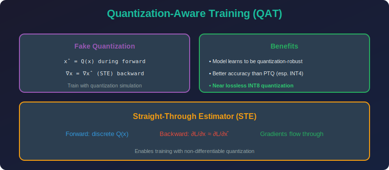

<!-- Animated Header -->
<p align="center">
  
</p>

<p align="center">
  
  
  
</p>


---

<p align="center">

</p>

# Quantization-Aware Training (QAT)

## 📐 Mathematical Theory

### 1. Problem with PTQ Gradients

**The Quantization Function is Non-Differentiable:**
```math
Q(x) = s \cdot \text{round}(x/s)
\frac{\partial Q}{\partial x} = 0 \text{ almost everywhere}
```

This breaks backpropagation!

---

### 2. Straight-Through Estimator (STE)

#### 2.1 Definition

**Straight-Through Estimator (Bengio et al., 2013):**

**Forward pass:** Use true quantization
```math
\hat{x} = Q(x)
```

**Backward pass:** Pass gradients through as identity
```math
\frac{\partial \mathcal{L}}{\partial x} \approx \frac{\partial \mathcal{L}}{\partial \hat{x}}
```

#### 2.2 Mathematical Justification

**Claim:** STE provides a biased but useful gradient estimate.

**Analysis:**
The true gradient is:
```math
\frac{\partial \mathcal{L}}{\partial x} = \frac{\partial \mathcal{L}}{\partial \hat{x}} \cdot \frac{\partial \hat{x}}{\partial x}
```

With STE, we approximate $\frac{\partial \hat{x}}{\partial x} \approx 1$.

**Expected value analysis:**
```math
\mathbb{E}\left[\frac{\partial Q}{\partial x}\right] = \mathbb{E}[\mathbf{1}_{Q \text{ continuous at } x}] = 0
```

But STE gives $\mathbb{E}[1] = 1$, which captures the "direction" of change.

#### 2.3 Clipped STE

**Better approximation:**
```math
\frac{\partial Q}{\partial x} \approx \mathbf{1}_{x \in [x_{min}, x_{max}]}
```

This sets gradient to 0 for clipped values (saturation).

**Implementation:**
```python
class STEQuantize(torch.autograd.Function):
    @staticmethod
    def forward(ctx, x, scale, zero_point, qmin, qmax):
        x_q = torch.clamp(torch.round(x / scale) + zero_point, qmin, qmax)
        x_dq = (x_q - zero_point) * scale
        ctx.save_for_backward(x, scale)
        ctx.qmin, ctx.qmax = qmin, qmax
        return x_dq
    
    @staticmethod
    def backward(ctx, grad_output):
        x, scale = ctx.saved_tensors
        # Clipped STE: zero gradient for clipped values
        x_q = x / scale
        mask = (x_q >= ctx.qmin) & (x_q <= ctx.qmax)
        grad_input = grad_output * mask.float()
        return grad_input, None, None, None, None
```

---

### 3. Fake Quantization

#### 3.1 Concept

**Fake Quantization:** Simulate quantization during training while keeping FP32 precision.

```math
\text{FakeQuant}(x) = s \cdot \text{clamp}\left(\text{round}\left(\frac{x}{s}\right), q_{min}, q_{max}\right)
```

**Key insight:** Output is still FP32, but values are restricted to quantization grid.

#### 3.2 Forward Pass Analysis

```
x (FP32) → Quantize → x_q (INT8) → Dequantize → x̂ (FP32)
           [round]              [scale]
           
x̂ = s · round(x/s) = s · [x/s + ε]
  = x + s·ε
  
where ε ∈ [-0.5, 0.5] is rounding error
```

---

### 4. Learnable Quantization Parameters

#### 4.1 Learning Scale

**Make scale a learnable parameter:**
```math
s = f_\theta(W) \quad \text{or} \quad s = \text{learnable parameter}
```

**Gradient of loss w.r.t. scale:**
```math
\frac{\partial \mathcal{L}}{\partial s} = \frac{\partial \mathcal{L}}{\partial \hat{W}} \cdot \frac{\partial \hat{W}}{\partial s}
\frac{\partial \hat{W}}{\partial s} = W_q - \frac{W}{s^2} \cdot s = W_q - \frac{W}{s}
```

#### 4.2 LSQ (Learned Step Size Quantization)

**Formulation:**
```math
\hat{W} = s \cdot \text{clip}\left(\text{round}\left(\frac{W}{s}\right), -Q_N, Q_P\right)
```

**Scale gradient with normalization:**
```math
\frac{\partial \mathcal{L}}{\partial s} = \frac{\partial \mathcal{L}}{\partial \hat{W}} \cdot \frac{\partial \hat{W}}{\partial s} \cdot \frac{1}{\sqrt{n \cdot Q_P}}
```

The normalization $\frac{1}{\sqrt{n \cdot Q\_P}}$ balances gradient magnitudes.

---

### 5. QAT Training Procedure

#### 5.1 Standard Pipeline

```
1. Start with pre-trained FP32 model
2. Insert fake quantization nodes after weights and activations
3. Initialize quantization parameters (scale, zero-point)
4. Fine-tune with lower learning rate (10-100x lower)
5. After training, convert to true quantized model
```

#### 5.2 Quantization Schedule

**Progressive Quantization:**
- Start with FP32 training
- Gradually decrease bit-width
- Or start with high precision, decrease during training

**Temperature Annealing for Soft Quantization:**
```math
Q_\tau(x) = s \cdot \text{softround}_\tau(x/s)
```

where $\text{softround}\_\tau \to \text{round}$ as $\tau \to 0$.

---

### 6. Weight and Activation Quantization

#### 6.1 Full QAT Model

```python
class QATLinear(nn.Module):
    def __init__(self, in_features, out_features, w_bits=8, a_bits=8):
        super().__init__()
        self.linear = nn.Linear(in_features, out_features)
        self.w_bits = w_bits
        self.a_bits = a_bits
        
        # Learnable quantization parameters
        self.w_scale = nn.Parameter(torch.tensor(1.0))
        self.a_scale = nn.Parameter(torch.tensor(1.0))
    
    def forward(self, x):
        # Quantize weights
        w_q = self.fake_quantize(
            self.linear.weight, 
            self.w_scale, 
            self.w_bits,
            symmetric=True
        )
        
        # Quantize activations
        x_q = self.fake_quantize(
            x, 
            self.a_scale, 
            self.a_bits,
            symmetric=False
        )
        
        return F.linear(x_q, w_q, self.linear.bias)
    
    def fake_quantize(self, x, scale, bits, symmetric=True):
        if symmetric:
            qmin, qmax = -2**(bits-1), 2**(bits-1) - 1
        else:
            qmin, qmax = 0, 2**bits - 1
        
        x_q = torch.clamp(torch.round(x / scale), qmin, qmax)
        return x_q * scale  # Fake quantize
```

#### 6.2 Batch Normalization Folding

**Before quantization, fold BN into preceding conv/linear:**

```math
W_{folded} = \frac{\gamma}{\sqrt{\sigma^2 + \epsilon}} \cdot W
b_{folded} = \gamma \cdot \frac{-\mu}{\sqrt{\sigma^2 + \epsilon}} + \beta + \frac{\gamma}{\sqrt{\sigma^2 + \epsilon}} \cdot b
```

**Why fold?**
- Reduces operations at inference
- Fewer tensors to quantize
- Better accuracy

---

### 7. Theoretical Analysis

#### 7.1 QAT Loss Landscape

**Claim:** QAT smooths the loss landscape by adding noise during training.

**Analysis:**
The fake quantization adds noise $\epsilon = Q(W) - W$.

Similar to regularization, this:
1. Prevents overfitting to precise weight values
2. Finds flatter minima (more robust)
3. Improves generalization

#### 7.2 Convergence Analysis

**Theorem (Informal):** Under certain conditions, QAT with STE converges to a local minimum.

**Key conditions:**
1. Learning rate decays appropriately
2. Gradient noise is bounded
3. Loss is Lipschitz smooth

**Bias-Variance Tradeoff:**
- STE introduces bias in gradients
- But reduces variance compared to other estimators
- Net effect: stable training

---

### 8. Complete QAT Implementation

```python
import torch
import torch.nn as nn
import torch.nn.functional as F

class FakeQuantize(torch.autograd.Function):
    """Fake quantization with STE."""
    
    @staticmethod
    def forward(ctx, x, scale, zero_point, qmin, qmax):
        x_q = torch.clamp(torch.round(x / scale) + zero_point, qmin, qmax)
        x_dq = (x_q - zero_point) * scale
        
        # Save for backward
        ctx.save_for_backward(x, torch.tensor([scale]))
        ctx.qmin, ctx.qmax = qmin, qmax
        
        return x_dq
    
    @staticmethod
    def backward(ctx, grad_output):
        x, scale_tensor = ctx.saved_tensors
        scale = scale_tensor.item()
        
        # Clipped STE
        x_normalized = x / scale
        mask = (x_normalized >= ctx.qmin) & (x_normalized <= ctx.qmax)
        
        grad_x = grad_output * mask.float()
        
        # Gradient for scale (optional, for learnable scale)
        x_q = torch.clamp(torch.round(x / scale), ctx.qmin, ctx.qmax)
        grad_scale = (grad_output * (x_q - x / scale)).sum()
        
        return grad_x, grad_scale, None, None, None

class QATModel(nn.Module):
    """Complete QAT model wrapper."""
    
    def __init__(self, model, w_bits=8, a_bits=8):
        super().__init__()
        self.model = model
        self.w_bits = w_bits
        self.a_bits = a_bits
        
        # Register quantization parameters
        self.w_scales = nn.ParameterDict()
        self.a_scales = nn.ParameterDict()
        
        self._prepare_qat()
    
    def _prepare_qat(self):
        """Initialize quantization parameters."""
        for name, module in self.model.named_modules():
            if isinstance(module, (nn.Linear, nn.Conv2d)):
                # Initialize weight scale
                w_max = module.weight.abs().max()
                self.w_scales[name.replace('.', '_')] = nn.Parameter(
                    w_max / (2**(self.w_bits-1) - 1)
                )
                
                # Initialize activation scale (updated during training)
                self.a_scales[name.replace('.', '_')] = nn.Parameter(
                    torch.tensor(1.0)
                )
    
    def _quantize_weight(self, weight, scale):
        """Fake quantize weights (symmetric)."""
        qmin = -2**(self.w_bits-1)
        qmax = 2**(self.w_bits-1) - 1
        return FakeQuantize.apply(weight, scale, 0, qmin, qmax)
    
    def _quantize_activation(self, x, scale):
        """Fake quantize activations (asymmetric)."""
        qmin = 0
        qmax = 2**self.a_bits - 1
        return FakeQuantize.apply(x, scale, 0, qmin, qmax)
    
    def forward(self, x):
        # Hook-based quantization would go here
        # For simplicity, showing manual approach
        return self.model(x)
    
    @torch.no_grad()
    def update_activation_scales(self, x):
        """Update activation scales from batch statistics."""
        for name, module in self.model.named_modules():
            if isinstance(module, (nn.Linear, nn.Conv2d)):
                key = name.replace('.', '_')
                # Exponential moving average
                ema_factor = 0.99
                current_max = x.abs().max()
                new_scale = current_max / (2**self.a_bits - 1)
                self.a_scales[key].data = (
                    ema_factor * self.a_scales[key].data + 
                    (1 - ema_factor) * new_scale
                )

def train_qat(model, train_loader, val_loader, epochs=10, lr=1e-4):
    """QAT training loop."""
    
    # Wrap model for QAT
    qat_model = QATModel(model, w_bits=8, a_bits=8)
    
    optimizer = torch.optim.Adam(qat_model.parameters(), lr=lr)
    scheduler = torch.optim.lr_scheduler.CosineAnnealingLR(optimizer, epochs)
    criterion = nn.CrossEntropyLoss()
    
    for epoch in range(epochs):
        qat_model.train()
        
        for batch_idx, (data, target) in enumerate(train_loader):
            optimizer.zero_grad()
            
            # Update activation scales
            qat_model.update_activation_scales(data)
            
            # Forward with fake quantization
            output = qat_model(data)
            loss = criterion(output, target)
            
            # Backward with STE
            loss.backward()
            optimizer.step()
        
        scheduler.step()
        
        # Validate
        qat_model.eval()
        correct = 0
        with torch.no_grad():
            for data, target in val_loader:
                output = qat_model(data)
                pred = output.argmax(dim=1)
                correct += pred.eq(target).sum().item()
        
        accuracy = 100. * correct / len(val_loader.dataset)
        print(f'Epoch {epoch+1}: Accuracy = {accuracy:.2f}%')
    
    return qat_model
```

---

### 9. QAT vs PTQ Comparison

| Aspect | PTQ | QAT |
|--------|-----|-----|
| **Training Required** | No | Yes |
| **Time** | Minutes | Hours/Days |
| **Accuracy (INT8)** | Good | Better |
| **Accuracy (INT4)** | Poor | Good |
| **Data Required** | Calibration set | Full training set |
| **Hyperparameter Tuning** | Minimal | Significant |

---

## 📚 References

| Type | Title | Link |
|------|-------|------|
| 📄 | STE (Bengio) | [arXiv](https://arxiv.org/abs/1308.3432) |
| 📄 | DoReFa-Net | [arXiv](https://arxiv.org/abs/1606.06160) |
| 📄 | LSQ | [arXiv](https://arxiv.org/abs/1902.08153) |
| 📄 | PACT | [arXiv](https://arxiv.org/abs/1805.06085) |
| 🇨🇳 | QAT量化感知训练 | [知乎](https://zhuanlan.zhihu.com/p/548252259) |
| 🇨🇳 | STE直通估计器详解 | [CSDN](https://blog.csdn.net/weixin_44878336/article/details/125035894) |
| 🇨🇳 | LSQ论文解读 | [机器之心](https://www.jiqizhixin.com/articles/2019-11-20-10) |

---

⬅️ [Back: PTQ](../02_ptq/README.md) | ➡️ [Next: LLM Quantization](../04_llm_quantization/README.md)

