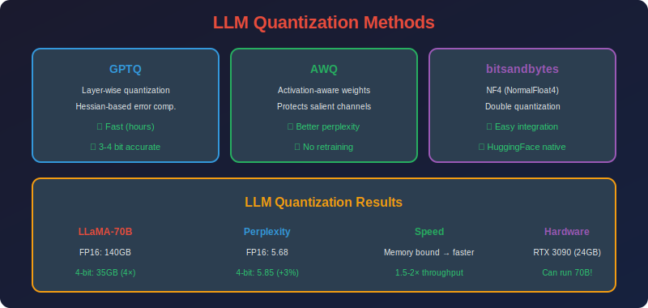

<!-- Animated Header -->
<p align="center">
  
</p>

<p align="center">
  
  
  
</p>


---

<p align="center">

</p>

# LLM Quantization (GPTQ, AWQ, SmoothQuant)

## 📐 Mathematical Theory

### 1. Challenges in LLM Quantization

**Key Issues:**
1. **Outlier activations:** LLMs have extreme activation values
2. **Scale:** Billions of parameters, can't do full QAT
3. **Sensitivity:** Small errors accumulate over many layers

---

### 2. GPTQ: Optimal Brain Quantization for LLMs

#### 2.1 Problem Formulation

**Goal:** Minimize layer-wise reconstruction error:

```math
\min_{\hat{W}} \|WX - \hat{W}X\|_F^2
```

where $X \in \mathbb{R}^{d\_{in} \times n}$ is calibration data.

#### 2.2 Optimal Brain Quantization (OBQ)

**Greedy approach:** Quantize one weight at a time, optimally adjusting others.

**Hessian approximation:**

```math
H = 2X X^T
```

**When quantizing weight $w\_q$ to $\hat{w}\_q$:**

The quantization error is $\delta\_q = \hat{w}\_q - w\_q$.

**Optimal update to remaining weights:**

```math
\delta_{-q} = -\frac{\delta_q}{[H^{-1}]_{qq}} \cdot H^{-1}_{:,q}
```

**Proof:**
We want to minimize the change in output:

```math
\min_{\delta_{-q}} \|(w_q + \delta_q, w_{-q} + \delta_{-q}) X\|_2^2 - \|w X\|_2^2
```

The second-order approximation gives:

```math
\Delta = \delta_q^2 [H]_{qq} + 2\delta_q H_{q,-q} \delta_{-q} + \delta_{-q}^T H_{-q,-q} \delta_{-q}
```

Taking derivative w.r.t. $\delta\_{-q}$:

```math
\frac{\partial \Delta}{\partial \delta_{-q}} = 2\delta_q H_{-q,q} + 2H_{-q,-q}\delta_{-q} = 0
```

Solving: $\delta\_{-q} = -H\_{-q,-q}^{-1} H\_{-q,q} \delta\_q$

Using Schur complement: $\delta\_{-q} = -\frac{\delta\_q}{[H^{-1}]\_{qq}} H^{-1}\_{:,q}$

#### 2.3 GPTQ Speedups

**Problem:** OBQ processes weights one at a time - too slow for LLMs.

**Solution 1: Row-wise processing**
Process entire rows of $W$ together since they share the same Hessian.

**Solution 2: Block updates**
Update Hessian inverse in blocks:

```math
H^{-1}_{new} = H^{-1} - \frac{H^{-1}_{:,B} (H^{-1}_{B,B})^{-1} H^{-1}_{B,:}}{1}
```

**Solution 3: Lazy batch updates**
Accumulate weight updates, apply periodically.

#### 2.4 GPTQ Algorithm

```
Input: Weight matrix W, Hessian H = 2XX^T
Output: Quantized W_q

1. H_inv = (H + λI)^{-1}  # Damping for stability
2. For each column group B:
   a. For q in B:
      - Quantize: w_q → ŵ_q
      - Error: δ_q = ŵ_q - w_q
      - Update remaining: W[:,q:] -= δ_q / [H_inv]_{qq} · H_inv[q,q:]
   b. Update H_inv using block formula
3. Return W_q
```

---

### 3. AWQ: Activation-Aware Weight Quantization

#### 3.1 Key Insight

**Observation:** Not all weights are equally important.
Weights connected to large activations matter more.

**Importance metric:**

```math
s_j = \mathbb{E}[|X_j|] = \frac{1}{n}\sum_{i=1}^{n} |x_{ij}|
```

#### 3.2 Per-Channel Scaling

**Idea:** Scale weights to protect important channels.

**Transformation:**

```math
Y = XW = (X \cdot \text{diag}(s)^{-1}) \cdot (\text{diag}(s) \cdot W) = \hat{X} \hat{W}
```

**Effect:**
- Important channels (large $s\_j$): weights scaled up → less relative quantization error
- Unimportant channels: weights scaled down → more error but less impact

#### 3.3 Optimal Scaling Factor

**Goal:** Find $s$ that minimizes quantization error:

```math
\min_s \|Q(\text{diag}(s) \cdot W) \cdot \text{diag}(s)^{-1} \cdot X - WX\|_F^2
```

**Closed-form approximation:**

```math
s_j^* = \left(\frac{\mathbb{E}[|X_j|]}{\mathbb{E}[|X|]}\right)^\alpha \cdot \left(\frac{\max|W_{:,j}|}{\max|W|}\right)^{1-\alpha}
```

where $\alpha \in [0, 1]$ balances activation and weight importance.

**Typical:** $\alpha = 0.5$

#### 3.4 AWQ Algorithm

```
Input: Weight W, Calibration X
Output: Quantized W_q, Scales s

1. Compute activation importance: s_act[j] = mean(|X[:,j]|)
2. Compute weight ranges: s_weight[j] = max(|W[:,j]|)
3. Compute optimal scales: s = (s_act / mean(s_act))^α * (s_weight / max(s_weight))^(1-α)
4. Scale weights: W_scaled = W * s
5. Quantize: W_q = Quantize(W_scaled)
6. Store s for inference rescaling
```

---

### 4. SmoothQuant: Migrating Difficulty

#### 4.1 The Outlier Problem

**Observation:** LLM activations have extreme outliers.

```math
\frac{\max|X|}{\text{mean}|X|} \sim 100\text{-}1000
```

These outliers make activation quantization very difficult.

#### 4.2 Smoothing Transformation

**Key idea:** Transfer quantization difficulty from activations to weights.

```math
Y = XW = (X \cdot \text{diag}(s)^{-1}) \cdot (\text{diag}(s) \cdot W)
```

**Choose $s$ to balance difficulties:**

```math
s_j = \frac{\max|X_{:,j}|^\alpha}{\max|W_{j,:}|^{1-\alpha}}
```

**Effect:**
- Dividing $X$ by $s$ reduces activation outliers
- Multiplying $W$ by $s$ increases weight range
- Choose $\alpha$ to balance

#### 4.3 Mathematical Analysis

**Quantization error for activations:**

```math
\epsilon_X = \frac{\Delta_X}{2} = \frac{\max|X|}{2(2^b - 1)}
```

**After smoothing:**

```math
\epsilon_{\hat{X}} = \frac{\max|\hat{X}|}{2(2^b - 1)} = \frac{\max|X|/s}{2(2^b - 1)}
```

**Similarly for weights, error increases by factor $s$.**

**Optimal $\alpha$:** Typically $\alpha = 0.5$ works well (equal migration).

#### 4.4 SmoothQuant Algorithm

```
Input: Model with linear layers Y = XW
Output: Smoothed model ready for W8A8 quantization

For each linear layer:
1. Collect activation statistics on calibration data
2. Compute per-channel max: max_X[j] = max|X[:,j]|
3. Compute per-channel max: max_W[j] = max|W[j,:]|
4. Compute smoothing factor: s[j] = (max_X[j])^α / (max_W[j])^(1-α)
5. Apply to preceding LayerNorm: γ_new = γ / s
6. Apply to weights: W_new = W * s
```

---

### 5. LLM.int8(): Mixed-Precision Decomposition

#### 5.1 Outlier Detection

**Observation:** ~0.1% of hidden dimensions cause 99% of outliers.

**Detection criterion:**

```math
O = \{j : \max_i |X_{ij}| > \tau\}
```

where $\tau = 6.0$ is typical threshold.

#### 5.2 Mixed-Precision Computation

**Decompose computation:**

```math
Y = XW = X_{:,O}W_{O,:} + X_{:,\bar{O}}W_{\bar{O},:}
```

**Apply:**
- Outlier part ($O$): FP16 precision
- Normal part ($\bar{O}$): INT8 precision

```math
Y = \underbrace{X_{:,O}^{fp16} W_{O,:}^{fp16}}_{\text{~0.1% dims, FP16}} + \underbrace{Q(X_{:,\bar{O}}) \cdot Q(W_{\bar{O},:})}_{\text{~99.9% dims, INT8}}
```

#### 5.3 Efficiency Analysis

**Memory:**
- Most weights in INT8: 4x compression
- Small overhead for outlier indices

**Compute:**
- INT8 GEMM for most computation
- Small FP16 GEMM for outliers

---

### 6. Complete Implementation

```python
import torch
import torch.nn as nn
import numpy as np

class GPTQQuantizer:
    """GPTQ quantization for a single linear layer."""
    
    def __init__(self, layer: nn.Linear, bits: int = 4):
        self.layer = layer
        self.bits = bits
        self.qmin = 0
        self.qmax = 2**bits - 1
        
    def quantize(self, calibration_data: torch.Tensor, blocksize: int = 128):
        """
        Quantize layer weights using GPTQ algorithm.
        
        Args:
            calibration_data: Input activations [n_samples, d_in]
            blocksize: Number of columns to process together
        """
        W = self.layer.weight.data.clone()  # [d_out, d_in]
        n_samples = calibration_data.shape[0]
        
        # Compute Hessian
        H = calibration_data.T @ calibration_data  # [d_in, d_in]
        H = 2 * H / n_samples
        
        # Add damping for numerical stability
        damp = 0.01 * torch.diag(H).mean()
        H += damp * torch.eye(H.shape[0], device=H.device)
        
        # Cholesky decomposition for efficient inverse
        H_inv = torch.linalg.inv(H)
        
        # Process columns in blocks
        for i1 in range(0, W.shape[1], blocksize):
            i2 = min(i1 + blocksize, W.shape[1])
            
            W_block = W[:, i1:i2].clone()
            H_inv_block = H_inv[i1:i2, i1:i2]
            
            for j in range(i2 - i1):
                col = i1 + j
                w = W[:, col]
                
                # Quantize
                scale = w.abs().max() / self.qmax
                w_q = torch.clamp(torch.round(w / scale), self.qmin, self.qmax)
                w_dq = w_q * scale
                
                # Compute error
                delta = w_dq - w
                
                # Update remaining columns
                if col < W.shape[1] - 1:
                    update = delta.unsqueeze(1) @ H_inv[col:col+1, col+1:] / H_inv[col, col]
                    W[:, col+1:] -= update
                
                W[:, col] = w_dq
        
        self.layer.weight.data = W
        return self.layer

class AWQQuantizer:
    """AWQ quantization for linear layer."""
    
    def __init__(self, layer: nn.Linear, bits: int = 4, alpha: float = 0.5):
        self.layer = layer
        self.bits = bits
        self.alpha = alpha
        
    def compute_scales(self, calibration_data: torch.Tensor) -> torch.Tensor:
        """Compute per-channel scaling factors."""
        W = self.layer.weight.data
        
        # Activation importance
        act_scales = calibration_data.abs().mean(dim=0)  # [d_in]
        act_scales = act_scales / act_scales.mean()
        
        # Weight range per input channel
        weight_scales = W.abs().max(dim=0)[0]  # [d_in]
        weight_scales = weight_scales / weight_scales.max()
        
        # Combined scale
        scales = (act_scales ** self.alpha) * (weight_scales ** (1 - self.alpha))
        
        return scales
    
    def quantize(self, calibration_data: torch.Tensor):
        """Quantize with AWQ."""
        scales = self.compute_scales(calibration_data)
        
        W = self.layer.weight.data
        
        # Scale weights
        W_scaled = W * scales.unsqueeze(0)
        
        # Quantize
        w_max = W_scaled.abs().max()
        qmax = 2**self.bits - 1
        scale = w_max / qmax
        
        W_q = torch.clamp(torch.round(W_scaled / scale), 0, qmax)
        W_dq = W_q * scale
        
        # Unscale
        W_final = W_dq / scales.unsqueeze(0)
        
        self.layer.weight.data = W_final
        self.scales = scales
        
        return self.layer

class SmoothQuantTransform:
    """SmoothQuant transformation for a model."""
    
    def __init__(self, alpha: float = 0.5):
        self.alpha = alpha
        self.smooth_scales = {}
    
    def calibrate(self, model: nn.Module, calibration_loader):
        """Collect activation statistics."""
        act_scales = {}
        
        def make_hook(name):
            def hook(module, input, output):
                x = input[0]
                if name not in act_scales:
                    act_scales[name] = x.abs().max(dim=0)[0]
                else:
                    act_scales[name] = torch.max(
                        act_scales[name], 
                        x.abs().max(dim=0)[0]
                    )
            return hook
        
        hooks = []
        for name, module in model.named_modules():
            if isinstance(module, nn.Linear):
                hooks.append(module.register_forward_hook(make_hook(name)))
        
        model.eval()
        with torch.no_grad():
            for batch in calibration_loader:
                model(batch[0])
        
        for hook in hooks:
            hook.remove()
        
        return act_scales
    
    def apply_smoothing(self, model: nn.Module, act_scales: dict):
        """Apply smoothing transformation."""
        for name, module in model.named_modules():
            if isinstance(module, nn.Linear) and name in act_scales:
                W = module.weight.data
                X_max = act_scales[name]
                W_max = W.abs().max(dim=0)[0]
                
                # Compute smoothing factor
                s = (X_max ** self.alpha) / (W_max ** (1 - self.alpha))
                s = s.clamp(min=1e-5)  # Prevent division by zero
                
                # Apply to weights
                module.weight.data = W * s.unsqueeze(0)
                
                # Store for inference
                self.smooth_scales[name] = s
        
        return model

def quantize_llm(model, calibration_loader, method='gptq', bits=4):
    """Quantize an LLM using specified method."""
    
    # Collect calibration data
    calibration_data = []
    model.eval()
    with torch.no_grad():
        for batch in calibration_loader:
            calibration_data.append(batch[0])
    calibration_data = torch.cat(calibration_data, dim=0)
    
    if method == 'gptq':
        for name, module in model.named_modules():
            if isinstance(module, nn.Linear):
                quantizer = GPTQQuantizer(module, bits=bits)
                quantizer.quantize(calibration_data)
    
    elif method == 'awq':
        for name, module in model.named_modules():
            if isinstance(module, nn.Linear):
                quantizer = AWQQuantizer(module, bits=bits)
                quantizer.quantize(calibration_data)
    
    elif method == 'smoothquant':
        transform = SmoothQuantTransform(alpha=0.5)
        act_scales = transform.calibrate(model, calibration_loader)
        model = transform.apply_smoothing(model, act_scales)

        # Then apply standard INT8 quantization
    
    return model
```

---

### 7. Comparison

| Method | Target | Accuracy | Speed | Memory |
|--------|--------|----------|-------|--------|
| **GPTQ** | W4 | Best | Slow | 4x |
| **AWQ** | W4 | Best | Medium | 4x |
| **SmoothQuant** | W8A8 | Good | Fast | 2x |
| **LLM.int8()** | W8A8 (mixed) | Good | Medium | 2-4x |

---

## 📚 References

| Type | Title | Link |
|------|-------|------|
| 📄 | GPTQ | [arXiv](https://arxiv.org/abs/2210.17323) |
| 📄 | AWQ | [arXiv](https://arxiv.org/abs/2306.00978) |
| 📄 | SmoothQuant | [arXiv](https://arxiv.org/abs/2211.10438) |
| 📄 | LLM.int8() | [arXiv](https://arxiv.org/abs/2208.07339) |
| 🇨🇳 | GPTQ大模型量化详解 | [知乎](https://zhuanlan.zhihu.com/p/627436535) |
| 🇨🇳 | AWQ量化原理与实现 | [CSDN](https://blog.csdn.net/qq_27590277/article/details/132419675) |
| 🇨🇳 | SmoothQuant论文解读 | [B站](https://www.bilibili.com/video/BV1Xj411o7f3) |
| 🇨🇳 | LLM量化技术综述 | [机器之心](https://www.jiqizhixin.com/articles/2023-06-21-5) |

---

⬅️ [Back: QAT](../03_qat/README.md) | ➡️ [Back to Quantization](../README.md)

