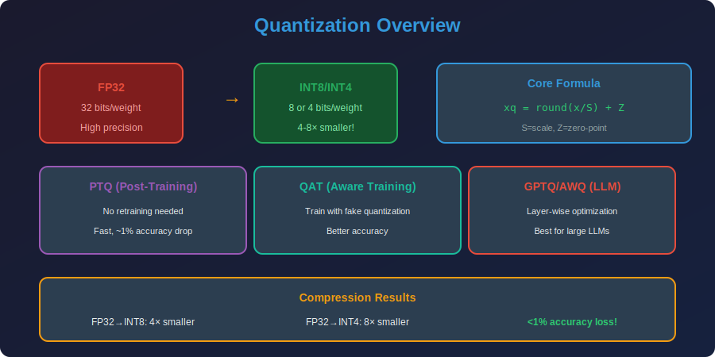

<!-- Animated Header -->
<p align="center">
  
</p>

<p align="center">
  
  
  
</p>


---

<p align="center">

</p>

## 📐 Mathematical Foundations

### 1. Uniform Quantization Theory

**Definition:** Uniform quantization maps continuous values to discrete levels uniformly spaced:

$$Q(x) = \text{round}\left(\frac{x - z}{s}\right) \cdot s + z$$

Where:

- $s$ = scale (step size)

- $z$ = zero-point (offset)

- $\text{round}(\cdot)$ = rounding function

**Asymmetric Quantization:**

$$s = \frac{x_{max} - x_{min}}{2^b - 1}, \quad z = x_{min}
q = \text{clamp}\left(\text{round}\left(\frac{x - z}{s}\right), 0, 2^b - 1\right)$$

**Symmetric Quantization:**

$$s = \frac{\max(|x_{max}|, |x_{min}|)}{2^{b-1} - 1}, \quad z = 0
q = \text{clamp}\left(\text{round}\left(\frac{x}{s}\right), -2^{b-1}, 2^{b-1} - 1\right)$$

### 2. Quantization Error Analysis

**Theorem (Quantization Noise):**
For uniform quantization with step size $s$, the quantization error $e = x - \hat{x}$ is approximately uniformly distributed on $[-s/2, s/2]$.

**Mean Squared Error:**

$$\text{MSE} = \mathbb{E}[(x - \hat{x})^2] = \frac{s^2}{12}$$

**Proof:**

$$\text{MSE} = \int_{-s/2}^{s/2} e^2 \cdot \frac{1}{s} de = \frac{1}{s} \cdot \frac{e^3}{3}\Big|_{-s/2}^{s/2} = \frac{1}{s} \cdot \frac{s^3}{12} = \frac{s^2}{12}$$

**Signal-to-Quantization-Noise Ratio (SQNR):**

$$\text{SQNR} = 10 \log_{10}\left(\frac{\sigma_x^2}{\sigma_e^2}\right) = 10 \log_{10}\left(\frac{12\sigma_x^2}{s^2}\right)$$

For $b$-bit quantization over range $[-1, 1]$:

$$\text{SQNR} \approx 6.02b + 4.77 \text{ dB}$$

### 3. Optimal Quantization (Lloyd-Max)

**Objective:** Minimize MSE for non-uniform quantization

$$\min_{\{c_i\}, \{d_i\}} \int (x - Q(x))^2 p(x) dx$$

**Lloyd-Max Conditions:**

1. Decision boundaries: $d_i = \frac{c_i + c_{i+1}}{2}$

2. Centroids: $c_i = \frac{\int_{d_{i-1}}^{d_i} x \cdot p(x) dx}{\int_{d_{i-1}}^{d_i} p(x) dx}$

**For Gaussian distribution:** Non-uniform quantization achieves lower MSE.

### 4. Post-Training Quantization (PTQ)

**Algorithm:**

1. Run calibration data through network

2. Collect activation statistics ($x_{min}$, $x_{max}$, or histogram)

3. Compute optimal scale and zero-point

4. Quantize weights and set up activation quantization

**Optimal Scale (Min-Max):**

$$s^* = \frac{x_{max} - x_{min}}{2^b - 1}$$

**Optimal Scale (MSE Minimization):**

$$s^* = \arg\min_s \mathbb{E}[(x - Q_s(x))^2]$$

### 5. Quantization-Aware Training (QAT)

**Straight-Through Estimator (STE):**

During forward pass: $\hat{x} = Q(x)$ (quantize)

During backward pass: $\frac{\partial \mathcal{L}}{\partial x} = \frac{\partial \mathcal{L}}{\partial \hat{x}}$ (pass gradients through)

**Mathematical Justification:**

$$\frac{\partial Q(x)}{\partial x} \approx \mathbf{1}_{x \in [x_{min}, x_{max}]}$$

**QAT Loss Function:**

$$\mathcal{L}_{QAT} = \mathcal{L}_{task}(f_Q(x; W_Q), y)$$

Where $W_Q$ are fake-quantized weights.

### 6. Per-Channel vs Per-Tensor Quantization

**Per-Tensor:**

$$W_q[i,j] = \text{round}(W[i,j] / s)$$

Single scale for entire weight matrix.

**Per-Channel (Output):**

$$W_q[c,i] = \text{round}(W[c,i] / s_c)$$

Each output channel has its own scale.

**Error Analysis:**

$$\text{MSE}_{per-channel} \leq \text{MSE}_{per-tensor}$$

Per-channel is always equal or better because each $s_c$ can be optimized independently.

### 7. Matrix Multiplication in Low Precision

**FP32 GEMM:** $Y = XW$

**Quantized GEMM:**

$$Y \approx s_x \cdot s_w \cdot (\bar{X}_{int} \cdot \bar{W}_{int})$$

**With zero-points:**

$$Y = s_x s_w \left[(X_q - z_x)(W_q - z_w)\right]
= s_x s_w \left[X_q W_q - z_w \sum X_q - z_x \sum W_q + z_x z_w nm\right]$$

**Optimization:** Pre-compute $z_w \sum X_q$ terms.

---

## 🔬 Advanced LLM Quantization Methods

### 8. GPTQ: Post-Training Quantization for LLMs

**Objective:** Minimize layer-wise reconstruction error:

$$\arg\min_{\hat{W}} \|WX - \hat{W}X\|_2^2$$

**Optimal Brain Quantization (OBQ):**
Quantize one weight at a time, adjusting remaining weights:

$$\delta_{F_q} = \arg\min_{\delta} \|(\hat{w}_q - w_q + \delta_{-q}) X\|_2^2$$

**Solution:**

$$\delta_{-q} = -\frac{w_q - \hat{w}_q}{[H^{-1}]_{qq}} H^{-1}_{:,q}$$

Where $H = XX^T$ is the Hessian.

**GPTQ Speedup:** Process weights in blocks, use lazy batch updates.

### 9. AWQ: Activation-Aware Weight Quantization

**Key Insight:** Some weights are more important based on activation magnitude.

**Importance Score:**

$$s_j = \mathbb{E}[|X_j|]$$

**Per-channel scaling:**

$$\hat{W}[:,j] = W[:,j] \cdot s_j, \quad \hat{X}[j] = X[j] / s_j$$

This redistributes quantization error to less important channels.

### 10. SmoothQuant: Smoothing Activations

**Problem:** Activations have outliers, making quantization hard.

**Solution:** Migrate quantization difficulty from activations to weights:

$$Y = X W = (X \cdot \text{diag}(s)^{-1}) \cdot (\text{diag}(s) \cdot W) = \hat{X} \hat{W}$$

**Optimal smoothing factor:**

$$s_j = \frac{\max(|X_j|)^\alpha}{\max(|W_j|)^{1-\alpha}}$$

Where $\alpha \in [0, 1]$ balances difficulty.

---

## 📊 Quantization Types Comparison

| Method | Calibration | Accuracy | Speed | Use Case |
|--------|-------------|----------|-------|----------|
| **RTN** | None | Poor | Fast | Baseline |
| **PTQ (Static)** | Offline | Good | Fast | Production |
| **QAT** | Training | Best | Slow | When accuracy critical |
| **GPTQ** | Calibration data | Good | Slow | LLM compression |
| **AWQ** | Calibration data | Better | Medium | Production LLMs |
| **SmoothQuant** | Calibration data | Good | Fast | W8A8 serving |

---

## 🔗 Precision Levels

| Bits | Memory | Speed | SQNR | Typical Accuracy |
|------|--------|-------|------|-----------------|
| **FP32** | 1× | 1× | ∞ | Baseline |
| **FP16** | 0.5× | 2× | ~High | ~Same |
| **INT8** | 0.25× | 4× | ~50 dB | <1% drop |
| **INT4** | 0.125× | 8× | ~26 dB | 1-3% drop |

**Memory Savings Formula:**

$$\text{Compression Ratio} = \frac{32}{b} = \{4\times \text{ (INT8)}, 8\times \text{ (INT4)}\}$$

---

## 💻 Code Examples

```python
import torch
import torch.quantization as quant

# ========== Manual Quantization ==========
def quantize_tensor_symmetric(x, num_bits=8):
    """Symmetric quantization to INT8"""
    qmax = 2**(num_bits-1) - 1  # 127
    qmin = -2**(num_bits-1)      # -128
    
    # Compute scale
    max_val = x.abs().max()
    scale = max_val / qmax
    
    # Quantize
    x_q = torch.clamp(torch.round(x / scale), qmin, qmax).to(torch.int8)
    
    return x_q, scale

def dequantize_tensor(x_q, scale):
    """Dequantize INT8 back to FP32"""
    return x_q.float() * scale

# ========== Dynamic Quantization ==========
model.eval()
model_quantized = torch.quantization.quantize_dynamic(
    model, {nn.Linear}, dtype=torch.qint8
)

# ========== Static Post-Training Quantization ==========
model.eval()
model.qconfig = torch.quantization.get_default_qconfig('fbgemm')
model_prepared = torch.quantization.prepare(model)

# Calibrate with representative data
for batch in calibration_data:
    model_prepared(batch)

model_quantized = torch.quantization.convert(model_prepared)

# ========== Quantization-Aware Training ==========
model.train()
model.qconfig = torch.quantization.get_default_qat_qconfig('fbgemm')
model_prepared = torch.quantization.prepare_qat(model)

# Train with fake quantization
for epoch in range(epochs):
    for batch in train_loader:
        loss = criterion(model_prepared(batch), labels)
        loss.backward()
        optimizer.step()

model_quantized = torch.quantization.convert(model_prepared)

```

### LLM Quantization with bitsandbytes

```python
from transformers import AutoModelForCausalLM

# ========== 4-bit Loading with bitsandbytes ==========
model = AutoModelForCausalLM.from_pretrained(
    "meta-llama/Llama-2-7b-hf",
    load_in_4bit=True,
    device_map="auto"
)
# 14 GB → 3.5 GB, runs on consumer GPU!

# ========== GPTQ Quantization ==========
from auto_gptq import AutoGPTQForCausalLM

model = AutoGPTQForCausalLM.from_pretrained(
    "meta-llama/Llama-2-7b-hf",
    quantize_config={
        "bits": 4,
        "group_size": 128,
        "desc_act": True
    }
)
model.quantize(calibration_data)
model.save_quantized("llama-7b-gptq-4bit")

# ========== AWQ Quantization ==========
from awq import AutoAWQForCausalLM

model = AutoAWQForCausalLM.from_pretrained("meta-llama/Llama-2-7b-hf")
model.quantize(calibration_data, quant_config={"w_bit": 4, "q_group_size": 128})
model.save_quantized("llama-7b-awq-4bit")

```

---

## 🔗 Where This Topic Is Used

| Topic | How Quantization Is Used |
|-------|-------------------------|
| **llama.cpp** | INT4/INT8 for CPU inference |
| **GGML/GGUF** | Quantization formats |
| **QLoRA** | 4-bit base model for fine-tuning |
| **TensorRT** | INT8 for NVIDIA GPUs |
| **CoreML** | Apple device optimization |
| **Mobile Models** | INT8 for edge deployment |
| **Production LLMs** | Reduce serving costs |

---

## 📚 References & Resources

### 📄 Key Papers

| Paper | Authors | Year | Key Contribution |
|-------|---------|------|------------------|
| [LLM.int8()](https://arxiv.org/abs/2208.07339) | Dettmers et al. | 2022 | Mixed-precision for LLMs |
| [GPTQ](https://arxiv.org/abs/2210.17323) | Frantar et al. | 2022 | One-shot quantization |
| [QLoRA](https://arxiv.org/abs/2305.14314) | Dettmers et al. | 2023 | 4-bit + LoRA |
| [AWQ](https://arxiv.org/abs/2306.00978) | Lin et al. | 2023 | Activation-aware |
| [SmoothQuant](https://arxiv.org/abs/2211.10438) | Xiao et al. | 2022 | Outlier smoothing |
| [Quantization Survey](https://arxiv.org/abs/2103.13630) | Gholami et al. | 2021 | Comprehensive survey |

### 🎓 Courses

| Course | Description | Link |
|--------|-------------|------|
| 🔥 MIT 6.5940 | TinyML: Quantization lectures 5-6 | [Course](https://hanlab.mit.edu/courses/2024-fall-65940) |

### 🛠️ Tools & Libraries

| Tool | Description | Link |
|------|-------------|------|
| bitsandbytes | 4/8-bit quantization | [GitHub](https://github.com/TimDettmers/bitsandbytes) |
| AutoGPTQ | GPTQ implementation | [GitHub](https://github.com/PanQiWei/AutoGPTQ) |
| AutoAWQ | AWQ implementation | [GitHub](https://github.com/casper-hansen/AutoAWQ) |
| llama.cpp | GGML/GGUF quantization | [GitHub](https://github.com/ggerganov/llama.cpp) |
| PyTorch Quantization | Official PyTorch | [Docs](https://pytorch.org/docs/stable/quantization.html) |

---

## 📁 Sub-Topics

| # | Topic | Description | Link |
|:-:|-------|-------------|:----:|
| 1 | **Fundamentals** | Quantization theory, error analysis, Lloyd-Max | [📁 Open](./01_fundamentals/README.md) |
| 2 | **PTQ** | Post-Training Quantization, AdaRound, BRECQ | [📁 Open](./02_ptq/README.md) |
| 3 | **QAT** | Quantization-Aware Training, STE, learnable scales | [📁 Open](./03_qat/README.md) |
| 4 | **LLM Quantization** | GPTQ, AWQ, SmoothQuant, LLM.int8() | [📁 Open](./04_llm_quantization/README.md) |

---

⬅️ [Back: Introduction](../01_introduction/README.md) | ➡️ [Next: Pruning](../03_pruning/README.md)

---


<p align="center">
  
</p>

