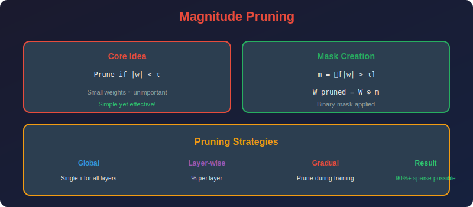

<!-- Animated Header -->
<p align="center">
  
</p>

<p align="center">
  
  
  
</p>


---

<p align="center">

</p>

# Magnitude Pruning

## 📐 Mathematical Theory

### 1. Basic Magnitude Pruning

#### 1.1 Definition

**Magnitude Pruning** removes weights with smallest absolute values:

```math
\mathcal{M} = \{(i,j) : |w_{ij}| \leq \tau\}

```

**Pruning mask:**

```math
m_{ij} = \mathbf{1}[|w_{ij}| > \tau]

```

**Pruned weights:**

```math
W_{pruned} = W \odot M

```

where $\odot$ is element-wise multiplication.

#### 1.2 Threshold Selection

**Fixed sparsity $s$:**

```math
\tau = \text{Percentile}(|W|, 100 \cdot s)

```

**Example:** For 90% sparsity, $\tau$ is the 90th percentile of $|W|$.

---

### 2. Global vs Layer-wise Pruning

#### 2.1 Layer-wise Pruning

**Prune each layer independently:**

```math
\tau_l = \text{Percentile}(|W_l|, 100 \cdot s)

```

**Pros:** Equal sparsity per layer
**Cons:** May over-prune important layers

#### 2.2 Global Pruning

**Single threshold across all layers:**

```math
\tau = \text{Percentile}(\{|w| : w \in \bigcup_l W_l\}, 100 \cdot s)

```

**Pros:** Automatically allocates sparsity based on importance
**Cons:** Some layers may be pruned more than others

**Theorem:** Global pruning achieves lower or equal loss compared to layer-wise at the same total sparsity.

**Proof sketch:** Global pruning removes the globally smallest weights. Layer-wise pruning removes some larger weights (in low-magnitude layers) while keeping smaller weights (in high-magnitude layers). Since we remove based on magnitude (a proxy for importance), global is better.

---

### 3. Optimal Brain Damage (OBD)

#### 3.1 Second-Order Analysis

**Taylor expansion of loss around optimal weights $w^*$:**

```math
\mathcal{L}(w^* + \delta w) = \mathcal{L}(w^*) + \underbrace{\nabla\mathcal{L}^T \delta w}_{= 0 \text{ at optimum}} + \frac{1}{2}\delta w^T H \delta w + O(\|\delta w\|^3)

```

**Key insight:** At optimum, $\nabla\mathcal{L} = 0$, so:

```math
\Delta\mathcal{L} \approx \frac{1}{2}\delta w^T H \delta w = \frac{1}{2}\sum_{i,j} H_{ij} \delta w_i \delta w_j

```

#### 3.2 Diagonal Approximation

**Assumption:** Off-diagonal terms are small, so:

```math
\Delta\mathcal{L} \approx \frac{1}{2}\sum_i H_{ii} \delta w_i^2

```

**When removing weight $w_i$ (setting $\delta w_i = -w_i$):**

```math
\Delta\mathcal{L}_i \approx \frac{1}{2}H_{ii} w_i^2

```

**OBD Saliency:**

```math
s_i^{OBD} = \frac{1}{2}H_{ii} w_i^2 = \frac{1}{2}\frac{\partial^2\mathcal{L}}{\partial w_i^2} w_i^2

```

#### 3.3 Relationship to Magnitude Pruning

**If $H_{ii} \approx \text{constant}$ across weights:**

```math
s_i^{OBD} \propto w_i^2

```

Then OBD reduces to magnitude pruning!

**When this holds:**
- Well-conditioned loss landscape

- Weights are at similar scale

- Curvature is approximately uniform

---

### 4. Optimal Brain Surgeon (OBS)

#### 4.1 Full Hessian Analysis

**Don't assume diagonal Hessian.**

**When removing weight $w_q$, optimal adjustment to other weights:**

```math
\delta w_{-q} = -\frac{w_q}{[H^{-1}]_{qq}} H^{-1}_{:,q}

```

**OBS Saliency:**

```math
s_q^{OBS} = \frac{w_q^2}{2[H^{-1}]_{qq}}

```

#### 4.2 Derivation

**Objective:** Minimize loss increase when pruning $w_q$:

```math
\min_{\delta w_{-q}} \frac{1}{2}(\delta w_q, \delta w_{-q})^T H (\delta w_q, \delta w_{-q})

```

subject to $\delta w_q = -w_q$ (remove the weight).

**Lagrangian:**

```math
L = \frac{1}{2}\delta w^T H \delta w + \lambda(e_q^T \delta w + w_q)

```

**KKT conditions:**

```math
H \delta w + \lambda e_q = 0
e_q^T \delta w = -w_q

```

**Solution:**

```math
\delta w = -\lambda H^{-1} e_q
\lambda = \frac{w_q}{[H^{-1}]_{qq}}
\delta w = -\frac{w_q}{[H^{-1}]_{qq}} H^{-1}_{:,q}

```

**Loss increase:**

```math
\Delta\mathcal{L}_q = \frac{1}{2}\delta w^T H \delta w = \frac{w_q^2}{2[H^{-1}]_{qq}}

```

---

### 5. Iterative Magnitude Pruning (IMP)

#### 5.1 Algorithm

```
1. Train network to convergence: θ_T = train(θ_0)

2. Prune p% of smallest magnitude weights

3. Reset remaining weights to initial values: θ_0' = mask ⊙ θ_0
4. Repeat from step 1 until target sparsity

```

#### 5.2 Theoretical Motivation

**Lottery Ticket Hypothesis:** The initial weights contain "winning tickets" - sparse subnetworks that can train to full accuracy.

**IMP finds these tickets** by:

1. Training reveals which weights become important

2. Pruning removes unimportant ones

3. Resetting to initialization preserves the "ticket"

#### 5.3 Late Resetting Variant

**Problem:** Resetting to $\theta_0$ doesn't work for very deep networks.

**Solution:** Reset to $\theta_k$ (weights at iteration $k$, early in training).

**Why this works:** Early training dynamics are crucial; some learning needs to happen before the ticket is identifiable.

---

### 6. Gradual Magnitude Pruning

#### 6.1 Sparsity Schedule

**Cubic schedule (Zhu & Gupta, 2017):**

```math
s_t = s_f + (s_0 - s_f)\left(1 - \frac{t - t_0}{n\Delta t}\right)^3

```

where:

- $s_t$ = sparsity at step $t$

- $s_0$ = initial sparsity (usually 0)

- $s_f$ = final target sparsity

- $t_0$ = pruning start step

- $n\Delta t$ = total pruning duration

#### 6.2 Why Gradual Works

**Advantages:**

1. Network adapts to sparsity gradually

2. Remaining weights can compensate

3. Better final accuracy than one-shot

**Mathematical intuition:**
Each pruning step removes small loss increase:

```math
\Delta\mathcal{L}_{total} = \sum_i \Delta\mathcal{L}_i

```

Small steps allow gradient descent to reduce each $\Delta\mathcal{L}_i$.

---

### 7. Implementation

```python
import torch
import torch.nn as nn

class MagnitudePruner:
    """Magnitude-based pruning with various strategies."""
    
    def __init__(self, model: nn.Module, sparsity: float = 0.9):
        self.model = model
        self.sparsity = sparsity
        self.masks = {}
    
    def compute_global_threshold(self) -> float:
        """Compute global pruning threshold."""
        all_weights = []
        for name, param in self.model.named_parameters():
            if 'weight' in name and param.dim() >= 2:
                all_weights.append(param.data.abs().flatten())
        
        all_weights = torch.cat(all_weights)
        threshold = torch.quantile(all_weights, self.sparsity)
        return threshold.item()
    
    def compute_layer_thresholds(self) -> dict:
        """Compute per-layer pruning thresholds."""
        thresholds = {}
        for name, param in self.model.named_parameters():
            if 'weight' in name and param.dim() >= 2:
                threshold = torch.quantile(param.data.abs().flatten(), self.sparsity)
                thresholds[name] = threshold.item()
        return thresholds
    
    def prune_global(self):
        """Apply global magnitude pruning."""
        threshold = self.compute_global_threshold()
        
        for name, param in self.model.named_parameters():
            if 'weight' in name and param.dim() >= 2:
                mask = (param.data.abs() > threshold).float()
                self.masks[name] = mask
                param.data *= mask
        
        return self._compute_sparsity()
    
    def prune_layerwise(self):
        """Apply layer-wise magnitude pruning."""
        thresholds = self.compute_layer_thresholds()
        
        for name, param in self.model.named_parameters():
            if name in thresholds:
                mask = (param.data.abs() > thresholds[name]).float()
                self.masks[name] = mask
                param.data *= mask
        
        return self._compute_sparsity()
    
    def _compute_sparsity(self) -> float:
        """Compute actual sparsity achieved."""
        total, zeros = 0, 0
        for name, param in self.model.named_parameters():
            if 'weight' in name and param.dim() >= 2:
                total += param.numel()
                zeros += (param.data == 0).sum().item()
        return zeros / total
    
    def apply_masks(self):
        """Apply stored masks (call after optimizer step)."""
        for name, param in self.model.named_parameters():
            if name in self.masks:
                param.data *= self.masks[name]

class OBDPruner:
    """Optimal Brain Damage pruning using diagonal Hessian."""
    
    def __init__(self, model: nn.Module, sparsity: float = 0.9):
        self.model = model
        self.sparsity = sparsity
        self.saliencies = {}
    
    def compute_hessian_diag(self, dataloader, criterion):
        """Estimate diagonal Hessian using Fisher approximation."""
        self.model.eval()
        
        # Initialize accumulators
        fisher_diag = {}
        for name, param in self.model.named_parameters():
            if 'weight' in name and param.dim() >= 2:
                fisher_diag[name] = torch.zeros_like(param)
        
        n_samples = 0
        for inputs, targets in dataloader:
            self.model.zero_grad()
            outputs = self.model(inputs)
            loss = criterion(outputs, targets)
            loss.backward()
            
            for name, param in self.model.named_parameters():
                if name in fisher_diag:
                    # Fisher = E[g g^T], diagonal = E[g^2]
                    fisher_diag[name] += param.grad.data ** 2
            
            n_samples += inputs.size(0)
        
        # Normalize
        for name in fisher_diag:
            fisher_diag[name] /= n_samples
        
        return fisher_diag
    
    def compute_saliencies(self, fisher_diag: dict):
        """Compute OBD saliencies: s_i = 0.5 * H_ii * w_i^2."""
        for name, param in self.model.named_parameters():
            if name in fisher_diag:
                self.saliencies[name] = 0.5 * fisher_diag[name] * (param.data ** 2)
    
    def prune(self, dataloader, criterion):
        """Prune using OBD saliencies."""
        fisher_diag = self.compute_hessian_diag(dataloader, criterion)
        self.compute_saliencies(fisher_diag)
        
        # Global threshold on saliencies
        all_saliencies = []
        for s in self.saliencies.values():
            all_saliencies.append(s.flatten())
        all_saliencies = torch.cat(all_saliencies)
        threshold = torch.quantile(all_saliencies, self.sparsity)
        
        # Prune weights with low saliency
        for name, param in self.model.named_parameters():
            if name in self.saliencies:
                mask = (self.saliencies[name] > threshold).float()
                param.data *= mask

class GradualPruner:
    """Gradual magnitude pruning with cubic schedule."""
    
    def __init__(self, model: nn.Module, final_sparsity: float = 0.9,
                 start_step: int = 0, end_step: int = 10000, 
                 frequency: int = 100):
        self.model = model
        self.final_sparsity = final_sparsity
        self.start_step = start_step
        self.end_step = end_step
        self.frequency = frequency
        self.pruner = MagnitudePruner(model, 0)
    
    def get_sparsity(self, step: int) -> float:
        """Compute target sparsity at given step."""
        if step < self.start_step:
            return 0.0
        if step >= self.end_step:
            return self.final_sparsity
        
        # Cubic schedule
        progress = (step - self.start_step) / (self.end_step - self.start_step)
        return self.final_sparsity * (1 - (1 - progress) ** 3)
    
    def step(self, current_step: int):
        """Potentially prune at this step."""
        if current_step < self.start_step:
            return
        if current_step > self.end_step:
            self.pruner.apply_masks()
            return
        if (current_step - self.start_step) % self.frequency != 0:
            self.pruner.apply_masks()
            return
        
        # Compute and apply new sparsity
        target = self.get_sparsity(current_step)
        self.pruner.sparsity = target
        actual = self.pruner.prune_global()
        print(f"Step {current_step}: target sparsity {target:.2%}, actual {actual:.2%}")

```

---

### 8. Comparison of Methods

| Method | Complexity | Accuracy | Theory |
|--------|------------|----------|--------|
| **Magnitude** | O(n log n) | Good | Weak |
| **OBD** | O(n²) | Better | Strong |
| **OBS** | O(n³) | Best | Strongest |
| **Gradual** | O(n log n) × steps | Best | Empirical |

---

## 📚 References

| Type | Title | Link |
|------|-------|------|
| 📄 | Optimal Brain Damage | [LeCun](http://yann.lecun.com/exdb/publis/pdf/lecun-90b.pdf) |
| 📄 | Optimal Brain Surgeon | [NeurIPS](https://proceedings.neurips.cc/paper/1992/file/303ed4c69846ab36c2904d3ba8573050-Paper.pdf) |
| 📄 | Gradual Magnitude Pruning | [arXiv](https://arxiv.org/abs/1710.01878) |
| 🇨🇳 | 神经网络剪枝综述 | [知乎](https://zhuanlan.zhihu.com/p/93196134) |
| 🇨🇳 | 模型剪枝入门教程 | [CSDN](https://blog.csdn.net/weixin_44878336/article/details/124963571) |
| 🇨🇳 | 剪枝算法详解 | [B站](https://www.bilibili.com/video/BV1fY411H7bA) |

---

⬅️ [Back: Pruning](../README.md) | ➡️ [Next: Structured Pruning](../02_structured_pruning/README.md)

