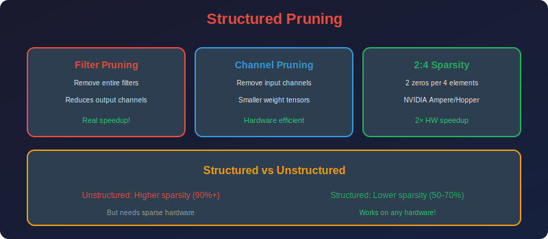

<!-- Animated Header -->
<p align="center">
  
</p>

<p align="center">
  
  
  
</p>


---

<p align="center">

</p>

# Structured Pruning

## 📐 Mathematical Theory

### 1. Definition

**Structured Pruning** removes entire structures (filters, channels, attention heads) rather than individual weights.

**Unstructured:**

```math
W_{pruned}[i,j] = 0 \text{ for some } (i,j)

```

**Structured (filter pruning):**

```math
W_{pruned}[f,:,:,:] = 0 \text{ for entire filter } f

```

---

### 2. Types of Structured Pruning

#### 2.1 Filter Pruning (CNNs)

**Remove entire convolution filters:**

```math
W \in \mathbb{R}^{C_{out} \times C_{in} \times K \times K} \to W' \in \mathbb{R}^{C'_{out} \times C_{in} \times K \times K}

```

**Effect:** Reduces output channels, affects next layer's input.

#### 2.2 Channel Pruning

**Remove input channels:**

```math
W \in \mathbb{R}^{C_{out} \times C_{in} \times K \times K} \to W' \in \mathbb{R}^{C_{out} \times C'_{in} \times K \times K}

```

**Must prune:** Corresponding output feature maps in previous layer.

#### 2.3 Attention Head Pruning (Transformers)

**Remove entire attention heads:**

```math
\text{MultiHead}(Q,K,V) = \text{Concat}(\text{head}_1, ..., \text{head}_h) W^O
\to \text{Concat}(\text{head}_1, ..., \text{head}_{h'}) W'^O

```

#### 2.4 Block/Layer Pruning

**Remove entire layers:**

```math
f(x) = f_L \circ f_{L-1} \circ ... \circ f_1(x)
\to f'(x) = f_L \circ f_{L-1} \circ ... \circ f_{l+1} \circ f_{l-1} \circ ... \circ f_1(x)

```

---

### 3. Importance Criteria

#### 3.1 L1/L2 Norm

**Filter importance (Li et al., 2016):**

```math
s_f = \|W_f\|_1 = \sum_{c,i,j} |W[f,c,i,j]|

```

or

```math
s_f = \|W_f\|_2 = \sqrt{\sum_{c,i,j} W[f,c,i,j]^2}

```

**Prune filters with smallest norm.**

#### 3.2 Taylor Expansion (First-Order)

**Importance based on gradient-weight product:**

```math
s_f = \left|\sum_{c,i,j} \frac{\partial\mathcal{L}}{\partial W[f,c,i,j]} \cdot W[f,c,i,j]\right|

```

**Approximation of loss change when removing filter:**

```math
\Delta\mathcal{L}_f \approx \nabla_{W_f}\mathcal{L}^T \cdot (-W_f) = -\sum_{c,i,j} g_{f,c,i,j} \cdot w_{f,c,i,j}

```

Taking absolute value: $s\_f = |...|$

#### 3.3 Activation-Based (APoZ)

**Average Percentage of Zeros (Hu et al., 2016):**

```math
\text{APoZ}(f) = \frac{1}{N}\sum_{n=1}^{N} \mathbf{1}[a_f^{(n)} = 0]

```

where $a\_f^{(n)}$ is activation of filter $f$ on sample $n$ (after ReLU).

**High APoZ → Filter rarely activates → Can prune.**

#### 3.4 Geometric Median (FPGM)

**Prune filters closest to geometric median:**

```math
f^* = \arg\min_f \sum_{f' \neq f} \|W_f - W_{f'}\|_2

```

**Intuition:** Redundant filters are "in the middle" of others.

**Theorem:** Removing the geometric median causes minimal change to the span of filter outputs.

---

### 4. Structured Pruning Formulation

#### 4.1 Group Sparsity Regularization

**Add group sparsity penalty during training:**

```math
\mathcal{L}_{total} = \mathcal{L}_{task} + \lambda \sum_g \|W_g\|_2

```

where groups $g$ are filters, channels, etc.

**Why $L\_{2,1}$ norm?**

```math
\|W\|_{2,1} = \sum_g \sqrt{\sum_{i \in g} w_i^2}

```

This encourages entire groups to be zero (group sparsity).

**Gradient:**

```math
\frac{\partial \|W_g\|_2}{\partial w_i} = \frac{w_i}{\|W_g\|_2}

```

Weights in small groups get larger gradients → pushed to zero.

#### 4.2 Learnable Masks

**Soft mask per structure:**

```math
\hat{W}_f = m_f \cdot W_f

```

where $m\_f \in [0,1]$ is learned.

**During training:**

```math
\mathcal{L} = \mathcal{L}_{task} + \lambda \sum_f |m_f|

```

**After training:** Prune structures with $m\_f < \tau$.

---

### 5. Layer-wise Analysis

#### 5.1 Sensitivity Analysis

**Measure accuracy drop when pruning each layer:**

```math
\Delta\text{Acc}_l(s) = \text{Acc}(W) - \text{Acc}(W \text{ with layer } l \text{ at sparsity } s)

```

**Result:** Some layers are more sensitive than others.

**Use:** Allocate less pruning to sensitive layers.

#### 5.2 Network Slimming

**Use Batch Normalization scaling factors:**

```math
y = \gamma \cdot \hat{x} + \beta

```

**Add L1 penalty on $\gamma$:**

```math
\mathcal{L} = \mathcal{L}_{task} + \lambda \sum_c |\gamma_c|

```

**Prune channels with small $\gamma\_c$.**

**Advantage:** No extra parameters, uses existing BN.

---

### 6. Dependency-Aware Pruning

#### 6.1 The Dependency Problem

**When pruning filter $f$ in layer $l$:**
- Output channels of layer $l$ decrease

- Input channels of layer $l+1$ must also decrease

- Skip connections complicate matters

#### 6.2 Dependency Graph

**Build graph of layer dependencies:**

```
Conv1 → BN1 → ReLU → Conv2 → BN2 → Add → ...
  |                             ↑
  +-----------------------------+
        (skip connection)

```

**Constraint:** Pruning must respect dependencies.

#### 6.3 Coupled Pruning

**For residual connections:**

```math
y = F(x) + x

```

**If we prune channels in $F$, we must also prune in skip connection.**

**Solution:** Prune at matching points or use 1×1 convs.

---

### 7. Implementation

```python
import torch
import torch.nn as nn
import torch.nn.functional as F

class StructuredPruner:
    """Structured pruning for CNNs and Transformers."""
    
    def __init__(self, model: nn.Module, sparsity: float = 0.5):
        self.model = model
        self.sparsity = sparsity
    
    def compute_filter_importance_l1(self) -> dict:
        """Compute L1 norm importance for each filter."""
        importance = {}
        for name, module in self.model.named_modules():
            if isinstance(module, nn.Conv2d):
                # L1 norm per filter: sum over (C_in, H, W)
                w = module.weight.data  # [C_out, C_in, H, W]
                imp = w.abs().sum(dim=(1, 2, 3))  # [C_out]
                importance[name] = imp
        return importance
    
    def compute_filter_importance_taylor(self, dataloader, criterion) -> dict:
        """Compute Taylor expansion importance."""
        importance = {}
        
        # Accumulate gradient × weight
        for name, module in self.model.named_modules():
            if isinstance(module, nn.Conv2d):
                importance[name] = torch.zeros(module.out_channels)
        
        self.model.train()
        for inputs, targets in dataloader:
            self.model.zero_grad()
            outputs = self.model(inputs)
            loss = criterion(outputs, targets)
            loss.backward()
            
            for name, module in self.model.named_modules():
                if isinstance(module, nn.Conv2d):
                    # |gradient × weight| summed per filter
                    taylor = (module.weight.grad * module.weight).abs()
                    importance[name] += taylor.sum(dim=(1, 2, 3)).cpu()
        
        return importance
    
    def prune_filters(self, importance: dict, sparsity: float):
        """Prune filters based on importance scores."""
        # Global threshold
        all_scores = torch.cat([imp for imp in importance.values()])
        threshold = torch.quantile(all_scores, sparsity)
        
        masks = {}
        for name, module in self.model.named_modules():
            if name in importance:
                mask = importance[name] > threshold
                masks[name] = mask
                
                # Actually prune (create smaller layer)
                keep_indices = mask.nonzero().squeeze()
                if len(keep_indices) == 0:
                    keep_indices = torch.tensor([0])  # Keep at least one
                
                # Store for layer reconstruction
                masks[name] = keep_indices
        
        return masks
    
    def reconstruct_model(self, masks: dict):
        """Reconstruct model with pruned filters."""
        # This is complex - need to handle dependencies
        # Simplified version for sequential models
        
        prev_keep = None
        for name, module in self.model.named_modules():
            if isinstance(module, nn.Conv2d) and name in masks:
                keep = masks[name]
                
                # Prune output filters
                new_out = len(keep)
                new_in = module.in_channels if prev_keep is None else len(prev_keep)
                
                new_conv = nn.Conv2d(
                    new_in, new_out, 
                    module.kernel_size, 
                    module.stride, 
                    module.padding,
                    bias=module.bias is not None
                )
                
                # Copy weights
                if prev_keep is None:
                    new_conv.weight.data = module.weight.data[keep]
                else:
                    new_conv.weight.data = module.weight.data[keep][:, prev_keep]
                
                if module.bias is not None:
                    new_conv.bias.data = module.bias.data[keep]
                
                # Replace module (need parent reference)
                # ... (implementation depends on model structure)
                
                prev_keep = keep

class NetworkSlimming:
    """Network Slimming using BN scaling factors."""
    
    def __init__(self, model: nn.Module, sparsity: float = 0.5, reg_lambda: float = 1e-4):
        self.model = model
        self.sparsity = sparsity
        self.reg_lambda = reg_lambda
    
    def get_bn_layers(self):
        """Get all BatchNorm layers."""
        bn_layers = {}
        for name, module in self.model.named_modules():
            if isinstance(module, nn.BatchNorm2d):
                bn_layers[name] = module
        return bn_layers
    
    def l1_regularization_loss(self):
        """Compute L1 regularization on BN gamma."""
        reg_loss = 0
        for name, module in self.model.named_modules():
            if isinstance(module, nn.BatchNorm2d):
                reg_loss += module.weight.abs().sum()
        return self.reg_lambda * reg_loss
    
    def get_channel_importance(self) -> dict:
        """Get importance from BN gamma values."""
        importance = {}
        for name, module in self.model.named_modules():
            if isinstance(module, nn.BatchNorm2d):
                importance[name] = module.weight.data.abs()
        return importance
    
    def prune(self):
        """Prune channels based on BN gamma."""
        importance = self.get_channel_importance()
        
        # Global threshold
        all_gamma = torch.cat([imp for imp in importance.values()])
        threshold = torch.quantile(all_gamma, self.sparsity)
        
        masks = {}
        for name, imp in importance.items():
            masks[name] = imp > threshold
        
        return masks

class AttentionHeadPruner:
    """Prune attention heads in Transformers."""
    
    def __init__(self, model: nn.Module, sparsity: float = 0.5):
        self.model = model
        self.sparsity = sparsity
    
    def compute_head_importance(self, dataloader) -> dict:
        """Compute importance of each attention head."""
        importance = {}
        
        # Hook to capture attention weights
        attention_scores = {}
        
        def make_hook(name):
            def hook(module, input, output):
                # Assuming output contains attention weights
                if hasattr(module, 'attention_weights'):
                    attention_scores[name] = module.attention_weights
            return hook
        
        hooks = []
        for name, module in self.model.named_modules():
            if 'attention' in name.lower():
                hooks.append(module.register_forward_hook(make_hook(name)))
        
        # Collect attention patterns
        self.model.eval()
        for inputs, _ in dataloader:
            with torch.no_grad():
                self.model(inputs)
        
        for hook in hooks:
            hook.remove()
        
        # Compute importance (e.g., entropy of attention)
        for name, attn in attention_scores.items():
            # Higher entropy = more diverse attention = more important
            entropy = -(attn * attn.log()).sum(dim=-1).mean()
            importance[name] = entropy
        
        return importance
    
    def prune_heads(self, importance: dict) -> list:
        """Return indices of heads to prune."""
        all_importance = list(importance.items())
        all_importance.sort(key=lambda x: x[1])
        
        n_prune = int(len(all_importance) * self.sparsity)
        heads_to_prune = [name for name, _ in all_importance[:n_prune]]
        
        return heads_to_prune

```

---

### 8. N:M Structured Sparsity

#### 8.1 Definition

**N:M Sparsity:** Exactly N zeros in every M consecutive weights.

**2:4 Sparsity (NVIDIA Ampere):**
- 2 zeros per 4 weights

- 50% sparsity with hardware acceleration

- 2× speedup on Tensor Cores

#### 8.2 Mathematical Constraint

```math
\forall i: |\{j \in [4i, 4i+4) : w_j = 0\}| = 2

```

#### 8.3 Finding Optimal 2:4 Pattern

**For each group of 4 weights, keep 2 with largest magnitude:**

```math
\text{mask} = \text{TopK}(|w_{4i:4i+4}|, k=2)

```

---

### 9. Comparison

| Method | Hardware Speedup | Accuracy | Complexity |
|--------|-----------------|----------|------------|
| **Unstructured** | Requires sparse HW | Best | Low |
| **Filter Pruning** | Yes | Good | Medium |
| **Channel Pruning** | Yes | Good | Medium |
| **N:M Sparsity** | Yes (Ampere) | Very Good | Low |

---

## 📚 References

| Type | Title | Link |
|------|-------|------|
| 📄 | Pruning Filters | [arXiv](https://arxiv.org/abs/1608.08710) |
| 📄 | Network Slimming | [arXiv](https://arxiv.org/abs/1708.06519) |
| 📄 | FPGM | [arXiv](https://arxiv.org/abs/1811.00250) |
| 📄 | 2:4 Sparsity | [arXiv](https://arxiv.org/abs/2104.08378) |
| 🇨🇳 | 结构化剪枝详解 | [知乎](https://zhuanlan.zhihu.com/p/98703682) |
| 🇨🇳 | 通道剪枝实现 | [CSDN](https://blog.csdn.net/qq_40243750/article/details/121369695) |
| 🇨🇳 | Network Slimming解读 | [B站](https://www.bilibili.com/video/BV1JZ4y1c7KK) |

---

⬅️ [Back: Magnitude Pruning](../01_magnitude_pruning/README.md) | ➡️ [Next: Lottery Ticket](../03_lottery_ticket/README.md)

