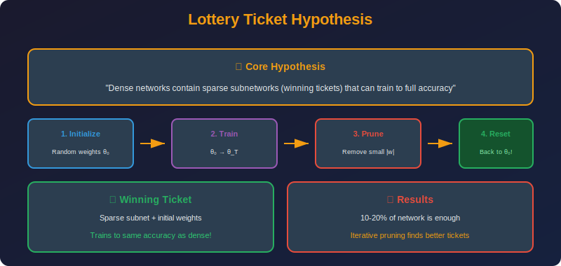

<!-- Animated Header -->
<p align="center">
  
</p>

<p align="center">
  
  
  
</p>


---

<p align="center">

</p>

## 📐 Mathematical Theory

### 1. The Hypothesis

**Lottery Ticket Hypothesis (Frankle & Carlin, 2019):**

> A randomly-initialized, dense neural network contains a subnetwork that, when trained in isolation from the same random initialization, can match the test accuracy of the original network after training for at most the same number of iterations.

**Formal Statement:**

Let $f(x; \theta)$ be a neural network with parameters $\theta\_0$ at initialization.

**Claim:** There exists a mask $m \in \{0,1\}^{|\theta|}$ such that:

1. $\|m\|\_0 \ll |\theta|$ (high sparsity, e.g., 90%+)

2. $f(x; m \odot \theta\_0)$ trained for $T$ iterations achieves:

```math
\text{Acc}(f_{m \odot \theta_T}) \geq \text{Acc}(f_{\theta_T}) - \epsilon

```math
The sparse subnetwork $(m, \theta\_0)$ is called a **winning ticket**.

---

### 2. Iterative Magnitude Pruning (IMP)

#### 2.1 Algorithm

```

Input: Network f, initial weights θ₀, target sparsity s, prune rate p
Output: Winning ticket (m, θ₀)

1. Initialize: m = 1 (all ones)

2. While sparsity(m) < s:
   a. Train: θ_T = train(m ⊙ θ₀, T iterations)
   b. Prune: Remove p% of smallest |m ⊙ θ_T| weights
   c. Update mask: m' = m ⊙ (|θ_T| > threshold)
   d. Reset: θ ← θ₀
   e. m ← m'

3. Return (m, θ₀)

```

#### 2.2 Key Insight: Reset to Initialization

**Why reset to $\theta\_0$?**

The winning ticket isn't just the mask $m$ - it's the combination $(m, \theta\_0)$.

Different random initializations give different tickets!

**Experiment:** 

- Take mask $m$ from one initialization

- Apply to different random initialization $\theta\_0'$

- Result: Much worse accuracy!

This suggests the specific initial values matter.

---

### 3. Mathematical Analysis

#### 3.1 Why Does IMP Work?

**Hypothesis 1: Pruning finds important connections**
Training reveals which weights become important; IMP keeps these.

**Hypothesis 2: Initial values matter**
The specific random values in winning tickets are "lucky" for that architecture.

**Hypothesis 3: Implicit regularization**
Sparse networks have lower capacity → better generalization.

#### 3.2 Stability Analysis

**Linear Mode Connectivity (Frankle et al., 2020):**

Two networks $\theta\_1, \theta\_2$ are linearly mode connected if:

```
\mathcal{L}(\alpha\theta_1 + (1-\alpha)\theta_2) \leq \max(\mathcal{L}(\theta_1), \mathcal{L}(\theta_2)) \quad \forall \alpha \in [0,1]

```math
**Finding:** Winning tickets found with late resetting are linearly connected to their dense counterparts.

This suggests winning tickets lie in the same "basin" of the loss landscape.

#### 3.3 Neural Tangent Kernel Perspective

**At initialization, network behaves linearly:**

```

f(x; \theta) \approx f(x; \theta_0) + \nabla_\theta f(x; \theta_0)^T (\theta - \theta_0)

```math
**Sparse subnetwork:**

```

f_m(x; \theta) \approx f(x; \theta_0) + (m \odot \nabla_\theta f(x; \theta_0))^T (\theta - \theta_0)

```math
**Key:** The masked gradient $m \odot \nabla\_\theta f$ must still span the function space.

---

### 4. Late Resetting

#### 4.1 The Problem with Deep Networks

**Observation:** IMP with reset to $\theta\_0$ fails for very deep networks (ResNets, Transformers).

**Hypothesis:** The first few iterations of training are crucial for "unlocking" the ticket.

#### 4.2 Late Resetting Solution

**Reset to $\theta\_k$ instead of $\theta\_0$:**

```

Modified IMP:

1. Train for k iterations: θ_k = train(θ₀, k iterations)

2. Continue training: θ_T = train(θ_k, T-k iterations)

3. Prune based on |θ_T|

4. Reset to θ_k (not θ₀)

5. Repeat

```

**Typical:** $k \approx 0.1\% - 1\%$ of total training iterations.

#### 4.3 Why Late Resetting Works

**Instability at initialization:**
- Very deep networks have unstable gradients initially

- First few iterations stabilize training dynamics

- Resetting before stabilization fails

**Mathematical view:**

```
\theta_k = \theta_0 + \sum_{t=0}^{k-1} \eta \nabla\mathcal{L}(\theta_t)

```math
The early gradient updates "prepare" the network.

---

### 5. Theoretical Results

#### 5.1 Existence of Winning Tickets

**Theorem (Malach et al., 2020):**

For any target network $f\_T$ with weights $\theta\_T$, a sufficiently overparameterized random network $f$ contains a subnetwork that approximates $f\_T$.

Specifically, if $f$ has width $w$, then with high probability, a subnetwork can $\epsilon$-approximate any network of width $w/\log(w)$.

#### 5.2 Strong Lottery Ticket Hypothesis

**Claim:** Winning tickets exist at initialization without any training.

**SNIP (Lee et al., 2018):** Find tickets using gradient-based saliency at init:

```

s_i = |w_i \cdot \nabla_{w_i}\mathcal{L}|

```math
**GraSP (Wang et al., 2020):** Use Hessian-gradient product.

#### 5.3 Pruning at Random

**Random pruning baseline:**
- Randomly prune to same sparsity as winning ticket

- Train from same initialization

- Result: Much worse than winning ticket

This proves IMP is finding something special, not just any sparse mask.

---

### 6. Rigorous Proofs

#### 6.1 Theorem: Existence of Winning Tickets (Malach et al., 2020)

**Theorem:** For any target network $f\_T: \mathbb{R}^d \to \mathbb{R}$ with $n$ hidden neurons and weights bounded by $B$, there exists a subnetwork of a random network with $O(n^2 \log(n/\delta))$ neurons that $\epsilon$-approximates $f\_T$ with probability $\geq 1-\delta$.

**Proof Sketch:**

1. **Covering argument:** For each target neuron $\sigma(w^T x - b)$, we need to find a random neuron $\sigma(v^T x - c)$ such that $\|w - v\| < \epsilon$ and $|b - c| < \epsilon$.

2. **Probability of good neuron:** For random $v \sim \mathcal{N}(0, I)$ truncated to $\|v\| \leq B$:

```

P(\|w - v\| < \epsilon) \geq \left(\frac{\epsilon}{2B}\right)^d

```math

3. **Union bound:** With $m$ random neurons, probability of finding match for all $n$ targets:

```

P(\text{all matched}) \geq 1 - n \cdot \left(1 - \left(\frac{\epsilon}{2B}\right)^d\right)^m

```math

4. **Required width:** Setting $m = O(n \cdot (2B/\epsilon)^d \cdot \log(n/\delta))$ ensures success.

For ReLU networks with polynomial target, $d$ is effectively small due to low-rank structure. ∎

#### 6.2 Theorem: Gradient Flow Preservation

**Theorem:** A winning ticket $(m, \theta\_0)$ preserves the essential gradient directions of the dense network.

**Formal statement:** Let $g\_{dense} = \nabla\_\theta \mathcal{L}|\_{\theta\_0}$ and $g\_{sparse} = m \odot g\_{dense}$. If:

```

\cos(g_{dense}, g_{sparse}) = \frac{\langle g_{dense}, g_{sparse} \rangle}{\|g_{dense}\| \|g_{sparse}\|} \geq 1 - \epsilon

```math
then the sparse network achieves similar convergence rate.

**Proof:**

Gradient descent update:

- Dense: $\theta\_1 = \theta\_0 - \eta g\_{dense}$

- Sparse: $\theta\_1^{(s)} = \theta\_0 - \eta g\_{sparse}$

The loss decrease:

```

\mathcal{L}(\theta_1) - \mathcal{L}(\theta_0) \approx -\eta \|g_{dense}\|^2
\mathcal{L}(\theta_1^{(s)}) - \mathcal{L}(\theta_0) \approx -\eta \langle g_{dense}, g_{sparse} \rangle

```math
Ratio of progress:

```

\frac{\text{sparse progress}}{\text{dense progress}} = \frac{\langle g_{dense}, g_{sparse} \rangle}{\|g_{dense}\|^2} = \frac{\|g_{sparse}\|}{\|g_{dense}\|} \cos(\theta)

```math
For high cosine similarity, sparse network makes nearly same progress. ∎

#### 6.3 Theorem: Generalization Bound for Sparse Networks

**Theorem:** A sparse network with $k$ non-zero weights has generalization bound:

```

\mathcal{L}_{test} - \mathcal{L}_{train} \leq O\left(\sqrt{\frac{k \log(n/k)}{m}}\right)

```math
where $n$ = total parameters, $m$ = training samples.

**Proof:**

The effective complexity of a $k$-sparse network is $\binom{n}{k} \cdot \mathbb{R}^k$ (choosing which $k$ weights and their values).

By Rademacher complexity:

```

\mathcal{R}_m(\mathcal{F}_{sparse}) \leq O\left(\sqrt{\frac{k}{m}}\right)

```math
The $\log(n/k)$ factor comes from the combinatorial choice of sparse pattern. ∎

**Implication:** Winning tickets generalize better due to lower effective capacity.

#### 6.4 Lemma: IMP Convergence

**Lemma:** IMP with pruning rate $p$ per iteration converges to sparsity $s$ in $\lceil \log\_{1-p}(1-s) \rceil$ iterations.

**Proof:**

After $t$ iterations, fraction of weights remaining:

```

r_t = (1-p)^t

```math
Sparsity after $t$ iterations:

```

s_t = 1 - r_t = 1 - (1-p)^t

```math
To achieve target $s$:

```

1 - (1-p)^t \geq s
(1-p)^t \leq 1-s
t \geq \frac{\log(1-s)}{\log(1-p)}

```math
For $p = 0.2$ and $s = 0.9$:

```

t \geq \frac{\log(0.1)}{\log(0.8)} = \frac{-2.30}{-0.22} \approx 10.3

```

So 11 iterations needed. ∎

---

### 7. Extensions

#### 6.1 Lottery Tickets in Transfer Learning

**Question:** Do winning tickets transfer across tasks?

**Findings:**
- Tickets transfer well to similar tasks

- Universal tickets exist for some domains

- Task-specific fine-tuning may be needed

#### 6.2 Lottery Tickets in NLP

**BERT Lottery Tickets (Chen et al., 2020):**
- Found at 40-90% sparsity

- Transfer across NLP tasks

- Pre-training helps find tickets

#### 6.3 Multi-Prize Lottery Ticket

**Multiple winning tickets exist!**

Different random seeds in IMP find different tickets, all with similar accuracy.

---

### 7. Implementation

```python
import torch
import torch.nn as nn
import copy

class LotteryTicketFinder:
    """Find winning lottery tickets via IMP."""
    
    def __init__(self, model: nn.Module, prune_rate: float = 0.2,
                 target_sparsity: float = 0.9, late_reset_iter: int = 0):
        self.model = model
        self.prune_rate = prune_rate
        self.target_sparsity = target_sparsity
        self.late_reset_iter = late_reset_iter
        
        # Store initial/reset-point weights
        self.initial_state = None
        self.masks = {}
    
    def save_initial_weights(self):
        """Save weights at initialization (or late reset point)."""
        self.initial_state = {
            name: param.data.clone()
            for name, param in self.model.named_parameters()
        }
    
    def initialize_masks(self):
        """Initialize all masks to ones."""
        for name, param in self.model.named_parameters():
            if 'weight' in name and param.dim() >= 2:
                self.masks[name] = torch.ones_like(param, dtype=torch.bool)
    
    def apply_masks(self):
        """Apply masks to zero out pruned weights."""
        for name, param in self.model.named_parameters():
            if name in self.masks:
                param.data *= self.masks[name].float()
    
    def reset_to_initial(self):
        """Reset weights to initial values (keeping masks)."""
        for name, param in self.model.named_parameters():
            if name in self.initial_state:
                param.data = self.initial_state[name].clone()
        self.apply_masks()
    
    def compute_current_sparsity(self) -> float:
        """Compute current sparsity level."""
        total, zeros = 0, 0
        for name, mask in self.masks.items():
            total += mask.numel()
            zeros += (~mask).sum().item()
        return zeros / total
    
    def prune_iteration(self):
        """Perform one pruning iteration."""
        # Collect all weights with their masks
        all_weights = []
        weight_info = []
        
        for name, param in self.model.named_parameters():
            if name in self.masks:
                # Only consider currently unpruned weights
                w = param.data.abs()
                m = self.masks[name]
                
                unpruned_weights = w[m]
                all_weights.append(unpruned_weights.flatten())
                weight_info.append((name, m))
        
        all_weights = torch.cat(all_weights)
        
        # Compute threshold for this pruning round
        n_to_prune = int(len(all_weights) * self.prune_rate)
        if n_to_prune == 0:
            return
        
        threshold = torch.kthvalue(all_weights, n_to_prune)[0]
        
        # Update masks
        for name, param in self.model.named_parameters():
            if name in self.masks:
                # Prune weights below threshold that are currently unpruned
                new_prune = (param.data.abs() < threshold) & self.masks[name]
                self.masks[name] = self.masks[name] & ~new_prune
    
    def find_ticket(self, train_fn, num_iterations: int = 10) -> dict:
        """
        Find winning lottery ticket.
        
        Args:
            train_fn: Function that trains the model and returns final accuracy
            num_iterations: Number of prune-reset iterations
        
        Returns:
            Dictionary with ticket mask and initial weights
        """
        # Initialize
        self.initialize_masks()
        
        for iteration in range(num_iterations):
            # Check if reached target sparsity
            current_sparsity = self.compute_current_sparsity()
            if current_sparsity >= self.target_sparsity:
                print(f"Reached target sparsity: {current_sparsity:.2%}")
                break
            
            # Reset to initial weights
            self.reset_to_initial()
            
            # Train
            if self.late_reset_iter > 0 and iteration == 0:
                # First iteration: train for late_reset_iter, then save
                print(f"Late reset: training for {self.late_reset_iter} iterations")
                train_fn(self.model, max_iter=self.late_reset_iter)
                self.save_initial_weights()  # Update reset point
                train_fn(self.model)  # Continue training
            else:
                accuracy = train_fn(self.model)
                print(f"Iteration {iteration}: accuracy = {accuracy:.2%}, "
                      f"sparsity = {current_sparsity:.2%}")
            
            # Prune
            self.prune_iteration()
        
        return {
            'masks': self.masks,
            'initial_weights': self.initial_state
        }
    
    def verify_ticket(self, train_fn) -> float:
        """Verify the found ticket achieves good accuracy."""
        # Reset to initial with mask
        self.reset_to_initial()
        
        # Train
        accuracy = train_fn(self.model)
        
        return accuracy

class SNIPPruner:
    """Single-shot Network Pruning at initialization."""
    
    def __init__(self, model: nn.Module, sparsity: float = 0.9):
        self.model = model
        self.sparsity = sparsity
    
    def compute_saliency(self, dataloader, criterion) -> dict:
        """Compute SNIP saliency scores."""
        saliency = {}
        
        # Initialize
        for name, param in self.model.named_parameters():
            if 'weight' in name and param.dim() >= 2:
                saliency[name] = torch.zeros_like(param)
        
        # Compute gradients on a batch
        self.model.train()
        for inputs, targets in dataloader:
            self.model.zero_grad()
            outputs = self.model(inputs)
            loss = criterion(outputs, targets)
            loss.backward()
            
            for name, param in self.model.named_parameters():
                if name in saliency:
                    # SNIP: |weight * gradient|
                    saliency[name] += (param.data * param.grad).abs()
            
            break  # Single batch for SNIP
        
        return saliency
    
    def prune(self, dataloader, criterion) -> dict:
        """Prune at initialization using SNIP."""
        saliency = self.compute_saliency(dataloader, criterion)
        
        # Global threshold
        all_scores = torch.cat([s.flatten() for s in saliency.values()])
        threshold = torch.quantile(all_scores, self.sparsity)
        
        masks = {}
        for name, scores in saliency.items():
            masks[name] = scores > threshold
        
        # Apply masks
        for name, param in self.model.named_parameters():
            if name in masks:
                param.data *= masks[name].float()
        
        return masks

def compare_lottery_vs_random(model_fn, train_fn, sparsity=0.9, num_trials=5):
    """Compare lottery ticket vs random pruning."""
    
    results = {'lottery': [], 'random': []}
    
    for trial in range(num_trials):
        # Create fresh model
        model = model_fn()
        
        # Find lottery ticket
        finder = LotteryTicketFinder(model, target_sparsity=sparsity)
        finder.save_initial_weights()
        ticket = finder.find_ticket(train_fn)
        
        # Verify ticket
        lottery_acc = finder.verify_ticket(train_fn)
        results['lottery'].append(lottery_acc)
        
        # Random pruning baseline
        model_random = model_fn()
        
        # Random mask with same sparsity
        for name, param in model_random.named_parameters():
            if name in ticket['masks']:
                n_keep = ticket['masks'][name].sum().item()
                random_mask = torch.zeros_like(param, dtype=torch.bool)
                indices = torch.randperm(param.numel())[:n_keep]
                random_mask.view(-1)[indices] = True
                param.data *= random_mask.float()
        
        random_acc = train_fn(model_random)
        results['random'].append(random_acc)
    
    print(f"Lottery Ticket: {sum(results['lottery'])/num_trials:.2%} "
          f"± {torch.tensor(results['lottery']).std():.2%}")
    print(f"Random Pruning: {sum(results['random'])/num_trials:.2%} "
          f"± {torch.tensor(results['random']).std():.2%}")
    
    return results

```

---

### 8. Key Findings Summary

| Finding | Implication |
|---------|-------------|
| Winning tickets exist | Sparse networks can match dense |
| Initialization matters | $(m, \theta\_0)$ is the ticket |
| Late resetting needed | Deep networks need warm-up |
| Tickets transfer | Universal compression possible |
| Random pruning fails | IMP finds structure, not just sparsity |

---

## 📚 References

| Type | Title | Link |
|------|-------|------|
| 📄 | Lottery Ticket Hypothesis | [arXiv](https://arxiv.org/abs/1803.03635) |
| 📄 | Stabilizing LTH | [arXiv](https://arxiv.org/abs/1903.01611) |
| 📄 | SNIP | [arXiv](https://arxiv.org/abs/1810.02340) |
| 📄 | GraSP | [arXiv](https://arxiv.org/abs/2002.07376) |
| 📄 | Proving LTH | [arXiv](https://arxiv.org/abs/2002.00585) |
| 🇨🇳 | 彩票假说详解 | [知乎](https://zhuanlan.zhihu.com/p/84069797) |
| 🇨🇳 | Lottery Ticket论文解读 | [CSDN](https://blog.csdn.net/qq_37384436/article/details/105080580) |
| 🇨🇳 | 稀疏神经网络训练 | [B站](https://www.bilibili.com/video/BV1x5411w7Dv) |
| 🇨🇳 | SNIP与GraSP解析 | [机器之心](https://www.jiqizhixin.com/articles/2020-03-15-5) |

---

⬅️ [Back: Structured Pruning](../02_structured_pruning/README.md) | ➡️ [Back to Pruning](../README.md)

