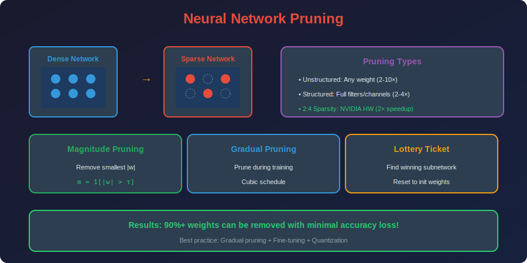

<!-- Animated Header -->
<p align="center">
  
</p>

<p align="center">
  
  
  
</p>


---

<p align="center">

</p>

## 📐 Mathematical Foundations

### 1. Magnitude Pruning

**Basic Criterion:**

```math
\text{Prune } w_{ij} \text{ if } |w_{ij}| < \tau

```

**Global vs Layer-wise Pruning:**

*Global:* Single threshold $\tau$ for entire network

```math
\mathcal{P} = \{w : |w| < \tau_{global}\}

```

*Layer-wise:* Per-layer threshold based on percentile

```math
\mathcal{P}_l = \{w \in W_l : |w| < \text{Percentile}(|W_l|, p)\}

```

### 2. Optimal Brain Damage (OBD)

**Second-Order Taylor Expansion:**

```math
\Delta\mathcal{L} = \sum_i g_i \delta w_i + \frac{1}{2}\sum_i h_{ii} \delta w_i^2 + O(\delta w^3)

```

At a minimum, $g\_i = \frac{\partial\mathcal{L}}{\partial w\_i} \approx 0$, so:

```math
\Delta\mathcal{L} \approx \frac{1}{2}\sum_i h_{ii} w_i^2

```

**Saliency (Importance Score):**

```math
s_i^{OBD} = \frac{1}{2}h_{ii}w_i^2

```

Prune weights with lowest saliency.

### 3. Optimal Brain Surgeon (OBS)

**Full Hessian Analysis:**

When pruning weight $w\_q$, optimal adjustment to other weights:

```math
\delta w = -\frac{w_q}{[H^{-1}]_{qq}}H^{-1}e_q

```

**Saliency:**

```math
s_q^{OBS} = \frac{w_q^2}{2[H^{-1}]_{qq}}

```

**Advantage:** Accounts for weight correlations
**Disadvantage:** Computing $H^{-1}$ is expensive ($O(n^3)$)

### 4. Movement Pruning (During Fine-tuning)

**Criterion:** Prune weights moving toward zero during training

```math
s_i = -w_i \cdot \frac{\partial\mathcal{L}}{\partial w_i}

```

If $s\_i > 0$: weight is moving away from zero (important)
If $s\_i < 0$: weight is moving toward zero (can prune)

### 5. Lottery Ticket Hypothesis - Formal Statement

**Theorem (Frankle & Carlin, 2019):**

Let $f(x; \theta)$ be a dense neural network. There exists a sparse mask $m \in \{0,1\}^{|\theta|}$ such that:

1. $\|m\|\_0 \ll |\theta|$ (high sparsity)
2. $f(x; m \odot \theta\_0)$ trained for $T$ iterations achieves accuracy $\geq f(x; \theta\_T) - \epsilon$

**IMP Algorithm:**

```
1. θ₀ ~ init()
2. θ_T = train(θ₀, T iterations)
3. m = magnitude_prune(θ_T, keep p%)
4. θ₀' = m ⊙ θ₀  (reset to init with mask)
5. Repeat from step 2 with θ₀'

```

### 6. Structured Pruning Criteria

**Filter Pruning (L1/L2 norm):**

```math
s_f = \|W_f\|_p = \left(\sum_{i,j,k} |w_{f,i,j,k}|^p\right)^{1/p}

```

**Channel Importance (Taylor Expansion):**

```math
s_c = \left|\sum_i \frac{\partial\mathcal{L}}{\partial a_c^{(i)}} \cdot a_c^{(i)}\right|

```

Where $a\_c$ are activations of channel $c$.

**Geometric Median (FPGM):**
Remove filters closest to geometric median:

```math
f^* = \arg\min_f \sum_{f' \neq f} \|W_f - W_{f'}\|_2

```

### 7. Sparse Training Theory

**Gradual Magnitude Pruning (Zhu & Gupta, 2017):**

```math
s_t = s_f + (s_i - s_f)\left(1 - \frac{t - t_0}{n\Delta t}\right)^3

```

Where:

- $s\_t$ = sparsity at step $t$

- $s\_i, s\_f$ = initial and final sparsity

- $t\_0$ = pruning start step

- $n\Delta t$ = pruning frequency

### 8. N:M Structured Sparsity

**Definition:** $N$ zeros in every $M$ consecutive elements

**2:4 Sparsity (NVIDIA Ampere):**
- 2 zeros per 4 elements

- 50% sparsity

- Hardware acceleration: 2× speedup

**Mathematical Constraint:**

```math
\forall i: |\{j \in [iM, (i+1)M) : w_j \neq 0\}| = M - N

```

---

## 🎯 Pruning Types

```
Unstructured Pruning:
+-------------------------------------+

|  Before:  [1.2, 0.01, -0.8, 0.002] |
|  After:   [1.2, 0,    -0.8, 0    ] |  (zeros where small)
+-------------------------------------+

Structured Pruning:
+-------------------------------------+

|  Before:  Conv with 64 filters     |
|  After:   Conv with 48 filters     |  (remove entire filters)
+-------------------------------------+

2:4 Structured Sparsity:
+-------------------------------------+

|  Before:  [a, b, c, d, e, f, g, h] |
|  After:   [a, 0, c, 0, e, 0, g, 0] |  (2 zeros per 4)
+-------------------------------------+

```

---

## 📊 Comparison

| Technique | Compression | Speed Gain | Accuracy | Hardware |
|-----------|-------------|------------|----------|----------|
| **Unstructured Pruning** | 2-10x | 1x (dense HW) | Good | Sparse HW |
| **Structured Pruning** | 2-4x | 2-4x | Moderate | All |
| **2:4 Sparsity** | 2x | 2x | Good | NVIDIA Ampere+ |

---

## 💻 Code Examples

```python
import torch
import torch.nn.utils.prune as prune

# ========== Magnitude Pruning ==========
def magnitude_prune(weights, sparsity=0.5):
    """Prune smallest magnitude weights"""
    threshold = torch.quantile(weights.abs().flatten(), sparsity)
    mask = weights.abs() > threshold
    return weights * mask, mask

# Example
W = torch.randn(100, 100)
W_pruned, mask = magnitude_prune(W, sparsity=0.9)  # 90% zeros

# ========== PyTorch Pruning API ==========
model = MyModel()

# Unstructured L1 pruning (30% of weights)
prune.l1_unstructured(model.fc1, name='weight', amount=0.3)

# Structured pruning (remove 20% of channels by L2 norm)
prune.ln_structured(model.conv1, name='weight', amount=0.2, n=2, dim=0)

# Global pruning (20% globally)
parameters_to_prune = [
    (model.conv1, 'weight'),
    (model.conv2, 'weight'),
    (model.fc1, 'weight'),
]
prune.global_unstructured(
    parameters_to_prune,
    pruning_method=prune.L1Unstructured,
    amount=0.2,
)

# ========== Lottery Ticket (Iterative Magnitude Pruning) ==========
def lottery_ticket_pruning(model, train_fn, prune_percent=0.2, iterations=10):
    """Find winning ticket via IMP"""
    # Save initial weights
    initial_state = {k: v.clone() for k, v in model.state_dict().items()}
    
    for i in range(iterations):
        # Train
        train_fn(model)
        
        # Prune globally
        all_weights = torch.cat([p.flatten() for p in model.parameters()])
        threshold = torch.quantile(all_weights.abs(), prune_percent)
        
        # Create masks
        masks = {}
        for name, param in model.named_parameters():
            masks[name] = (param.abs() > threshold).float()
        
        # Reset to initial weights with mask
        for name, param in model.named_parameters():
            param.data = initial_state[name] * masks[name]
    
    return model, masks

```

---

## 🔗 Where This Topic Is Used

| Topic | How Pruning Is Used |
|-------|---------------------|
| **Lottery Ticket Hypothesis** | Find winning tickets via pruning |
| **BERT Compression** | Prune attention heads |
| **Vision Models** | Filter pruning in CNNs |
| **Sparse Training** | Train with pruning from start |
| **Mobile Deployment** | Reduce model size |
| **SparseGPT** | One-shot 50% sparsity for LLMs |
| **Wanda** | Pruning LLMs without retraining |

---

## 📚 References & Resources

### 📄 Key Papers

| Paper | Authors | Year | Key Contribution |
|-------|---------|------|------------------|
| [Lottery Ticket Hypothesis](https://arxiv.org/abs/1803.03635) | Frankle & Carlin | 2018 | Sparse subnetworks from init |
| [Deep Compression](https://arxiv.org/abs/1510.00149) | Han et al. | 2015 | Prune+Quantize+Huffman |
| [Learning Structured Sparsity](https://arxiv.org/abs/1608.03665) | Wen et al. | 2016 | SSL for CNNs |
| [Movement Pruning](https://arxiv.org/abs/2005.07683) | Sanh et al. | 2020 | Pruning during fine-tuning |
| [SNIP](https://arxiv.org/abs/1810.02340) | Lee et al. | 2018 | Single-shot pruning at init |
| [Wanda](https://arxiv.org/abs/2306.11695) | Sun et al. | 2023 | Pruning LLMs without retraining |
| [SparseGPT](https://arxiv.org/abs/2301.00774) | Frantar & Alistarh | 2023 | One-shot 50% sparsity for GPT |

### 🎓 Courses

| Course | Description | Link |
|--------|-------------|------|
| 🔥 MIT 6.5940 | Prof. Song Han's TinyML: Lectures 3-4 Pruning & Sparsity | [Course](https://hanlab.mit.edu/courses/2024-fall-65940) |

### 🛠️ Tools

| Tool | Description | Link |
|------|-------------|------|
| torch.nn.utils.prune | PyTorch pruning | [Docs](https://pytorch.org/docs/stable/nn.html#utilities) |
| Neural Magic | Sparse inference | [GitHub](https://github.com/neuralmagic) |

---

## 📁 Sub-Topics

| # | Topic | Description | Link |
|:-:|-------|-------------|:----:|
| 1 | **Magnitude Pruning** | OBD, OBS, saliency, gradual pruning | [📁 Open](./01_magnitude_pruning/README.md) |
| 2 | **Structured Pruning** | Filter/channel pruning, N:M sparsity | [📁 Open](./02_structured_pruning/README.md) |
| 3 | **Lottery Ticket** | LTH, IMP, SNIP, late resetting | [📁 Open](./03_lottery_ticket/README.md) |

---

⬅️ [Back: Quantization](../02_quantization/README.md) | ➡️ [Next: Knowledge Distillation](../04_knowledge_distillation/README.md)

---


<p align="center">
  
</p>

