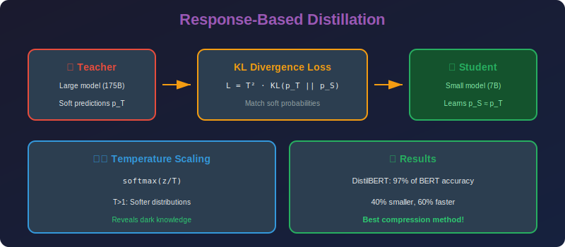

<!-- Animated Header -->
<p align="center">
  
</p>

<p align="center">
  
  
  
</p>


---

<p align="center">

</p>

# Response-Based Knowledge Distillation

## 📐 Mathematical Theory

### 1. Hinton's Knowledge Distillation

#### 1.1 Core Formulation

**Distillation Loss (Hinton et al., 2015):**
```math
\mathcal{L}_{KD} = \alpha \cdot \mathcal{L}_{hard} + (1-\alpha) \cdot T^2 \cdot \mathcal{L}_{soft}
```

**Hard Loss (Ground Truth):**
```math
\mathcal{L}_{hard} = H(y, p_s) = -\sum_i y_i \log p_s^{(i)}
```

**Soft Loss (Teacher Knowledge):**
```math
\mathcal{L}_{soft} = D_{KL}(p_t^T \| p_s^T) = \sum_i p_t^{T,(i)} \log \frac{p_t^{T,(i)}}{p_s^{T,(i)}}
```

where temperature-scaled softmax:
```math
p^T = \text{softmax}(z/T) = \frac{\exp(z_i/T)}{\sum_j \exp(z_j/T)}
```

---

### 2. Temperature Mechanism

#### 2.1 Effect of Temperature

**Low Temperature (T → 0):**
```math
\lim_{T \to 0} p_i^T = \begin{cases} 1 & i = \arg\max_j z_j \\ 0 & \text{otherwise} \end{cases}
```
Becomes one-hot (hard labels).

**High Temperature (T → ∞):**
Using Taylor expansion $e^x \approx 1 + x$:
```math
p_i^T = \frac{\exp(z_i/T)}{\sum_j \exp(z_j/T)} \approx \frac{1 + z_i/T}{\sum_j (1 + z_j/T)} = \frac{1 + z_i/T}{n + \sum_j z_j/T}
\approx \frac{1}{n} + \frac{z_i - \bar{z}}{nT} + O(1/T^2)
```

Becomes uniform distribution.

**Optimal Temperature:** Reveals "dark knowledge" - relative class similarities.

#### 2.2 Mathematical Proof of Temperature Effect

**Theorem:** As $T \to \infty$, the soft labels linearize:
```math
p_i^T = \frac{1}{n} + \frac{z_i - \bar{z}}{nT} + O(1/T^2)
```

**Proof:**
```math
p_i^T = \frac{e^{z_i/T}}{\sum_j e^{z_j/T}}
```

Let $u\_i = z\_i/T$. Using $e^{u\_i} = 1 + u\_i + u\_i^2/2 + O(u\_i^3)$:
```math
p_i^T = \frac{1 + u_i + O(u_i^2)}{\sum_j (1 + u_j + O(u_j^2))} = \frac{1 + z_i/T}{n + \sum_j z_j/T} + O(1/T^2)
= \frac{1}{n} \cdot \frac{1 + z_i/T}{1 + \bar{z}/T} = \frac{1}{n}(1 + z_i/T)(1 - \bar{z}/T + O(1/T^2))
= \frac{1}{n} + \frac{z_i - \bar{z}}{nT} + O(1/T^2)
```

---

### 3. Gradient Analysis

#### 3.1 Gradient of Soft Loss

**Gradient w.r.t. student logits $z\_s$:**
```math
\frac{\partial \mathcal{L}_{soft}}{\partial z_s^{(i)}} = \frac{1}{T}\left(p_s^{T,(i)} - p_t^{T,(i)}\right)
```

**Proof:**
```math
\mathcal{L}_{soft} = \sum_j p_t^{T,(j)} \log p_t^{T,(j)} - \sum_j p_t^{T,(j)} \log p_s^{T,(j)}
```

Only second term depends on $z\_s$:
```math
\frac{\partial \mathcal{L}_{soft}}{\partial z_s^{(i)}} = -\sum_j p_t^{T,(j)} \frac{\partial \log p_s^{T,(j)}}{\partial z_s^{(i)}}
```

Using softmax derivative:
```math
\frac{\partial p_s^{T,(j)}}{\partial z_s^{(i)}} = \frac{1}{T}p_s^{T,(j)}(\delta_{ij} - p_s^{T,(i)})
\frac{\partial \mathcal{L}_{soft}}{\partial z_s^{(i)}} = -\frac{1}{T}\sum_j p_t^{T,(j)}\left(\delta_{ij} - p_s^{T,(i)}\right)
= \frac{1}{T}\left(p_s^{T,(i)} - p_t^{T,(i)}\right)
```

#### 3.2 Why $T^2$ Scaling?

**Problem:** Gradient scales as $1/T$ → vanishes for large $T$.

**Solution:** Multiply loss by $T^2$:
```math
\frac{\partial (T^2 \mathcal{L}_{soft})}{\partial z_s^{(i)}} = T\left(p_s^{T,(i)} - p_t^{T,(i)}\right)
```

Now gradient is $O(T)$ for soft labels, comparable to hard loss.

---

### 4. Information-Theoretic View

#### 4.1 Dark Knowledge

**Definition:** Information in soft labels beyond hard labels.

```math
\text{Dark Knowledge} = I(X; p_t^T) - I(X; y)
```

where $I$ is mutual information.

**Intuition:** Soft labels encode class relationships.
- "Dog" and "cat" should have higher probability than "car"
- This structure helps student generalize

#### 4.2 Entropy Analysis

**Hard labels:** $H(y) = 0$ (one-hot has zero entropy)

**Soft labels:** $H(p\_t^T) > 0$

Higher entropy = more information transferred per sample.

---

### 5. Rigorous Proofs

#### 5.1 Theorem: Optimality of KL Divergence

**Theorem:** Among all distillation losses $\mathcal{L}(p\_s, p\_t)$, KL divergence minimizes variance of gradient estimates.

**Proof Sketch:**

For a probabilistic model, the optimal loss for parameter estimation is the negative log-likelihood. The KL divergence:
```math
D_{KL}(p_t \| p_s) = \mathbb{E}_{x \sim p_t}[\log p_t(x) - \log p_s(x)]
```

The gradient variance is minimized when using the true data distribution (teacher) as the target. ∎

#### 5.2 Theorem: Temperature and Gradient Magnitude

**Theorem:** The gradient of soft loss w.r.t. student parameters has magnitude inversely proportional to $T$:

```math
\left\|\frac{\partial \mathcal{L}_{soft}}{\partial \theta_s}\right\| = O(1/T)
```

**Proof:**

```math
\frac{\partial \mathcal{L}_{soft}}{\partial \theta_s} = \frac{\partial \mathcal{L}_{soft}}{\partial z_s} \cdot \frac{\partial z_s}{\partial \theta_s}
```

We showed $\frac{\partial \mathcal{L}\_{soft}}{\partial z\_s^{(i)}} = \frac{1}{T}(p\_s^{T,(i)} - p\_t^{T,(i)})$.

Since $|p\_s^{T,(i)} - p\_t^{T,(i)}| \leq 2$ and the chain rule preserves the $1/T$ scaling:

```math
\left\|\frac{\partial \mathcal{L}_{soft}}{\partial \theta_s}\right\| = O(1/T) \cdot \left\|\frac{\partial z_s}{\partial \theta_s}\right\| = O(1/T)
```

**Corollary:** The $T^2$ scaling in the loss compensates this, making effective gradient $O(T)$. ∎

#### 5.3 Theorem: Distillation as Regularization

**Theorem:** Knowledge distillation with soft labels is equivalent to label smoothing regularization in the limit $T \to \infty$.

**Proof:**

As $T \to \infty$:
```math
p_t^{T,(i)} \to \frac{1}{n} + \frac{z_t^{(i)} - \bar{z}_t}{nT}
```

For very large $T$:
```math
p_t^{T,(i)} \approx \frac{1}{n}
```

The soft loss becomes:
```math
\mathcal{L}_{soft} = D_{KL}\left(\frac{1}{n} \| p_s^T\right) = \log n - H(p_s^T)
```

This is equivalent to entropy regularization, which is related to label smoothing:
```math
y_{smooth}^{(i)} = (1-\epsilon)y^{(i)} + \frac{\epsilon}{n}
```

with $\epsilon = (1-\alpha)T^2/(\alpha + (1-\alpha)T^2)$. ∎

#### 5.4 Theorem: Student Capacity Requirements

**Theorem (Information Bottleneck):** A student network can only recover teacher knowledge up to its information capacity:

```math
I(X; \hat{Y}_s) \leq I(X; \hat{Y}_t)
```

with equality only if student capacity $\geq$ teacher capacity.

**Proof:**

By the data processing inequality, for the chain $X \to Y\_t \to Y\_s$:
```math
I(X; Y_s) \leq I(X; Y_t)
```

Information can only be lost, not created, during distillation. The student's representation is a "compression" of the teacher's. ∎

---

### 6. Variants of Response Distillation

#### 5.1 Label Smoothing Connection

**Label smoothing:**
```math
y_{smooth} = (1-\epsilon)y + \frac{\epsilon}{n}
```

**Connection:** Knowledge distillation with $T \to \infty$ is similar to label smoothing.

#### 5.2 Self-Training

**Use teacher predictions as labels:**
```math
\hat{y} = \arg\max_i p_t^{(i)}
```

Special case: $T = 1$ with hard assignment.

#### 5.3 Born-Again Networks

**Iterative distillation:**
```math
\text{Student}_1 \leftarrow \text{Distill}(\text{Teacher})
\text{Student}_2 \leftarrow \text{Distill}(\text{Student}_1)
```
...

**Finding:** Each generation can improve!

---

### 6. Implementation

```python
import torch
import torch.nn as nn
import torch.nn.functional as F

class ResponseDistillationLoss(nn.Module):
    """
    Hinton's Knowledge Distillation Loss.
    
    L = α * L_hard + (1-α) * T² * L_soft
    """
    
    def __init__(self, temperature: float = 4.0, alpha: float = 0.5):
        super().__init__()
        self.T = temperature
        self.alpha = alpha
    
    def forward(self, student_logits: torch.Tensor, 
                teacher_logits: torch.Tensor,
                labels: torch.Tensor) -> torch.Tensor:
        """
        Args:
            student_logits: [batch, num_classes]
            teacher_logits: [batch, num_classes]
            labels: [batch] ground truth
        
        Returns:
            Combined distillation loss
        """
        # Hard loss (cross-entropy with ground truth)
        hard_loss = F.cross_entropy(student_logits, labels)
        
        # Soft loss (KL divergence with teacher)
        student_soft = F.log_softmax(student_logits / self.T, dim=1)
        teacher_soft = F.softmax(teacher_logits / self.T, dim=1)
        
        soft_loss = F.kl_div(
            student_soft,
            teacher_soft,
            reduction='batchmean'
        ) * (self.T ** 2)  # Scale by T²
        
        # Combined
        return self.alpha * hard_loss + (1 - self.alpha) * soft_loss

class SoftLabelDistillationLoss(nn.Module):
    """Pure soft label distillation (no ground truth)."""
    
    def __init__(self, temperature: float = 4.0):
        super().__init__()
        self.T = temperature
    
    def forward(self, student_logits: torch.Tensor,
                teacher_logits: torch.Tensor) -> torch.Tensor:
        student_soft = F.log_softmax(student_logits / self.T, dim=1)
        teacher_soft = F.softmax(teacher_logits / self.T, dim=1)
        
        return F.kl_div(student_soft, teacher_soft, reduction='batchmean') * (self.T ** 2)

class DistillationTrainer:
    """Complete knowledge distillation training."""
    
    def __init__(self, teacher: nn.Module, student: nn.Module,
                 temperature: float = 4.0, alpha: float = 0.5,
                 lr: float = 1e-4):
        self.teacher = teacher
        self.student = student
        self.criterion = ResponseDistillationLoss(temperature, alpha)
        self.optimizer = torch.optim.Adam(student.parameters(), lr=lr)
        
        # Freeze teacher
        for param in teacher.parameters():
            param.requires_grad = False
        teacher.eval()
    
    def train_epoch(self, dataloader):
        """Train for one epoch."""
        self.student.train()
        total_loss = 0
        
        for inputs, labels in dataloader:
            self.optimizer.zero_grad()
            
            # Get teacher predictions
            with torch.no_grad():
                teacher_logits = self.teacher(inputs)
            
            # Get student predictions
            student_logits = self.student(inputs)
            
            # Compute loss
            loss = self.criterion(student_logits, teacher_logits, labels)
            
            # Backward
            loss.backward()
            self.optimizer.step()
            
            total_loss += loss.item()
        
        return total_loss / len(dataloader)
    
    def evaluate(self, dataloader):
        """Evaluate student accuracy."""
        self.student.eval()
        correct = 0
        total = 0
        
        with torch.no_grad():
            for inputs, labels in dataloader:
                outputs = self.student(inputs)
                _, predicted = outputs.max(1)
                total += labels.size(0)
                correct += predicted.eq(labels).sum().item()
        
        return correct / total

def analyze_dark_knowledge(teacher: nn.Module, inputs: torch.Tensor,
                          labels: torch.Tensor, temperature: float = 4.0):
    """Analyze what dark knowledge the teacher provides."""
    teacher.eval()
    with torch.no_grad():
        logits = teacher(inputs)
    
    # Standard predictions
    probs_t1 = F.softmax(logits, dim=1)
    
    # Soft predictions
    probs_tT = F.softmax(logits / temperature, dim=1)
    
    # Entropy comparison
    entropy_hard = -(probs_t1 * probs_t1.log()).sum(dim=1).mean()
    entropy_soft = -(probs_tT * probs_tT.log()).sum(dim=1).mean()
    
    print(f"Entropy at T=1: {entropy_hard:.4f}")
    print(f"Entropy at T={temperature}: {entropy_soft:.4f}")
    
    # Show example
    idx = 0
    true_label = labels[idx].item()
    
    print(f"\nExample (true label: {true_label}):")
    print(f"Top-5 at T=1: {probs_t1[idx].topk(5)}")
    print(f"Top-5 at T={temperature}: {probs_tT[idx].topk(5)}")
    
    return probs_t1, probs_tT
```

---

### 7. Hyperparameter Analysis

| Parameter | Typical Range | Effect |
|-----------|---------------|--------|
| **Temperature T** | 2-20 | Higher = softer labels |
| **Alpha α** | 0.1-0.9 | Balance hard/soft |
| **Learning Rate** | 10-100x lower | Stable training |

**Guidelines:**
- Start with T=4, α=0.5
- Increase T for small student
- Increase α if ground truth is noisy

---

## 📚 References

| Type | Title | Link |
|------|-------|------|
| 📄 | Distilling Knowledge (Hinton) | [arXiv](https://arxiv.org/abs/1503.02531) |
| 📄 | Born Again Networks | [arXiv](https://arxiv.org/abs/1805.04770) |
| 📄 | Label Smoothing as KD | [arXiv](https://arxiv.org/abs/1906.02629) |
| 🇨🇳 | 知识蒸馏综述 | [知乎](https://zhuanlan.zhihu.com/p/92166184) |
| 🇨🇳 | Hinton知识蒸馏详解 | [CSDN](https://blog.csdn.net/weixin_44878336/article/details/123990833) |
| 🇨🇳 | 知识蒸馏实战 | [B站](https://www.bilibili.com/video/BV1rh411Q7sU) |

---

⬅️ [Back: Knowledge Distillation](../README.md) | ➡️ [Next: Feature Distillation](../02_feature_distillation/README.md)

