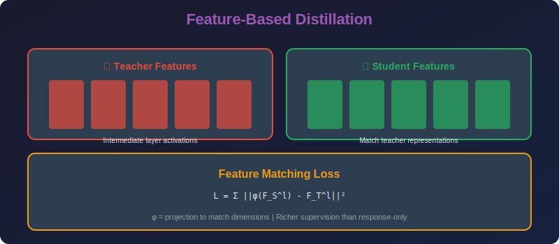

<!-- Animated Header -->
<p align="center">
  
</p>

<p align="center">
  
  
  
</p>


---

<p align="center">

</p>

# Feature-Based Knowledge Distillation

## 📐 Mathematical Theory

### 1. FitNets: Hint Learning

#### 1.1 Formulation

**FitNets (Romero et al., 2015):**
Transfer intermediate representations, not just outputs.

```math
\mathcal{L}_{hint} = \|r(F_s^l) - F_t^{l'}\|_2^2

```

where:
- $F\_s^l$ = student features at layer $l$
- $F\_t^{l'}$ = teacher features at layer $l'$ (hint layer)
- $r(\cdot)$ = regressor to match dimensions

#### 1.2 Regressor Design

**When dimensions differ:**
- Student: $F\_s^l \in \mathbb{R}^{B \times C\_s \times H \times W}$
- Teacher: $F\_t^{l'} \in \mathbb{R}^{B \times C\_t \times H' \times W'}$

**Regressor options:**
1. 1×1 convolution: $r(F\_s) = \text{Conv}\_{1\times1}(F\_s)$
2. Linear projection: $r(F\_s) = F\_s W\_r$
3. MLP: $r(F\_s) = \text{MLP}(F\_s)$

#### 1.3 Training Procedure

**Two-stage training:**
1. **Stage 1:** Train hint layers only

```math
\min_{\theta_s^{1:l}, W_r} \|r(F_s^l) - F_t^{l'}\|_2^2

```math
2. **Stage 2:** Train full network with KD

```

\min_{\theta_s} \mathcal{L}_{KD}

```

---

### 2. Attention Transfer

#### 2.1 Spatial Attention Maps

**Attention map (Zagoruyko & Komodakis, 2016):**

```math
A = \sum_{c=1}^{C} |F_c|^p

```

where $F\_c$ is the feature map of channel $c$ and $p \in \{1, 2\}$.

**Intuition:** Where the network "looks" in the input.

#### 2.2 Attention Transfer Loss

```math
\mathcal{L}_{AT} = \sum_l \left\|\frac{A_s^l}{\|A_s^l\|_2} - \frac{A_t^l}{\|A_t^l\|_2}\right\|_p^p

```

**Normalization:** Makes attention maps comparable across layers/networks.

#### 2.3 Gradient Flow

**Gradient of attention loss:**

```math
\frac{\partial \mathcal{L}_{AT}}{\partial F_s^{(c)}} = p \cdot |F_s^{(c)}|^{p-1} \cdot \text{sign}(F_s^{(c)}) \cdot \frac{\partial}{\partial A_s}\left\|\frac{A_s}{\|A_s\|} - \frac{A_t}{\|A_t\|}\right\|

```

---

### 3. Activation Boundary Distillation

#### 3.1 Concept

**Neuron Selectivity Transfer (Huang & Wang, 2017):**
Transfer activation patterns, not values.

**Binary activation map:**

```math
B = \mathbf{1}[F > 0]

```

#### 3.2 Maximum Mean Discrepancy

**MMD between student and teacher activations:**

```math
\mathcal{L}_{MMD} = \left\|\frac{1}{n}\sum_{i=1}^n \phi(F_s^{(i)}) - \frac{1}{n}\sum_{i=1}^n \phi(F_t^{(i)})\right\|^2

```

where $\phi$ is a kernel feature map.

---

### 4. Intermediate Feature Matching

#### 4.1 Layer Selection

**Which layers to match?**

**Principle:** Match layers with similar abstraction level:
- Early layers: Low-level features (edges, textures)
- Middle layers: Mid-level features (parts, shapes)
- Late layers: High-level semantics

#### 4.2 Multi-layer Distillation

```math
\mathcal{L}_{multi} = \sum_{(l_s, l_t) \in \mathcal{P}} \lambda_l \|r_l(F_s^{l_s}) - F_t^{l_t}\|_2^2

```

where $\mathcal{P}$ is a set of layer pairs.

#### 4.3 Correlation-based Matching

**Correlation Matrix:**

```math
G = F^T F \in \mathbb{R}^{n \times n}

```

**Loss:**

```math
\mathcal{L}_{corr} = \|G_s - G_t\|_F^2

```

Matches relationships between samples, not absolute values.

---

### 5. FSP: Flow of Solution Procedure

#### 5.1 Concept

**Flow between layers (Yim et al., 2017):**

```math
G = \sum_{s=1}^{h \times w} F_1(s) \otimes F_2(s)

```

where $\otimes$ is outer product, $F\_1, F\_2$ are features from consecutive layers.

#### 5.2 FSP Matrix

**FSP matrix captures transformation:**

```math
G_{FSP} = \frac{1}{hw} F_1^T F_2 \in \mathbb{R}^{c_1 \times c_2}

```

**Loss:**

```math
\mathcal{L}_{FSP} = \sum_l \|G_s^l - G_t^l\|_F^2

```

---

### 6. Implementation

```python
import torch
import torch.nn as nn
import torch.nn.functional as F

class FitNetLoss(nn.Module):
    """FitNets intermediate representation matching."""
    
    def __init__(self, student_channels: int, teacher_channels: int):
        super().__init__()
        # Regressor to match dimensions
        self.regressor = nn.Conv2d(student_channels, teacher_channels, 1)
    
    def forward(self, student_features: torch.Tensor,
                teacher_features: torch.Tensor) -> torch.Tensor:
        """
        Args:
            student_features: [B, C_s, H, W]
            teacher_features: [B, C_t, H, W]
        """
        # Project student features
        projected = self.regressor(student_features)
        
        # Spatial alignment if needed
        if projected.shape[2:] != teacher_features.shape[2:]:
            projected = F.interpolate(
                projected, 
                size=teacher_features.shape[2:],
                mode='bilinear',
                align_corners=False
            )
        
        # L2 loss
        return F.mse_loss(projected, teacher_features)

class AttentionTransferLoss(nn.Module):
    """Attention map distillation."""
    
    def __init__(self, p: int = 2):
        super().__init__()
        self.p = p
    
    def forward(self, student_features: torch.Tensor,
                teacher_features: torch.Tensor) -> torch.Tensor:
        """
        Args:
            student_features: [B, C, H, W]
            teacher_features: [B, C, H, W]
        """
        # Compute attention maps
        s_attn = self._attention_map(student_features)
        t_attn = self._attention_map(teacher_features)
        
        # Resize if needed
        if s_attn.shape != t_attn.shape:
            s_attn = F.interpolate(s_attn.unsqueeze(1), 
                                   size=t_attn.shape[1:],
                                   mode='bilinear').squeeze(1)
        
        # Normalize
        s_attn = s_attn / (s_attn.norm(p=2, dim=(1, 2), keepdim=True) + 1e-8)
        t_attn = t_attn / (t_attn.norm(p=2, dim=(1, 2), keepdim=True) + 1e-8)
        
        # L_p loss
        return (s_attn - t_attn).abs().pow(self.p).mean()
    
    def _attention_map(self, features: torch.Tensor) -> torch.Tensor:
        """Compute spatial attention map."""
        return features.pow(2).sum(dim=1)  # [B, H, W]

class CorrelationDistillationLoss(nn.Module):
    """Correlation-based feature distillation."""
    
    def forward(self, student_features: torch.Tensor,
                teacher_features: torch.Tensor) -> torch.Tensor:
        """
        Match correlation matrices (Gram-like).
        """
        B, C, H, W = student_features.shape
        
        # Flatten spatial dimensions
        s_flat = student_features.view(B, C, -1)  # [B, C, HW]
        t_flat = teacher_features.view(B, teacher_features.size(1), -1)
        
        # Compute correlation
        s_corr = torch.bmm(s_flat, s_flat.transpose(1, 2)) / (H * W)  # [B, C, C]
        t_corr = torch.bmm(t_flat, t_flat.transpose(1, 2)) / (H * W)
        
        # Match (need to handle different channel numbers)
        # Option 1: Use pooling to match dimensions
        if s_corr.size(1) != t_corr.size(1):
            # Resize using linear interpolation
            s_corr = F.interpolate(s_corr.unsqueeze(1), 
                                   size=t_corr.shape[1:],
                                   mode='bilinear').squeeze(1)
        
        return F.mse_loss(s_corr, t_corr)

class FSPLoss(nn.Module):
    """Flow of Solution Procedure matrix matching."""
    
    def forward(self, student_f1: torch.Tensor, student_f2: torch.Tensor,
                teacher_f1: torch.Tensor, teacher_f2: torch.Tensor) -> torch.Tensor:
        """
        Match FSP matrices between consecutive layers.
        """
        s_fsp = self._compute_fsp(student_f1, student_f2)
        t_fsp = self._compute_fsp(teacher_f1, teacher_f2)
        
        return F.mse_loss(s_fsp, t_fsp)
    
    def _compute_fsp(self, f1: torch.Tensor, f2: torch.Tensor) -> torch.Tensor:
        """Compute FSP matrix."""
        B, C1, H, W = f1.shape
        C2 = f2.size(1)
        
        # Flatten
        f1_flat = f1.view(B, C1, -1)  # [B, C1, HW]
        f2_flat = f2.view(B, C2, -1)  # [B, C2, HW]
        
        # FSP = F1^T @ F2 / (H*W)
        fsp = torch.bmm(f1_flat, f2_flat.transpose(1, 2)) / (H * W)  # [B, C1, C2]
        
        return fsp

class MultiLayerDistillation(nn.Module):
    """Combined multi-layer feature distillation."""
    
    def __init__(self, layer_pairs: list, layer_weights: list = None):
        """
        Args:
            layer_pairs: List of (student_channels, teacher_channels)
            layer_weights: Optional weights for each layer
        """
        super().__init__()
        
        self.regressors = nn.ModuleList([
            nn.Conv2d(s_ch, t_ch, 1) for s_ch, t_ch in layer_pairs
        ])
        
        self.weights = layer_weights or [1.0] * len(layer_pairs)
    
    def forward(self, student_features: list, teacher_features: list) -> torch.Tensor:
        """
        Args:
            student_features: List of student feature maps
            teacher_features: List of teacher feature maps
        """
        total_loss = 0
        
        for i, (s_feat, t_feat) in enumerate(zip(student_features, teacher_features)):
            # Project
            projected = self.regressors[i](s_feat)
            
            # Align spatial dimensions
            if projected.shape[2:] != t_feat.shape[2:]:
                projected = F.interpolate(projected, size=t_feat.shape[2:],
                                          mode='bilinear', align_corners=False)
            
            # L2 loss
            layer_loss = F.mse_loss(projected, t_feat)
            total_loss += self.weights[i] * layer_loss
        
        return total_loss

class FeatureDistillationTrainer:
    """Complete training with feature distillation."""
    
    def __init__(self, teacher: nn.Module, student: nn.Module,
                 feature_layers: dict, temperature: float = 4.0,
                 alpha: float = 0.5, beta: float = 0.5):
        """
        Args:
            feature_layers: Dict mapping layer names to (student, teacher) indices
        """
        self.teacher = teacher
        self.student = student
        self.temperature = temperature
        self.alpha = alpha  # Weight for hard loss
        self.beta = beta    # Weight for feature loss
        
        # Freeze teacher
        for param in teacher.parameters():
            param.requires_grad = False
        
        # Setup feature extraction
        self.student_features = {}
        self.teacher_features = {}
        self._register_hooks(feature_layers)
        
        # Feature loss
        # (Simplified - in practice, would have regressors for each layer)
        self.feature_criterion = nn.MSELoss()
    
    def _register_hooks(self, feature_layers: dict):
        """Register forward hooks to capture intermediate features."""
        
        def make_hook(storage, name):
            def hook(module, input, output):
                storage[name] = output
            return hook
        
        for name, module in self.student.named_modules():
            if name in feature_layers:
                module.register_forward_hook(make_hook(self.student_features, name))
        
        for name, module in self.teacher.named_modules():
            if name in feature_layers:
                module.register_forward_hook(make_hook(self.teacher_features, name))
    
    def compute_loss(self, inputs: torch.Tensor, labels: torch.Tensor):
        """Compute combined distillation loss."""
        # Forward pass
        with torch.no_grad():
            teacher_logits = self.teacher(inputs)
        student_logits = self.student(inputs)
        
        # Hard loss
        hard_loss = F.cross_entropy(student_logits, labels)
        
        # Soft loss
        soft_loss = F.kl_div(
            F.log_softmax(student_logits / self.temperature, dim=1),
            F.softmax(teacher_logits / self.temperature, dim=1),
            reduction='batchmean'
        ) * (self.temperature ** 2)
        
        # Feature loss
        feature_loss = 0
        for name in self.student_features:
            s_feat = self.student_features[name]
            t_feat = self.teacher_features[name]
            
            # Simple L2 (in practice, use proper regressor)
            if s_feat.shape == t_feat.shape:
                feature_loss += F.mse_loss(s_feat, t_feat)
        
        # Combined
        total_loss = (
            self.alpha * hard_loss + 
            (1 - self.alpha) * soft_loss + 
            self.beta * feature_loss
        )
        
        return total_loss, hard_loss, soft_loss, feature_loss

```

---

### 7. Layer Matching Strategies

| Strategy | Description | Use Case |
|----------|-------------|----------|
| **Uniform** | Match every k layers | Similar architectures |
| **Guided** | Match based on layer type | Different architectures |
| **Adaptive** | Learn which layers to match | Large architecture gap |

---

## 📚 References

| Type | Title | Link |
|------|-------|------|
| 📄 | FitNets | [arXiv](https://arxiv.org/abs/1412.6550) |
| 📄 | Attention Transfer | [arXiv](https://arxiv.org/abs/1612.03928) |
| 📄 | FSP | [arXiv](https://arxiv.org/abs/1706.05551) |
| 📄 | VID | [arXiv](https://arxiv.org/abs/1904.05835) |
| 🇨🇳 | 特征蒸馏详解 | [知乎](https://zhuanlan.zhihu.com/p/102038521) |
| 🇨🇳 | FitNets论文解读 | [CSDN](https://blog.csdn.net/qq_37384436/article/details/103744320) |
| 🇨🇳 | 注意力迁移蒸馏 | [B站](https://www.bilibili.com/video/BV1Eb4y1f7aA) |

---

⬅️ [Back: Response Distillation](../01_response_distillation/README.md) | ➡️ [Next: Self Distillation](../03_self_distillation/README.md)

