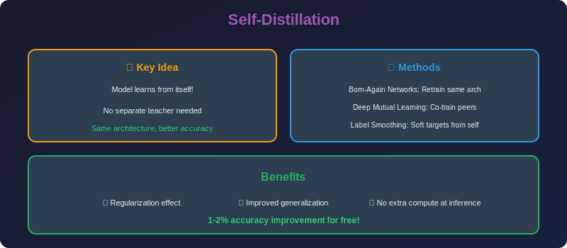

<!-- Animated Header -->
<p align="center">
  
</p>

<p align="center">
  
  
  
</p>


---

<p align="center">

</p>

# Self-Distillation

## 📐 Mathematical Theory

### 1. Born-Again Networks

#### 1.1 Concept

**Self-Distillation:** Student has same architecture as teacher.

**Born-Again Networks (Furlanello et al., 2018):**

```math
\text{Student}^{(k+1)} \leftarrow \text{Distill}(\text{Student}^{(k)})
```

Train generation $k+1$ to mimic generation $k$ (which was trained on ground truth).

#### 1.2 Iterative Training

```
Generation 0: Train on ground truth
  θ₀ = argmin_θ L_CE(f(x; θ), y)

Generation 1: Distill from Generation 0
  θ₁ = argmin_θ L_KD(f(x; θ), f(x; θ₀), y)

Generation k: Distill from Generation k-1
  θ_k = argmin_θ L_KD(f(x; θ), f(x; θ_{k-1}), y)
```

#### 1.3 Surprising Result

**Finding:** Later generations often outperform the original!

```math
\text{Acc}(\theta_k) > \text{Acc}(\theta_0) \text{ for } k > 0
```

**Why?**
- Soft labels provide regularization
- "Dark knowledge" helps find better minima
- Label smoothing effect

---

### 2. Deep Mutual Learning

#### 2.1 Formulation

**DML (Zhang et al., 2018):** Two networks teach each other simultaneously.

```math
\mathcal{L}_1 = \mathcal{L}_{CE}(p_1, y) + D_{KL}(p_2 \| p_1)
\mathcal{L}_2 = \mathcal{L}_{CE}(p_2, y) + D_{KL}(p_1 \| p_2)
```

Both networks learn from ground truth AND each other.

#### 2.2 Extension to Multiple Networks

**Multi-network DML:**

```math
\mathcal{L}_i = \mathcal{L}_{CE}(p_i, y) + \frac{1}{N-1}\sum_{j \neq i} D_{KL}(p_j \| p_i)
```

Each network distills from all others.

#### 2.3 Why It Works

**Ensemble effect without ensemble cost:**
- During training: Ensemble of N networks
- At inference: Single network
- Knowledge from ensemble is "baked in"

---

### 3. Be Your Own Teacher

#### 3.1 Auxiliary Classifiers

**Self-distillation within a network:**
Add auxiliary classifiers at intermediate layers.

```math
\mathcal{L} = \mathcal{L}_{main} + \sum_l \lambda_l \mathcal{L}_{aux}^l + \sum_l \beta_l D_{KL}(p_{main} \| p_{aux}^l)
```

Later classifiers teach earlier ones.

#### 3.2 Feature Aggregation

**Combine features from multiple depths:**

```math
F_{aggregated} = \sum_l \alpha_l \cdot r_l(F^l)
```

Learn $\alpha\_l$ to weight contributions.

---

### 4. Online Knowledge Distillation

#### 4.1 ONE: Online Network Ensembling

**Gate module selects teacher:**

```math
p_{teacher} = \sum_i g_i \cdot p_i
```

where $g = \text{softmax}(W\_g \cdot h)$ is a learned gate.

#### 4.2 Collaborative Learning

**All branches updated simultaneously:**

```math
\mathcal{L}_i = \mathcal{L}_{task}(p_i, y) + \lambda D_{KL}(p_{ensemble} \| p_i)
```

where $p\_{ensemble} = \frac{1}{N}\sum\_j p\_j$ (or weighted).

---

### 5. Theoretical Analysis

#### 5.1 Regularization Perspective

**Self-distillation as regularization:**

```math
\mathcal{L}_{SD} = \mathcal{L}_{CE}(p, y) + \lambda D_{KL}(p_{teacher} \| p)
```

The KL term acts as a regularizer:
- Prevents overconfident predictions
- Encourages smooth decision boundaries
- Similar to label smoothing

#### 5.2 Connection to Label Smoothing

**Label smoothing:**

```math
y_{smooth} = (1-\epsilon)y + \frac{\epsilon}{K}
```

**Self-distillation (high T):**

```math
p_{soft} \approx \frac{1}{K} + \frac{z - \bar{z}}{KT}
```

Both add uniform noise to hard labels.

#### 5.3 Implicit Ensemble

**Theorem (informal):** Self-distillation approximates ensemble distillation.

Multiple generations explore different local minima:

```math
\theta_k \sim p(\theta | \text{data}, \theta_{k-1})
```

Distilling from previous generation transfers ensemble knowledge.

---

### 6. Implementation

```python
import torch
import torch.nn as nn
import torch.nn.functional as F
import copy

class BornAgainTrainer:
    """Born-Again Networks: Iterative self-distillation."""
    
    def __init__(self, model_fn, num_generations: int = 3,
                 temperature: float = 4.0, alpha: float = 0.5):
        self.model_fn = model_fn
        self.num_generations = num_generations
        self.temperature = temperature
        self.alpha = alpha
    
    def train(self, train_loader, val_loader, epochs_per_gen: int = 100):
        """Train multiple generations."""
        
        results = []
        teacher = None
        
        for gen in range(self.num_generations):
            print(f"\n=== Generation {gen} ===")
            
            # Create new student
            student = self.model_fn()
            
            if teacher is None:
                # First generation: train on ground truth only
                accuracy = self._train_base(student, train_loader, val_loader, epochs_per_gen)
            else:
                # Later generations: distill from previous
                accuracy = self._train_distill(student, teacher, train_loader, 
                                               val_loader, epochs_per_gen)
            
            print(f"Generation {gen} accuracy: {accuracy:.2%}")
            results.append({'generation': gen, 'accuracy': accuracy})
            
            # Student becomes teacher for next generation
            teacher = copy.deepcopy(student)
            teacher.eval()
            for param in teacher.parameters():
                param.requires_grad = False
        
        return results
    
    def _train_base(self, model, train_loader, val_loader, epochs):
        """Train on ground truth only."""
        optimizer = torch.optim.Adam(model.parameters(), lr=1e-3)
        
        for epoch in range(epochs):
            model.train()
            for inputs, labels in train_loader:
                optimizer.zero_grad()
                outputs = model(inputs)
                loss = F.cross_entropy(outputs, labels)
                loss.backward()
                optimizer.step()
        
        return self._evaluate(model, val_loader)
    
    def _train_distill(self, student, teacher, train_loader, val_loader, epochs):
        """Train with distillation from previous generation."""
        optimizer = torch.optim.Adam(student.parameters(), lr=1e-3)
        
        for epoch in range(epochs):
            student.train()
            for inputs, labels in train_loader:
                optimizer.zero_grad()
                
                # Get teacher predictions
                with torch.no_grad():
                    teacher_logits = teacher(inputs)
                
                student_logits = student(inputs)
                
                # Hard loss
                hard_loss = F.cross_entropy(student_logits, labels)
                
                # Soft loss
                soft_loss = F.kl_div(
                    F.log_softmax(student_logits / self.temperature, dim=1),
                    F.softmax(teacher_logits / self.temperature, dim=1),
                    reduction='batchmean'
                ) * (self.temperature ** 2)
                
                loss = self.alpha * hard_loss + (1 - self.alpha) * soft_loss
                loss.backward()
                optimizer.step()
        
        return self._evaluate(student, val_loader)
    
    def _evaluate(self, model, val_loader):
        """Evaluate model accuracy."""
        model.eval()
        correct, total = 0, 0
        with torch.no_grad():
            for inputs, labels in val_loader:
                outputs = model(inputs)
                _, predicted = outputs.max(1)
                total += labels.size(0)
                correct += predicted.eq(labels).sum().item()
        return correct / total

class DeepMutualLearning:
    """Deep Mutual Learning: Networks teach each other."""
    
    def __init__(self, model_fns: list, temperature: float = 4.0, lambda_kl: float = 1.0):
        self.models = [fn() for fn in model_fns]
        self.temperature = temperature
        self.lambda_kl = lambda_kl
        self.optimizers = [
            torch.optim.Adam(m.parameters(), lr=1e-3) 
            for m in self.models
        ]
    
    def train_epoch(self, train_loader):
        """Train all models for one epoch."""
        for model in self.models:
            model.train()
        
        total_losses = [0] * len(self.models)
        
        for inputs, labels in train_loader:
            # Get all predictions
            logits = [model(inputs) for model in self.models]
            
            for i, (model, opt) in enumerate(zip(self.models, self.optimizers)):
                opt.zero_grad()
                
                # CE loss
                ce_loss = F.cross_entropy(logits[i], labels)
                
                # KL loss from other models
                kl_loss = 0
                for j, other_logits in enumerate(logits):
                    if i != j:
                        kl_loss += F.kl_div(
                            F.log_softmax(logits[i] / self.temperature, dim=1),
                            F.softmax(other_logits.detach() / self.temperature, dim=1),
                            reduction='batchmean'
                        ) * (self.temperature ** 2)
                
                kl_loss /= (len(self.models) - 1)
                
                # Total loss
                loss = ce_loss + self.lambda_kl * kl_loss
                loss.backward(retain_graph=(i < len(self.models) - 1))
                opt.step()
                
                total_losses[i] += loss.item()
        
        return [l / len(train_loader) for l in total_losses]

class SelfDistillationNetwork(nn.Module):
    """Network with auxiliary classifiers for self-distillation."""
    
    def __init__(self, backbone: nn.Module, num_classes: int, 
                 aux_layer_indices: list):
        super().__init__()
        self.backbone = backbone
        self.aux_layer_indices = aux_layer_indices
        
        # Extract layer dimensions (implementation-specific)
        # For simplicity, assume we know them
        self.aux_classifiers = nn.ModuleList()
        # Would need to define based on backbone architecture
        
        self.main_classifier = nn.Linear(512, num_classes)  # Example
    
    def forward(self, x):
        features = []
        h = x
        
        for i, layer in enumerate(self.backbone.children()):
            h = layer(h)
            if i in self.aux_layer_indices:
                features.append(h)
        
        # Main output
        main_out = self.main_classifier(h.view(h.size(0), -1))
        
        # Auxiliary outputs
        aux_outs = []
        for i, feat in enumerate(features):
            aux_out = self.aux_classifiers[i](feat.view(feat.size(0), -1))
            aux_outs.append(aux_out)
        
        return main_out, aux_outs
    
    def compute_loss(self, main_out, aux_outs, labels, temperature=4.0):
        """Compute self-distillation loss."""
        # Main CE loss
        main_loss = F.cross_entropy(main_out, labels)
        
        # Auxiliary CE losses
        aux_loss = sum(F.cross_entropy(aux, labels) for aux in aux_outs)
        
        # Self-distillation: auxiliary learns from main
        sd_loss = 0
        for aux in aux_outs:
            sd_loss += F.kl_div(
                F.log_softmax(aux / temperature, dim=1),
                F.softmax(main_out.detach() / temperature, dim=1),
                reduction='batchmean'
            ) * (temperature ** 2)
        
        return main_loss + 0.5 * aux_loss + 0.5 * sd_loss

def analyze_generation_improvement(results: list):
    """Analyze why later generations improve."""
    
    print("Generation Analysis:")
    print("-" * 40)
    
    for i, res in enumerate(results):
        print(f"Gen {res['generation']}: {res['accuracy']:.2%}")
    
    if len(results) > 1:
        improvement = results[-1]['accuracy'] - results[0]['accuracy']
        print(f"\nTotal improvement: {improvement:+.2%}")
        
        if improvement > 0:
            print("\nPossible reasons for improvement:")
            print("1. Soft labels provide regularization")
            print("2. Knowledge distillation acts as label smoothing")
            print("3. Later generations find flatter minima")
            print("4. Implicit ensemble effect from multiple generations")
```

---

### 7. Comparison

| Method | Teachers | Students | Key Benefit |
|--------|----------|----------|-------------|
| **Born-Again** | Self (prev gen) | Same arch | No extra model |
| **DML** | Peers | Multiple | Collaborative |
| **Self-Distill** | Main classifier | Aux classifiers | Single network |
| **ONE** | Ensemble | Single | Online ensemble |

---

## 📚 References

| Type | Title | Link |
|------|-------|------|
| 📄 | Born-Again Networks | [arXiv](https://arxiv.org/abs/1805.04770) |
| 📄 | Deep Mutual Learning | [arXiv](https://arxiv.org/abs/1706.00384) |
| 📄 | Be Your Own Teacher | [arXiv](https://arxiv.org/abs/1905.08094) |
| 📄 | ONE | [arXiv](https://arxiv.org/abs/1806.05594) |
| 🇨🇳 | 自蒸馏详解 | [知乎](https://zhuanlan.zhihu.com/p/117973828) |
| 🇨🇳 | Deep Mutual Learning解读 | [CSDN](https://blog.csdn.net/weixin_43624538/article/details/105287809) |
| 🇨🇳 | 在线蒸馏方法 | [B站](https://www.bilibili.com/video/BV1FY4y1H7Ns) |

---

⬅️ [Back: Feature Distillation](../02_feature_distillation/README.md) | ➡️ [Back to Knowledge Distillation](../README.md)

