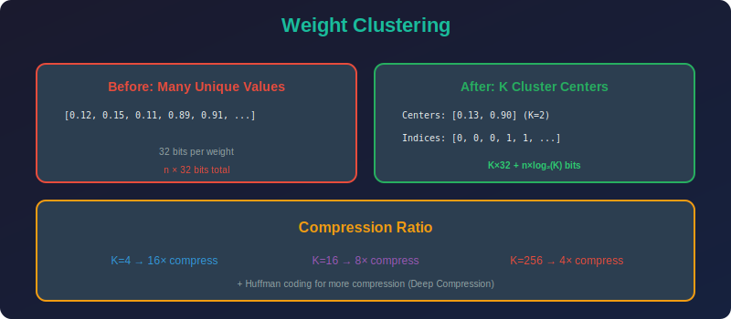

<!-- Animated Header -->
<p align="center">
  
</p>

<p align="center">
  
  
  
</p>


---

<p align="center">

</p>

# Weight Clustering (K-Means Quantization)

## 📐 Mathematical Theory

### 1. Problem Formulation

#### 1.1 K-Means Clustering for Weights

**Objective:** Represent $n$ weights using only $K$ unique values.

$$\min_{\{c_j\}_{j=1}^K, \{a_i\}_{i=1}^n} \sum_{i=1}^n \|w_i - c_{a_i}\|^2$$

where:

- $w_i$ = original weight value

- $c_j$ = cluster centroid (shared value)

- $a_i \in \{1, ..., K\}$ = cluster assignment for weight $i$

#### 1.2 Lloyd's Algorithm

```
1. Initialize centroids c₁, ..., c_K

2. Repeat until convergence:
   a. Assignment: aᵢ = argmin_j ‖wᵢ - cⱼ‖²
   b. Update: cⱼ = (1/|Sⱼ|) Σᵢ∈Sⱼ wᵢ

3. Return centroids {cⱼ} and assignments {aᵢ}

```

---

### 2. Compression Analysis

#### 2.1 Storage Requirements

**Original:**

$$\text{Bits}_{orig} = n \times 32 \text{ (FP32)}$$

**Clustered:**

$$\text{Bits}_{clustered} = \underbrace{K \times 32}_{\text{centroids}} + \underbrace{n \times \lceil\log_2(K)\rceil}_{\text{indices}}$$

#### 2.2 Compression Ratio

$$CR = \frac{32n}{32K + n\lceil\log_2(K)\rceil}$$

**For $n \gg K$:**

$$CR \approx \frac{32}{\lceil\log_2(K)\rceil}$$

| K | Bits/Index | CR |
|---|-----------|-----|
| 4 | 2 | 16× |
| 16 | 4 | 8× |
| 64 | 6 | 5.3× |
| 256 | 8 | 4× |

---

### 3. Error Analysis

#### 3.1 Quantization Error Bound

**Theorem:** For K-means with $K$ clusters on distribution $p(w)$:

$$\mathbb{E}[\|w - c_{a(w)}\|^2] = O\left(\frac{\sigma_w^2}{K^{2/d}}\right)$$

where $d$ is intrinsic dimension (1 for scalar weights).

**For scalar weights:**

$$\text{MSE} = O\left(\frac{\sigma_w^2}{K^2}\right)$$

#### 3.2 Comparison to Uniform Quantization

| Method | MSE | Optimal For |
|--------|-----|-------------|
| Uniform | $O(\Delta^2/12)$ | Uniform distribution |
| K-means | $O(\sigma^2/K^2)$ | Any distribution |

K-means adapts to actual weight distribution!

---

### 4. Huffman Coding Enhancement

#### 4.1 Variable-Length Encoding

**After clustering, cluster frequencies are non-uniform.**

**Shannon Entropy:**

$$H = -\sum_{j=1}^K p_j \log_2(p_j)$$

where $p_j = \frac{|S_j|}{n}$.

**Huffman codes achieve:**

$$H \leq \text{bits/weight} \leq H + 1$$

#### 4.2 Combined Compression

$$\text{Bits}_{final} = K \times 32 + n \times H$$

**Example:**
- K = 16, equal frequencies: $H = 4$ bits

- K = 16, skewed frequencies: $H \approx 2.5$ bits

- Additional 1.6× compression!

---

### 5. Fine-tuning Clustered Weights

#### 5.1 Gradient Sharing

**During backprop, gradients are shared across cluster:**

$$\frac{\partial \mathcal{L}}{\partial c_j} = \sum_{i: a_i = j} \frac{\partial \mathcal{L}}{\partial w_i}$$

**Update rule:**

$$c_j \leftarrow c_j - \eta \sum_{i: a_i = j} \frac{\partial \mathcal{L}}{\partial w_i}$$

#### 5.2 Cluster Re-assignment

**Periodically re-cluster to adapt:**

1. Train for N epochs

2. Re-run K-means on current weights

3. Repeat

---

### 6. Implementation

```python
import numpy as np
import torch
import torch.nn as nn
from sklearn.cluster import KMeans

class WeightClusterer:
    """K-Means weight clustering for neural network compression."""
    
    def __init__(self, n_clusters: int = 16):
        self.n_clusters = n_clusters
        self.centroids = None
    
    def fit(self, weights: np.ndarray):
        """Cluster weights using K-means."""
        flat = weights.flatten().reshape(-1, 1)
        
        kmeans = KMeans(n_clusters=self.n_clusters, random_state=42, n_init=10)
        kmeans.fit(flat)
        
        self.centroids = kmeans.cluster_centers_.flatten()
        self.labels = kmeans.labels_
        
        return self
    
    def transform(self, weights: np.ndarray) -> tuple:
        """Convert weights to clustered representation."""
        original_shape = weights.shape
        flat = weights.flatten().reshape(-1, 1)
        
        # Find nearest centroid for each weight
        distances = np.abs(flat - self.centroids)
        indices = distances.argmin(axis=1)
        
        return indices.astype(np.uint8), original_shape
    
    def inverse_transform(self, indices: np.ndarray, shape: tuple) -> np.ndarray:
        """Reconstruct weights from indices."""
        flat = self.centroids[indices]
        return flat.reshape(shape)
    
    def compression_ratio(self, n_weights: int) -> float:
        """Calculate compression ratio."""
        bits_original = n_weights * 32
        bits_indices = n_weights * np.ceil(np.log2(self.n_clusters))
        bits_centroids = self.n_clusters * 32
        bits_compressed = bits_indices + bits_centroids
        return bits_original / bits_compressed
    
    def mse(self, original: np.ndarray) -> float:
        """Compute MSE of reconstruction."""
        indices, shape = self.transform(original)
        reconstructed = self.inverse_transform(indices, shape)
        return np.mean((original - reconstructed) ** 2)

class ClusteredLinear(nn.Module):
    """Linear layer with clustered weights."""
    
    def __init__(self, in_features: int, out_features: int, 
                 n_clusters: int = 16, bias: bool = True):
        super().__init__()
        
        self.in_features = in_features
        self.out_features = out_features
        self.n_clusters = n_clusters
        
        # Trainable centroids
        self.centroids = nn.Parameter(torch.randn(n_clusters))
        
        # Fixed cluster assignments (updated during clustering)
        self.register_buffer('indices', 
            torch.zeros(out_features, in_features, dtype=torch.long))
        
        if bias:
            self.bias = nn.Parameter(torch.zeros(out_features))
        else:
            self.register_parameter('bias', None)
        
        self._initialize()
    
    def _initialize(self):
        """Initialize with standard linear initialization, then cluster."""
        # Standard init
        weight = torch.empty(self.out_features, self.in_features)
        nn.init.kaiming_uniform_(weight)
        
        # Cluster
        self._cluster_weights(weight)
    
    def _cluster_weights(self, weights: torch.Tensor):
        """Run K-means clustering on weights."""
        flat = weights.flatten().numpy()
        
        kmeans = KMeans(n_clusters=self.n_clusters, random_state=42)
        kmeans.fit(flat.reshape(-1, 1))
        
        self.centroids.data = torch.tensor(kmeans.cluster_centers_.flatten())
        self.indices = torch.tensor(kmeans.labels_.reshape(self.out_features, self.in_features))
    
    def forward(self, x: torch.Tensor) -> torch.Tensor:
        # Reconstruct weight matrix from centroids and indices
        weight = self.centroids[self.indices]
        
        return nn.functional.linear(x, weight, self.bias)
    
    def recluster(self):
        """Re-cluster using current centroid values."""
        weight = self.centroids[self.indices].detach()
        self._cluster_weights(weight)
    
    @property
    def weight(self) -> torch.Tensor:
        """Return reconstructed weight for inspection."""
        return self.centroids[self.indices]

class HuffmanCoder:
    """Huffman coding for cluster indices."""
    
    def __init__(self):
        self.codes = {}
    
    def fit(self, indices: np.ndarray, n_clusters: int):
        """Build Huffman tree from index frequencies."""
        from collections import Counter
        import heapq
        
        # Count frequencies
        counts = Counter(indices.flatten())
        
        # Build Huffman tree
        heap = [[count, [symbol, ""]] for symbol, count in counts.items()]
        heapq.heapify(heap)
        
        while len(heap) > 1:
            lo = heapq.heappop(heap)
            hi = heapq.heappop(heap)
            for pair in lo[1:]:
                pair[1] = '0' + pair[1]
            for pair in hi[1:]:
                pair[1] = '1' + pair[1]
            heapq.heappush(heap, [lo[0] + hi[0]] + lo[1:] + hi[1:])
        
        self.codes = {symbol: code for symbol, code in heap[0][1:]}
        
        return self
    
    def avg_bits(self, indices: np.ndarray) -> float:
        """Compute average bits per symbol."""
        from collections import Counter
        
        counts = Counter(indices.flatten())
        total = sum(counts.values())
        
        avg = sum(len(self.codes[symbol]) * count / total 
                  for symbol, count in counts.items() 
                  if symbol in self.codes)
        
        return avg
    
    def entropy(self, indices: np.ndarray) -> float:
        """Compute entropy of index distribution."""
        from collections import Counter
        
        counts = Counter(indices.flatten())
        total = sum(counts.values())
        probs = [count / total for count in counts.values()]
        
        return -sum(p * np.log2(p) for p in probs if p > 0)

def deep_compression_pipeline(model: nn.Module, n_clusters: int = 16):
    """Apply weight clustering to all linear layers."""
    
    results = {}
    
    for name, module in model.named_modules():
        if isinstance(module, nn.Linear):
            # Cluster weights
            clusterer = WeightClusterer(n_clusters)
            weights_np = module.weight.data.numpy()
            clusterer.fit(weights_np)
            
            # Store results
            indices, shape = clusterer.transform(weights_np)
            results[name] = {
                'centroids': clusterer.centroids,
                'indices': indices,
                'shape': shape,
                'cr': clusterer.compression_ratio(weights_np.size),
                'mse': clusterer.mse(weights_np)
            }
            
            # Update module weights
            reconstructed = clusterer.inverse_transform(indices, shape)
            module.weight.data = torch.tensor(reconstructed)
    
    return results

```

---

### 7. Deep Compression Pipeline

```
1. Train network normally

2. Prune (remove small weights)

3. Cluster remaining weights

4. Apply Huffman coding

5. Fine-tune centroids

Result: 10-50× compression with minimal accuracy loss

```

---

## 📚 References

| Type | Title | Link |
|------|-------|------|
| 📄 | Deep Compression | [arXiv](https://arxiv.org/abs/1510.00149) |
| 📄 | Trained Ternary | [arXiv](https://arxiv.org/abs/1612.01064) |
| 📄 | Product Quantization | [IEEE](https://ieeexplore.ieee.org/document/5432202) |
| 🇨🇳 | Deep Compression详解 | [知乎](https://zhuanlan.zhihu.com/p/21890829) |
| 🇨🇳 | 权重聚类压缩 | [CSDN](https://blog.csdn.net/qq_40243750/article/details/121461780) |
| 🇨🇳 | 模型压缩三板斧 | [B站](https://www.bilibili.com/video/BV1rT4y1E7T8) |

---

⬅️ [Back: Weight Sharing](../README.md) | ➡️ [Next: Weight Tying](../02_weight_tying/README.md)

