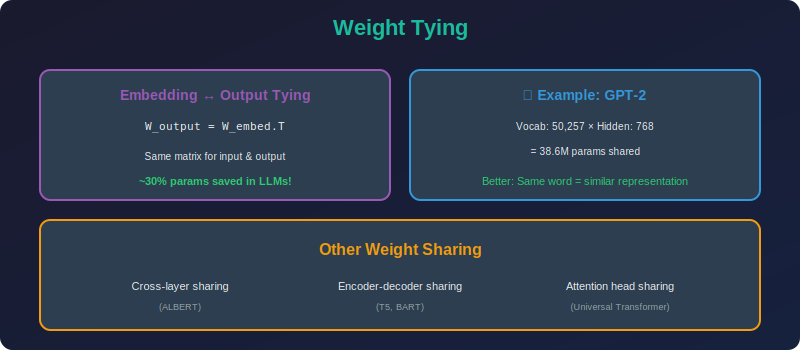

<!-- Animated Header -->
<p align="center">
  
</p>

<p align="center">
  
  
  
</p>


---

<p align="center">

</p>

# Weight Tying (Embedding Sharing)

## 📐 Mathematical Theory

### 1. Input-Output Embedding Tying

#### 1.1 Standard Language Model

**Input embedding:**

```math
x_{embed} = E_{in}[token], \quad E_{in} \in \mathbb{R}^{V \times d}
```

**Output projection:**

```math
p(y|h) = \text{softmax}(W_{out} h), \quad W_{out} \in \mathbb{R}^{V \times d}
```

**Parameters:** $2 \times V \times d$

#### 1.2 With Weight Tying

**Tie output to input:**

```math
W_{out} = E_{in}
```

**Output computation:**

```math
p(y|h) = \text{softmax}(E_{in} h)
```

**Parameters:** $V \times d$ (50% reduction!)

---

### 2. Mathematical Justification

#### 2.1 Semantic Consistency

**Claim:** Words with similar embeddings should have similar prediction probabilities.

**With tying:**

```math
p(y_i|h) \propto \exp(e_i^T h)
```

where $e\_i$ is the embedding of word $i$.

**Interpretation:** 
- Hidden state $h$ is "compared" to all word embeddings
- Most similar embedding gets highest probability
- Encourages semantic consistency

#### 2.2 Low-Rank Approximation View

**Learned matrix:**

```math
W = E_{in}^T E_{in}
```

This is a rank-$d$ approximation of the full $V \times V$ word similarity matrix.

---

### 3. Parameter Savings

#### 3.1 Analysis

**For LLaMA-7B:**
- Vocabulary: $V = 32,000$
- Hidden dim: $d = 4,096$
- Embedding parameters: $32,000 \times 4,096 = 131M$

**With tying:** Save 131M parameters!

**Percentage of total:**

```math
\frac{131M}{7B} \approx 1.9\%
```

#### 3.2 Memory Savings

```math
\text{Memory saved} = V \times d \times 4 \text{ bytes} = 500 \text{ MB}
```

---

### 4. Gradient Analysis

#### 4.1 Gradient Flow

**Loss gradient:**

```math
\frac{\partial \mathcal{L}}{\partial E_{in}} = \underbrace{\frac{\partial \mathcal{L}}{\partial E_{in}}|_{input}}_{\text{from embedding lookup}} + \underbrace{\frac{\partial \mathcal{L}}{\partial E_{in}}|_{output}}_{\text{from output projection}}
```

**Contribution from output:**

```math
\frac{\partial \mathcal{L}}{\partial E_i} += \sum_t (\hat{p}_t - y_t)_i \cdot h_t
```

#### 4.2 Regularization Effect

Weight tying provides implicit regularization:
- Input and output representations must be consistent
- Prevents overfitting in output layer
- Similar to multi-task learning

---

### 5. Implementation

```python
import torch
import torch.nn as nn
import torch.nn.functional as F

class TiedEmbeddingLanguageModel(nn.Module):
    """Language model with tied input/output embeddings."""
    
    def __init__(self, vocab_size: int, d_model: int, n_layers: int = 6,
                 n_heads: int = 8, dropout: float = 0.1):
        super().__init__()
        
        self.vocab_size = vocab_size
        self.d_model = d_model
        
        # Shared embedding
        self.embedding = nn.Embedding(vocab_size, d_model)
        
        # Transformer layers
        encoder_layer = nn.TransformerEncoderLayer(
            d_model=d_model,
            nhead=n_heads,
            dim_feedforward=4 * d_model,
            dropout=dropout,
            batch_first=True
        )
        self.transformer = nn.TransformerEncoder(encoder_layer, n_layers)
        
        # Layer norm before output
        self.ln_f = nn.LayerNorm(d_model)
        
        # No separate output projection - use embedding.weight
    
    def forward(self, input_ids: torch.Tensor) -> torch.Tensor:
        """
        Args:
            input_ids: [B, L] token indices
        
        Returns:
            logits: [B, L, V] unnormalized log probabilities
        """

        # Embed tokens
        x = self.embedding(input_ids)  # [B, L, D]
        
        # Causal mask
        seq_len = input_ids.size(1)
        causal_mask = torch.triu(
            torch.ones(seq_len, seq_len, device=input_ids.device),
            diagonal=1
        ).bool()
        
        # Transform
        x = self.transformer(x, mask=causal_mask)
        
        # Final layer norm
        x = self.ln_f(x)
        
        # Output projection with tied weights
        # logits = x @ embedding.weight.T
        logits = F.linear(x, self.embedding.weight)
        
        return logits
    
    def count_parameters(self) -> dict:
        """Count parameters with and without tying."""
        embedding_params = self.embedding.weight.numel()
        other_params = sum(p.numel() for name, p in self.named_parameters() 
                         if 'embedding' not in name)
        
        return {
            'embedding': embedding_params,
            'other': other_params,
            'total': embedding_params + other_params,
            'without_tying': 2 * embedding_params + other_params,
            'savings': embedding_params
        }

class ThreeWayTiedEmbedding(nn.Module):
    """Encoder-decoder with three-way tying."""
    
    def __init__(self, vocab_size: int, d_model: int):
        super().__init__()
        
        # Single shared embedding
        self.shared_embedding = nn.Embedding(vocab_size, d_model)
        
        # Encoder and decoder both use it
    
    def encode(self, src_ids: torch.Tensor) -> torch.Tensor:
        return self.shared_embedding(src_ids)
    
    def decode_embed(self, tgt_ids: torch.Tensor) -> torch.Tensor:
        return self.shared_embedding(tgt_ids)
    
    def output_projection(self, hidden: torch.Tensor) -> torch.Tensor:
        return F.linear(hidden, self.shared_embedding.weight)

def tie_weights(model: nn.Module, embedding_name: str, output_name: str):
    """Tie embedding and output weights after model creation."""
    
    # Get embedding weight
    embedding = dict(model.named_modules())[embedding_name]
    
    # Get output layer
    output = dict(model.named_modules())[output_name]
    
    # Tie weights
    if hasattr(output, 'weight'):
        output.weight = embedding.weight
    
    print(f"Tied {embedding_name} to {output_name}")
    print(f"Shared parameters: {embedding.weight.numel():,}")
```

---

### 6. Variations

| Variation | Description | Use Case |
|-----------|-------------|----------|
| **Two-way** | Input ↔ Output | Decoder LMs |
| **Three-way** | Encoder input ↔ Decoder input ↔ Output | Seq2seq |
| **Cross-lingual** | Shared across languages | Multilingual |

---

## 📚 References

| Type | Title | Link |
|------|-------|------|
| 📄 | Weight Tying | [arXiv](https://arxiv.org/abs/1608.05859) |
| 📄 | ALBERT | [arXiv](https://arxiv.org/abs/1909.11942) |
| 🇨🇳 | 权重共享技术 | [知乎](https://zhuanlan.zhihu.com/p/98874543) |
| 🇨🇳 | ALBERT详解 | [CSDN](https://blog.csdn.net/weixin_37947156/article/details/101115981) |
| 🇨🇳 | Embedding Tying原理 | [B站](https://www.bilibili.com/video/BV1oK4y1a7u8) |

---

⬅️ [Back: Weight Clustering](../01_weight_clustering/README.md) | ➡️ [Next: Attention Sharing](../03_attention_sharing/README.md)

