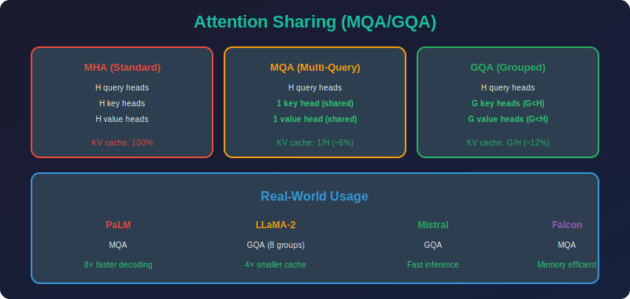

<!-- Animated Header -->
<p align="center">
  
</p>

<p align="center">
  
  
  
</p>


---

<p align="center">

</p>

# Attention Sharing (MQA/GQA)

## 📐 Mathematical Theory

### 1. Multi-Head Attention Review

#### 1.1 Standard MHA

```math
\text{MHA}(Q, K, V) = \text{Concat}(\text{head}_1, ..., \text{head}_h)W^O
\text{head}_i = \text{Attention}(QW_Q^i, KW_K^i, VW_V^i)
```

**Parameters per layer:**
- Query: $h \times d \times d\_k$
- Key: $h \times d \times d\_k$
- Value: $h \times d \times d\_v$
- Output: $h \times d\_v \times d$

**Total:** $4 \times h \times d \times d\_k = 4d^2$ (assuming $d\_k = d/h$)

---

### 2. Multi-Query Attention (MQA)

#### 2.1 Core Idea

**Share K and V projections across all heads:**

```math
\text{head}_i = \text{Attention}(QW_Q^i, KW_K, VW_V)
```

- Each head has unique $W\_Q^i$
- All heads share single $W\_K, W\_V$

#### 2.2 Parameter Reduction

**MHA K,V parameters:** $2 \times h \times d \times d\_k = 2d^2$

**MQA K,V parameters:** $2 \times d \times d\_k = 2d^2/h$

**Reduction:** $h \times$ for K,V!

**Example (h=8):**
- MHA: Q, K, V each have 8 heads → 24 projection matrices
- MQA: 8 Q heads, 1 K, 1 V → 10 projection matrices

---

### 3. Grouped-Query Attention (GQA)

#### 3.1 Interpolation

**GQA:** Use $g$ groups of K,V shared across $h/g$ heads each.

```math
\text{head}_i = \text{Attention}(QW_Q^i, KW_K^{g(i)}, VW_V^{g(i)})
```

where $g(i) = \lfloor i \cdot g / h \rfloor$.

#### 3.2 Parameter Spectrum

| Method | K,V Groups | K,V Parameters | 
|--------|------------|----------------|
| MHA | $h$ | $2d^2$ |
| GQA-4 | 4 | $4 \cdot 2d\_k d$ |
| GQA-2 | 2 | $2 \cdot 2d\_k d$ |
| MQA | 1 | $2d\_k d$ |

---

### 4. KV Cache Analysis

#### 4.1 The Real Motivation

**Autoregressive generation requires caching K,V:**

```math
\text{Cache size} = B \times L \times N_L \times N_{kv} \times d_k
```

**MHA cache (LLaMA-7B, seq=2048):**

```math
1 \times 2048 \times 32 \times 32 \times 128 = 268M \text{ floats} = 1GB
```

**MQA cache (1 KV head per layer):**

```math
1 \times 2048 \times 32 \times 1 \times 128 = 8.4M \text{ floats} = 32MB
```

**32× reduction in KV cache!**

#### 4.2 Throughput Impact

**Memory bandwidth bound:**

```math
\text{Throughput} \propto \frac{\text{Compute}}{\text{Memory Access}}
```

Smaller KV cache → Less memory access → Higher throughput.

---

### 5. Quality Analysis

#### 5.1 Expressiveness Comparison

**MHA:** Each head can attend to different patterns.

**MQA:** All heads attend using same K,V → Less diverse attention.

**GQA:** Groups can learn different patterns.

#### 5.2 Empirical Results

| Method | Perplexity | Throughput |
|--------|------------|------------|
| MHA | 1.00× | 1.0× |
| GQA-8 | 1.00× | 1.5× |
| GQA-4 | 1.01× | 1.8× |
| MQA | 1.02× | 2.5× |

GQA-8 matches MHA quality with significant speedup!

---

### 6. Implementation

```python
import torch
import torch.nn as nn
import torch.nn.functional as F
import math

class MultiQueryAttention(nn.Module):
    """Multi-Query Attention: Single K,V shared across heads."""
    
    def __init__(self, d_model: int, n_heads: int, dropout: float = 0.1):
        super().__init__()
        
        self.n_heads = n_heads
        self.d_k = d_model // n_heads
        
        # Separate Q projection per head
        self.W_q = nn.Linear(d_model, d_model)
        
        # Shared K,V projections (single head dimension)
        self.W_k = nn.Linear(d_model, self.d_k)
        self.W_v = nn.Linear(d_model, self.d_k)
        
        self.W_o = nn.Linear(d_model, d_model)
        self.dropout = nn.Dropout(dropout)
    
    def forward(self, x: torch.Tensor, 
                kv_cache: tuple = None) -> tuple:
        """
        Args:
            x: [B, L, D]
            kv_cache: Optional (cached_k, cached_v) for generation
        
        Returns:
            output: [B, L, D]
            new_kv_cache: (k, v)
        """
        B, L, D = x.shape
        
        # Query: multi-head
        Q = self.W_q(x).view(B, L, self.n_heads, self.d_k).transpose(1, 2)
        # Q: [B, n_heads, L, d_k]
        
        # Key, Value: single head
        K = self.W_k(x)  # [B, L, d_k]
        V = self.W_v(x)  # [B, L, d_k]
        
        # Handle KV cache for generation
        if kv_cache is not None:
            cached_k, cached_v = kv_cache
            K = torch.cat([cached_k, K], dim=1)
            V = torch.cat([cached_v, V], dim=1)
        
        new_kv_cache = (K, V)
        
        # Expand K,V for broadcasting with multi-head Q
        K = K.unsqueeze(1).expand(-1, self.n_heads, -1, -1)  # [B, n_heads, L', d_k]
        V = V.unsqueeze(1).expand(-1, self.n_heads, -1, -1)
        
        # Attention
        scores = torch.matmul(Q, K.transpose(-2, -1)) / math.sqrt(self.d_k)
        attn_weights = F.softmax(scores, dim=-1)
        attn_weights = self.dropout(attn_weights)
        
        output = torch.matmul(attn_weights, V)  # [B, n_heads, L, d_k]
        output = output.transpose(1, 2).contiguous().view(B, L, D)
        output = self.W_o(output)
        
        return output, new_kv_cache

class GroupedQueryAttention(nn.Module):
    """Grouped-Query Attention: K,V shared within groups."""
    
    def __init__(self, d_model: int, n_heads: int, n_kv_heads: int,
                 dropout: float = 0.1):
        super().__init__()
        
        assert n_heads % n_kv_heads == 0
        
        self.n_heads = n_heads
        self.n_kv_heads = n_kv_heads
        self.n_groups = n_heads // n_kv_heads
        self.d_k = d_model // n_heads
        
        # Query: full heads
        self.W_q = nn.Linear(d_model, d_model)
        
        # Key, Value: reduced heads
        self.W_k = nn.Linear(d_model, n_kv_heads * self.d_k)
        self.W_v = nn.Linear(d_model, n_kv_heads * self.d_k)
        
        self.W_o = nn.Linear(d_model, d_model)
        self.dropout = nn.Dropout(dropout)
    
    def forward(self, x: torch.Tensor,
                kv_cache: tuple = None) -> tuple:
        B, L, D = x.shape
        
        # Query: [B, n_heads, L, d_k]
        Q = self.W_q(x).view(B, L, self.n_heads, self.d_k).transpose(1, 2)
        
        # Key, Value: [B, n_kv_heads, L, d_k]
        K = self.W_k(x).view(B, L, self.n_kv_heads, self.d_k).transpose(1, 2)
        V = self.W_v(x).view(B, L, self.n_kv_heads, self.d_k).transpose(1, 2)
        
        # Handle cache
        if kv_cache is not None:
            cached_k, cached_v = kv_cache
            K = torch.cat([cached_k, K], dim=2)
            V = torch.cat([cached_v, V], dim=2)
        
        new_kv_cache = (K, V)
        
        # Repeat K,V for each group
        # [B, n_kv_heads, L, d_k] -> [B, n_heads, L, d_k]
        K = K.repeat_interleave(self.n_groups, dim=1)
        V = V.repeat_interleave(self.n_groups, dim=1)
        
        # Standard attention
        scores = torch.matmul(Q, K.transpose(-2, -1)) / math.sqrt(self.d_k)
        attn_weights = F.softmax(scores, dim=-1)
        attn_weights = self.dropout(attn_weights)
        
        output = torch.matmul(attn_weights, V)
        output = output.transpose(1, 2).contiguous().view(B, L, D)
        output = self.W_o(output)
        
        return output, new_kv_cache

def convert_mha_to_gqa(mha_weights: dict, n_kv_heads: int) -> dict:
    """Convert MHA weights to GQA by averaging groups."""
    
    n_heads = mha_weights['W_q'].shape[0] // (mha_weights['W_q'].shape[1] // n_kv_heads)
    n_groups = n_heads // n_kv_heads
    
    new_weights = {}
    
    # Q stays the same
    new_weights['W_q'] = mha_weights['W_q']
    
    # Average K,V across groups
    W_k = mha_weights['W_k']
    W_v = mha_weights['W_v']
    
    # Reshape and average
    # [d_model, n_heads * d_k] -> [d_model, n_kv_heads, n_groups, d_k]
    d_model = W_k.shape[0]
    d_k = W_k.shape[1] // n_heads
    
    W_k = W_k.view(d_model, n_kv_heads, n_groups, d_k).mean(dim=2)
    W_v = W_v.view(d_model, n_kv_heads, n_groups, d_k).mean(dim=2)
    
    new_weights['W_k'] = W_k.view(d_model, -1)
    new_weights['W_v'] = W_v.view(d_model, -1)
    new_weights['W_o'] = mha_weights['W_o']
    
    return new_weights

def benchmark_kv_cache(n_layers: int, n_heads: int, n_kv_heads: int,
                       d_model: int, seq_len: int, batch_size: int):
    """Compare KV cache sizes."""
    
    d_k = d_model // n_heads
    
    mha_cache = batch_size * seq_len * n_layers * n_heads * d_k * 2  # K and V
    gqa_cache = batch_size * seq_len * n_layers * n_kv_heads * d_k * 2
    
    mha_gb = mha_cache * 2 / 1e9  # FP16
    gqa_gb = gqa_cache * 2 / 1e9
    
    print(f"MHA KV Cache: {mha_gb:.2f} GB")
    print(f"GQA KV Cache: {gqa_gb:.2f} GB")
    print(f"Reduction: {mha_cache / gqa_cache:.1f}x")

# Example
if __name__ == "__main__":
    benchmark_kv_cache(
        n_layers=32, n_heads=32, n_kv_heads=8,
        d_model=4096, seq_len=4096, batch_size=1
    )
```

---

### 7. When to Use

| Scenario | Recommendation |
|----------|----------------|
| **Training** | MHA or GQA-8 |
| **Inference** | GQA or MQA |
| **Long context** | MQA (smaller cache) |
| **Quality-critical** | GQA-8 |

---

## 📚 References

| Type | Title | Link |
|------|-------|------|
| 📄 | MQA | [arXiv](https://arxiv.org/abs/1911.02150) |
| 📄 | GQA | [arXiv](https://arxiv.org/abs/2305.13245) |
| 📄 | LLaMA 2 | [arXiv](https://arxiv.org/abs/2307.09288) |
| 🇨🇳 | MQA/GQA详解 | [知乎](https://zhuanlan.zhihu.com/p/647130255) |
| 🇨🇳 | 大模型推理优化 | [CSDN](https://blog.csdn.net/qq_27590277/article/details/131999789) |
| 🇨🇳 | KV Cache优化技术 | [B站](https://www.bilibili.com/video/BV1G94y1o7Tp) |

---

⬅️ [Back: Weight Tying](../02_weight_tying/README.md) | ➡️ [Back to Weight Sharing](../README.md)

