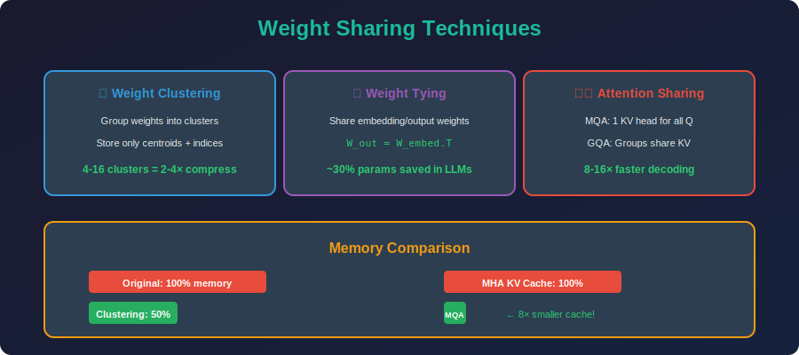

<!-- Animated Header -->
<p align="center">
  
</p>

<p align="center">
  
  
  
</p>


---

<p align="center">

</p>

## 📐 Weight Clustering

### 1. K-Means Clustering for Weights

**Objective Function:**

```math
\min_{\{c_j\}, \{a_i\}} \sum_{i=1}^{n} \|w_i - c_{a_i}\|^2
```

Where:
- $w\_i$ = original weight value
- $c\_j$ = cluster centroid ($j \in \{1,...,K\}$)
- $a\_i$ = cluster assignment for weight $i$
- $K$ = number of clusters

**Lloyd's Algorithm:**
1. **Assignment:** $a\_i = \arg\min\_j \|w\_i - c\_j\|^2$
2. **Update:** $c\_j = \frac{1}{|S\_j|}\sum\_{i \in S\_j} w\_i$ where $S\_j = \{i : a\_i = j\}$
3. Repeat until convergence

### 2. Compression Analysis

**Original Storage:**

```math
\text{Bits}_{original} = n \times 32 \text{ bits}
```

**Clustered Storage:**

```math
\text{Bits}_{clustered} = K \times 32 + n \times \lceil\log_2(K)\rceil \text{ bits}
```

- $K \times 32$: Store $K$ centroids in FP32
- $n \times \lceil\log\_2(K)\rceil$: Store indices

**Compression Ratio:**

```math
CR = \frac{32n}{32K + n\lceil\log_2(K)\rceil}
```

**For $n \gg K$:**

```math
CR \approx \frac{32}{\lceil\log_2(K)\rceil}
```

| K | Bits/Index | CR |
|---|-----------|-----|
| 4 | 2 | 16× |
| 16 | 4 | 8× |
| 64 | 6 | 5.3× |
| 256 | 8 | 4× |

### 3. Huffman Coding Enhancement

**Shannon Entropy:**

```math
H = -\sum_{j=1}^{K} p_j \log_2(p_j)
```

Where $p\_j = \frac{|S\_j|}{n}$ is the fraction of weights in cluster $j$.

**Huffman Coding Guarantee:**

```math
H \leq \mathbb{E}[\text{bits per weight}] \leq H + 1
```

---

## 📐 Weight Sharing

### 4. Weight Tying (Embedding Sharing)

**Standard Transformer Embeddings:**

```math
\text{Input embedding: } E_{in} \in \mathbb{R}^{V \times d}
\text{Output projection: } W_{out} \in \mathbb{R}^{d \times V}
```

**With Weight Tying:**

```math
W_{out} = E_{in}^T
```

**Parameter Savings:**

```math
\Delta P = V \times d
```

For LLaMA-7B ($V=32000$, $d=4096$):

```math
\Delta P = 32000 \times 4096 = 131M \text{ parameters} \approx 500 \text{ MB}
```

### 5. Cross-Layer Parameter Sharing (ALBERT)

**BERT:** Each layer $l$ has unique parameters

```math
\theta_l = \{W_Q^l, W_K^l, W_V^l, W_O^l, W_1^l, W_2^l\}
```

**ALBERT:** All layers share the same parameters

```math
\theta = \theta_1 = \theta_2 = ... = \theta_L
```

**Compression Factor:**

```math
CR = L \times
```

For BERT-Large ($L=24$): 24× parameter reduction in attention/FFN layers!

### 6. Factorized Embedding (ALBERT)

**Problem:** Embedding matrix $E \in \mathbb{R}^{V \times H}$ is huge when $H$ is large.

**Solution:** Factorize into two smaller matrices:

```math
E = E_1 \times E_2
```

Where:
- $E\_1 \in \mathbb{R}^{V \times E}$ (vocabulary to low-dim)
- $E\_2 \in \mathbb{R}^{E \times H}$ (low-dim to hidden)

**Parameter Reduction:**

```math
V \times H \to V \times E + E \times H
```

For $V=30000$, $H=1024$, $E=128$:

```math
30M \to 3.84M + 0.13M = 3.97M \quad (7.5\times \text{ reduction})
```

### 7. Multi-Query Attention (MQA)

**Standard Multi-Head Attention:** Each head has unique $W\_Q^i, W\_K^i, W\_V^i$.

**Multi-Query Attention (MQA):**
Single K,V projection shared across all heads:

```math
W_K, W_V \text{ shared for all heads}
```

**Parameter Reduction (MQA):**

```math
\frac{h \times d_k \times 2}{d_k \times 2} = h \times
```

---

## 🎯 Core Ideas

### Weight Clustering
```
Original weights:
[1.23, 1.19, 1.25, 0.01, 0.03, -0.02, 0.89, 0.91, 0.87]

After K-means clustering (K=3):
Centroids: C = [1.22, 0.01, 0.89]
Indices:   I = [0, 0, 0, 1, 1, 1, 2, 2, 2]

Storage:
+-- 3 centroids (FP32): 12 bytes
+-- 9 indices (2 bits each): 3 bytes
+-- Total: 15 bytes vs 36 bytes original (2.4× compression)
```

### Weight Sharing
```
ALBERT Cross-Layer Sharing:
+-------------------------------------+
|  Layer 1-12: All use same W         |
|  Parameters: 1/12 of BERT!          |
+-------------------------------------+
```

---

## 🌍 Famous Example: ALBERT

| Model | Layers | Params | GLUE Score |
|-------|--------|--------|------------|
| BERT-Base | 12 | 110M | 79.6 |
| ALBERT-Base | 12 | 12M | 80.1 |
| BERT-Large | 24 | 340M | 81.9 |
| ALBERT-Large | 24 | 18M | 82.3 |

---

## 💻 Code Examples

```python
import numpy as np
import torch
import torch.nn as nn
from sklearn.cluster import KMeans

# ========== Weight Clustering ==========
def cluster_weights(weights, n_clusters=16):
    """Cluster neural network weights using K-means"""
    original_shape = weights.shape
    flat = weights.flatten().reshape(-1, 1)
    
    kmeans = KMeans(n_clusters=n_clusters, random_state=42, n_init=10)
    kmeans.fit(flat)
    
    labels = kmeans.labels_
    centroids = kmeans.cluster_centers_.flatten()
    clustered = centroids[labels].reshape(original_shape)
    
    return clustered, centroids, labels

# ========== ALBERT-style Cross-Layer Sharing ==========
class ALBERTEncoder(nn.Module):
    """ALBERT-style encoder with shared layer"""
    
    def __init__(self, d_model, n_heads, d_ff, n_layers):
        super().__init__()
        # Single shared layer
        self.shared_layer = nn.TransformerEncoderLayer(d_model, n_heads, d_ff)
        self.n_layers = n_layers
    
    def forward(self, x):
        # Apply same layer n_layers times
        for _ in range(self.n_layers):
            x = self.shared_layer(x)
        return x

# ========== Weight Tying Example ==========
class TiedEmbeddingLM(nn.Module):
    """Language model with tied input/output embeddings"""
    
    def __init__(self, vocab_size, d_model):
        super().__init__()
        self.embedding = nn.Embedding(vocab_size, d_model)
        self.transformer = nn.TransformerEncoder(
            nn.TransformerEncoderLayer(d_model, 8), 
            num_layers=6
        )
    
    def forward(self, x):
        h = self.embedding(x)
        h = self.transformer(h)
        # Output projection with tied weights
        logits = torch.matmul(h, self.embedding.weight.T)
        return logits

# ========== Multi-Query Attention ==========
class MultiQueryAttention(nn.Module):
    """MQA: Single K,V projection shared across heads"""
    
    def __init__(self, d_model, n_heads):
        super().__init__()
        self.n_heads = n_heads
        self.d_k = d_model // n_heads
        
        self.W_q = nn.Linear(d_model, d_model)
        # Shared K,V projections (single head)
        self.W_k = nn.Linear(d_model, self.d_k)
        self.W_v = nn.Linear(d_model, self.d_k)
        self.W_o = nn.Linear(d_model, d_model)
    
    def forward(self, x):
        B, L, D = x.shape
        Q = self.W_q(x).view(B, L, self.n_heads, self.d_k)
        K = self.W_k(x).view(B, L, 1, self.d_k)
        V = self.W_v(x).view(B, L, 1, self.d_k)
        
        scores = torch.einsum('blhd,bmhd->bhlm', Q, K.expand(-1,-1,self.n_heads,-1))
        attn = torch.softmax(scores / (self.d_k ** 0.5), dim=-1)
        out = torch.einsum('bhlm,bmhd->blhd', attn, V.expand(-1,-1,self.n_heads,-1))
        
        return self.W_o(out.reshape(B, L, D))
```

---

## 🔗 Where This Topic Is Used

| Topic | How It's Used |
|-------|---------------|
| **Deep Compression** | Han et al. compression pipeline |
| **ALBERT** | Cross-layer parameter sharing |
| **Tied Embeddings** | Input/output embedding shared |
| **GQA/MQA** | Shared K,V across heads |
| **Universal Transformers** | Shared layers with ACT |

---

## 📚 References

| Type | Title | Link |
|------|-------|------|
| 📄 | Deep Compression | [arXiv](https://arxiv.org/abs/1510.00149) |
| 📄 | ALBERT | [arXiv](https://arxiv.org/abs/1909.11942) |
| 📄 | Tied Embeddings | [arXiv](https://arxiv.org/abs/1608.05859) |
| 📄 | GQA | [arXiv](https://arxiv.org/abs/2305.13245) |
| 📄 | Product Quantization | [IEEE](https://ieeexplore.ieee.org/document/5432202) |

---

## 📁 Sub-Topics

| # | Topic | Description | Link |
|:-:|-------|-------------|:----:|
| 1 | **Weight Clustering** | K-means quantization, Huffman coding | [📁 Open](./01_weight_clustering/README.md) |
| 2 | **Weight Tying** | Embedding sharing, gradient analysis | [📁 Open](./02_weight_tying/README.md) |
| 3 | **Attention Sharing** | MQA, GQA, KV cache optimization | [📁 Open](./03_attention_sharing/README.md) |

---

⬅️ [Back: Knowledge Distillation](../04_knowledge_distillation/README.md) | ➡️ [Next: Factorization](../06_factorization/README.md)

---


<p align="center">
  
</p>

