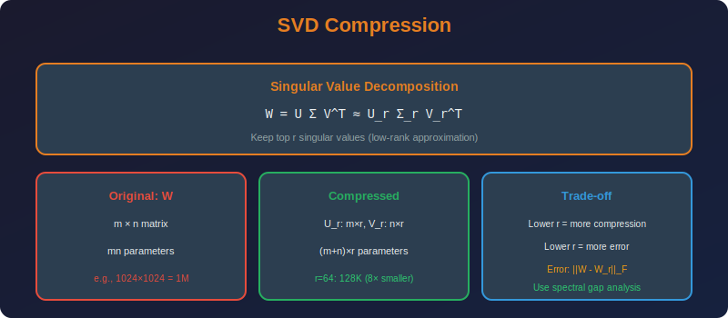

<!-- Animated Header -->
<p align="center">
  
</p>

<p align="center">
  
  
  
</p>


---

<p align="center">

</p>

# SVD-Based Weight Compression

## 📐 Mathematical Theory

### 1. Singular Value Decomposition

#### 1.1 Definition

**For any matrix $W \in \mathbb{R}^{m \times n}$:**

```math
W = U \Sigma V^T

```

where:

- $U \in \mathbb{R}^{m \times m}$ - left singular vectors (orthogonal)

- $\Sigma \in \mathbb{R}^{m \times n}$ - diagonal matrix of singular values

- $V \in \mathbb{R}^{n \times n}$ - right singular vectors (orthogonal)

#### 1.2 Thin SVD

**For $m \geq n$:**

```math
W = U_n \Sigma_n V^T

```

where $U\_n \in \mathbb{R}^{m \times n}$, $\Sigma\_n \in \mathbb{R}^{n \times n}$.

---

### 2. Low-Rank Approximation

#### 2.1 Truncated SVD

**Keep only $k$ largest singular values:**

```math
W_k = U_k \Sigma_k V_k^T

```

where:

- $U\_k \in \mathbb{R}^{m \times k}$ (first $k$ columns)

- $\Sigma\_k \in \mathbb{R}^{k \times k}$

- $V\_k \in \mathbb{R}^{n \times k}$

#### 2.2 Eckart-Young-Mirsky Theorem

**Theorem:** The rank-$k$ truncated SVD is the best rank-$k$ approximation:

```math
W_k = \arg\min_{\text{rank}(A) \leq k} \|W - A\|_F

```

**Optimal error:**

```math
\|W - W_k\|_F = \sqrt{\sum_{i=k+1}^{r} \sigma_i^2}

```

where $r = \text{rank}(W)$ and $\sigma\_i$ are singular values.

---

### 3. Compression Analysis

#### 3.1 Parameter Reduction

**Original:** $mn$ parameters

**Factorized:** $W\_k = U\_k (\Sigma\_k V\_k^T) = AB$

where $A \in \mathbb{R}^{m \times k}$, $B \in \mathbb{R}^{k \times n}$.

**Parameters:** $k(m + n)$

#### 3.2 Compression Ratio

```math
CR = \frac{mn}{k(m+n)} = \frac{mn}{km + kn}

```

**For square matrices ($m = n$):**

```math
CR = \frac{n^2}{2kn} = \frac{n}{2k}

```

#### 3.3 Break-even Analysis

**Compression useful when:**

```math
k(m + n) < mn
k < \frac{mn}{m + n}

```

**For $m = n$:** $k < n/2$

---

### 4. Energy-Based Rank Selection

#### 4.1 Cumulative Energy

**Total "energy":**

```math
E_{total} = \|W\|_F^2 = \sum_{i=1}^{r} \sigma_i^2

```

**Energy captured by rank-$k$:**

```math
E_k = \sum_{i=1}^{k} \sigma_i^2

```

**Energy ratio:**

```math
\rho_k = \frac{E_k}{E_{total}} = \frac{\sum_{i=1}^k \sigma_i^2}{\sum_{i=1}^r \sigma_i^2}

```

#### 4.2 Rank Selection

**Choose $k$ such that:**

```math
\rho_k \geq \tau

```

where $\tau \in [0.9, 0.99]$ is the target energy threshold.

**Approximation error:**

```math
\frac{\|W - W_k\|_F^2}{\|W\|_F^2} = 1 - \rho_k \leq 1 - \tau

```

---

### 5. Implementation

```python
import numpy as np
import torch
import torch.nn as nn

class SVDCompressor:
    """SVD-based neural network weight compression."""
    
    def __init__(self, energy_threshold: float = 0.95):
        self.energy_threshold = energy_threshold
    
    def compute_svd(self, weight: np.ndarray) -> tuple:
        """Compute full SVD."""
        U, S, Vt = np.linalg.svd(weight, full_matrices=False)
        return U, S, Vt
    
    def select_rank(self, singular_values: np.ndarray) -> int:
        """Select rank based on energy threshold."""
        total_energy = np.sum(singular_values ** 2)
        cumulative_energy = np.cumsum(singular_values ** 2)
        
        # Find minimum k that captures threshold energy
        energy_ratio = cumulative_energy / total_energy
        k = np.searchsorted(energy_ratio, self.energy_threshold) + 1
        
        return min(k, len(singular_values))
    
    def compress(self, weight: np.ndarray, rank: int = None) -> tuple:
        """
        Compress weight matrix using truncated SVD.
        
        Returns:
            A, B such that W ≈ AB
        """
        U, S, Vt = self.compute_svd(weight)
        
        if rank is None:
            rank = self.select_rank(S)
        
        # Truncate
        U_k = U[:, :rank]
        S_k = S[:rank]
        Vt_k = Vt[:rank, :]
        
        # Factorize as A @ B
        A = U_k * S_k  # Absorb singular values into U
        B = Vt_k
        
        return A, B, rank
    
    def compression_ratio(self, original_shape: tuple, rank: int) -> float:
        """Calculate compression ratio."""
        m, n = original_shape
        original_params = m * n
        compressed_params = rank * (m + n)
        return original_params / compressed_params
    
    def reconstruction_error(self, original: np.ndarray, 
                            A: np.ndarray, B: np.ndarray) -> float:
        """Compute relative reconstruction error."""
        reconstructed = A @ B
        error = np.linalg.norm(original - reconstructed, 'fro')
        original_norm = np.linalg.norm(original, 'fro')
        return error / original_norm

class SVDLinear(nn.Module):
    """Linear layer factorized using SVD."""
    
    def __init__(self, in_features: int, out_features: int, rank: int,
                 bias: bool = True):
        super().__init__()
        
        self.in_features = in_features
        self.out_features = out_features
        self.rank = rank
        
        # Factorized weights: W = A @ B
        self.A = nn.Parameter(torch.randn(out_features, rank))
        self.B = nn.Parameter(torch.randn(rank, in_features))
        
        if bias:
            self.bias = nn.Parameter(torch.zeros(out_features))
        else:
            self.register_parameter('bias', None)
        
        self._init_weights()
    
    def _init_weights(self):
        # Initialize to approximate Xavier/Kaiming
        nn.init.kaiming_uniform_(self.A)
        nn.init.kaiming_uniform_(self.B)
    
    @classmethod
    def from_linear(cls, linear: nn.Linear, rank: int = None,
                   energy_threshold: float = 0.95):
        """Create from existing linear layer."""
        weight = linear.weight.data.numpy()
        
        compressor = SVDCompressor(energy_threshold)
        A, B, actual_rank = compressor.compress(weight, rank)
        
        layer = cls(
            linear.in_features,
            linear.out_features,
            actual_rank,
            bias=linear.bias is not None
        )
        
        layer.A.data = torch.tensor(A)
        layer.B.data = torch.tensor(B)
        
        if linear.bias is not None:
            layer.bias.data = linear.bias.data.clone()
        
        return layer
    
    def forward(self, x: torch.Tensor) -> torch.Tensor:
        # Compute W @ x = A @ (B @ x)
        # More efficient for rank < min(in, out) / 2
        out = x @ self.B.T  # [B, L, rank]
        out = out @ self.A.T  # [B, L, out]
        
        if self.bias is not None:
            out = out + self.bias
        
        return out
    
    @property
    def weight(self) -> torch.Tensor:
        """Return reconstructed weight matrix."""
        return self.A @ self.B

def analyze_layer_ranks(model: nn.Module, energy_threshold: float = 0.95):
    """Analyze SVD ranks needed for each layer."""
    
    results = []
    compressor = SVDCompressor(energy_threshold)
    
    for name, module in model.named_modules():
        if isinstance(module, nn.Linear):
            weight = module.weight.data.numpy()
            U, S, Vt = compressor.compute_svd(weight)
            rank = compressor.select_rank(S)
            
            results.append({
                'name': name,
                'shape': weight.shape,
                'full_rank': min(weight.shape),
                'svd_rank': rank,
                'compression': compressor.compression_ratio(weight.shape, rank)
            })
    
    return results

def compress_model(model: nn.Module, energy_threshold: float = 0.95,
                  min_compression: float = 1.5) -> nn.Module:
    """
    Compress all linear layers in a model using SVD.
    
    Args:
        model: Model to compress
        energy_threshold: Energy to preserve
        min_compression: Minimum compression ratio to apply SVD
    """
    import copy
    model = copy.deepcopy(model)
    
    for name, module in list(model.named_modules()):
        if isinstance(module, nn.Linear):
            # Compute optimal rank
            weight = module.weight.data.numpy()
            compressor = SVDCompressor(energy_threshold)
            _, _, rank = compressor.compress(weight)
            
            # Check if compression is worthwhile
            cr = compressor.compression_ratio(weight.shape, rank)
            
            if cr >= min_compression:
                # Replace with SVD layer
                svd_layer = SVDLinear.from_linear(module, rank=rank)
                
                # Navigate to parent and replace
                parts = name.split('.')
                parent = model
                for part in parts[:-1]:
                    parent = getattr(parent, part)
                setattr(parent, parts[-1], svd_layer)
                
                print(f"Compressed {name}: {weight.shape} -> rank {rank} ({cr:.2f}x)")
    
    return model

```

---

### 6. Layer-wise Analysis

| Layer Type | Typical Rank | Notes |
|------------|--------------|-------|
| Embedding | High | Less compressible |
| Attention Q,K,V | Medium | Moderate compression |
| FFN Up | Low-Medium | Often compressible |
| FFN Down | Low-Medium | Often compressible |
| Output | High | Less compressible |

---

### 7. Hybrid Approaches

#### 7.1 SVD + Fine-tuning

1. Apply SVD compression
2. Fine-tune factorized layers
3. Recover accuracy loss

#### 7.2 SVD + Quantization

1. Apply SVD to reduce rank
2. Quantize factor matrices
3. Multiplicative compression!

---

## 📚 References

| Type | Title | Link |
|------|-------|------|
| 📄 | Low-Rank Factorization | [arXiv](https://arxiv.org/abs/1312.4894) |
| 📄 | Exploiting Linear Structure | [arXiv](https://arxiv.org/abs/1404.0736) |
| 📄 | ASVD | [arXiv](https://arxiv.org/abs/2312.05821) |
| 🇨🇳 | SVD矩阵分解详解 | [知乎](https://zhuanlan.zhihu.com/p/29846048) |
| 🇨🇳 | 低秩分解压缩CNN | [CSDN](https://blog.csdn.net/weixin_44878336/article/details/125170645) |
| 🇨🇳 | 矩阵分解加速神经网络 | [B站](https://www.bilibili.com/video/BV1x84y1F7xA) |

---

⬅️ [Back: Factorization](../README.md) | ➡️ [Next: Tensor Decomposition](../02_tensor_decomposition/README.md)

