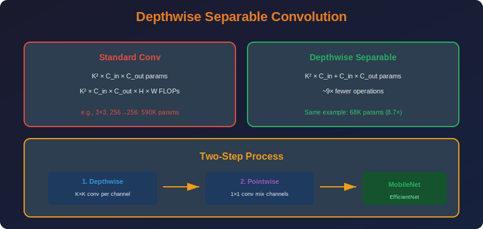

<!-- Animated Header -->
<p align="center">
  
</p>

<p align="center">
  
  
  
</p>


---

<p align="center">

</p>

# Depthwise Separable Convolutions

## 📐 Mathematical Theory

### 1. Standard Convolution Review

#### 1.1 Operation

**Input:** $X \in \mathbb{R}^{C\_{in} \times H \times W}$
**Kernel:** $W \in \mathbb{R}^{C\_{out} \times C\_{in} \times K \times K}$
**Output:** $Y \in \mathbb{R}^{C\_{out} \times H' \times W'}$

$$
Y[c_{out}, h, w] = \sum_{c_{in}=1}^{C_{in}} \sum_{i=1}^{K} \sum_{j=1}^{K} W[c_{out}, c_{in}, i, j] \cdot X[c_{in}, h+i, w+j]
$$

#### 1.2 Computational Cost

**Parameters:** $C\_{out} \times C\_{in} \times K^2$

**FLOPs:** $C\_{out} \times C\_{in} \times K^2 \times H' \times W'$

---

### 2. Depthwise Separable Convolution

#### 2.1 Factorization Idea

**Key insight:** Separate spatial and channel mixing.

$$
\text{Standard Conv} \approx \text{Depthwise} \circ \text{Pointwise}
$$

#### 2.2 Depthwise Convolution

**One filter per input channel:**

$$
Y_{dw}[c, h, w] = \sum_{i=1}^{K} \sum_{j=1}^{K} W_{dw}[c, i, j] \cdot X[c, h+i, w+j]
$$

**Parameters:** $C\_{in} \times K^2$

**FLOPs:** $C\_{in} \times K^2 \times H' \times W'$

#### 2.3 Pointwise Convolution

**1×1 convolution for channel mixing:**

$$
Y[c_{out}, h, w] = \sum_{c_{in}=1}^{C_{in}} W_{pw}[c_{out}, c_{in}] \cdot Y_{dw}[c_{in}, h, w]
$$

**Parameters:** $C\_{out} \times C\_{in}$

**FLOPs:** $C\_{out} \times C\_{in} \times H' \times W'$

---

### 3. Efficiency Analysis

#### 3.1 Parameter Reduction

**Standard:** $C\_{out} \cdot C\_{in} \cdot K^2$

**Depthwise Separable:** $C\_{in} \cdot K^2 + C\_{out} \cdot C\_{in}$

**Ratio:**

$$
\frac{C_{in} \cdot K^2 + C_{out} \cdot C_{in}}{C_{out} \cdot C_{in} \cdot K^2} = \frac{1}{C_{out}} + \frac{1}{K^2}
$$

**For typical values ($C\_{out} = 256$, $K = 3$):**

$$
\frac{1}{256} + \frac{1}{9} \approx 0.11 \approx \frac{1}{9}
$$

**~9× fewer parameters!**

#### 3.2 FLOP Reduction

Same ratio as parameters:

$$
\frac{\text{DSConv FLOPs}}{\text{Standard FLOPs}} = \frac{1}{C_{out}} + \frac{1}{K^2}
$$

---

### 4. Mathematical Interpretation

#### 4.1 Low-Rank Approximation

**Standard conv as 4D tensor:**

$$
\mathcal{W} \in \mathbb{R}^{C_{out} \times C_{in} \times K \times K}
$$

**Depthwise separable as rank-1 approximation in first two modes:**

$$
\mathcal{W} \approx \sum_{r=1}^{R} a_r \otimes b_r \otimes c_r
$$

where spatial ($c\_r$) and channel ($a\_r, b\_r$) are separated.

#### 4.2 When This Works

**Assumption:** Spatial patterns are similar across channels.

**Works well when:**
- Edge detectors are universal
- Texture patterns are channel-independent
- High-level features are composable

---

### 5. Inverted Residuals (MobileNet v2)

#### 5.1 Architecture

**Standard residual:** Wide → Narrow → Wide

**Inverted residual:** Narrow → Wide → Narrow

```
Input (narrow)
    ↓
1×1 Conv (expand)
    ↓
Depthwise Conv
    ↓
1×1 Conv (project)
    ↓
Output (narrow) + Skip
```

#### 5.2 Expansion Ratio

$$
\text{Expanded channels} = t \times C_{in}
$$

where $t \in \{1, 6\}$ is expansion factor.

**Total operations:**
1. Expand: $C\_{in} \times t \cdot C\_{in} = t \cdot C\_{in}^2$
2. Depthwise: $t \cdot C\_{in} \times K^2$
3. Project: $t \cdot C\_{in} \times C\_{out}$

---

### 6. Implementation

```python
import torch
import torch.nn as nn
import torch.nn.functional as F

class DepthwiseSeparableConv(nn.Module):
    """Depthwise separable convolution."""
    
    def __init__(self, in_channels: int, out_channels: int,
                 kernel_size: int = 3, stride: int = 1, 
                 padding: int = 1, bias: bool = False):
        super().__init__()
        
        # Depthwise: one filter per channel
        self.depthwise = nn.Conv2d(
            in_channels, in_channels, kernel_size,
            stride=stride, padding=padding,
            groups=in_channels,  # Key: groups = in_channels
            bias=False
        )
        
        # Pointwise: 1×1 conv for channel mixing
        self.pointwise = nn.Conv2d(
            in_channels, out_channels, 1,
            bias=bias
        )
    
    def forward(self, x: torch.Tensor) -> torch.Tensor:
        x = self.depthwise(x)
        x = self.pointwise(x)
        return x

class InvertedResidual(nn.Module):
    """MobileNetV2 inverted residual block."""
    
    def __init__(self, in_channels: int, out_channels: int,
                 stride: int = 1, expansion: int = 6):
        super().__init__()
        
        self.stride = stride
        self.use_residual = stride == 1 and in_channels == out_channels
        
        hidden_dim = in_channels * expansion
        
        layers = []
        
        # Expansion (if expansion > 1)
        if expansion != 1:
            layers.extend([
                nn.Conv2d(in_channels, hidden_dim, 1, bias=False),
                nn.BatchNorm2d(hidden_dim),
                nn.ReLU6(inplace=True)
            ])
        
        # Depthwise
        layers.extend([
            nn.Conv2d(hidden_dim, hidden_dim, 3, stride=stride,
                     padding=1, groups=hidden_dim, bias=False),
            nn.BatchNorm2d(hidden_dim),
            nn.ReLU6(inplace=True)
        ])
        
        # Pointwise projection (no activation!)
        layers.extend([
            nn.Conv2d(hidden_dim, out_channels, 1, bias=False),
            nn.BatchNorm2d(out_channels)
        ])
        
        self.conv = nn.Sequential(*layers)
    
    def forward(self, x: torch.Tensor) -> torch.Tensor:
        if self.use_residual:
            return x + self.conv(x)
        return self.conv(x)

class EfficientChannelAttention(nn.Module):
    """Efficient Channel Attention (ECA) for depthwise separable."""
    
    def __init__(self, channels: int, kernel_size: int = 3):
        super().__init__()
        
        self.avg_pool = nn.AdaptiveAvgPool2d(1)
        self.conv = nn.Conv1d(1, 1, kernel_size, padding=kernel_size//2, bias=False)
        self.sigmoid = nn.Sigmoid()
    
    def forward(self, x: torch.Tensor) -> torch.Tensor:

        # Global average pooling
        y = self.avg_pool(x)  # [B, C, 1, 1]
        y = y.squeeze(-1).transpose(-1, -2)  # [B, 1, C]
        
        # 1D conv for local channel interaction
        y = self.conv(y)  # [B, 1, C]
        y = y.transpose(-1, -2).unsqueeze(-1)  # [B, C, 1, 1]
        
        # Scale
        return x * self.sigmoid(y)

def compare_conv_efficiency(in_ch: int, out_ch: int, 
                           kernel: int, H: int, W: int):
    """Compare standard vs depthwise separable convolution."""
    
    # Parameters
    std_params = out_ch * in_ch * kernel * kernel
    ds_params = in_ch * kernel * kernel + out_ch * in_ch
    
    # FLOPs (multiply-adds)
    std_flops = out_ch * in_ch * kernel * kernel * H * W
    ds_flops = in_ch * kernel * kernel * H * W + out_ch * in_ch * H * W
    
    print(f"Input: {in_ch} channels, Output: {out_ch} channels")
    print(f"Kernel: {kernel}×{kernel}, Feature map: {H}×{W}")
    print()
    print(f"Standard Conv:")
    print(f"  Parameters: {std_params:,}")
    print(f"  FLOPs: {std_flops:,}")
    print()
    print(f"Depthwise Separable:")
    print(f"  Parameters: {ds_params:,} ({ds_params/std_params:.1%})")
    print(f"  FLOPs: {ds_flops:,} ({ds_flops/std_flops:.1%})")
    print()
    print(f"Speedup: {std_flops/ds_flops:.1f}×")

def convert_to_depthwise_separable(model: nn.Module, 
                                   min_channels: int = 32):
    """Convert Conv2d layers to depthwise separable."""
    import copy
    model = copy.deepcopy(model)
    
    for name, module in list(model.named_modules()):
        if isinstance(module, nn.Conv2d):

            # Skip if already depthwise or 1×1
            if module.groups > 1 or module.kernel_size == (1, 1):
                continue
            
            # Skip if channels too small
            if module.in_channels < min_channels:
                continue
            
            # Create depthwise separable replacement
            ds_conv = DepthwiseSeparableConv(
                module.in_channels,
                module.out_channels,
                kernel_size=module.kernel_size[0],
                stride=module.stride[0],
                padding=module.padding[0],
                bias=module.bias is not None
            )
            
            # Replace in model
            parts = name.split('.')
            parent = model
            for part in parts[:-1]:
                parent = getattr(parent, part)
            setattr(parent, parts[-1], ds_conv)
    
    return model

# Demo
if __name__ == "__main__":
    compare_conv_efficiency(
        in_ch=256, out_ch=256,
        kernel=3, H=14, W=14
    )
```

---

### 7. Variants and Extensions

| Variant | Description | Use Case |
|---------|-------------|----------|
| **MobileNetV1** | Basic DS conv | Mobile |
| **MobileNetV2** | Inverted residual | Mobile |
| **MobileNetV3** | + SE + H-swish | Mobile |
| **EfficientNet** | Compound scaling | General |

---

## 📚 References

| Type | Title | Link |
|------|-------|------|
| 📄 | MobileNets | [arXiv](https://arxiv.org/abs/1704.04861) |
| 📄 | MobileNetV2 | [arXiv](https://arxiv.org/abs/1801.04381) |
| 📄 | EfficientNet | [arXiv](https://arxiv.org/abs/1905.11946) |
| 🇨🇳 | MobileNet系列详解 | [知乎](https://zhuanlan.zhihu.com/p/70703846) |
| 🇨🇳 | 深度可分离卷积原理 | [CSDN](https://blog.csdn.net/u010712012/article/details/89430492) |
| 🇨🇳 | 轻量级网络设计 | [B站](https://www.bilibili.com/video/BV1Y7411T7pD) |
| 🇨🇳 | EfficientNet解读 | [机器之心](https://www.jiqizhixin.com/articles/2019-06-05-7) |

---

⬅️ [Back: Tensor Decomposition](../02_tensor_decomposition/README.md) | ➡️ [Back to Factorization](../README.md)

