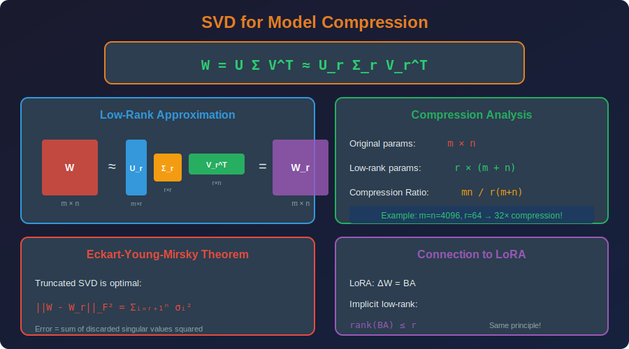

<!-- Animated Header -->
<p align="center">
  
</p>

<p align="center">
  
  
  
</p>


---

## 📐 Mathematical Foundations

### 1. Singular Value Decomposition (SVD)

**Theorem (SVD):** Any matrix $W \in \mathbb{R}^{m \times n}$ can be decomposed as:

```math
W = U \Sigma V^T

```

Where:

- $U \in \mathbb{R}^{m \times m}$: Left singular vectors (orthogonal)

- $\Sigma \in \mathbb{R}^{m \times n}$: Diagonal matrix of singular values

- $V \in \mathbb{R}^{n \times n}$: Right singular vectors (orthogonal)

- $\sigma\_1 \geq \sigma\_2 \geq ... \geq \sigma\_r > 0$: Singular values (non-negative, ordered)

**Properties:**
- $U^T U = I$ (orthonormality)

- $V^T V = I$

- $\text{rank}(W) = r$ (number of non-zero singular values)

### 2. Low-Rank Approximation

**Truncated SVD (Rank-$k$ Approximation):**

```math
W_k = U_k \Sigma_k V_k^T = \sum_{i=1}^{k} \sigma_i u_i v_i^T

```

Where $U\_k, V\_k$ contain only the first $k$ columns.

**Eckart-Young-Mirsky Theorem:**
The truncated SVD gives the optimal rank-$k$ approximation:

```math
W_k = \arg\min_{\text{rank}(A) \leq k} \|W - A\|_F

```

**Proof Sketch:**
For any rank-$k$ matrix $A$:

```math
\|W - A\|_F^2 \geq \sum_{i=k+1}^{r} \sigma_i^2 = \|W - W_k\|_F^2

```

### 3. Compression Analysis

**Original Parameters:** $m \times n$

**Factorized Parameters:** $m \times k + k \times n = k(m + n)$

**Compression Ratio:**

```math
CR = \frac{mn}{k(m+n)}

```

**For square matrices ($m = n$):**

```math
CR = \frac{n^2}{2kn} = \frac{n}{2k}

```

**Example:** $n = 4096$, $k = 64$:

```math
CR = \frac{4096}{128} = 32\times

```

### 4. Error Analysis

**Frobenius Norm Error:**

```math
\|W - W_k\|_F = \sqrt{\sum_{i=k+1}^{r} \sigma_i^2}

```

**Relative Error:**

```math
\frac{\|W - W_k\|_F}{\|W\|_F} = \sqrt{\frac{\sum_{i=k+1}^{r} \sigma_i^2}{\sum_{i=1}^{r} \sigma_i^2}}

```

**Spectral Norm Error:**

```math
\|W - W_k\|_2 = \sigma_{k+1}

```

### 5. LoRA as Implicit Low-Rank Factorization

**LoRA learns:**

```math
\Delta W = BA

```

Where:

- $B \in \mathbb{R}^{m \times r}$

- $A \in \mathbb{R}^{r \times n}$

**Connection to SVD:**
The learned $\Delta W$ is implicitly low-rank:

```math
\text{rank}(\Delta W) = \text{rank}(BA) \leq r

```

**During training, LoRA learns:**

```math
BA \approx U_r \Sigma_r V_r^T

```

Where $U\_r \Sigma\_r V\_r^T$ is the optimal rank-$r$ approximation to the true weight update.

### 6. Tensor Decomposition (CP and Tucker)

**CP Decomposition (CANDECOMP/PARAFAC):**

```math
\mathcal{W} \approx \sum_{r=1}^{R} \lambda_r \cdot a_r \otimes b_r \otimes c_r

```

For a 4D convolution kernel $\mathcal{W} \in \mathbb{R}^{C\_{out} \times C\_{in} \times H \times W}$.

**Tucker Decomposition:**

```math
\mathcal{W} \approx \mathcal{G} \times_1 U_1 \times_2 U_2 \times_3 U_3 \times_4 U_4

```

Where $\mathcal{G}$ is a smaller core tensor.

**Compression for Convolutions:**
- Original: $C\_{out} \times C\_{in} \times k \times k$

- CP: $R \times (C\_{out} + C\_{in} + k + k)$

- Tucker: $(R\_1 \times R\_2 \times R\_3 \times R\_4) + R\_1 C\_{out} + R\_2 C\_{in} + ...$

### 7. Depthwise Separable Convolution (Factorized Conv)

**Standard Convolution:**

```math
Y = W * X, \quad W \in \mathbb{R}^{C_{out} \times C_{in} \times K \times K}
\text{Params: } C_{out} \times C_{in} \times K^2

```

**Depthwise Separable:**

1. **Depthwise:** $H = W\_{dw} * X$ where $W\_{dw} \in \mathbb{R}^{C\_{in} \times 1 \times K \times K}$

2. **Pointwise:** $Y = W\_{pw} \cdot H$ where $W\_{pw} \in \mathbb{R}^{C\_{out} \times C\_{in} \times 1 \times 1}$

```math
\text{Params: } C_{in} \times K^2 + C_{out} \times C_{in}

```

**Compression Ratio:**

```math
CR = \frac{C_{out} \times C_{in} \times K^2}{C_{in} \times K^2 + C_{out} \times C_{in}} = \frac{C_{out} K^2}{K^2 + C_{out}}

```

For $K=3$, $C\_{out}=256$: $CR \approx 8-9\times$

---

## 🎯 The Core Idea

```
Original weight matrix W ∈ ℝ^(m×n):
+-------------------------------------+

|  W: m × n matrix                    |
|  Parameters: m × n                  |
|  Example: 4096 × 4096 = 16M params |
+-------------------------------------+

Low-rank factorization W ≈ UV^T:
+-------------------------------------+

|  U: m × r matrix                    |
|  V: n × r matrix                    |
|  Parameters: r(m + n)               |
|  If r = 64: 64×8192 = 524K params  |
|  Compression: 32×!                  |
+-------------------------------------+

For LoRA: ΔW = BA
+-------------------------------------+

|  B: d × r, A: r × k                |
|  Only train B, A (frozen W₀)       |
|  r = 16: ~100× fewer parameters    |
+-------------------------------------+

```

---

## 💻 Code Examples

```python
import torch
import torch.nn as nn
import numpy as np

# ========== SVD-based Layer Compression ==========
def compress_linear_svd(layer, rank):
    """
    Compress a linear layer using truncated SVD
    
    Args:
        layer: nn.Linear to compress
        rank: Target rank for approximation
    
    Returns:
        Two smaller linear layers
    """
    W = layer.weight.data.numpy()
    
    # SVD decomposition
    U, S, Vt = np.linalg.svd(W, full_matrices=False)
    
    # Truncate to rank
    U_k = U[:, :rank]
    S_k = S[:rank]
    Vt_k = Vt[:rank, :]
    
    # Create factorized layers: W ≈ U_k @ diag(S_k) @ Vt_k
    # Split as: (U_k @ sqrt(diag(S_k))) @ (sqrt(diag(S_k)) @ Vt_k)
    sqrt_S = np.sqrt(S_k)
    
    W1 = (U_k * sqrt_S).T  # shape: [rank, out_features]
    W2 = (sqrt_S[:, None] * Vt_k)  # shape: [rank, in_features]
    
    # First layer: in_features -> rank
    layer1 = nn.Linear(layer.in_features, rank, bias=False)
    layer1.weight.data = torch.from_numpy(W2).float()
    
    # Second layer: rank -> out_features
    layer2 = nn.Linear(rank, layer.out_features, bias=layer.bias is not None)
    layer2.weight.data = torch.from_numpy(W1.T).float()
    if layer.bias is not None:
        layer2.bias.data = layer.bias.data.clone()
    
    return nn.Sequential(layer1, layer2)

# ========== Compute Optimal Rank ==========
def find_optimal_rank(W, error_threshold=0.1):
    """Find minimum rank for given error threshold"""
    U, S, Vt = np.linalg.svd(W, full_matrices=False)
    
    total_energy = np.sum(S**2)
    cumsum = np.cumsum(S**2)
    
    # Find rank where error < threshold
    for k in range(1, len(S)+1):
        retained = cumsum[k-1] / total_energy
        if retained >= (1 - error_threshold**2):
            return k
    
    return len(S)

# ========== Depthwise Separable Convolution ==========
class DepthwiseSeparableConv(nn.Module):
    """Factorized convolution (MobileNet style)"""
    
    def __init__(self, in_channels, out_channels, kernel_size, stride=1, padding=0):
        super().__init__()
        
        # Depthwise: spatial convolution per channel
        self.depthwise = nn.Conv2d(
            in_channels, in_channels, kernel_size,
            stride=stride, padding=padding, groups=in_channels, bias=False
        )
        
        # Pointwise: 1x1 conv to mix channels
        self.pointwise = nn.Conv2d(in_channels, out_channels, 1, bias=True)
    
    def forward(self, x):
        x = self.depthwise(x)
        x = self.pointwise(x)
        return x

# ========== Tucker Decomposition for Conv ==========
def tucker_decompose_conv(conv, ranks):
    """
    Tucker decomposition of conv layer
    
    Original: C_out × C_in × K × K
    Decomposed: Core G + factor matrices
    """
    import tensorly as tl
    from tensorly.decomposition import partial_tucker
    
    W = conv.weight.data.numpy()
    
    # Tucker decomposition
    core, factors = partial_tucker(W, modes=[0, 1], rank=ranks)
    
    # Reconstruct as sequential convolutions
    # 1. 1×1 conv (C_in -> r2)
    # 2. K×K conv (r2 -> r1) 
    # 3. 1×1 conv (r1 -> C_out)
    
    return core, factors

# ========== Example Usage ==========
# Original linear layer
original = nn.Linear(4096, 4096)
print(f"Original params: {4096*4096:,}")

# Compress with SVD
compressed = compress_linear_svd(original, rank=64)
print(f"Compressed params: {64*4096 + 64*4096:,}")
print(f"Compression ratio: {4096*4096 / (64*4096*2):.1f}×")

```

---

## 📐 SVD Mathematics Visualization



---

## 🔗 Where This Topic Is Used

| Topic | How Factorization Is Used |
|-------|--------------------------|
| **LoRA** | Low-rank adapters for fine-tuning |
| **QLoRA** | LoRA + 4-bit quantization |
| **MobileNet** | Depthwise separable convolution |
| **EfficientNet** | Factorized building blocks |
| **SVD Compression** | Compress dense layers |
| **Recommendation** | Matrix factorization |

---

## 📚 References & Resources

### 📄 Key Papers

| Paper | Authors | Year | Key Contribution |
|-------|---------|------|------------------|
| [LoRA](https://arxiv.org/abs/2106.09685) | Hu et al. | 2021 | Low-rank adaptation |
| [Low-rank Matrix Factorization for DNNs](https://arxiv.org/abs/1312.4659) | Sainath et al. | 2013 | SVD for DNNs |
| [Tensor Decomposition](https://arxiv.org/abs/1511.06530) | Lebedev et al. | 2015 | CP decomposition for CNNs |
| [Tucker Decomposition](https://arxiv.org/abs/1412.6553) | Kim et al. | 2015 | Tucker for compression |
| [MobileNets](https://arxiv.org/abs/1704.04861) | Howard et al. | 2017 | Depthwise separable |

### 📐 Mathematical Background

| Concept | Description |
|---------|-------------|
| SVD | $W = U\Sigma V^T$, optimal low-rank |
| Eckart-Young | Truncated SVD is optimal |
| Intrinsic Dimension | NNs have low effective rank |
| CP Decomposition | Sum of rank-1 tensors |
| Tucker Decomposition | Core + factor matrices |

---

## 📁 Sub-Topics

| # | Topic | Description | Link |
|:-:|-------|-------------|:----:|
| 1 | **SVD Compression** | Truncated SVD, Eckart-Young theorem | [📁 Open](./01_svd_compression/README.md) |
| 2 | **Tensor Decomposition** | CP, Tucker, Tensor Train | [📁 Open](./02_tensor_decomposition/README.md) |
| 3 | **Depthwise Separable** | MobileNet, inverted residuals | [📁 Open](./03_depthwise_separable/README.md) |

---

⬅️ [Back: Weight Sharing](../05_weight_sharing/README.md) | ➡️ [Next: Sparsity](../07_sparsity/README.md)

---


<p align="center">
  
</p>
