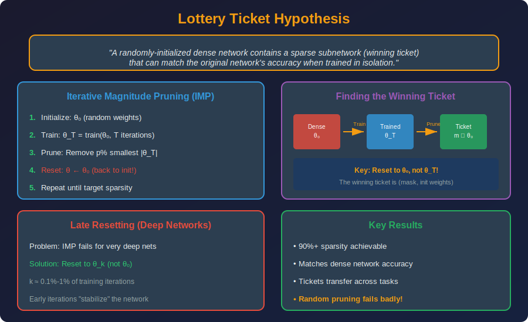

<!-- Animated Header -->
<p align="center">
  
</p>

<p align="center">
  
  
  
</p>


---

## 📐 Mathematical Foundations

### 1. Sparsity Definition

**Sparsity Ratio:**

```math
s = \frac{\|\mathbf{w}\|_0}{\text{total params}} = \frac{\#\text{zeros}}{\#\text{total}}

```

**Density:** $d = 1 - s$

**Example:** 90% sparsity = only 10% of weights are non-zero

### 2. Sparse Matrix Representations

**Compressed Sparse Row (CSR):**

```math
\text{Storage: } O(\text{nnz} + n)

```

Components:
- `values`: Non-zero values $[v\_1, v\_2, ..., v\_{nnz}]$
- `col_indices`: Column index for each value
- `row_ptr`: Start of each row in values array

**Coordinate Format (COO):**

```math
\text{Storage: } 3 \times \text{nnz}

```

Stores (row, col, value) triplets.

**Comparison:**
| Format | Storage | Row Access | Col Access | Matrix-Vector |
|--------|---------|------------|------------|---------------|
| Dense | $O(mn)$ | $O(1)$ | $O(1)$ | $O(mn)$ |
| CSR | $O(\text{nnz}+m)$ | $O(1)$ | $O(\text{nnz})$ | $O(\text{nnz})$ |
| COO | $O(3 \cdot \text{nnz})$ | $O(\text{nnz})$ | $O(\text{nnz})$ | $O(\text{nnz})$ |

### 3. N:M Structured Sparsity

**Definition:** In every $M$ consecutive elements, exactly $N$ are non-zero.

**2:4 Sparsity (NVIDIA Ampere):**

```math
\forall i: \sum_{j=4i}^{4i+3} \mathbf{1}[w_j \neq 0] = 2

```

**Valid patterns for 2:4:**

```
[*, *, 0, 0], [*, 0, *, 0], [*, 0, 0, *],
[0, *, *, 0], [0, *, 0, *], [0, 0, *, *]

```

**Hardware Speedup:** 2× on NVIDIA Ampere Tensor Cores

**Mathematical Formulation:**

```math
W_{2:4} = W \odot M_{2:4}

```

Where $M\_{2:4}$ satisfies the 2:4 constraint and minimizes $\|W - W\_{2:4}\|\_F$.

### 4. Lottery Ticket Hypothesis (Formal)

**Theorem (Frankle & Carlin, 2019):**

Let $f(x; \theta\_0)$ be a randomly-initialized neural network. There exists a mask $m \in \{0,1\}^{|\theta|}$ such that:

1. **Sparsity:** $\|m\|\_0 \ll |\theta|$
2. **Trainability:** $f(x; m \odot \theta\_0)$ trained for $T$ iterations achieves test accuracy $\geq f(x; \theta\_T) - \epsilon$

**Iterative Magnitude Pruning (IMP):**

```
θ₀ ← Initialize()
for round in 1..R:
    θ_T ← Train(θ, T iterations)
    m ← KeepTopK(|θ_T|, p%)
    θ ← m ⊙ θ₀  // Reset to init!
return m, θ₀

```

**Late Rewinding:** Reset to $\theta\_k$ instead of $\theta\_0$ (more stable for large models).

### 5. Sparse Training Methods

**Static Sparse Training:**
- Fix mask at initialization
- Train only non-zero weights
- Example: SNIP, GraSP

**Dynamic Sparse Training:**
- Periodically update mask during training
- Prune + Regrow based on importance

**RigL (Rigged Lottery):**

```math
\text{Drop: } \arg\min_{|\mathcal{S}|=k} \sum_{i \in \mathcal{S}} |w_i|
\text{Grow: } \arg\max_{|\mathcal{S}|=k} \sum_{i \in \mathcal{S}} |\nabla_i|

```

Drop smallest magnitude, grow largest gradient.

### 6. Sparse Attention

**Standard Attention Complexity:**

```math
\text{Attention}(Q, K, V) = \text{softmax}\left(\frac{QK^T}{\sqrt{d}}\right)V
\text{Memory: } O(n^2), \quad \text{Compute: } O(n^2 d)

```

**Local Attention:**

```math
A_{ij} = \begin{cases} \text{attention}(q_i, k_j) & |i-j| \leq w \\ 0 & \text{otherwise} \end{cases}
\text{Complexity: } O(nw)

```

**Global + Local (Longformer):**
- Select $g$ global tokens that attend to all
- All other tokens use local window $w$

```math
\text{Complexity: } O(n(w + g))

```

**Sparse Patterns Comparison:**
| Method | Pattern | Complexity | Use Case |
|--------|---------|------------|----------|
| Full | Dense | $O(n^2)$ | Short sequences |
| Local | Window | $O(nw)$ | Long sequences |
| Strided | Every $k$ | $O(n^2/k)$ | Hierarchical |
| Random | Sampled | $O(nr)$ | Research |

---

## 🎯 Types of Sparsity

```
Unstructured Sparsity:
+-------------------------------------+
| [1.2, 0, 0.8, 0, 0, 0.3, 0, 0.9]   |
| Zeros anywhere                      |
| Flexible but hardware-unfriendly    |
+-------------------------------------+

Structured Sparsity (2:4):
+-------------------------------------+
| [1.2, 0, | 0.8, 0, | 0.3, 0, | 0.9, 0] |
| 2 zeros per 4 elements              |
| NVIDIA Ampere supports natively!    |
+-------------------------------------+

Block Sparsity:
+-------------------------------------+
| [Block1, 0, 0, Block4]              |
| Entire blocks are zero              |
| Very hardware-friendly              |
+-------------------------------------+

```

---

## 💻 Code Examples

```python
import torch
import torch.nn as nn

# ========== 2:4 Sparsity Implementation ==========
def apply_2_4_sparsity(tensor):
    """Apply 2:4 structured sparsity"""
    # Reshape to groups of 4
    shape = tensor.shape
    tensor_flat = tensor.flatten()
    
    # Pad if necessary
    pad_len = (4 - len(tensor_flat) % 4) % 4
    if pad_len > 0:
        tensor_flat = torch.cat([tensor_flat, torch.zeros(pad_len)])
    
    tensor_grouped = tensor_flat.view(-1, 4)
    
    # Keep top 2 in each group
    _, indices = torch.topk(tensor_grouped.abs(), 2, dim=1)
    mask = torch.zeros_like(tensor_grouped)
    mask.scatter_(1, indices, 1)
    
    # Apply mask
    sparse_tensor = tensor_grouped * mask
    
    return sparse_tensor.flatten()[:tensor.numel()].view(shape)

# ========== Lottery Ticket (IMP) ==========
def iterative_magnitude_pruning(model, train_fn, prune_rate=0.2, rounds=10):
    """Find winning ticket via IMP"""
    
    # Save initial weights
    initial_state = {k: v.clone() for k, v in model.state_dict().items()}
    
    # Current mask (all ones)
    masks = {k: torch.ones_like(v) for k, v in model.state_dict().items()
             if 'weight' in k}
    
    for round in range(rounds):
        # Train model
        train_fn(model)
        
        # Compute global threshold
        all_weights = torch.cat([
            (p * masks.get(n, torch.ones_like(p))).abs().flatten()
            for n, p in model.named_parameters() if 'weight' in n
        ])
        threshold = torch.quantile(all_weights[all_weights > 0], prune_rate)
        
        # Update masks
        for name, param in model.named_parameters():
            if 'weight' in name:
                masks[name] *= (param.abs() > threshold).float()
        
        # Reset weights to init with new mask
        new_state = {}
        for name in model.state_dict():
            if name in masks:
                new_state[name] = initial_state[name] * masks[name]
            else:
                new_state[name] = model.state_dict()[name]
        
        model.load_state_dict(new_state)
        
        sparsity = 1 - sum(m.sum() for m in masks.values()) / sum(m.numel() for m in masks.values())
        print(f"Round {round+1}: Sparsity = {sparsity:.2%}")
    
    return model, masks

# ========== RigL Dynamic Sparse Training ==========
class RigLOptimizer:
    """Dynamic sparse training with RigL"""
    
    def __init__(self, model, sparsity=0.9, update_freq=100, drop_frac=0.3):
        self.model = model
        self.sparsity = sparsity
        self.update_freq = update_freq
        self.drop_frac = drop_frac
        
        # Initialize sparse masks
        self.masks = {}
        for name, param in model.named_parameters():
            if 'weight' in name and param.dim() >= 2:
                k = int((1 - sparsity) * param.numel())
                _, indices = torch.topk(param.abs().flatten(), k)
                mask = torch.zeros_like(param.flatten())
                mask[indices] = 1
                self.masks[name] = mask.view(param.shape)
        
        self.step_count = 0
    
    def step(self):
        """Update masks periodically"""
        self.step_count += 1
        
        if self.step_count % self.update_freq == 0:
            self.update_topology()
    
    def update_topology(self):
        """Drop + Grow connections"""
        for name, param in self.model.named_parameters():
            if name not in self.masks:
                continue
            
            mask = self.masks[name]
            
            # Number of connections to change
            n_drop = int(self.drop_frac * mask.sum())
            
            # DROP: Remove smallest magnitude active weights
            active = (mask > 0)
            active_weights = param.data.abs() * active
            _, drop_indices = torch.topk(-active_weights.flatten(), n_drop)
            
            # GROW: Add largest gradient inactive weights  
            inactive = (mask == 0)
            if param.grad is not None:
                inactive_grads = param.grad.abs() * inactive
                _, grow_indices = torch.topk(inactive_grads.flatten(), n_drop)
                
                # Update mask
                mask_flat = mask.flatten()
                mask_flat[drop_indices] = 0
                mask_flat[grow_indices] = 1
                self.masks[name] = mask_flat.view(param.shape)
    
    def apply_masks(self):
        """Zero out masked weights"""
        for name, param in self.model.named_parameters():
            if name in self.masks:
                param.data *= self.masks[name]

```

---

## 🎰 Lottery Ticket Hypothesis Visualization



---

## 📚 References & Resources

### 📄 Key Papers

| Paper | Authors | Year | Key Contribution |
|-------|---------|------|------------------|
| [Lottery Ticket Hypothesis](https://arxiv.org/abs/1803.03635) | Frankle & Carlin | 2018 | Original paper |
| [Stabilizing LTH](https://arxiv.org/abs/1903.01611) | Frankle et al. | 2019 | Late rewinding |
| [RigL](https://arxiv.org/abs/1911.11134) | Evci et al. | 2020 | Dynamic sparse training |
| [Sparse Transformers](https://arxiv.org/abs/1904.10509) | Child et al. | 2019 | Sparse attention |
| [2:4 Sparsity](https://arxiv.org/abs/2104.08378) | Mishra et al. | 2021 | NVIDIA hardware |
| [SNIP](https://arxiv.org/abs/1810.02340) | Lee et al. | 2018 | Single-shot pruning at init |

---

⬅️ [Back: MoE](../01_moe/README.md) | ➡️ [Next: PEFT](../../08_peft/README.md)

---


<p align="center">
  
</p>
