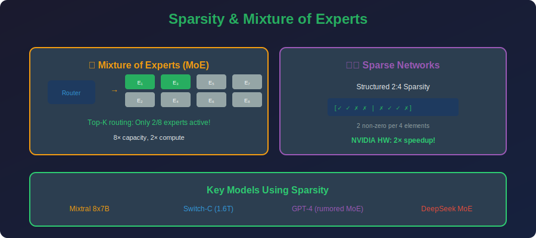

<!-- Animated Header -->
<p align="center">
  
</p>

<p align="center">
  
  
  
</p>


---

<p align="center">

</p>

## 📐 Mathematical Foundations

### 1. Sparse Matrix Computation

**Dense Matrix-Vector Multiplication:**

```math
y = Wx, \quad \text{Complexity: } O(mn)
```

**Sparse Matrix-Vector Multiplication:**

```math
y = W_{sparse}x, \quad \text{Complexity: } O(\text{nnz})
```

Where $\text{nnz}$ = number of non-zeros.

**Speedup:**

```math
\text{Speedup} = \frac{mn}{\text{nnz}} = \frac{1}{1 - \text{sparsity}}
```

For 90% sparsity: $\text{Speedup} = 10\times$ (theoretical)

### 2. Sparsity Patterns

**Unstructured Sparsity:**

```math
W_{sparse} = W \odot M, \quad M_{ij} \in \{0, 1\}
```

Any element can be zero. Maximum flexibility but requires sparse hardware.

**N:M Structured Sparsity:**

```math
\forall \text{ group of } M \text{ elements}: \text{exactly } N \text{ are zero}
```

**2:4 Sparsity (NVIDIA Ampere):**
- 2 zeros per 4 consecutive elements
- 50% sparsity with hardware acceleration
- 2× speedup on Tensor Cores

**Mathematical Constraint:**

```math
\sum_{j=iM}^{(i+1)M-1} \mathbf{1}[w_j \neq 0] = M - N
```

### 3. Block Sparsity

**Definition:** Entire blocks are zero or non-zero.

```math
W = \begin{bmatrix} W_{11} & \mathbf{0} \\ \mathbf{0} & W_{22} \end{bmatrix}
```

**Benefits:**
- Better hardware utilization
- Efficient memory access patterns
- Used in block-sparse attention

### 4. Mixture of Experts (MoE) - Activation Sparsity

**MoE Layer:**

```math
y = \sum_{i=1}^{N} g_i(x) \cdot E_i(x)
```

**Routing Function:**

```math
g(x) = \text{TopK}(\text{softmax}(W_r \cdot x + \epsilon))
```

Where $\epsilon \sim \text{Gumbel}(0, 1)$ adds exploration noise.

**Only $K$ experts are computed!**

```math
y = \sum_{i \in \text{TopK}} g_i(x) \cdot E_i(x)
```

**Effective Compute:**

```math
\text{FLOPs}_{effective} = \text{FLOPs}_{shared} + K \cdot \text{FLOPs}_{expert}
```

### 5. Load Balancing Loss (MoE)

**Problem:** Router may send all tokens to few experts.

**Auxiliary Loss:**

```math
\mathcal{L}_{aux} = \alpha \cdot N \cdot \sum_{i=1}^{N} f_i \cdot P_i
```

Where:
- $f\_i = \frac{1}{T}\sum\_t \mathbf{1}[\text{token } t \to \text{expert } i]$ (fraction of tokens)
- $P\_i = \frac{1}{T}\sum\_t p\_i(x\_t)$ (average routing probability)
- $\alpha$ = balancing coefficient

**Goal:** Make $f\_i \approx 1/N$ (uniform distribution).

### 6. Sparse Attention

**Standard Attention:**

```math
\text{Attention}(Q, K, V) = \text{softmax}\left(\frac{QK^T}{\sqrt{d}}\right)V
\text{Complexity: } O(n^2 d)
```

**Sparse Attention Patterns:**

*Local Attention:*

```math
A_{ij} = \begin{cases} \text{softmax}(\cdot) & |i-j| \leq w \\ 0 & \text{otherwise} \end{cases}
```

*Global + Local (Longformer):*

```math
A = A_{local} + A_{global}
```

*Random Sparse (BigBird):*

```math
A = A_{local} + A_{global} + A_{random}
```

**Complexity:** $O(n \cdot w)$ where $w$ = window size

### 7. Lottery Ticket and Sparse Training

**Lottery Ticket Hypothesis (Formal):**
Let $f(x; \theta\_0)$ be initialized network. $\exists$ mask $m$ s.t.:
1. $\|m\|\_0 \ll |\theta\_0|$ (sparse)
2. $f(x; m \odot \theta\_0)$ achieves comparable accuracy to $f(x; \theta\_T)$

**Sparse Training Methods:**

*Gradual Magnitude Pruning:*

```math
s_t = s_f + (s_0 - s_f)\left(1 - \frac{t}{T}\right)^3
```

*Dynamic Sparse Training (SET, RigL):*

```math
\theta_{t+1} = \text{TopK}(\theta_t - \alpha \nabla\mathcal{L})
```

Periodically prune and regrow connections based on gradient magnitude.

---

## 📂 Topics

| Folder | Topic | Key Concepts |
|--------|-------|--------------|
| [01_moe/](./01_moe/) | Mixture of Experts | 🔥 Conditional computation |
| [02_sparse_networks/](./02_sparse_networks/) | Sparse weights | Unstructured, block sparsity |

---

## 🎯 The Core Idea

### Sparse Weights

```
Dense matrix:
+-----------------+
| 1.2  0.5  0.8  |  All elements computed
| 0.3  0.9  0.1  |  FLOPs: m × n
| 0.7  0.2  0.6  |
+-----------------+

Sparse matrix (50%):
+-----------------+
| 1.2   0   0.8  |  Only non-zeros computed
|  0   0.9   0   |  FLOPs: nnz
| 0.7   0   0.6  |  → 2× theoretical speedup
+-----------------+
```

### Mixture of Experts

```
Input x
    |
    v
+-------------------------------------+
|           Router g(x)               |
|   "Which experts should handle x?"  |
+-------------------------------------+
    |
    +--> Expert 1 (activated) --+
    +--> Expert 2 (skipped)     |
    +--> Expert 3 (activated) --+--> Output
    +--> Expert 4 (skipped)     |
                                |
Only 2/4 experts run!           v
→ 2× effective compute     Σ weights × outputs
```

---

## 🔥 MoE: Why It Matters

```
Dense Model:
• All parameters used for every input
• 70B params → 70B FLOPs per token

MoE Model (Mixtral):
• 8 experts, top-2 routing
• 46B total params, but only ~12B active
• Better quality at same compute!

Mixtral 8x7B:
+-- Total params: 46B
+-- Active params: ~12B (per token)
+-- Quality ≈ LLaMA-70B dense
+-- 6× more efficient inference!
```

---

## 📚 References

| Type | Title | Link |
|------|-------|------|
| 📄 | Lottery Ticket Hypothesis | [arXiv](https://arxiv.org/abs/1803.03635) |
| 📄 | Mixtral MoE | [arXiv](https://arxiv.org/abs/2401.04088) |
| 📄 | Switch Transformer | [arXiv](https://arxiv.org/abs/2101.03961) |
| 📄 | Sparse Transformers | [arXiv](https://arxiv.org/abs/1904.10509) |
| 📄 | 2:4 Sparsity (NVIDIA) | [arXiv](https://arxiv.org/abs/2104.08378) |

---

⬅️ [Back: Factorization](../06_factorization/README.md) | 📂 [MoE](./01_moe/README.md) | ➡️ [Next: PEFT](../08_peft/README.md)

---


<p align="center">
  
</p>
