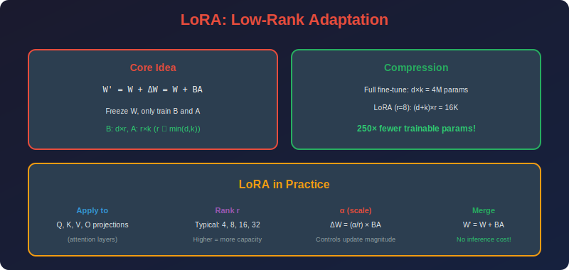

<!-- Animated Header -->
<p align="center">
  
</p>

<p align="center">
  
  
  
</p>


---

<p align="center">

</p>

## 📐 Mathematical Theory

### 1. Core Formulation

#### 1.1 LoRA Decomposition

**Standard weight update during fine-tuning:**

```math
W' = W_0 + \Delta W
```

**LoRA hypothesis:** $\Delta W$ has low intrinsic rank.

**LoRA parameterization:**

```math
\Delta W = BA
```

where:
- $W\_0 \in \mathbb{R}^{d \times k}$ (frozen pre-trained weights)
- $B \in \mathbb{R}^{d \times r}$ (trainable)
- $A \in \mathbb{R}^{r \times k}$ (trainable)
- $r \ll \min(d, k)$ (low rank)

#### 1.2 Forward Pass

```math
h = W'x = (W_0 + BA)x = W_0 x + BAx
```

**With scaling:**

```math
h = W_0 x + \frac{\alpha}{r} BAx
```

where $\alpha$ is a scaling hyperparameter.

---

### 2. Parameter Efficiency Proof

#### 2.1 Parameter Comparison

**Full fine-tuning parameters:**

```math
|\theta_{full}| = d \times k
```

**LoRA parameters:**

```math
|\theta_{LoRA}| = d \times r + r \times k = r(d + k)
```

**Reduction factor:**

```math
\frac{|\theta_{full}|}{|\theta_{LoRA}|} = \frac{dk}{r(d+k)} = \frac{dk}{rd + rk}
```

#### 2.2 For Square Matrices (d = k)

```math
\text{Reduction} = \frac{d^2}{2rd} = \frac{d}{2r}
```

**Example:** $d = 4096$, $r = 16$:

```math
\text{Reduction} = \frac{4096}{32} = 128\times
```

#### 2.3 Percentage of Original Parameters

```math
\frac{|\theta_{LoRA}|}{|\theta_{full}|} = \frac{r(d+k)}{dk} = \frac{r}{k} + \frac{r}{d}
```

For $d = k = 4096$, $r = 16$:

```math
\frac{16}{4096} + \frac{16}{4096} = 0.78\%
```

---

### 3. Scaling Factor Analysis

#### 3.1 Purpose of α/r Scaling

**Forward pass:**

```math
h = W_0 x + \frac{\alpha}{r} BAx
```

**Why scale by $\alpha/r$?**

When increasing rank $r$:
- More parameters → larger $BA$
- To maintain consistent magnitude: divide by $r$

**Standard practice:** Set $\alpha = 2r$, so scaling = 2.

#### 3.2 Gradient Analysis

**Gradient w.r.t. A:**

```math
\frac{\partial \mathcal{L}}{\partial A} = \frac{\alpha}{r} B^T \frac{\partial \mathcal{L}}{\partial h} x^T
```

**Gradient w.r.t. B:**

```math
\frac{\partial \mathcal{L}}{\partial B} = \frac{\alpha}{r} \frac{\partial \mathcal{L}}{\partial h} (Ax)^T
```

**Key property:** Setting $\alpha = r$ makes gradients invariant to rank choice:

```math
\frac{\alpha}{r} = 1 \Rightarrow \text{gradients don't depend on } r
```

---

### 4. Initialization

#### 4.1 Zero Initialization for B

**Initialize:**
- $A \sim \mathcal{N}(0, \sigma^2)$ with $\sigma = 1/\sqrt{r}$
- $B = 0$

**Result at initialization:**

```math
\Delta W = BA = 0
```

**Why?** Start as the pre-trained model, gradually learn adaptation.

#### 4.2 Kaiming-style Analysis

**For $A$ initialization:**

```math
\text{Var}(A_{ij}) = \frac{1}{r}
```

**After multiplication $BA$:**

```math
\text{Var}((BA)_{ij}) = r \cdot \text{Var}(B) \cdot \text{Var}(A) \cdot \mathbb{E}[x^2]
```

With $B = 0$ at init, this is 0 as desired.

---

### 5. Which Layers to Apply LoRA?

#### 5.1 Transformer Components

**Attention:**
- $W\_Q, W\_K, W\_V, W\_O$ - Query, Key, Value, Output projections

**FFN:**
- $W\_{up}, W\_{down}$ - Up and down projections (can also use $W\_{gate}$ for gated FFN)

#### 5.2 Empirical Findings

| Layers | Quality | Efficiency |
|--------|---------|------------|
| Q, V only | 95% | Best |
| Q, K, V, O | 98% | Good |
| All attention + FFN | 100% | Lower |

**Recommendation:** Start with Q, V, add more if needed.

---

### 6. Merging for Inference

#### 6.1 Weight Merging

**After training, merge LoRA into base weights:**

```math
W_{merged} = W_0 + \frac{\alpha}{r} BA
```

**Properties:**
- No inference overhead
- Single matrix multiplication
- Can unmerge to swap adapters

#### 6.2 Multiple Adapters

**For different tasks:**

```math
W_{task1} = W_0 + \Delta W_1
W_{task2} = W_0 + \Delta W_2
```

**Switching:** Just swap $\Delta W$ (small!).

---

### 7. Theoretical Justification

#### 7.1 Intrinsic Dimensionality

**Theorem (Aghajanyan et al., 2021):**
Fine-tuning pre-trained models has low intrinsic dimensionality.

```math
d_{intrinsic} \ll d_{total}
```

**Experiment:** Random projection to $d$ dimensions:

```math
\theta' = \theta_0 + P_d \cdot \delta
```

where $P\_d$ projects to $d$-dimensional subspace.

**Finding:** Can achieve 90% of full fine-tuning with $d \ll |\theta|$.

**For RoBERTa:** $d\_{intrinsic} \approx 896$ vs $|\theta| = 355M$

#### 7.2 Why Low-Rank Works

**Intuition:**
- Pre-trained models already capture general features
- Task-specific adaptation requires minor adjustments
- These adjustments lie in a low-dimensional subspace

---

### 8. Formal Proofs and Analysis

#### 8.1 Theorem: LoRA Approximation Error Bound

**Theorem:** Let $\Delta W^* \in \mathbb{R}^{d \times k}$ be the optimal full-rank weight update. The best rank-$r$ LoRA approximation $BA$ satisfies:

```math
\|\Delta W^* - BA\|_F \leq \sqrt{\sum_{i=r+1}^{\min(d,k)} \sigma_i^2}
```

where $\sigma\_i$ are singular values of $\Delta W^*$ in descending order.

**Proof:**

By the Eckart-Young-Mirsky theorem, the best rank-$r$ approximation is the truncated SVD.

Let $\Delta W^* = U\Sigma V^T$ be the SVD.

The optimal $B = U\_r \Sigma\_r^{1/2}$ and $A = \Sigma\_r^{1/2} V\_r^T$ where subscript $r$ denotes first $r$ components.

Then:

```math
BA = U_r \Sigma_r V_r^T
```

The Frobenius norm error:

```math
\|\Delta W^* - BA\|_F^2 = \|U\Sigma V^T - U_r\Sigma_r V_r^T\|_F^2 = \sum_{i=r+1}^{\min(d,k)} \sigma_i^2
```

Taking square root gives the bound. ∎

**Corollary:** If weight updates have rapidly decaying singular values (low intrinsic rank), LoRA approximation error is small.

#### 8.2 Theorem: Gradient Flow Equivalence

**Theorem:** Under LoRA training with $\alpha = r$, the gradient magnitude w.r.t. the implicit $\Delta W$ is:

```math
\left\|\frac{\partial \mathcal{L}}{\partial \Delta W}\right\| = \left\|\frac{\partial \mathcal{L}}{\partial (BA)}\right\|
```

independent of the choice of rank $r$.

**Proof:**

The forward pass with LoRA:

```math
h = W_0 x + \frac{\alpha}{r} BAx
```

With $\alpha = r$:

```math
h = W_0 x + BAx
```

The gradient w.r.t. implicit $\Delta W = BA$:

```math
\frac{\partial \mathcal{L}}{\partial \Delta W} = \frac{\partial \mathcal{L}}{\partial h} x^T
```

This is independent of how we factor $\Delta W$. The LoRA decomposition only affects how gradients propagate to $A$ and $B$ individually, not the total gradient signal. ∎

#### 8.3 Lemma: Initialization Stability

**Lemma:** With initialization $A \sim \mathcal{N}(0, 1/r)$ and $B = 0$:

1. $\Delta W = 0$ at initialization
2. $\text{Var}(\frac{\partial \mathcal{L}}{\partial A\_{ij}}) = O(1)$ (bounded variance)
3. Training starts from pre-trained model behavior

**Proof of (2):**

```math
\frac{\partial \mathcal{L}}{\partial A} = \frac{\alpha}{r} B^T \frac{\partial \mathcal{L}}{\partial h} x^T
```

At initialization, $B = 0$, so:

```math
\frac{\partial \mathcal{L}}{\partial A}\bigg|_{t=0} = 0
```

After first update, $B$ becomes non-zero with magnitude $O(\eta)$ where $\eta$ is learning rate.

```math
\text{Var}\left(\frac{\partial \mathcal{L}}{\partial A_{ij}}\right) = O\left(\frac{\alpha^2}{r^2}\right) \cdot \text{Var}(B) \cdot \text{Var}(\text{grad})
```

With $\alpha = O(r)$, this is $O(1)$. ∎

#### 8.4 Connection to Matrix Completion

**Theorem (Implicit Regularization):** LoRA with small initialization implicitly regularizes toward low nuclear norm solutions.

**Sketch:** Consider the matrix sensing problem with parameterization $W = BA$ where $B, A$ have $r$ columns. Gradient descent on this factorized form, starting from small initialization, converges to the minimum nuclear norm solution among all global minima.

This explains why LoRA finds "good" low-rank updates even without explicit regularization. ∎

---

### 9. Implementation

```python
import torch
import torch.nn as nn
import torch.nn.functional as F
import math

class LoRALayer(nn.Module):
    """
    LoRA adapter for a linear layer.
    
    W' = W_0 + (α/r) * B @ A
    """
    
    def __init__(self, original_layer: nn.Linear, r: int = 16, 
                 alpha: int = 32, dropout: float = 0.1):
        super().__init__()
        
        self.original = original_layer
        self.r = r
        self.alpha = alpha
        self.scaling = alpha / r
        
        d_out, d_in = original_layer.weight.shape
        
        # Freeze original weights
        self.original.weight.requires_grad = False
        if self.original.bias is not None:
            self.original.bias.requires_grad = False
        
        # LoRA matrices
        self.lora_A = nn.Parameter(torch.zeros(r, d_in))
        self.lora_B = nn.Parameter(torch.zeros(d_out, r))
        
        # Dropout
        self.dropout = nn.Dropout(dropout)
        
        # Initialize
        nn.init.kaiming_uniform_(self.lora_A, a=math.sqrt(5))
        nn.init.zeros_(self.lora_B)
    
    def forward(self, x: torch.Tensor) -> torch.Tensor:

        # Original computation
        result = self.original(x)
        
        # LoRA computation
        lora_out = self.dropout(x) @ self.lora_A.T @ self.lora_B.T
        result += self.scaling * lora_out
        
        return result
    
    def merge_weights(self):
        """Merge LoRA weights into original for inference."""
        with torch.no_grad():
            delta_w = self.scaling * (self.lora_B @ self.lora_A)
            self.original.weight.data += delta_w
    
    def unmerge_weights(self):
        """Unmerge LoRA weights (for adapter switching)."""
        with torch.no_grad():
            delta_w = self.scaling * (self.lora_B @ self.lora_A)
            self.original.weight.data -= delta_w

class LoRAAttention(nn.Module):
    """Apply LoRA to attention projections."""
    
    def __init__(self, attention_module, r: int = 16, alpha: int = 32,
                 target_modules: list = ['q_proj', 'v_proj']):
        super().__init__()
        self.attention = attention_module
        
        # Replace target projections with LoRA versions
        for name in target_modules:
            if hasattr(attention_module, name):
                original = getattr(attention_module, name)
                lora_layer = LoRALayer(original, r=r, alpha=alpha)
                setattr(self, f'lora_{name}', lora_layer)

def apply_lora_to_model(model: nn.Module, r: int = 16, alpha: int = 32,
                        target_modules: list = None) -> nn.Module:
    """
    Apply LoRA to specified modules in a model.
    
    Args:
        model: Base model
        r: LoRA rank
        alpha: LoRA scaling
        target_modules: List of module name patterns to target
    
    Returns:
        Model with LoRA applied
    """
    if target_modules is None:
        target_modules = ['q_proj', 'k_proj', 'v_proj', 'o_proj']
    
    lora_layers = {}
    
    for name, module in model.named_modules():
        if isinstance(module, nn.Linear):

            # Check if this module should have LoRA
            if any(target in name for target in target_modules):
                lora_layers[name] = LoRALayer(module, r=r, alpha=alpha)
    
    # Replace modules
    for name, lora_layer in lora_layers.items():

        # Navigate to parent and replace
        parts = name.split('.')
        parent = model
        for part in parts[:-1]:
            parent = getattr(parent, part)
        setattr(parent, parts[-1], lora_layer)
    
    return model

def count_trainable_parameters(model: nn.Module) -> dict:
    """Count trainable vs frozen parameters."""
    trainable = sum(p.numel() for p in model.parameters() if p.requires_grad)
    total = sum(p.numel() for p in model.parameters())
    frozen = total - trainable
    
    return {
        'trainable': trainable,
        'frozen': frozen,
        'total': total,
        'trainable_percent': 100 * trainable / total
    }

# Example usage
class SimpleTransformer(nn.Module):
    """Simple transformer for demonstration."""
    
    def __init__(self, d_model: int = 512, n_heads: int = 8):
        super().__init__()
        self.d_model = d_model
        self.n_heads = n_heads
        self.d_k = d_model // n_heads
        
        self.q_proj = nn.Linear(d_model, d_model)
        self.k_proj = nn.Linear(d_model, d_model)
        self.v_proj = nn.Linear(d_model, d_model)
        self.o_proj = nn.Linear(d_model, d_model)
        
        self.ffn_up = nn.Linear(d_model, 4 * d_model)
        self.ffn_down = nn.Linear(4 * d_model, d_model)
    
    def forward(self, x):

        # Attention
        q = self.q_proj(x)
        k = self.k_proj(x)
        v = self.v_proj(x)
        
        # Simplified attention (no multi-head for clarity)
        attn = F.softmax(q @ k.transpose(-2, -1) / math.sqrt(self.d_k), dim=-1)
        attn_out = self.o_proj(attn @ v)
        
        x = x + attn_out
        
        # FFN
        ffn_out = self.ffn_down(F.gelu(self.ffn_up(x)))
        x = x + ffn_out
        
        return x

# Demo
if __name__ == "__main__":

    # Create model
    model = SimpleTransformer(d_model=512)
    print("Before LoRA:")
    print(count_trainable_parameters(model))
    
    # Apply LoRA
    model = apply_lora_to_model(model, r=16, alpha=32, 
                                target_modules=['q_proj', 'v_proj'])
    print("\nAfter LoRA:")
    print(count_trainable_parameters(model))
```

---

### 9. Hyperparameter Guidelines

| Parameter | Typical Range | Guidance |
|-----------|---------------|----------|
| **Rank (r)** | 4-64 | Higher = more capacity |
| **Alpha (α)** | r to 2r | Scale of adaptation |
| **Learning Rate** | 1e-4 to 1e-3 | Higher than full fine-tune |
| **Dropout** | 0.05-0.1 | Regularization |

---

## 📚 References

| Type | Title | Link |
|------|-------|------|
| 📄 | LoRA | [arXiv](https://arxiv.org/abs/2106.09685) |
| 📄 | Intrinsic Dimensionality | [arXiv](https://arxiv.org/abs/2012.13255) |
| 📄 | LoRA+ | [arXiv](https://arxiv.org/abs/2402.12354) |
| 🇨🇳 | LoRA原理详解 | [知乎](https://zhuanlan.zhihu.com/p/620327907) |
| 🇨🇳 | LoRA实战指南 | [CSDN](https://blog.csdn.net/qq_27590277/article/details/131222295) |
| 🇨🇳 | 大模型微调LoRA | [B站](https://www.bilibili.com/video/BV1zu4y1Z7mc) |
| 🇨🇳 | PEFT高效微调综述 | [机器之心](https://www.jiqizhixin.com/articles/2023-05-15-5) |

---

⬅️ [Back: PEFT](../README.md) | ➡️ [Next: QLoRA](../02_qlora/README.md)

