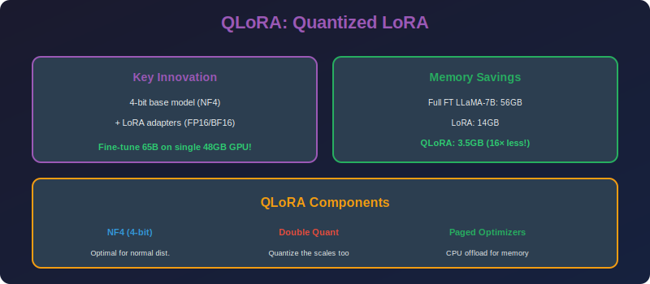

<!-- Animated Header -->
<p align="center">
  
</p>

<p align="center">
  
  
  
</p>


---

<p align="center">

</p>

# QLoRA: Quantized LoRA

## 📐 Mathematical Theory

### 1. Core Concept

**QLoRA = 4-bit Quantized Base Model + LoRA Adapters**

```math
W' = Q_{NF4}(W_0) + \frac{\alpha}{r} BA

```

where:
- $Q\_{NF4}(W\_0)$ = 4-bit NormalFloat quantized weights
- $BA$ = LoRA adaptation in FP16/BF16

---

### 2. NormalFloat Quantization (NF4)

#### 2.1 Motivation

**Observation:** Neural network weights are approximately normally distributed.

**Standard INT4:** Uniform quantization levels → suboptimal for Gaussian.

**NF4:** Quantization levels optimized for $\mathcal{N}(0, 1)$.

#### 2.2 NF4 Quantization Levels

**Construction:** Place 16 levels to minimize MSE for Gaussian:

```math
q_i = \Phi^{-1}\left(\frac{2i + 1}{32}\right), \quad i \in \{0, 1, ..., 15\}

```

where $\Phi^{-1}$ is the inverse normal CDF (quantile function).

**Result:** Levels at approximately:

```
-1.0, -0.6962, -0.5251, -0.3949, -0.2844, -0.1848, -0.0911, 0.0,
 0.0796, 0.1609, 0.2461, 0.3379, 0.4407, 0.5626, 0.7230, 1.0

```

#### 2.3 Quantization Error Comparison

| Method | MSE for Gaussian | MSE for Uniform |
|--------|-----------------|-----------------|
| **INT4** | 0.0365 | 0.0208 |
| **NF4** | 0.0208 | 0.0312 |

NF4 is optimal for normally distributed weights.

---

### 3. Double Quantization

#### 3.1 The Memory Problem

**Quantization requires scales:**

```math
W_q = \text{round}(W / s), \quad s \in \mathbb{R}

```

For block-wise quantization (e.g., 64 weights per block):

```math
\text{Scale memory} = \frac{|\theta|}{64} \times 32 \text{ bits} = 0.5 \text{ bits/weight}

```

This is significant overhead!

#### 3.2 Double Quantization Solution

**Quantize the scales themselves:**

```math
s_q = \text{round}(s / s_s)

```

where $s\_s$ is a "scale of scales" (per 256 blocks).

**Memory:**

```math
\text{Scale memory} = \frac{|\theta|}{64} \times 8 + \frac{|\theta|}{64 \times 256} \times 32
= 0.127 \text{ bits/weight}

```

**Savings:** From 0.5 to 0.127 bits per weight.

---

### 4. Paged Optimizers

#### 4.1 GPU Memory Problem

**Issue:** Optimizer states (Adam) require 8 bytes per parameter.
For 7B model: $7B \times 8 = 56$ GB just for optimizer!

#### 4.2 Paged Solution

**Use CPU RAM when GPU runs out:**
1. Keep frequently accessed states on GPU
2. Page out less-used states to CPU
3. Automatic transfer via NVIDIA unified memory

**Implementation:** Use `bitsandbytes` paged optimizers.

---

### 5. Memory Analysis

#### 5.1 QLoRA Memory Breakdown

**For 7B parameter model:**

| Component | FP16 | QLoRA (NF4) |
|-----------|------|-------------|
| Base model | 14 GB | 3.5 GB |
| LoRA params | N/A | ~50 MB |
| Activations | 2 GB | 2 GB |
| Optimizer | 28 GB | 400 MB |
| **Total** | **44 GB** | **~6 GB** |

**Result:** Can fine-tune 65B models on single 48GB GPU!

#### 5.2 Bits per Parameter

```math
\text{BPP} = 4 + 0.127 + \frac{16 \times r(d+k)}{dk}
\approx 4.13 + 0.01 = 4.14 \text{ bits/param}

```

vs. 16 bits for FP16.

---

### 6. Gradient Computation

#### 6.1 Through Quantized Weights

**Forward:**

```math
h = Q_{NF4}(W_0) \cdot x + \frac{\alpha}{r} BA \cdot x

```

**Backward:**

```math
\frac{\partial \mathcal{L}}{\partial A} = \frac{\alpha}{r} B^T \frac{\partial \mathcal{L}}{\partial h} x^T

```

**Note:** Gradients only flow through LoRA (B, A), not base weights.

#### 6.2 Dequantization for Compute

**During forward pass:**
1. Dequantize block of weights to FP16: $W\_{fp16} = s \cdot W\_q$
2. Compute matmul in FP16
3. Add LoRA contribution

**No full dequantization needed** - done block by block.

---

### 7. Implementation

```python
import torch
import torch.nn as nn
from transformers import AutoModelForCausalLM, BitsAndBytesConfig
from peft import LoraConfig, get_peft_model, TaskType

class QLoRAConfig:
    """Configuration for QLoRA training."""
    
    def __init__(
        self,
        # Quantization
        load_in_4bit: bool = True,
        bnb_4bit_quant_type: str = "nf4",  # or "fp4"
        bnb_4bit_compute_dtype: torch.dtype = torch.bfloat16,
        bnb_4bit_use_double_quant: bool = True,
        # LoRA
        r: int = 64,
        lora_alpha: int = 16,
        target_modules: list = None,
        lora_dropout: float = 0.1,
        bias: str = "none",
    ):
        self.load_in_4bit = load_in_4bit
        self.bnb_4bit_quant_type = bnb_4bit_quant_type
        self.bnb_4bit_compute_dtype = bnb_4bit_compute_dtype
        self.bnb_4bit_use_double_quant = bnb_4bit_use_double_quant
        self.r = r
        self.lora_alpha = lora_alpha
        self.target_modules = target_modules or [
            "q_proj", "k_proj", "v_proj", "o_proj",
            "gate_proj", "up_proj", "down_proj"
        ]
        self.lora_dropout = lora_dropout
        self.bias = bias

def load_qlora_model(model_name: str, config: QLoRAConfig):
    """Load a model with QLoRA configuration."""
    
    # BitsAndBytes quantization config
    bnb_config = BitsAndBytesConfig(
        load_in_4bit=config.load_in_4bit,
        bnb_4bit_quant_type=config.bnb_4bit_quant_type,
        bnb_4bit_compute_dtype=config.bnb_4bit_compute_dtype,
        bnb_4bit_use_double_quant=config.bnb_4bit_use_double_quant,
    )
    
    # Load model in 4-bit
    model = AutoModelForCausalLM.from_pretrained(
        model_name,
        quantization_config=bnb_config,
        device_map="auto",
        trust_remote_code=True,
    )
    
    # Prepare for k-bit training
    model.gradient_checkpointing_enable()
    model = prepare_model_for_kbit_training(model)
    
    # LoRA config
    lora_config = LoraConfig(
        r=config.r,
        lora_alpha=config.lora_alpha,
        target_modules=config.target_modules,
        lora_dropout=config.lora_dropout,
        bias=config.bias,
        task_type=TaskType.CAUSAL_LM,
    )
    
    # Apply LoRA
    model = get_peft_model(model, lora_config)
    
    return model

def prepare_model_for_kbit_training(model):
    """Prepare model for k-bit training."""
    
    # Cast layer norms to fp32 for stability
    for name, module in model.named_modules():
        if isinstance(module, nn.LayerNorm):
            module.to(torch.float32)
    
    # Enable gradient for input embeddings
    model.enable_input_require_grads()
    
    return model

class NF4Quantizer:
    """NormalFloat 4-bit quantization implementation."""
    
    def __init__(self):
        # Pre-compute NF4 quantization levels
        # These are the optimal levels for N(0,1)
        self.levels = torch.tensor([
            -1.0, -0.6962, -0.5251, -0.3949, -0.2844, -0.1848, -0.0911, 0.0,
            0.0796, 0.1609, 0.2461, 0.3379, 0.4407, 0.5626, 0.7230, 1.0
        ])
    
    def quantize(self, weights: torch.Tensor, block_size: int = 64):
        """
        Quantize weights to NF4.
        
        Args:
            weights: FP32/FP16 weights
            block_size: Number of weights per scale
        
        Returns:
            Tuple of (quantized weights, scales)
        """
        # Reshape to blocks
        original_shape = weights.shape
        weights_flat = weights.flatten()
        n_blocks = (weights_flat.numel() + block_size - 1) // block_size
        
        # Pad if necessary
        padded_size = n_blocks * block_size
        if padded_size > weights_flat.numel():
            weights_flat = torch.cat([
                weights_flat,
                torch.zeros(padded_size - weights_flat.numel(), device=weights.device)
            ])
        
        weights_blocked = weights_flat.view(n_blocks, block_size)
        
        # Compute scales (absmax per block)
        scales = weights_blocked.abs().max(dim=1, keepdim=True)[0]
        scales = scales.clamp(min=1e-8)
        
        # Normalize to [-1, 1]
        weights_normalized = weights_blocked / scales
        
        # Quantize to nearest NF4 level
        levels = self.levels.to(weights.device)
        distances = (weights_normalized.unsqueeze(-1) - levels.unsqueeze(0).unsqueeze(0)).abs()
        indices = distances.argmin(dim=-1)
        
        return indices.byte(), scales.squeeze(-1), original_shape
    
    def dequantize(self, indices: torch.Tensor, scales: torch.Tensor, 
                   original_shape: tuple, block_size: int = 64):
        """Dequantize NF4 weights."""
        levels = self.levels.to(indices.device)
        
        # Map indices to levels
        weights_blocked = levels[indices.long()]
        
        # Apply scales
        weights_blocked = weights_blocked * scales.unsqueeze(-1)
        
        # Reshape
        weights_flat = weights_blocked.flatten()[:torch.prod(torch.tensor(original_shape))]
        
        return weights_flat.view(original_shape)

def qlora_training_loop(model, train_dataloader, num_epochs: int = 3,
                        learning_rate: float = 2e-4):
    """QLoRA training loop with paged optimizer."""
    
    from bitsandbytes.optim import PagedAdamW8bit
    
    # Use paged 8-bit Adam
    optimizer = PagedAdamW8bit(
        model.parameters(),
        lr=learning_rate,
        betas=(0.9, 0.999),
        eps=1e-8,
        weight_decay=0.0,
    )
    
    model.train()
    
    for epoch in range(num_epochs):
        total_loss = 0
        
        for batch in train_dataloader:
            optimizer.zero_grad()
            
            outputs = model(**batch)
            loss = outputs.loss
            
            loss.backward()
            optimizer.step()
            
            total_loss += loss.item()
        
        avg_loss = total_loss / len(train_dataloader)
        print(f"Epoch {epoch+1}/{num_epochs}, Loss: {avg_loss:.4f}")
    
    return model

def print_trainable_parameters(model):
    """Print trainable parameter statistics."""
    trainable = sum(p.numel() for p in model.parameters() if p.requires_grad)
    total = sum(p.numel() for p in model.parameters())
    
    print(f"Trainable: {trainable:,} ({100*trainable/total:.2f}%)")
    print(f"Total: {total:,}")
    
    return trainable, total

```

---

### 8. Training Guidelines

| Setting | Recommendation |
|---------|----------------|
| **Rank** | 64 for most tasks, 128 for complex |
| **Alpha** | Equal to rank (α = r) |
| **Learning Rate** | 2e-4 to 3e-4 |
| **Batch Size** | As large as fits in memory |
| **Epochs** | 1-3 for most tasks |
| **Gradient Checkpointing** | Always enable |

---

### 9. Comparison with Full Fine-tuning

| Aspect | Full Fine-tune | QLoRA |
|--------|---------------|-------|
| **Memory** | 28+ GB (7B) | 6 GB (7B) |
| **Parameters** | 100% | ~0.1% |
| **Quality** | 100% | 95-99% |
| **Speed** | 1x | 2-3x faster |
| **Multi-task** | Separate models | Swap adapters |

---

## 📚 References

| Type | Title | Link |
|------|-------|------|
| 📄 | QLoRA | [arXiv](https://arxiv.org/abs/2305.14314) |
| 📄 | LLM.int8() | [arXiv](https://arxiv.org/abs/2208.07339) |
| 💻 | bitsandbytes | [GitHub](https://github.com/TimDettmers/bitsandbytes) |
| 🇨🇳 | QLoRA详解与实战 | [知乎](https://zhuanlan.zhihu.com/p/634256283) |
| 🇨🇳 | 4bit量化微调大模型 | [CSDN](https://blog.csdn.net/qq_27590277/article/details/131407541) |
| 🇨🇳 | QLoRA源码解读 | [B站](https://www.bilibili.com/video/BV1PP41127Ga) |
| 🇨🇳 | NF4量化原理 | [机器之心](https://www.jiqizhixin.com/articles/2023-05-29-3) |

---

⬅️ [Back: LoRA](../01_lora/README.md) | ➡️ [Next: Adapters](../03_adapters/README.md)

