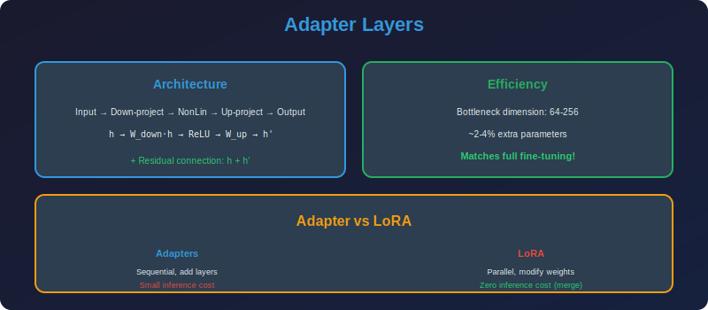

<!-- Animated Header -->
<p align="center">
  
</p>

<p align="center">
  
  
  
</p>


---

<p align="center">

</p>

# Adapter Layers

## 📐 Mathematical Theory

### 1. Bottleneck Adapters

#### 1.1 Architecture

**Adapter module (Houlsby et al., 2019):**

$$
\text{Adapter}(x) = x + f(x W_{down}) W_{up}
$$

where:
- $W\_{down} \in \mathbb{R}^{d \times r}$ (down-projection)
- $W\_{up} \in \mathbb{R}^{r \times d}$ (up-projection)
- $f$ = nonlinearity (GELU, ReLU)
- $r \ll d$ (bottleneck dimension)

#### 1.2 Placement in Transformer

**After attention:**

$$
h = \text{LayerNorm}(x + \text{Attn}(x))
h' = h + \text{Adapter}_{attn}(h)
$$

**After FFN:**

$$
z = \text{LayerNorm}(h' + \text{FFN}(h'))
z' = z + \text{Adapter}_{ffn}(z)
$$

---

### 2. Parameter Analysis

#### 2.1 Parameters per Adapter

$$
|\theta_{adapter}| = 2 \times d \times r = 2dr
$$

**With bias:** $2dr + d + r$

#### 2.2 Total for Transformer

**Per layer:** 2 adapters (after attention, after FFN)

$$
|\theta_{layer}| = 4dr
$$

**Full model (L layers):**

$$
|\theta_{total}| = 4Ldr
$$

#### 2.3 Efficiency

**For BERT-Base ($d=768$, $L=12$, $r=64$):**

$$
|\theta_{adapters}| = 4 \times 12 \times 768 \times 64 = 2.36M
$$

vs. 110M for full BERT → **2.1%** of parameters!

---

### 3. Theoretical Justification

#### 3.1 Low-Rank Adaptation

**Claim:** Adapters learn low-rank updates.

**Analysis:**

$$
\text{Adapter}(x) = x + \sigma(xW_{down})W_{up}
$$

If $\sigma$ is linear (or linearized):

$$
\text{Adapter}(x) \approx x + x W_{down} W_{up} = x(I + W_{down}W_{up})
$$

This is a rank-$r$ perturbation of identity!

#### 3.2 Connection to LoRA

**Adapter (without nonlinearity):**

$$
h' = h + h W_{down} W_{up}
$$

**LoRA:**

$$
h' = Wh + BAh
$$

Both learn low-rank adaptations, but:
- LoRA: Modifies the weight matrix
- Adapter: Adds a parallel residual

---

### 4. Variants

#### 4.1 AdapterFusion

**Learn to combine multiple task adapters:**

$$
h' = h + \sum_i \alpha_i \text{Adapter}_i(h)
$$

where $\alpha = \text{softmax}(W\_\alpha h)$ are learned attention weights.

#### 4.2 Parallel Adapters (He et al.)

**Insert parallel to attention, not after:**

$$
\text{Attn}'(x) = \text{Attn}(x) + s \cdot \text{Adapter}(x)
$$

where $s$ is a learned scaling factor.

#### 4.3 Compacter

**Use Kronecker products for more compression:**

$$
W_{down} = A_1 \otimes A_2
$$

where $A\_1 \in \mathbb{R}^{d\_1 \times r\_1}$, $A\_2 \in \mathbb{R}^{d\_2 \times r\_2}$, and $d = d\_1 d\_2$.

**Compression:** From $O(dr)$ to $O((d\_1 + d\_2)(r\_1 + r\_2))$.

---

### 5. Implementation

```python
import torch
import torch.nn as nn
import torch.nn.functional as F

class BottleneckAdapter(nn.Module):
    """Standard bottleneck adapter module."""
    
    def __init__(self, d_model: int, bottleneck_dim: int, 
                 activation: str = "gelu", init_scale: float = 1e-3):
        super().__init__()
        
        self.down_proj = nn.Linear(d_model, bottleneck_dim)
        self.up_proj = nn.Linear(bottleneck_dim, d_model)
        
        if activation == "gelu":
            self.activation = nn.GELU()
        elif activation == "relu":
            self.activation = nn.ReLU()
        else:
            self.activation = nn.Identity()
        
        # Initialize to near-identity
        nn.init.normal_(self.down_proj.weight, std=init_scale)
        nn.init.zeros_(self.down_proj.bias)
        nn.init.normal_(self.up_proj.weight, std=init_scale)
        nn.init.zeros_(self.up_proj.bias)
    
    def forward(self, x: torch.Tensor) -> torch.Tensor:
        """Apply adapter with residual connection."""
        residual = self.up_proj(self.activation(self.down_proj(x)))
        return x + residual

class ParallelAdapter(nn.Module):
    """Adapter that runs parallel to main computation."""
    
    def __init__(self, d_model: int, bottleneck_dim: int, 
                 scale_init: float = 0.1):
        super().__init__()
        
        self.adapter = BottleneckAdapter(d_model, bottleneck_dim)
        self.scale = nn.Parameter(torch.tensor(scale_init))
    
    def forward(self, x: torch.Tensor, main_output: torch.Tensor) -> torch.Tensor:
        """Combine main output with adapter output."""
        adapter_output = self.adapter(x)
        return main_output + self.scale * adapter_output

class TransformerWithAdapters(nn.Module):
    """Transformer layer with inserted adapters."""
    
    def __init__(self, d_model: int, n_heads: int, d_ff: int, 
                 adapter_dim: int = 64):
        super().__init__()
        
        # Standard transformer components
        self.self_attn = nn.MultiheadAttention(d_model, n_heads, batch_first=True)
        self.ffn = nn.Sequential(
            nn.Linear(d_model, d_ff),
            nn.GELU(),
            nn.Linear(d_ff, d_model)
        )
        self.norm1 = nn.LayerNorm(d_model)
        self.norm2 = nn.LayerNorm(d_model)
        
        # Adapters
        self.adapter_attn = BottleneckAdapter(d_model, adapter_dim)
        self.adapter_ffn = BottleneckAdapter(d_model, adapter_dim)
    
    def forward(self, x: torch.Tensor) -> torch.Tensor:

        # Self-attention with adapter
        attn_out, _ = self.self_attn(x, x, x)
        x = self.norm1(x + attn_out)
        x = self.adapter_attn(x)  # Apply adapter
        
        # FFN with adapter
        ffn_out = self.ffn(x)
        x = self.norm2(x + ffn_out)
        x = self.adapter_ffn(x)  # Apply adapter
        
        return x

class AdapterFusion(nn.Module):
    """Combine multiple task-specific adapters."""
    
    def __init__(self, d_model: int, adapter_dim: int, num_tasks: int):
        super().__init__()
        
        # Task-specific adapters
        self.adapters = nn.ModuleList([
            BottleneckAdapter(d_model, adapter_dim)
            for _ in range(num_tasks)
        ])
        
        # Fusion attention
        self.fusion_query = nn.Linear(d_model, d_model)
        self.fusion_key = nn.Linear(d_model, d_model)
    
    def forward(self, x: torch.Tensor) -> torch.Tensor:
        """Fuse adapter outputs using attention."""

        # Get all adapter outputs
        adapter_outputs = torch.stack([
            adapter(x) for adapter in self.adapters
        ], dim=-2)  # [B, L, num_tasks, D]
        
        # Compute fusion weights
        query = self.fusion_query(x).unsqueeze(-2)  # [B, L, 1, D]
        keys = self.fusion_key(adapter_outputs)  # [B, L, num_tasks, D]
        
        attn_weights = F.softmax(
            (query * keys).sum(-1) / (keys.size(-1) ** 0.5),
            dim=-1
        )  # [B, L, num_tasks]
        
        # Weighted combination
        fused = (attn_weights.unsqueeze(-1) * adapter_outputs).sum(-2)
        
        return x + fused

def add_adapters_to_model(model: nn.Module, adapter_dim: int = 64):
    """Add adapters to an existing model."""
    
    adapters = {}
    
    for name, module in model.named_modules():
        if isinstance(module, nn.MultiheadAttention):

            # Add adapter after attention
            adapters[name + '_adapter'] = BottleneckAdapter(
                module.embed_dim, adapter_dim
            )
    
    return adapters

def freeze_except_adapters(model: nn.Module):
    """Freeze all parameters except adapters."""
    for name, param in model.named_parameters():
        if 'adapter' not in name.lower():
            param.requires_grad = False
        else:
            param.requires_grad = True
    
    # Print statistics
    trainable = sum(p.numel() for p in model.parameters() if p.requires_grad)
    total = sum(p.numel() for p in model.parameters())
    print(f"Trainable: {trainable:,} / {total:,} ({100*trainable/total:.2f}%)")
```

---

### 6. Comparison with Other PEFT Methods

| Method | Where | How | Inference Overhead |
|--------|-------|-----|-------------------|
| **Adapters** | After layers | Add bottleneck | Yes (extra layers) |
| **LoRA** | In weights | Low-rank delta | No (can merge) |
| **Prefix** | Input | Learnable prefix | Yes (longer sequence) |
| **Prompt** | Input | Soft prompts | Yes (longer sequence) |

---

### 7. When to Use Adapters

| Scenario | Recommendation |
|----------|----------------|
| **Multi-task** | AdapterFusion |
| **No inference latency** | Use LoRA instead |
| **Very low memory** | Use smaller bottleneck |
| **Modular fine-tuning** | Adapters + freeze base |

---

## 📚 References

| Type | Title | Link |
|------|-------|------|
| 📄 | Adapters (Houlsby) | [arXiv](https://arxiv.org/abs/1902.00751) |
| 📄 | AdapterFusion | [arXiv](https://arxiv.org/abs/2005.00247) |
| 📄 | Compacter | [arXiv](https://arxiv.org/abs/2106.04647) |
| 📄 | Parallel Adapters | [arXiv](https://arxiv.org/abs/2110.04366) |
| 🇨🇳 | Adapter详解 | [知乎](https://zhuanlan.zhihu.com/p/441275022) |
| 🇨🇳 | AdapterFusion多任务学习 | [CSDN](https://blog.csdn.net/qq_37384436/article/details/117376639) |
| 🇨🇳 | 参数高效微调方法 | [B站](https://www.bilibili.com/video/BV1Xm4y1R7uM) |

---

⬅️ [Back: QLoRA](../02_qlora/README.md) | ➡️ [Next: Prefix Tuning](../04_prefix_tuning/README.md)

