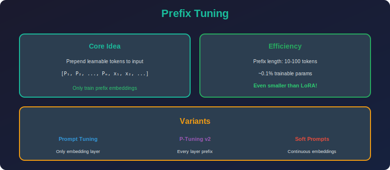

<!-- Animated Header -->
<p align="center">
  
</p>

<p align="center">
  
  
  
</p>


---

<p align="center">

</p>

# Prefix Tuning

## 📐 Mathematical Theory

### 1. Core Concept

**Prefix Tuning (Li & Liang, 2021):**
Prepend learnable "virtual tokens" to keys and values.

$$\text{Attention}(Q, [P_K; K], [P_V; V])$$

where:

- $P_K, P_V \in \mathbb{R}^{l \times d}$ are learnable prefix matrices

- $l$ = prefix length

- $K, V$ = actual keys and values from input

---

### 2. Mathematical Formulation

#### 2.1 Standard Attention

$$\text{Attn}(Q, K, V) = \text{softmax}\left(\frac{QK^T}{\sqrt{d}}\right)V$$

#### 2.2 With Prefix

**Concatenate prefix to K and V:**

$$K' = [P_K; K] \in \mathbb{R}^{(l+n) \times d}
V' = [P_V; V] \in \mathbb{R}^{(l+n) \times d}$$

**Attention becomes:**

$$\text{Attn}(Q, K', V') = \text{softmax}\left(\frac{Q[P_K; K]^T}{\sqrt{d}}\right)[P_V; V]$$

#### 2.3 Decomposition

**Attention output:**

$$O = \text{softmax}\left(\frac{[Q P_K^T | QK^T]}{\sqrt{d}}\right) \begin{bmatrix} P_V \\ V \end{bmatrix}
= \alpha \cdot \text{softmax}\left(\frac{QP_K^T}{\sqrt{d}}\right)P_V + (1-\alpha) \cdot \text{softmax}\left(\frac{QK^T}{\sqrt{d}}\right)V$$

The prefix "steers" attention by providing additional context.

---

### 3. Parameter Analysis

#### 3.1 Parameters per Layer

$$|\theta_{prefix}^{layer}| = 2 \times l \times d$$

(One for keys, one for values)

#### 3.2 Total Parameters

**For L-layer transformer:**

$$|\theta_{prefix}| = 2 \times L \times l \times d$$

**Example (GPT-2 Medium, $L=24$, $d=1024$, $l=100$):**

$$|\theta_{prefix}| = 2 \times 24 \times 100 \times 1024 = 4.9M$$

vs. 345M for full model → **1.4%**

---

### 4. Reparameterization

#### 4.1 The Optimization Problem

**Direct optimization of $P_K, P_V$ is unstable:**
- High-dimensional

- Lies in unusual parameter space

#### 4.2 MLP Reparameterization

**Use a smaller embedding + MLP:**

$$P_K = \text{MLP}(E_K)
P_V = \text{MLP}(E_V)$$

where:

- $E_K, E_V \in \mathbb{R}^{l \times d'}$ with $d' < d$

- MLP: $\mathbb{R}^{d'} \to \mathbb{R}^d$

**Benefits:**

1. Lower-dimensional optimization

2. More stable training

3. Regularization effect

#### 4.3 After Training

**Discard MLP, keep only $P_K, P_V$:**
- Compute final prefix values

- Use directly for inference

- No MLP overhead

---

### 5. Prompt Tuning (Simplified Version)

#### 5.1 Soft Prompts

**Prepend to input embeddings only (not K, V):**

$$X' = [P; X]$$

where $P \in \mathbb{R}^{l \times d}$ is learned.

**Simpler but less expressive:**
- Only affects input layer

- Prefix tuning affects all layers

#### 5.2 Comparison

| Method | Where Added | Parameters | Expressiveness |
|--------|------------|------------|----------------|
| **Prefix Tuning** | K, V (all layers) | $2Lld$ | High |
| **Prompt Tuning** | Input only | $ld$ | Medium |
| **P-Tuning v2** | All layers (like prefix) | $2Lld$ | High |

---

### 6. Theoretical Analysis

#### 6.1 Expressiveness

**Theorem (informal):** Prefix tuning can express any continuous function in a neighborhood of the original model output.

**Intuition:** The prefix provides $l \times d$ degrees of freedom per layer, which can steer the attention in arbitrary directions.

#### 6.2 Connection to Prompting

**Hard prompt:** Fixed text prepended to input

$$\text{Input: } \text{"Translate to French: "} + \text{sentence}$$

**Soft prompt:** Learned embeddings

$$\text{Input: } P + \text{Embed(sentence)}$$

Soft prompts can express things hard prompts cannot.

---

### 7. Implementation

```python
import torch
import torch.nn as nn
import torch.nn.functional as F

class PrefixTuning(nn.Module):
    """Prefix tuning for transformer models."""
    
    def __init__(self, num_layers: int, d_model: int, prefix_length: int,
                 n_heads: int, hidden_dim: int = 512):
        super().__init__()
        
        self.num_layers = num_layers
        self.prefix_length = prefix_length
        self.d_model = d_model
        self.n_heads = n_heads
        self.d_head = d_model // n_heads
        
        # Embedding for prefix
        self.prefix_embedding = nn.Embedding(prefix_length, hidden_dim)
        
        # MLP to project to prefix keys and values
        self.prefix_mlp = nn.Sequential(
            nn.Linear(hidden_dim, hidden_dim),
            nn.Tanh(),
            nn.Linear(hidden_dim, 2 * num_layers * d_model)  # K and V for all layers
        )
    
    def forward(self, batch_size: int):
        """
        Generate prefix keys and values for all layers.
        
        Returns:
            Tuple of (prefix_keys, prefix_values)
            Each: [num_layers, batch_size, n_heads, prefix_length, d_head]
        """
        # Get prefix indices
        prefix_indices = torch.arange(self.prefix_length, device=self.prefix_embedding.weight.device)
        
        # Embed and project
        prefix_emb = self.prefix_embedding(prefix_indices)  # [l, hidden]
        prefix_proj = self.prefix_mlp(prefix_emb)  # [l, 2 * L * d]
        
        # Reshape
        prefix_proj = prefix_proj.view(
            self.prefix_length,
            2,  # K and V
            self.num_layers,
            self.n_heads,
            self.d_head
        )
        
        # Expand for batch
        prefix_proj = prefix_proj.unsqueeze(2).expand(-1, -1, batch_size, -1, -1, -1)
        
        # Split into keys and values
        prefix_keys = prefix_proj[:, 0]  # [l, B, L, H, d_h]
        prefix_values = prefix_proj[:, 1]  # [l, B, L, H, d_h]
        
        # Rearrange to [L, B, H, l, d_h]
        prefix_keys = prefix_keys.permute(2, 1, 3, 0, 4)
        prefix_values = prefix_values.permute(2, 1, 3, 0, 4)
        
        return prefix_keys, prefix_values

class PrefixAttention(nn.Module):
    """Multi-head attention with prefix."""
    
    def __init__(self, d_model: int, n_heads: int, dropout: float = 0.1):
        super().__init__()
        
        self.d_model = d_model
        self.n_heads = n_heads
        self.d_head = d_model // n_heads
        
        self.q_proj = nn.Linear(d_model, d_model)
        self.k_proj = nn.Linear(d_model, d_model)
        self.v_proj = nn.Linear(d_model, d_model)
        self.out_proj = nn.Linear(d_model, d_model)
        
        self.dropout = nn.Dropout(dropout)
    
    def forward(self, x: torch.Tensor, 
                prefix_k: torch.Tensor = None,
                prefix_v: torch.Tensor = None,
                attention_mask: torch.Tensor = None):
        """
        Args:
            x: [B, L, D]
            prefix_k: [B, H, l, d_h] - prefix keys
            prefix_v: [B, H, l, d_h] - prefix values
        """
        B, L, D = x.shape
        
        # Project
        Q = self.q_proj(x).view(B, L, self.n_heads, self.d_head).transpose(1, 2)
        K = self.k_proj(x).view(B, L, self.n_heads, self.d_head).transpose(1, 2)
        V = self.v_proj(x).view(B, L, self.n_heads, self.d_head).transpose(1, 2)
        # Q, K, V: [B, H, L, d_h]
        
        # Concatenate prefix
        if prefix_k is not None and prefix_v is not None:
            K = torch.cat([prefix_k, K], dim=2)  # [B, H, l+L, d_h]
            V = torch.cat([prefix_v, V], dim=2)
        
        # Attention
        scores = torch.matmul(Q, K.transpose(-2, -1)) / (self.d_head ** 0.5)
        
        if attention_mask is not None:
            # Extend mask for prefix (prefix is always attended to)
            if prefix_k is not None:
                prefix_len = prefix_k.size(2)
                prefix_mask = torch.ones(B, 1, 1, prefix_len, device=x.device)
                attention_mask = torch.cat([prefix_mask, attention_mask], dim=-1)
            scores = scores.masked_fill(attention_mask == 0, float('-inf'))
        
        attn_weights = F.softmax(scores, dim=-1)
        attn_weights = self.dropout(attn_weights)
        
        output = torch.matmul(attn_weights, V)  # [B, H, L, d_h]
        output = output.transpose(1, 2).contiguous().view(B, L, D)
        output = self.out_proj(output)
        
        return output

class PromptTuning(nn.Module):
    """Simple prompt tuning (soft prompts at input only)."""
    
    def __init__(self, num_tokens: int, d_model: int, init_from_vocab: bool = True):
        super().__init__()
        
        self.num_tokens = num_tokens
        self.prompt_embeddings = nn.Parameter(torch.randn(num_tokens, d_model))
        
        if init_from_vocab:
            # Would initialize from actual vocabulary embeddings
            nn.init.normal_(self.prompt_embeddings, std=0.02)
    
    def forward(self, input_embeddings: torch.Tensor):
        """
        Prepend soft prompts to input embeddings.
        
        Args:
            input_embeddings: [B, L, D]
        
        Returns:
            [B, L + num_tokens, D]
        """
        B = input_embeddings.size(0)
        
        # Expand prompts for batch
        prompts = self.prompt_embeddings.unsqueeze(0).expand(B, -1, -1)
        
        # Concatenate
        return torch.cat([prompts, input_embeddings], dim=1)

class PTuningV2(nn.Module):
    """P-Tuning v2: Deep prompt tuning."""
    
    def __init__(self, num_layers: int, d_model: int, prefix_length: int):
        super().__init__()
        
        self.num_layers = num_layers
        self.prefix_length = prefix_length
        
        # Separate prefix for each layer
        self.prefix_embeddings = nn.ParameterList([
            nn.Parameter(torch.randn(prefix_length, d_model))
            for _ in range(num_layers)
        ])
        
        # Initialize
        for emb in self.prefix_embeddings:
            nn.init.normal_(emb, std=0.02)
    
    def get_prefix(self, layer_idx: int, batch_size: int):
        """Get prefix for a specific layer."""
        prefix = self.prefix_embeddings[layer_idx]
        return prefix.unsqueeze(0).expand(batch_size, -1, -1)

def count_prefix_parameters(model: PrefixTuning):
    """Count prefix-related parameters."""
    total = sum(p.numel() for p in model.parameters() if p.requires_grad)
    return total

# Example usage
if __name__ == "__main__":
    # Configuration
    num_layers = 12
    d_model = 768
    n_heads = 12
    prefix_length = 20
    batch_size = 4
    seq_length = 128
    
    # Create prefix tuning module
    prefix_module = PrefixTuning(
        num_layers=num_layers,
        d_model=d_model,
        prefix_length=prefix_length,
        n_heads=n_heads
    )
    
    # Generate prefixes
    prefix_k, prefix_v = prefix_module(batch_size)
    print(f"Prefix K shape: {prefix_k.shape}")  # [L, B, H, l, d_h]
    print(f"Prefix V shape: {prefix_v.shape}")
    
    # Count parameters
    n_params = count_prefix_parameters(prefix_module)
    print(f"Prefix parameters: {n_params:,}")
    
    # Compare to full model
    full_params = num_layers * (4 * d_model * d_model)  # Rough estimate
    print(f"Prefix / Full: {100 * n_params / full_params:.2f}%")

```

---

### 8. Comparison with Prompt Tuning

| Aspect | Prefix Tuning | Prompt Tuning |
|--------|---------------|---------------|
| **Applied to** | K, V at all layers | Input embeddings |
| **Parameters** | $2Lld$ | $ld$ |
| **Performance** | Higher | Lower |
| **Complexity** | Higher | Lower |

---

## 📚 References

| Type | Title | Link |
|------|-------|------|
| 📄 | Prefix-Tuning | [arXiv](https://arxiv.org/abs/2101.00190) |
| 📄 | Prompt Tuning | [arXiv](https://arxiv.org/abs/2104.08691) |
| 📄 | P-Tuning v2 | [arXiv](https://arxiv.org/abs/2110.07602) |
| 🇨🇳 | Prefix Tuning详解 | [知乎](https://zhuanlan.zhihu.com/p/386073664) |
| 🇨🇳 | P-Tuning系列解读 | [CSDN](https://blog.csdn.net/qq_27590277/article/details/128286952) |
| 🇨🇳 | Prompt微调方法 | [B站](https://www.bilibili.com/video/BV1V84y1u7Bv) |
| 🇨🇳 | 软提示学习综述 | [机器之心](https://www.jiqizhixin.com/articles/2022-03-28-2) |

---

⬅️ [Back: Adapters](../03_adapters/README.md) | ➡️ [Back to PEFT](../README.md)

