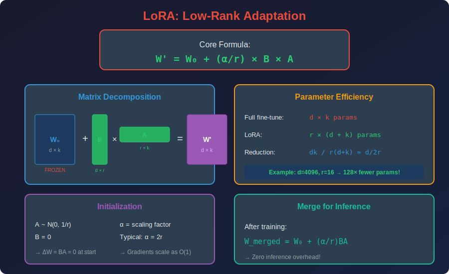

<!-- Animated Header -->
<p align="center">
  
</p>

<p align="center">
  
  
  
</p>


---

## 📐 Mathematical Foundations

### 1. LoRA: Low-Rank Adaptation

**Core Formulation:**

```math
W' = W_0 + \Delta W = W_0 + \frac{\alpha}{r}BA

```

Where:
- $W\_0 \in \mathbb{R}^{d \times k}$: Pretrained weights (frozen)
- $B \in \mathbb{R}^{d \times r}$: Down-projection (trainable)
- $A \in \mathbb{R}^{r \times k}$: Up-projection (trainable)
- $\alpha$: Scaling factor
- $r$: Rank ($r \ll \min(d, k)$)

**Parameter Efficiency:**

```math
\frac{|\theta_{LoRA}|}{|\theta_{full}|} = \frac{r(d+k)}{dk} = \frac{r}{k} + \frac{r}{d}

```

For $d = k = 4096$, $r = 16$: $\frac{32768}{16.8M} = 0.2\%$

**Initialization (Critical for stability):**
- $A \sim \mathcal{N}(0, \sigma^2)$ with $\sigma = 1/\sqrt{r}$
- $B = 0$

This ensures $\Delta W = BA = 0$ at initialization.

### 2. Gradient Analysis

**Forward Pass:**

```math
h = W_0 x + \frac{\alpha}{r}BAx

```

**Gradient w.r.t. $A$:**

```math
\frac{\partial \mathcal{L}}{\partial A} = \frac{\alpha}{r} B^T \frac{\partial \mathcal{L}}{\partial h} x^T

```

**Gradient w.r.t. $B$:**

```math
\frac{\partial \mathcal{L}}{\partial B} = \frac{\alpha}{r} \frac{\partial \mathcal{L}}{\partial h} (Ax)^T

```

**Scaling Analysis:**
The $\alpha/r$ factor ensures gradients are independent of rank choice, enabling hyperparameter transfer.

### 3. QLoRA: 4-bit LoRA

**Quantization:**

```math
W_0 \to W_0^{NF4} + \text{double quantization}

```

**NF4 (NormalFloat4):**
Quantization levels optimized for normally-distributed weights:

```math
q_i = \Phi^{-1}\left(\frac{2i + 1}{32}\right), \quad i \in \{0, ..., 15\}

```

Where $\Phi^{-1}$ is inverse normal CDF.

**Memory Savings:**

```math
\text{Base model: } P \times 0.5 \text{ bytes (NF4)}
\text{LoRA adapters: } 2rd \times 2 \text{ bytes (FP16)}
\text{Total: } 0.5P + 4rd

```

For 7B model: $3.5\text{GB} + 0.5\text{MB} \approx 3.5\text{GB}$ (vs 14GB FP16)

### 4. Prefix Tuning

**Prepend learnable "virtual tokens":**

```math
\text{Attention}(Q, [P_k; K], [P_v; V])

```

Where $P\_k, P\_v \in \mathbb{R}^{l \times d}$ are learnable prefix matrices.

**Parameter Count:**

```math

|\theta_{prefix}| = 2 \times l \times d \times L

```

Where $l$ = prefix length, $L$ = number of layers.

**Reparameterization (for stability):**

```math
P = \text{MLP}(E)

```

Where $E \in \mathbb{R}^{l \times d'}$ is a smaller embedding.

### 5. Adapter Layers

**Bottleneck Architecture:**

```math
h' = h + f(h W_{down}) W_{up}

```

Where:
- $W\_{down} \in \mathbb{R}^{d \times r}$
- $W\_{up} \in \mathbb{R}^{r \times d}$
- $f$ = nonlinearity (GELU)
- $r$ = bottleneck dimension

**Placement:** After attention and after FFN in each layer.

**Parameter Count:**

```math
|\theta_{adapter}| = L \times 2 \times (2dr + r)

```

### 6. IA³ (Infused Adapter by Inhibiting and Amplifying)

**Simplest Form:**

```math
h' = l \odot h

```

Where $l \in \mathbb{R}^d$ is a learned rescaling vector.

**Applied to:**
- Keys: $K' = l\_K \odot K$
- Values: $V' = l\_V \odot V$
- FFN: $h' = l\_{ff} \odot f(hW\_1)$

**Parameters:** Only $3d$ per layer (extremely efficient!)

### 7. Theoretical Justification

**Intrinsic Dimensionality (Aghajanyan et al., 2021):**

Fine-tuning has low intrinsic dimension $d\_{int}$:

```math
\text{Acc}(\theta_0 + P_{d_{int}} \delta) \approx \text{Acc}(\theta_T)

```

Where $P\_{d\_{int}}$ projects to random $d\_{int}$-dimensional subspace.

For RoBERTa: $d\_{int} \approx 896$ while $|\theta| = 355M$

**This explains why low-rank works!**

---

## 🎯 Why PEFT Matters

```
Full Fine-Tuning LLaMA-7B:
+-- Parameters to train: 7,000,000,000
+-- GPU memory: 28+ GB (optimizer states)
+-- Storage per task: 14 GB
+-- Cost: High

PEFT (LoRA) Fine-Tuning:
+-- Parameters to train: 4,000,000 (0.06%)
+-- GPU memory: 8 GB (frozen base)
+-- Storage per task: 16 MB
+-- Cost: Low

```

---

## 📊 PEFT Methods Comparison

| Method | Trainable % | Quality | Memory | Inference |
|--------|-------------|---------|--------|-----------|
| **Full Fine-Tune** | 100% | Best | High | Normal |
| **LoRA** | 0.1% | ~Full | Low | Mergeable |
| **QLoRA** | 0.1% | ~Full | Very Low | Quantized |
| **Adapters** | 1-5% | Good | Medium | Overhead |
| **Prefix Tuning** | 0.1% | Good | Low | Overhead |
| **IA³** | 0.01% | Good | Lowest | Overhead |

---

## 💻 Complete Code Example

```python
import torch
import torch.nn as nn
from peft import LoraConfig, get_peft_model, TaskType
from transformers import AutoModelForCausalLM, BitsAndBytesConfig

# ========== QLoRA Setup ==========
# 4-bit quantization config
bnb_config = BitsAndBytesConfig(
    load_in_4bit=True,
    bnb_4bit_quant_type="nf4",
    bnb_4bit_compute_dtype=torch.bfloat16,
    bnb_4bit_use_double_quant=True,  # Double quantization
)

# Load base model in 4-bit
model = AutoModelForCausalLM.from_pretrained(
    "meta-llama/Llama-2-7b-hf",
    quantization_config=bnb_config,
    device_map="auto"
)

# Configure LoRA
lora_config = LoraConfig(
    task_type=TaskType.CAUSAL_LM,
    r=16,                    # Rank
    lora_alpha=32,           # α = 2r is common
    lora_dropout=0.1,
    target_modules=[
        "q_proj", "k_proj", "v_proj", "o_proj",  # Attention
        "gate_proj", "up_proj", "down_proj"       # FFN
    ],
    bias="none",
)

# Apply LoRA
model = get_peft_model(model, lora_config)
model.print_trainable_parameters()
# trainable params: 4,194,304 || all params: 6,742,609,920 || trainable%: 0.06%

# ========== Manual LoRA Implementation ==========
class LoRALinear(nn.Module):
    """LoRA-enhanced linear layer"""
    
    def __init__(self, in_features, out_features, r=16, alpha=32):
        super().__init__()
        
        self.in_features = in_features
        self.out_features = out_features
        self.r = r
        self.alpha = alpha
        self.scaling = alpha / r
        
        # Frozen base weight
        self.weight = nn.Parameter(torch.empty(out_features, in_features))
        nn.init.kaiming_uniform_(self.weight)
        self.weight.requires_grad = False
        
        # LoRA matrices
        self.lora_A = nn.Parameter(torch.randn(r, in_features) / r**0.5)
        self.lora_B = nn.Parameter(torch.zeros(out_features, r))
    
    def forward(self, x):
        # Base computation (frozen)
        base_out = x @ self.weight.T
        
        # LoRA computation
        lora_out = (x @ self.lora_A.T @ self.lora_B.T) * self.scaling
        
        return base_out + lora_out
    
    def merge(self):
        """Merge LoRA into base weight for inference"""
        self.weight.data += self.scaling * (self.lora_B @ self.lora_A)
        self.lora_A.data.zero_()
        self.lora_B.data.zero_()

# ========== Training Loop ==========
from torch.optim import AdamW

optimizer = AdamW(model.parameters(), lr=2e-4)

for batch in train_loader:
    outputs = model(**batch)
    loss = outputs.loss
    loss.backward()
    optimizer.step()
    optimizer.zero_grad()

# Save only LoRA weights (16MB vs 14GB!)
model.save_pretrained("my-lora-adapter")

```

---

## 📐 Mathematical Visualization



---

## 🔗 Where PEFT Is Used

| Application | Method | Details |
|-------------|--------|---------|
| **LLM Fine-tuning** | QLoRA | Standard for all LLM adaptation |
| **Stable Diffusion** | LoRA | Custom styles/characters |
| **Multi-task** | Adapters | One base, many adapters |
| **Mobile** | IA³ | Minimal overhead |
| **Production** | LoRA + Merge | No inference cost |

---

## 📚 References & Resources

### 📄 Key Papers

| Paper | Authors | Year | Key Contribution |
|-------|---------|------|------------------|
| [LoRA](https://arxiv.org/abs/2106.09685) | Hu et al. | 2021 | Low-rank adaptation |
| [QLoRA](https://arxiv.org/abs/2305.14314) | Dettmers et al. | 2023 | 4-bit + LoRA |
| [Adapters](https://arxiv.org/abs/1902.00751) | Houlsby et al. | 2019 | Bottleneck adapters |
| [Prefix Tuning](https://arxiv.org/abs/2101.00190) | Li & Liang | 2021 | Learnable prefixes |
| [IA³](https://arxiv.org/abs/2205.05638) | Liu et al. | 2022 | Rescaling vectors |
| [Intrinsic Dim](https://arxiv.org/abs/2012.13255) | Aghajanyan et al. | 2021 | Theoretical basis |

### 🛠️ Tools

| Tool | Description | Link |
|------|-------------|------|
| PEFT | HuggingFace library | [GitHub](https://github.com/huggingface/peft) |
| LLaMA-Factory | Training toolkit | [GitHub](https://github.com/hiyouga/LLaMA-Factory) |
| Axolotl | Fine-tuning framework | [GitHub](https://github.com/OpenAccess-AI-Collective/axolotl) |

---

## 📁 Sub-Topics

| # | Topic | Description | Link |
|:-:|-------|-------------|:----:|
| 1 | **LoRA** | Low-rank adaptation, scaling analysis | [📁 Open](./01_lora/README.md) |
| 2 | **QLoRA** | 4-bit NF4 + LoRA, memory optimization | [📁 Open](./02_qlora/README.md) |
| 3 | **Adapters** | Bottleneck adapters, AdapterFusion | [📁 Open](./03_adapters/README.md) |
| 4 | **Prefix Tuning** | Soft prompts, P-Tuning v2 | [📁 Open](./04_prefix_tuning/README.md) |

---

⬅️ [Back: Sparsity](../07_sparsity/README.md) | ➡️ [Next: Efficient Architectures](../09_efficient_architectures/README.md)

---


<p align="center">
  
</p>
