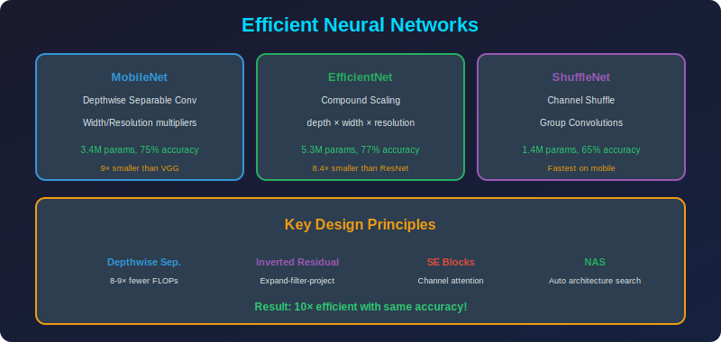

<!-- Animated Header -->
<p align="center">
  
</p>

<p align="center">
  
  
  
</p>


---

<p align="center">

</p>

## 📐 Mathematical Foundations

### 1. Depthwise Separable Convolution

**Standard Convolution Analysis:**

```math
Y = W * X
W \in \mathbb{R}^{C_{out} \times C_{in} \times K \times K}

```

**Parameters:** $C_{out} \times C_{in} \times K^2$
**FLOPs:** $2 \times C_{out} \times C_{in} \times K^2 \times H_{out} \times W_{out}$

**Depthwise Separable Decomposition:**

*Depthwise (spatial filtering):*

```math
H_c = W_c^{dw} * X_c, \quad c = 1, ..., C_{in}
W^{dw} \in \mathbb{R}^{C_{in} \times 1 \times K \times K}

```

*Pointwise (channel mixing):*

```math
Y = W^{pw} \cdot H
W^{pw} \in \mathbb{R}^{C_{out} \times C_{in} \times 1 \times 1}

```

**Total Parameters:** $C_{in} \times K^2 + C_{out} \times C_{in}$

**Reduction Factor:**

```math
\frac{C_{out} \times C_{in} \times K^2}{C_{in} \times K^2 + C_{out} \times C_{in}} = \frac{C_{out} \times K^2}{K^2 + C_{out}}

```

For $K=3$, $C_{out}=256$: $\frac{256 \times 9}{9 + 256} = 8.7\times$

### 2. Inverted Residual (MobileNetV2)

**Architecture:**

```math
Y = X + \text{Proj}(\text{DW}(\text{Expand}(X)))

```

**Expansion Phase:**

```math
H_1 = \text{ReLU6}(\text{BN}(\text{Conv}_{1\times1}(X)))
H_1 \in \mathbb{R}^{B \times (t \cdot C) \times H \times W}

```

**Depthwise Phase:**

```math
H_2 = \text{ReLU6}(\text{BN}(\text{DWConv}_{K\times K}(H_1)))

```

**Projection Phase (Linear):**

```math
Y = \text{BN}(\text{Conv}_{1\times1}(H_2))
Y \in \mathbb{R}^{B \times C' \times H \times W}

```

**Why Linear in Projection?**
Nonlinearity destroys information in low-dimensional space. Linear projection preserves manifold structure.

### 3. EfficientNet Compound Scaling

**Base Model (B0):**
- Depth coefficient: $\alpha$

- Width coefficient: $\beta$

- Resolution coefficient: $\gamma$

**Scaling Law:**

```math
d = \alpha^\phi, \quad w = \beta^\phi, \quad r = \gamma^\phi

```

**FLOPS Constraint:**

```math
\text{FLOPS} \propto d \cdot w^2 \cdot r^2
\alpha \cdot \beta^2 \cdot \gamma^2 \approx 2

```

**Grid Search Results:**

```math
\alpha = 1.2, \quad \beta = 1.1, \quad \gamma = 1.15

```

**Scaling Examples:**

| Model | $\phi$ | Depth | Width | Resolution | FLOPS |
|-------|--------|-------|-------|------------|-------|
| B0 | 0 | 1.0× | 1.0× | 224 | 0.39B |
| B1 | 1 | 1.2× | 1.1× | 240 | 0.70B |
| B4 | 4 | 2.1× | 1.5× | 380 | 4.2B |
| B7 | 7 | 3.1× | 2.0× | 600 | 37B |

### 4. Squeeze-and-Excitation (SE) Blocks

**Channel Attention:**

```math
z = F_{sq}(U) = \frac{1}{H \times W}\sum_{i,j} u_{ij}
s = F_{ex}(z) = \sigma(W_2 \cdot \delta(W_1 \cdot z))
\tilde{X}_c = s_c \cdot U_c

```

Where:

- $W_1 \in \mathbb{R}^{C/r \times C}$ (reduction)

- $W_2 \in \mathbb{R}^{C \times C/r}$ (expansion)

- $r$ = reduction ratio (typically 16)

**Parameters Added:** $\frac{2C^2}{r}$ (negligible)

### 5. Neural Architecture Search (NAS)

**Search Space:**
- Kernel sizes: $\{3, 5, 7\}$

- Expansion ratios: $\{1, 3, 6\}$

- SE ratio: $\{0, 0.25\}$

- Number of layers per stage

**Objective:**

```math
\max_{\alpha} \text{Accuracy}(N(\alpha)) \quad \text{s.t.} \quad \text{Latency}(N(\alpha)) \leq T

```

**MnasNet/EfficientNet used reinforcement learning with:**

```math
R(\alpha) = \text{Acc}(\alpha) \times \left(\frac{\text{Latency}(\alpha)}{T}\right)^w

```

---

## 🎯 MobileNet: Depthwise Separable Conv

```
Standard Convolution:
Input: H×W×C_in → Output: H×W×C_out
Params: K² × C_in × C_out
FLOPs: H × W × K² × C_in × C_out

Depthwise Separable (MobileNet):

1. Depthwise: H×W×C_in → H×W×C_in (one filter per channel)
   Params: K² × C_in

2. Pointwise: H×W×C_in → H×W×C_out (1×1 conv)
   Params: C_in × C_out

Total: K² × C_in + C_in × C_out
Savings: ~8-9× fewer params and FLOPs!

```

---

## 💻 Code Examples

```python
import torch
import torch.nn as nn

# ========== Depthwise Separable Convolution ==========
class DepthwiseSeparableConv(nn.Module):
    """MobileNet-style depthwise separable convolution"""
    
    def __init__(self, in_channels, out_channels, kernel_size=3, stride=1):
        super().__init__()
        padding = kernel_size // 2
        
        # Depthwise: spatial convolution per channel
        self.depthwise = nn.Conv2d(
            in_channels, in_channels, kernel_size,
            stride=stride, padding=padding, groups=in_channels, bias=False
        )
        self.bn1 = nn.BatchNorm2d(in_channels)
        
        # Pointwise: 1×1 to mix channels
        self.pointwise = nn.Conv2d(in_channels, out_channels, 1, bias=False)
        self.bn2 = nn.BatchNorm2d(out_channels)
        
        self.act = nn.ReLU6(inplace=True)
    
    def forward(self, x):
        x = self.act(self.bn1(self.depthwise(x)))
        x = self.act(self.bn2(self.pointwise(x)))
        return x

# ========== Inverted Residual Block (MobileNetV2) ==========
class InvertedResidual(nn.Module):
    """MobileNetV2 inverted residual with linear bottleneck"""
    
    def __init__(self, in_channels, out_channels, stride, expand_ratio):
        super().__init__()
        self.stride = stride
        self.use_residual = stride == 1 and in_channels == out_channels
        
        hidden_dim = in_channels * expand_ratio
        
        layers = []
        
        # Expansion (if needed)
        if expand_ratio != 1:
            layers.extend([
                nn.Conv2d(in_channels, hidden_dim, 1, bias=False),
                nn.BatchNorm2d(hidden_dim),
                nn.ReLU6(inplace=True)
            ])
        
        # Depthwise
        layers.extend([
            nn.Conv2d(hidden_dim, hidden_dim, 3, stride=stride, 
                     padding=1, groups=hidden_dim, bias=False),
            nn.BatchNorm2d(hidden_dim),
            nn.ReLU6(inplace=True)
        ])
        
        # Projection (linear - no activation!)
        layers.extend([
            nn.Conv2d(hidden_dim, out_channels, 1, bias=False),
            nn.BatchNorm2d(out_channels)
        ])
        
        self.conv = nn.Sequential(*layers)
    
    def forward(self, x):
        if self.use_residual:
            return x + self.conv(x)
        return self.conv(x)

# ========== SE Block ==========
class SEBlock(nn.Module):
    """Squeeze-and-Excitation block"""
    
    def __init__(self, channels, reduction=16):
        super().__init__()
        self.avg_pool = nn.AdaptiveAvgPool2d(1)
        self.fc = nn.Sequential(
            nn.Linear(channels, channels // reduction, bias=False),
            nn.ReLU(inplace=True),
            nn.Linear(channels // reduction, channels, bias=False),
            nn.Sigmoid()
        )
    
    def forward(self, x):
        b, c, _, _ = x.shape
        y = self.avg_pool(x).view(b, c)
        y = self.fc(y).view(b, c, 1, 1)
        return x * y.expand_as(x)

# ========== Parameter Count Comparison ==========
def count_params(model):
    return sum(p.numel() for p in model.parameters())

# Standard conv: 3×3, 256→256
standard = nn.Conv2d(256, 256, 3, padding=1)
print(f"Standard Conv: {count_params(standard):,} params")

# Depthwise separable
dw_sep = DepthwiseSeparableConv(256, 256, 3)
print(f"DW Separable: {count_params(dw_sep):,} params")
print(f"Reduction: {count_params(standard) / count_params(dw_sep):.1f}×")

```

---

## 📊 Comparison

| Model | Params | Top-1 Acc | FLOPs | Latency |
|-------|--------|-----------|-------|---------|
| ResNet-50 | 25M | 76.0% | 4B | 1× |
| MobileNetV2 | 3.4M | 72.0% | 300M | 6× faster |
| MobileNetV3 | 5.4M | 75.2% | 219M | 7× faster |
| EfficientNet-B0 | 5.3M | 77.3% | 390M | 5× faster |

---

## 📚 References

| Type | Title | Link |
|------|-------|------|
| 📄 | MobileNetV1 | [arXiv](https://arxiv.org/abs/1704.04861) |
| 📄 | MobileNetV2 | [arXiv](https://arxiv.org/abs/1801.04381) |
| 📄 | MobileNetV3 | [arXiv](https://arxiv.org/abs/1905.02244) |
| 📄 | EfficientNet | [arXiv](https://arxiv.org/abs/1905.11946) |
| 📄 | SE-Networks | [arXiv](https://arxiv.org/abs/1709.01507) |

---

⬅️ [Back: Efficient Architectures](../README.md) | ➡️ [Next: Efficient Transformers](../02_efficient_transformers/README.md)

---


<p align="center">
  
</p>
