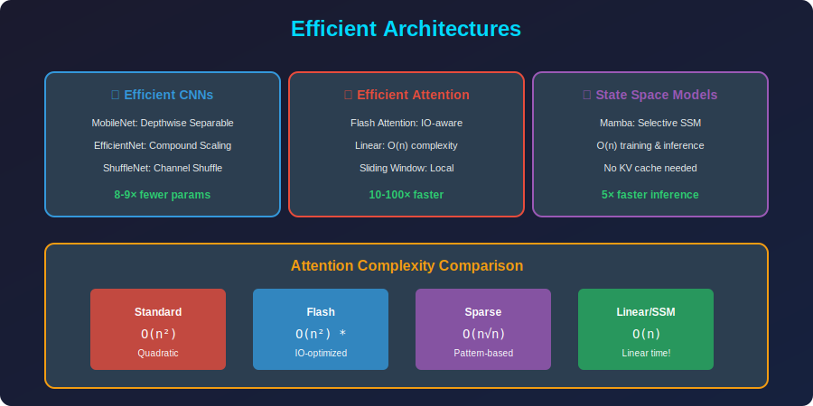

<!-- Animated Header -->
<p align="center">
  
</p>

<p align="center">
  
  
  
</p>


---

<p align="center">

</p>

## 📐 Mathematical Foundations

### 1. Depthwise Separable Convolution

**Standard Convolution:**

```math
Y = W * X, \quad W \in \mathbb{R}^{C_{out} \times C_{in} \times K \times K}

```

**Computation:** $O(K^2 \cdot C\_{in} \cdot C\_{out} \cdot H \cdot W)$

**Depthwise Separable (MobileNet):**

*Step 1 - Depthwise:*

```math
H_c = W_c^{dw} * X_c, \quad W^{dw} \in \mathbb{R}^{C_{in} \times 1 \times K \times K}

```

*Step 2 - Pointwise:*

```math
Y = W^{pw} \cdot H, \quad W^{pw} \in \mathbb{R}^{C_{out} \times C_{in} \times 1 \times 1}

```

**Computation:** $O(K^2 \cdot C\_{in} \cdot H \cdot W + C\_{in} \cdot C\_{out} \cdot H \cdot W)$

**Reduction Ratio:**

```math
\frac{K^2 C_{in} C_{out}}{K^2 C_{in} + C_{in} C_{out}} = \frac{1}{1/C_{out} + 1/K^2}

```

For $K=3$, $C\_{out}=256$: Reduction ≈ $8-9\times$

### 2. Inverted Residual Block (MobileNetV2)

**Standard Residual:** Wide → Narrow → Wide

**Inverted Residual:** Narrow → Wide → Narrow

```math
Y = X + \text{Conv}_{1\times1}^{proj}(\text{DWConv}(\text{Conv}_{1\times1}^{expand}(X)))

```

**Expansion Factor $t$:**
- Input: $d$ dimensions
- Expanded: $td$ dimensions
- Depthwise: $td$ dimensions
- Output: $d'$ dimensions

**Parameters:** $d \cdot td + K^2 \cdot td + td \cdot d' \approx td(d + K^2 + d')$

### 3. Linear Attention

**Standard Attention:**

```math
\text{Attention}(Q,K,V) = \text{softmax}\left(\frac{QK^T}{\sqrt{d}}\right)V
\text{Complexity: } O(n^2 d)

```

**Linear Attention:**

```math
\text{Attention}(Q,K,V) = \phi(Q)(\phi(K)^T V)

```

Where $\phi: \mathbb{R}^d \to \mathbb{R}^m$ is a feature map.

**Key Insight:** Compute $(\phi(K)^T V)$ first!

```math
\phi(K)^T V \in \mathbb{R}^{m \times d}, \quad \text{Cost: } O(nmd)
\phi(Q) \cdot (\phi(K)^T V) \in \mathbb{R}^{n \times d}, \quad \text{Cost: } O(nmd)

```

**Total Complexity:** $O(nmd)$ vs $O(n^2d)$

### 4. EfficientNet Compound Scaling

**Scaling Dimensions:**
- Depth: $d = \alpha^\phi$
- Width: $w = \beta^\phi$
- Resolution: $r = \gamma^\phi$

**Constraint (FLOPS):**

```math
d \cdot w^2 \cdot r^2 = \alpha \cdot \beta^2 \cdot \gamma^2 \approx 2

```

**Optimal Coefficients (from grid search):**

```math
\alpha = 1.2, \quad \beta = 1.1, \quad \gamma = 1.15

```

**Scaling Law:**

```math
\text{FLOPS} \propto d \cdot w^2 \cdot r^2 \propto 2^\phi

```

| Model | $\phi$ | FLOPS | Top-1 Acc |
|-------|--------|-------|-----------|
| EfficientNet-B0 | 0 | 0.39B | 77.1% |
| EfficientNet-B4 | 4 | 4.2B | 82.9% |
| EfficientNet-B7 | 7 | 37B | 84.3% |

### 5. Flash Attention

**Problem:** Standard attention is memory-bound due to $O(n^2)$ intermediate storage.

**Solution:** Tiled computation with recomputation.

**Memory Complexity:**
- Standard: $O(n^2)$ (store attention matrix)
- Flash: $O(n)$ (stream through tiles)

**IO Complexity:**

```math
\text{Standard: } O(n^2 d + n^2) \text{ HBM accesses}
\text{Flash: } O(n^2 d^2 / M) \text{ HBM accesses}

```

Where $M$ = SRAM size. For typical GPU: $10-100\times$ fewer memory accesses!

### 6. Grouped Query Attention (GQA)

**Multi-Head Attention (MHA):**

```math
\text{heads} = h, \quad \text{K,V heads} = h
\text{KV cache: } O(h \cdot d_k \cdot L)

```

**Multi-Query Attention (MQA):**

```math
\text{Q heads} = h, \quad \text{K,V heads} = 1
\text{KV cache: } O(d_k \cdot L)

```

**Grouped Query Attention (GQA):**

```math
\text{Q heads} = h, \quad \text{K,V heads} = g
\text{KV cache: } O(g \cdot d_k \cdot L)

```

**Trade-off:** MHA > GQA > MQA (quality), MQA > GQA > MHA (efficiency)

---

## 📂 Topics

| Folder | Topic | Key Concepts |
|--------|-------|--------------|
| [01_efficient_networks/](./01_efficient_networks/) | Efficient CNNs | MobileNet, EfficientNet |
| [02_efficient_transformers/](./02_efficient_transformers/) | Efficient Attention | Linformer, Flash Attention |

---

## 🎯 Philosophy

```
Compression: Take large model → make smaller
             (post-hoc, may lose quality)

Efficient Architecture: Design small but powerful
                        (native efficiency)

Examples:
+----------------------------------------------------------+

| Task: Image Classification                                |
+----------------------------------------------------------+
| ResNet-50:     25M params,  4 GFLOPs                     |
| MobileNetV3:   5.4M params, 0.2 GFLOPs  (similar acc!)   |
|                                                          |
| 5× smaller, 20× less compute, ~same accuracy            |
+----------------------------------------------------------+

```

---

## 📊 Key Architectures Comparison

| Architecture | Innovation | Params | Use Case |
|--------------|------------|--------|----------|
| **MobileNetV3** | Depthwise sep + NAS | 5.4M | Mobile vision |
| **EfficientNet** | Compound scaling | 5-66M | Scalable vision |
| **ALBERT** | Parameter sharing | 12M | Efficient NLP |
| **Linformer** | O(n) attention | Varies | Long sequences |
| **Flash Attention** | IO-aware | Same | All transformers |
| **GQA** | Shared KV | ~Same | LLM inference |

---

## 📚 References

| Type | Title | Link |
|------|-------|------|
| 📄 | MobileNetV3 | [arXiv](https://arxiv.org/abs/1905.02244) |
| 📄 | EfficientNet | [arXiv](https://arxiv.org/abs/1905.11946) |
| 📄 | Flash Attention | [arXiv](https://arxiv.org/abs/2205.14135) |
| 📄 | GQA | [arXiv](https://arxiv.org/abs/2305.13245) |
| 📄 | Linformer | [arXiv](https://arxiv.org/abs/2006.04768) |

---

⬅️ [Back: PEFT](../08_peft/README.md) | 📂 [Efficient Networks](./01_efficient_networks/README.md) | ➡️ [Next: Compression Pipelines](../10_compression_pipelines/README.md)

---


<p align="center">
  
</p>
