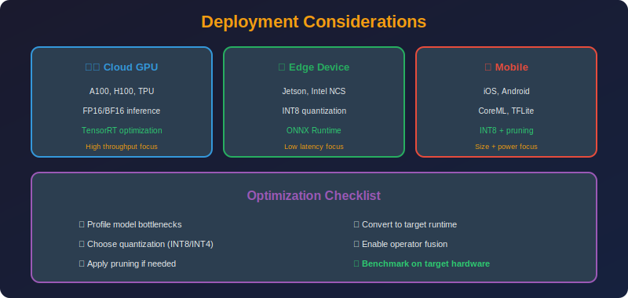

<!-- Animated Header -->
<p align="center">
  
</p>

<p align="center">
  
  
  
</p>


---

<p align="center">

</p>

## 📐 Mathematical Foundations

### 1. Latency Estimation

**Total Latency:**

```math
T_{total} = T_{compute} + T_{memory} + T_{communication}
```

**Compute-Bound:**

```math
T_{compute} = \frac{\text{FLOPs}}{\text{Peak Throughput}}
```

**Memory-Bound (LLMs during decoding):**

```math
T_{memory} = \frac{\text{Model Parameters} \times \text{bytes/param}}{\text{Memory Bandwidth}}
```

**Example (LLaMA-7B on A100):**
- FP16: $7B \times 2 / 2\text{TB/s} = 7\text{ms/token}$
- INT4: $7B \times 0.5 / 2\text{TB/s} = 1.75\text{ms/token}$

### 2. Throughput Analysis

**Batch Processing:**

```math
\text{Throughput} = \frac{\text{Batch Size}}{T_{batch}}
```

**Tokens per Second:**

```math
\text{tok/s} = \frac{B \times L}{T_{prefill} + L \times T_{decode}}
```

Where:
- $B$ = batch size
- $L$ = sequence length
- $T\_{prefill}$ = prompt processing time
- $T\_{decode}$ = per-token generation time

### 3. Memory Requirements

**Inference Memory:**

```math
M_{inference} = M_{model} + M_{KV} + M_{activations}
```

**KV Cache:**

```math
M_{KV} = 2 \times L \times H \times d_k \times B \times S \times b_{kv}
```

Where:
- $L$ = layers
- $H$ = heads (or KV heads for GQA)
- $d\_k$ = head dimension
- $B$ = batch size
- $S$ = sequence length
- $b\_{kv}$ = bytes per element

**Example (LLaMA-7B, seq=4096, batch=1):**

```math
M_{KV} = 2 \times 32 \times 32 \times 128 \times 1 \times 4096 \times 2 = 2.1\text{GB}
```

### 4. Hardware Efficiency

**Arithmetic Intensity:**

```math
\text{AI} = \frac{\text{FLOPs}}{\text{Bytes Transferred}}
```

**Roofline Model:**

```math
\text{Achieved FLOPS} = \min(\text{Peak FLOPS}, \text{AI} \times \text{Bandwidth})
```

**LLM Decoding:** Very low AI (~1) → Memory-bound → Compression helps!

---

## 📊 Deployment Targets

| Target | Memory | Compute | Framework | Compression |
|--------|--------|---------|-----------|-------------|
| **Mobile (iOS)** | 2-4 GB | Limited | CoreML | INT8, INT4 |
| **Mobile (Android)** | 2-6 GB | Limited | TFLite | INT8 |
| **Edge (IoT)** | 256 MB-1 GB | Very limited | TFLite Micro | Extreme |
| **Server (CPU)** | 32+ GB | Multi-core | ONNX, llama.cpp | INT8, INT4 |
| **Server (GPU)** | 16-80 GB | High | TensorRT, vLLM | FP16, INT8 |
| **Cloud (TPU)** | 16+ GB | Very high | JAX | BF16 |

---

## 🔥 LLM Deployment Stack

```
+-------------------------------------------------------------+
|                   LLM Deployment Options                     |
+-------------------------------------------------------------+
|                                                              |
|  Local CPU:                                                  |
|  +-- llama.cpp (GGML/GGUF quantization)                     |
|  +-- Best for: Consumer hardware, privacy                   |
|  +-- Formats: Q4_K_M, Q5_K_M, Q8_0                         |
|                                                              |
|  Local GPU:                                                  |
|  +-- vLLM (PagedAttention, continuous batching)             |
|  +-- TensorRT-LLM (NVIDIA optimized)                        |
|  +-- text-generation-inference (HuggingFace)                |
|  +-- Best for: High throughput serving                      |
|                                                              |
|  Cloud API:                                                  |
|  +-- OpenAI, Anthropic, Google APIs                         |
|  +-- Best for: Simple integration                           |
|  +-- Cost: Pay per token                                    |
|                                                              |
|  Serverless:                                                 |
|  +-- Modal, Replicate, Banana, RunPod                       |
|  +-- Best for: Variable load                                |
|  +-- Cost: Pay per compute second                           |
|                                                              |
+-------------------------------------------------------------+
```

---

## 💻 Deployment Code Examples

### Mobile (TFLite)

```python
import tensorflow as tf

# Convert to TFLite with INT8
converter = tf.lite.TFLiteConverter.from_saved_model(model_path)
converter.optimizations = [tf.lite.Optimize.DEFAULT]

# Representative dataset for calibration
def representative_dataset():
    for sample in calibration_data:
        yield [sample]

converter.representative_dataset = representative_dataset
converter.target_spec.supported_ops = [tf.lite.OpsSet.TFLITE_BUILTINS_INT8]
converter.inference_input_type = tf.int8
converter.inference_output_type = tf.int8

tflite_model = converter.convert()

# Save
with open('model.tflite', 'wb') as f:
    f.write(tflite_model)
```

### Server (TensorRT)

```bash
# Convert ONNX to TensorRT with FP16
trtexec --onnx=model.onnx \
        --saveEngine=model.trt \
        --fp16 \
        --workspace=4096
```

```python
import tensorrt as trt
import pycuda.driver as cuda

# Load and run TensorRT engine
with open("model.trt", "rb") as f:
    engine = trt.Runtime(trt.Logger()).deserialize_cuda_engine(f.read())

context = engine.create_execution_context()
# ... allocate buffers and run inference
```

### Local LLM (llama.cpp)

```bash
# Quantize model
./quantize model-fp16.gguf model-q4_k_m.gguf Q4_K_M

# Run inference
./main -m model-q4_k_m.gguf \
       -p "Hello, how are you?" \
       -n 100 \
       -t 8  # threads
```

### vLLM (High-throughput serving)

```python
from vllm import LLM, SamplingParams

# Load with PagedAttention
llm = LLM(
    model="meta-llama/Llama-2-7b-chat-hf",
    tensor_parallel_size=1,
    dtype="float16",
    quantization="awq",  # or "gptq"
)

# Batch inference
sampling_params = SamplingParams(temperature=0.7, max_tokens=100)
outputs = llm.generate(prompts, sampling_params)
```

---

## 📊 Quantization Formats Comparison

| Format | Framework | Compression | Quality | Speed |
|--------|-----------|-------------|---------|-------|
| **GGUF Q4_K_M** | llama.cpp | 8× | Good | CPU |
| **GPTQ 4-bit** | AutoGPTQ | 8× | Good | GPU |
| **AWQ 4-bit** | AutoAWQ | 8× | Better | GPU |
| **INT8** | TensorRT | 4× | Best | GPU |
| **FP16** | Native | 2× | Baseline | GPU |

---

## 📚 References

| Type | Title | Link |
|------|-------|------|
| 📖 | TensorFlow Lite | [Docs](https://www.tensorflow.org/lite) |
| 📖 | TensorRT | [NVIDIA](https://developer.nvidia.com/tensorrt) |
| 📖 | llama.cpp | [GitHub](https://github.com/ggerganov/llama.cpp) |
| 📖 | vLLM | [GitHub](https://github.com/vllm-project/vllm) |
| 📖 | text-generation-inference | [GitHub](https://github.com/huggingface/text-generation-inference) |

---

⬅️ [Back: Compression Pipelines](../README.md) | ➡️ [Next: Workflows](../02_workflows/README.md)

---


<p align="center">
  
</p>
