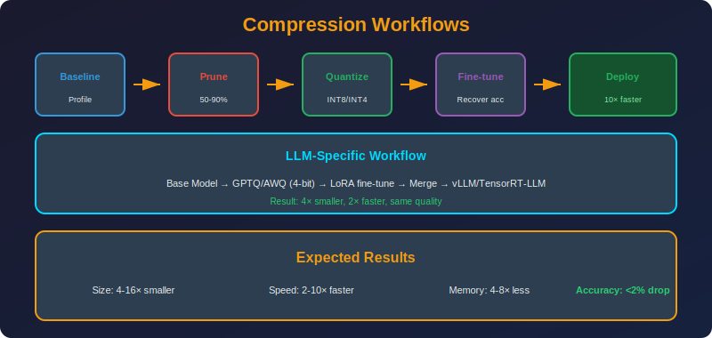

<!-- Animated Header -->
<p align="center">
  
</p>

<p align="center">
  
  
  
</p>


---

<p align="center">

</p>

## 📐 Mathematical Foundations

### 1. Combined Compression Ratio

**Multiplicative Rule:**
```math
CR_{total} = \prod_{i=1}^{n} CR_i
```

**Example: Prune (50%) + Quantize (INT8):**
```math
CR = \frac{1}{0.5} \times \frac{32}{8} = 2 \times 4 = 8\times
```

### 2. Distillation + Quantization

**Size Reduction:**
```math
\text{Final Size} = \frac{S_{student}}{S_{teacher}} \times \frac{b_{quant}}{b_{original}}
```

**Example: BERT → DistilBERT + INT8:**
```math
\text{Reduction} = \frac{66M}{340M} \times \frac{8}{32} = 0.19 \times 0.25 = 0.049 \approx 20\times
```

### 3. QLoRA Memory Formula

**Training Memory:**
```math
M_{train} = M_{base(4bit)} + M_{LoRA(FP16)} + M_{optimizer(8bit)} + M_{grad(FP16)}
M_{train} = 0.5P + 4rd \cdot 2 + 2 \cdot |\theta_{LoRA}| \cdot 1 + 4rd \cdot 2
```

**For 7B model, r=16:**
```math
M_{train} \approx 3.5\text{GB} + 8\text{MB} + 4\text{MB} + 8\text{MB} \approx 3.5\text{GB}
```

### 4. Accuracy-Latency Pareto Analysis

**Objective:**
```math
\min \text{Latency} \quad \text{s.t.} \quad \text{Accuracy} \geq A_{threshold}
```

**Pareto Optimal:** A pipeline is Pareto optimal if no other pipeline achieves:
- Same accuracy with lower latency, OR
- Same latency with higher accuracy

---

## 🎯 Common Pipelines

### Pipeline 1: Prune → Quantize

```
Original Model (100%)
       |
       v
+--------------+
|   Pruning    |  Remove 50% weights (magnitude)
+--------------+
       |
       v
+--------------+
|  Fine-tune   |  Recover accuracy (3-5 epochs)
+--------------+
       |
       v
+--------------+
| Quantization |  FP32 → INT8
+--------------+
       |
       v
Compressed Model (12.5% size, 4-8× speedup)
```

**Best for:** Vision models, edge deployment

### Pipeline 2: Distill → Quantize

```
Teacher Model (Large)
       |
       v
+--------------+
| Distillation |  Train smaller student
|   L = αL_CE + (1-α)T²L_KL
+--------------+
       |
       v
Student Model (Small)
       |
       v
+--------------+
| Quantization |  INT8
+--------------+
       |
       v
Production Model (10-100× smaller!)
```

**Best for:** Creating new efficient architectures

### Pipeline 3: QLoRA (LLMs)

```
Pretrained LLM (FP16)
       |
       v
+------------------+
| 4-bit Quantization|  bitsandbytes NF4
+------------------+
       |
       v
+------------------+
|   Add LoRA       |  r=16, α=32
+------------------+
       |
       v
+------------------+
|   Train LoRA     |  0.1% parameters
+------------------+
       |
       v
+------------------+
| Merge (optional) |  W = W_base + BA
+------------------+
       |
       v
Fine-tuned 4-bit Model
```

**Best for:** All LLM fine-tuning

---

## 💻 Complete Pipeline Implementations

```python
# ========== Pipeline 1: Prune + Quantize ==========
import torch
import torch.nn as nn
import torch.nn.utils.prune as prune

def prune_quantize_pipeline(model, train_loader, val_loader, sparsity=0.5):
    """Complete prune + quantize pipeline"""
    
    # Step 1: Global magnitude pruning
    parameters_to_prune = [
        (module, 'weight') 
        for module in model.modules() 
        if isinstance(module, nn.Linear)
    ]
    
    prune.global_unstructured(
        parameters_to_prune,
        pruning_method=prune.L1Unstructured,
        amount=sparsity,
    )
    
    # Make pruning permanent
    for module, _ in parameters_to_prune:
        prune.remove(module, 'weight')
    
    print(f"After pruning: {count_nonzero(model)/count_total(model):.1%} non-zero")
    
    # Step 2: Fine-tune to recover accuracy
    optimizer = torch.optim.AdamW(model.parameters(), lr=1e-5)
    for epoch in range(3):
        train_epoch(model, train_loader, optimizer)
        acc = evaluate(model, val_loader)
        print(f"Epoch {epoch+1}: Accuracy = {acc:.2%}")
    
    # Step 3: Dynamic quantization to INT8
    model_quantized = torch.quantization.quantize_dynamic(
        model, {nn.Linear}, dtype=torch.qint8
    )
    
    return model_quantized

# ========== Pipeline 2: Distillation + Quantize ==========
import torch.nn.functional as F

def distillation_pipeline(teacher, student, train_loader, T=4, alpha=0.5):
    """Knowledge distillation + quantization pipeline"""
    
    teacher.eval()
    optimizer = torch.optim.AdamW(student.parameters(), lr=2e-4)
    
    # Step 1: Distillation training
    for epoch in range(10):
        student.train()
        for batch in train_loader:
            inputs, labels = batch
            
            with torch.no_grad():
                teacher_logits = teacher(inputs)
            
            student_logits = student(inputs)
            
            # Combined loss
            soft_loss = F.kl_div(
                F.log_softmax(student_logits / T, dim=1),
                F.softmax(teacher_logits / T, dim=1),
                reduction='batchmean'
            ) * T * T
            
            hard_loss = F.cross_entropy(student_logits, labels)
            loss = alpha * hard_loss + (1 - alpha) * soft_loss
            
            loss.backward()
            optimizer.step()
            optimizer.zero_grad()
    
    # Step 2: Quantize student
    student_quantized = torch.quantization.quantize_dynamic(
        student, {nn.Linear}, dtype=torch.qint8
    )
    
    return student_quantized

# ========== Pipeline 3: QLoRA ==========
from transformers import AutoModelForCausalLM, BitsAndBytesConfig, TrainingArguments
from peft import LoraConfig, get_peft_model, prepare_model_for_kbit_training
from trl import SFTTrainer

def qlora_pipeline(model_name, dataset, output_dir):
    """Complete QLoRA fine-tuning pipeline"""
    
    # Step 1: Load in 4-bit
    bnb_config = BitsAndBytesConfig(
        load_in_4bit=True,
        bnb_4bit_quant_type="nf4",
        bnb_4bit_compute_dtype=torch.bfloat16,
        bnb_4bit_use_double_quant=True,
    )
    
    model = AutoModelForCausalLM.from_pretrained(
        model_name,
        quantization_config=bnb_config,
        device_map="auto",
    )
    
    # Step 2: Prepare for k-bit training
    model = prepare_model_for_kbit_training(model)
    
    # Step 3: Add LoRA
    lora_config = LoraConfig(
        r=16,
        lora_alpha=32,
        target_modules=["q_proj", "k_proj", "v_proj", "o_proj"],
        lora_dropout=0.05,
        bias="none",
        task_type="CAUSAL_LM",
    )
    model = get_peft_model(model, lora_config)
    
    # Step 4: Training
    training_args = TrainingArguments(
        output_dir=output_dir,
        per_device_train_batch_size=4,
        gradient_accumulation_steps=4,
        learning_rate=2e-4,
        num_train_epochs=3,
        fp16=True,
    )
    
    trainer = SFTTrainer(
        model=model,
        args=training_args,
        train_dataset=dataset,
        dataset_text_field="text",
        max_seq_length=512,
    )
    
    trainer.train()
    
    # Step 5: Save adapter
    model.save_pretrained(output_dir)
    
    return model

# ========== Pipeline 4: Full Compression (Deep Compression) ==========
def deep_compression_pipeline(model, train_loader, n_clusters=16, sparsity=0.9):
    """Han et al. Deep Compression: Prune + Cluster + Huffman"""
    
    # Step 1: Iterative pruning
    for _ in range(3):  # 3 rounds
        # Prune
        for name, param in model.named_parameters():
            if 'weight' in name:
                threshold = torch.quantile(param.abs(), sparsity)
                mask = param.abs() > threshold
                param.data *= mask
        
        # Fine-tune
        train_epochs(model, train_loader, epochs=2)
    
    # Step 2: Weight clustering (k-means)
    for name, param in model.named_parameters():
        if 'weight' in name:
            # Get non-zero weights
            mask = param != 0
            weights = param[mask].flatten()
            
            # K-means clustering
            from sklearn.cluster import KMeans
            kmeans = KMeans(n_clusters=n_clusters)
            labels = kmeans.fit_predict(weights.cpu().numpy().reshape(-1, 1))
            centroids = kmeans.cluster_centers_.flatten()
            
            # Replace weights with centroids
            new_weights = torch.tensor(centroids[labels])
            param.data[mask] = new_weights.to(param.device)
    
    # Step 3: Huffman coding (conceptual - storage only)
    # In practice, weights stored as centroid indices
    
    return model
```

---

## 📊 Pipeline Selection Guide

| Scenario | Recommended Pipeline | Compression | Time |
|----------|---------------------|-------------|------|
| **Quick deployment** | Quantize only | 4× | Minutes |
| **Mobile app** | Prune + Quantize | 8-16× | Hours |
| **New small model** | Distill + Quantize | 10-100× | Days |
| **LLM adaptation** | QLoRA | Memory only | Hours |
| **Maximum compression** | Deep Compression | 20-50× | Days |

---

## 📚 References

| Type | Title | Link |
|------|-------|------|
| 📄 | Deep Compression | [arXiv](https://arxiv.org/abs/1510.00149) |
| 📄 | QLoRA | [arXiv](https://arxiv.org/abs/2305.14314) |
| 📖 | HF Optimum | [Docs](https://huggingface.co/docs/optimum) |

---

⬅️ [Back: Deployment](../01_deployment/README.md) | ➡️ [Next: Tools](../../11_tools/README.md)

---


<p align="center">
  
</p>
