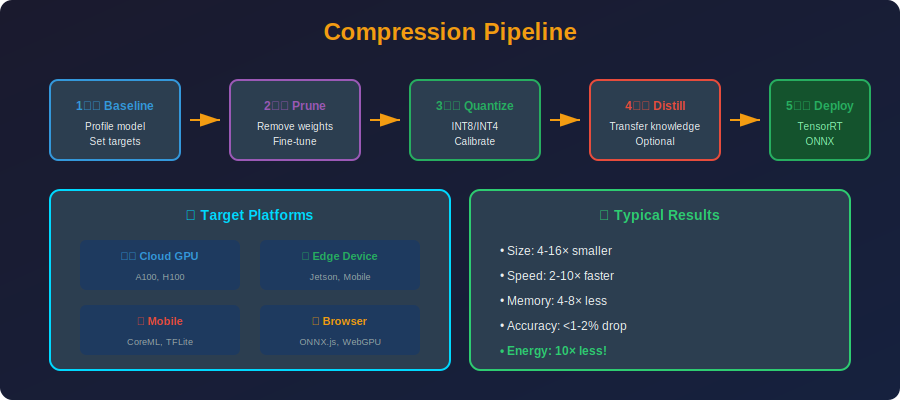

<!-- Animated Header -->
<p align="center">
  
</p>

<p align="center">
  
  
  
</p>


---

<p align="center">

</p>

## 📐 Mathematical Foundations

### 1. Combined Compression Ratio

**Multiplicative Compression:**

```math
CR_{total} = CR_{method_1} \times CR_{method_2} \times ... \times CR_{method_n}

```

**Example (Prune + Quantize):**

```math
CR = CR_{prune} \times CR_{quant} = \frac{1}{1-s} \times \frac{32}{b}

```

For 50% sparsity + INT8:

```math
CR = 2 \times 4 = 8\times

```

### 2. Error Accumulation Analysis

**Single Method Error:**

```math
\mathcal{L}_{compressed} = \mathcal{L}_{original} + \Delta\mathcal{L}_{method}

```

**Combined Error (Worst Case):**

```math
\Delta\mathcal{L}_{total} \leq \sum_i \Delta\mathcal{L}_{method_i}

```

**With Synergy (Best Case):**

```math
\Delta\mathcal{L}_{total} < \sum_i \Delta\mathcal{L}_{method_i}

```

Methods can be synergistic (e.g., pruning removes weights that would be poorly quantized).

### 3. Deep Compression Pipeline (Han et al., 2015)

**Three-Stage Compression:**

```math
M_{compressed} = \text{Huffman}(\text{Quantize}(\text{Prune}(M)))

```

1. **Prune:** Remove weights below threshold

```math
W_{pruned} = W \odot \mathbf{1}_{|W| > \tau}

```math

2. **Quantize:** Cluster remaining weights

```

W_{quant} = \arg\min_C \sum_i \min_j \|w_i - c_j\|^2

```

3. **Huffman Code:** Entropy coding

```math
\text{bits} \approx H(p) = -\sum_j p_j \log_2 p_j

```math
**Achieved Compression:**
- AlexNet: 35× (240MB → 6.9MB)

- VGG-16: 49× (552MB → 11.3MB)

### 4. QLoRA Memory Model

**Memory Components:**

```

M_{total} = M_{base} + M_{LoRA} + M_{optimizer} + M_{activations}

```math
**Base Model (4-bit):**

```

M_{base} = P \times 0.5 \text{ bytes}

```math
**LoRA Adapters (FP16):**

```

M_{LoRA} = 2 \times r \times d \times L \times 2 \text{ bytes}

```math
**Optimizer States (AdamW, 8-bit):**

```

M_{optimizer} = 2 \times |\theta_{LoRA}| \times 1 \text{ byte}

```math
**Example (LLaMA-7B, r=16):**
- Base: $7B \times 0.5 = 3.5$GB

- LoRA: $\sim 4M \times 2 = 8$MB

- Total: $\sim 4$GB (fits 8GB GPU!)

### 5. Accuracy-Compression Pareto Frontier

**Empirical Scaling Law:**

```

\text{Accuracy} \approx A_0 - \alpha \cdot CR^\beta

```math
Where:

- $A_0$ = original accuracy

- $\alpha, \beta$ = method-dependent constants

- $CR$ = compression ratio

**Optimal Pipeline Selection:**

```

\arg\min_{\text{pipeline}} CR \quad \text{s.t.} \quad \text{Accuracy} \geq A_{threshold}

```math
### 6. Inference Latency Model

**Latency Components:**

```

T_{inference} = T_{compute} + T_{memory}

```math
**Compute Bound:**

```

T_{compute} = \frac{\text{FLOPs}}{\text{Peak FLOPS}}

```math
**Memory Bound (LLMs):**

```

T_{memory} = \frac{\text{Model Size}}{\text{Memory Bandwidth}}

```math
**Most LLMs are memory-bound:**

```

T_{inference} \approx \frac{P \times b}{BW}

```

Compression directly reduces latency!

---

## 📂 Topics

| Folder | Topic | Key Concepts |
|--------|-------|--------------|
| [01_deployment/](./01_deployment/) | Deployment | Edge, cloud, mobile |
| [02_workflows/](./02_workflows/) | Combined pipelines | Prune+Quantize, QLoRA |

---

## 🎯 Typical Pipeline

```
+-------------------------------------------------------------+
|               Model Compression Pipeline                     |
+-------------------------------------------------------------+
|                                                              |
|  1. Train/Get Base Model                                     |
|         |                                                    |
|         v                                                    |
|  2. (Optional) Knowledge Distillation                        |
|         |     Teacher → Student architecture                 |
|         v                                                    |
|  3. Pruning (remove redundant weights)                       |
|         |     Magnitude, movement, or structured             |
|         v                                                    |
|  4. Fine-tune (recover accuracy)                             |
|         |     Few epochs with original data                  |
|         v                                                    |
|  5. Quantization (reduce precision)                          |
|         |     INT8, INT4, or mixed precision                 |
|         v                                                    |
|  6. Export (ONNX, TensorRT, etc.)                           |
|         |     Platform-specific optimization                 |
|         v                                                    |
|  7. Deploy!                                                  |
|                                                              |
+-------------------------------------------------------------+

```

---

## 📊 Common Workflows

| Workflow | When to Use | Compression | Example |
|----------|-------------|-------------|---------|
| **Quantize Only** | Quick wins | 4× | INT8 production |
| **Prune + Quantize** | Maximum | 8-16× | Mobile deployment |
| **Distill + Quantize** | New model | 10-100× | DistilBERT |
| **QLoRA** | LLM fine-tuning | N/A (memory) | All LLM adaptation |

---

## 🔥 QLoRA Pipeline (Most Common for LLMs)

```
1. Load base model in 4-bit
   +-- bitsandbytes NF4 quantization
   +-- Memory: 3.5 GB for 7B model

2. Add LoRA adapters
   +-- Only 0.1% trainable params
   +-- Target: q, k, v, o projections

3. Train on your data
   +-- 8 GB GPU is enough!
   +-- Full fine-tune quality

4. (Optional) Merge adapters
   +-- W_new = W_base + BA
   +-- For deployment without LoRA overhead

5. Deploy
   +-- Still 4-bit, fast inference
   +-- Or merge + requantize

```

---

## 💻 Pipeline Code Examples

```python
# ========== Pipeline 1: QLoRA ==========
from transformers import AutoModelForCausalLM, BitsAndBytesConfig
from peft import LoraConfig, get_peft_model

# Step 1: Load in 4-bit
bnb_config = BitsAndBytesConfig(
    load_in_4bit=True,
    bnb_4bit_quant_type="nf4",
    bnb_4bit_compute_dtype=torch.bfloat16,
)
model = AutoModelForCausalLM.from_pretrained(
    "meta-llama/Llama-2-7b-hf",
    quantization_config=bnb_config,
)

# Step 2: Add LoRA
lora_config = LoraConfig(r=16, lora_alpha=32, target_modules=["q_proj", "v_proj"])
model = get_peft_model(model, lora_config)

# Step 3: Train
trainer.train()

# Step 4: Save adapter
model.save_pretrained("my-adapter")

# ========== Pipeline 2: Prune + Quantize ==========
import torch.nn.utils.prune as prune

# Step 1: Prune
for module in model.modules():
    if isinstance(module, nn.Linear):
        prune.l1_unstructured(module, 'weight', amount=0.5)
        prune.remove(module, 'weight')  # Make permanent

# Step 2: Fine-tune
trainer.train(epochs=3)

# Step 3: Quantize
model_quantized = torch.quantization.quantize_dynamic(
    model, {nn.Linear}, dtype=torch.qint8
)

# Step 4: Export to ONNX
torch.onnx.export(model_quantized, dummy_input, "model.onnx")

# ========== Pipeline 3: Distillation ==========
# Step 1: Load teacher and student
teacher = AutoModel.from_pretrained("bert-large-uncased")
student = AutoModel.from_pretrained("distilbert-base-uncased")

# Step 2: Distillation training
def distill_loss(student_out, teacher_out, labels, T=4, alpha=0.5):
    soft_loss = F.kl_div(
        F.log_softmax(student_out / T, dim=-1),
        F.softmax(teacher_out / T, dim=-1),
        reduction='batchmean'
    ) * T * T
    hard_loss = F.cross_entropy(student_out, labels)
    return alpha * hard_loss + (1 - alpha) * soft_loss

# Step 3: Quantize student
student_quantized = torch.quantization.quantize_dynamic(student, {nn.Linear})

```

---

## 📚 References

| Type | Title | Link |
|------|-------|------|
| 📄 | Deep Compression | [arXiv](https://arxiv.org/abs/1510.00149) |
| 📄 | QLoRA Paper | [arXiv](https://arxiv.org/abs/2305.14314) |
| 📖 | HuggingFace PEFT | [Docs](https://huggingface.co/docs/peft) |
| 📖 | HuggingFace Optimum | [Docs](https://huggingface.co/docs/optimum) |

---

⬅️ [Back: Efficient Architectures](../09_efficient_architectures/README.md) | 📂 [Deployment](./01_deployment/README.md) | ➡️ [Next: Tools](../11_tools/README.md)

---


<p align="center">
  
</p>
