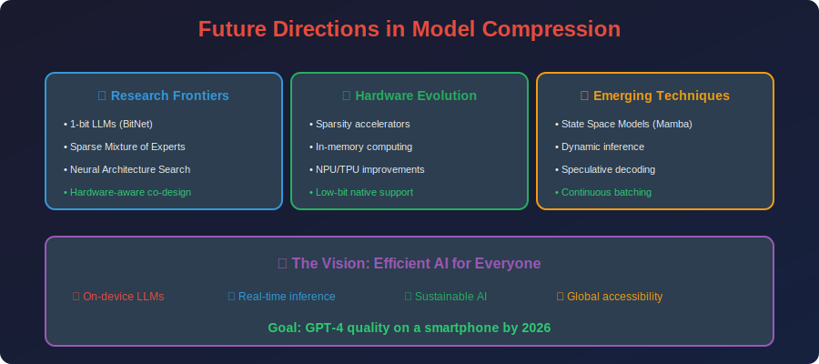

<!-- Animated Header -->
<p align="center">
  
</p>

<p align="center">
  
  
  
</p>


---

<p align="center">

</p>

## 📐 Mathematical Foundations of Emerging Techniques

### 1. 1-Bit Quantization (BitNet)

**Binary Weights:**

```math
W \in \{-1, +1\}^{m \times n}

```

**Quantization Function:**

```math
\hat{w} = \text{sign}(w) = \begin{cases} +1 & w \geq 0 \\ -1 & w < 0 \end{cases}

```

**With Scaling:**

```math
W_{binary} = \alpha \cdot \text{sign}(W)
\alpha = \frac{1}{mn}\|W\|_1

```

**Computation:**

```math
Y = \alpha \cdot (\text{sign}(W) \otimes X)

```

XNOR + popcount operations instead of multiply-accumulate!

**Theoretical Compression:**

```math
CR = \frac{32 \text{ bits}}{1 \text{ bit}} = 32\times

```

### 2. Information-Theoretic Limits

**Shannon's Source Coding Theorem:**

```math
R \geq H(W)

```

Minimum bits per weight equals entropy.

**For Gaussian Weights:**

```math
H(W) = \frac{1}{2}\log_2(2\pi e\sigma^2) \approx 4.13 \text{ bits (for } \sigma=1)

```

**Implications:**
- 4-bit is near theoretical limit for Gaussian weights

- 1-bit requires different weight distributions

- Training from scratch may achieve lower entropy

### 3. Scaling Laws for Compression

**Chinchilla-style Law for Compressed Models:**

```math
L(N_c, D) = \frac{A}{N_c^\alpha} + \frac{B}{D^\beta} + E

```

Where $N_c$ = effective compressed parameters.

**Compression Penalty:**

```math
L_{compressed} \approx L_{original} + \gamma \cdot CR^\delta

```

Empirically: $\delta \approx 0.3-0.5$ for quantization.

### 4. Dynamic Quantization (Per-Token)

**Adaptive Precision:**

```math
b_t = f(x_t, \text{context})

```

Different tokens get different bit-widths based on:

- Token importance (attention weight)

- Layer position

- Prediction confidence

**Mixed-Precision MoE:**

```math
y = \sum_i g_i(x) \cdot Q_{b_i}(E_i(x))

```

Different experts at different precisions.

### 5. Hardware-Aware Compression

**Co-design Objective:**

```math
\min_{M, H} \text{Latency}(M, H) \quad \text{s.t.} \quad \text{Accuracy}(M) \geq A

```

Where $H$ = hardware configuration.

**Quantization-Aware NAS:**
Search for architecture + quantization jointly.

---

## 🔥 Hot Research Areas

### 1. Extreme Quantization (1-2 bits)

```
Current State:
+-- INT4: Works well, <1% accuracy loss
+-- INT2: Significant accuracy loss
+-- INT1: Requires specialized training

BitNet (2023):
+-- Binary weights (-1, +1)
+-- 8-bit activations
+-- 10× memory reduction
+-- 8× energy reduction
+-- Requires training from scratch

1.58-bit LLMs (2024):
+-- Ternary weights (-1, 0, +1)
+-- Matches FP16 quality!
+-- Massive efficiency gains

```

### 2. Training-Free Compression

```
Current:
+-- PTQ: Quantize after training
+-- QAT: Quantize during training
+-- Both require some calibration

Future:
+-- Zero-shot quantization (no data!)
+-- Automatic optimal bit-width selection
+-- Architecture-aware compression

```

### 3. Dynamic/Adaptive Compression

```
Static: Fixed compression for all inputs
Dynamic: Adapt compression to input

Ideas:
+-- Easy inputs: More compression
+-- Hard inputs: Less compression
+-- Token-level adaptive precision
+-- Early exit + compression

```

### 4. Compression for Reasoning

```
Challenge: Compressed models lose reasoning ability

Approaches:
+-- Chain-of-thought distillation
+-- Reasoning-aware pruning
+-- Selective compression (preserve reasoning layers)

```

---

## 📊 Research Frontiers

| Area | Challenge | Potential Solution |
|------|-----------|-------------------|
| **1-bit LLMs** | Accuracy loss | Better training, ternary |
| **Zero-shot Compression** | No calibration data | Learned quantization grids |
| **Dynamic Compression** | Runtime overhead | Hardware support |
| **Reasoning Preservation** | Capability loss | Selective compression |
| **Multimodal Compression** | Different modalities | Modality-specific methods |
| **Hardware Co-design** | Optimization gap | Neural architecture + chip |

---

## 🔮 Predictions

### Near-term (2024-2025)

- 1-bit training becomes mainstream

- All LLMs ship with INT4 by default

- Hardware support for 2:4 sparsity everywhere

- MoE becomes standard for large models

### Medium-term (2025-2027)

- On-device LLMs with 1B+ params

- Dynamic precision becomes practical

- Custom AI chips for specific models

- Green AI compliance requirements

### Long-term (2028+)

- Biological-inspired compression (sparse + analog)

- Zero-cost compression (built into architecture)

- Universal compression APIs

- Democratized SOTA models on edge

---

## 💡 Open Problems

1. **Can we train 1-bit models that match FP16?**
   - Current: ~95% quality
   - Goal: 99%+ quality

2. **What's the minimum bits for different tasks?**
   - Classification: ~2 bits?
   - Generation: ~4 bits?
   - Reasoning: ~8 bits?

3. **Can we compress activations effectively?**
   - Weights: Well understood
   - Activations: Outliers are hard

4. **How to compress multimodal models?**
   - Vision encoder vs language model
   - Cross-modal alignment preservation

---

## 📚 References

| Type | Title | Link |
|------|-------|------|
| 📄 | BitNet | [arXiv](https://arxiv.org/abs/2310.11453) |
| 📄 | 1-bit LLMs | [arXiv](https://arxiv.org/abs/2402.17764) |
| 📄 | Green AI | [arXiv](https://arxiv.org/abs/1907.10597) |
| 📄 | Scaling Laws | [arXiv](https://arxiv.org/abs/2001.08361) |
| 📄 | Hardware-Aware NAS | [arXiv](https://arxiv.org/abs/1812.00332) |

---

## 🔗 Impact and Applications

| Trend | Impact |
|-------|--------|
| **On-device LLMs** | Privacy, latency, offline capability |
| **Democratized AI** | SOTA models on consumer hardware |
| **Green AI** | Lower carbon footprint |
| **Edge Intelligence** | Autonomous systems, IoT |
| **Personalized AI** | User-specific models on device |

---

⬅️ [Back: Case Studies](../12_case_studies/README.md)

---


<p align="center">
  
</p>
