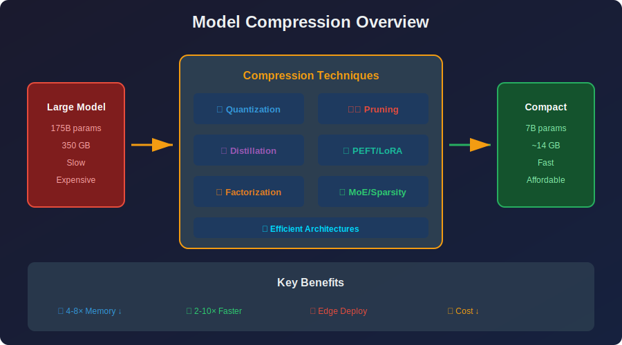

<!-- Animated Header -->
<p align="center">
  
</p>

<p align="center">
  
  
  
</p>


---

<p align="center">

</p>

## 📊 Learning Path

```
🚀 Start → 🔢 Quantization → ✂️ Pruning → 🎓 Distillation → 🔧 LoRA/PEFT → 🧩 MoE → 🏭 Production
```

## 🎯 What You'll Learn

> 💡 From **175B parameters to your phone**: Compress models 4-10x with minimal accuracy loss

<table>
<tr>
<td align="center">

### 🔢 Quantization
4x smaller ⭐

</td>
<td align="center">

### 🔧 LoRA
0.1% params 🔥

</td>
<td align="center">

### 🎓 Distillation
10x smaller

</td>
</tr>
</table>

---

## 📚 Table of Contents

| # | Topic | Description | Key Concepts |
|:-:|-------|-------------|--------------|
| 01 | [Introduction](./01_introduction/) | Overview & motivation | Compression ratio, tradeoffs |
| 02 | [Quantization](./02_quantization/) | Reduce precision | INT8, INT4, GPTQ, AWQ |
| 03 | [Pruning](./03_pruning/) | Remove weights | Magnitude, structured, lottery ticket |
| 04 | [Knowledge Distillation](./04_knowledge_distillation/) | Transfer knowledge | Soft labels, temperature |
| 05 | [Weight Sharing](./05_weight_sharing/) | Share parameters | ALBERT, clustering, MQA |
| 06 | [Factorization](./06_factorization/) | Low-rank decomposition | SVD, tensor decomposition |
| 07 | [Sparsity](./07_sparsity/) | Sparse computation | MoE, 2:4 sparsity |
| 08 | [PEFT](./08_peft/) | Parameter-efficient fine-tuning | LoRA, QLoRA, Adapters |
| 09 | [Efficient Architectures](./09_efficient_architectures/) | Efficient models | Flash Attention, MobileNets |
| 10 | [Compression Pipelines](./10_compression_pipelines/) | End-to-end workflows | Deployment, optimization |
| 11 | [Tools](./11_tools/) | Libraries & frameworks | TensorRT, ONNX, llama.cpp |
| 12 | [Case Studies](./12_case_studies/) | Real-world examples | BERT, LLaMA compression |
| 13 | [Future Directions](./13_future_directions/) | Emerging trends | Speculative decoding, MoE |

---

## 📐 Mathematical Foundations & Theory

### 1. Compression Ratio Definition

The **compression ratio (CR)** quantifies the reduction in model size:

```math
CR = \frac{\text{Original Size}}{\text{Compressed Size}} = \frac{|M|}{|M_c|}
```

**Example Calculation:**
- Original (FP32): $340M \times 4 \text{ bytes} = 1.36 \text{ GB}$
- Compressed (INT8): $340M \times 1 \text{ byte} = 340 \text{ MB}$
- $CR = \frac{1360}{340} = 4\times$

### 2. Compression-Accuracy Trade-off (Pareto Optimality)

**Optimization Objective:**

```math
\min_{M_c} \text{Size}(M_c) \quad \text{subject to} \quad |\text{Acc}(M_c) - \text{Acc}(M)| \leq \epsilon
```

**Theorem (Pareto Frontier):** For a given compression technique, there exists a Pareto frontier where no compression can simultaneously improve both model size and accuracy. Any point on this frontier represents an optimal trade-off.

**Rate-Distortion Theory Connection:**

```math
R(D) = \min_{p(\hat{W}|W)} I(W; \hat{W}) \quad \text{s.t.} \quad \mathbb{E}[d(W, \hat{W})] \leq D
```

Where:
- $R(D)$ = minimum bits needed for distortion $D$
- $I(W; \hat{W})$ = mutual information between original and compressed weights
- $d(W, \hat{W})$ = distortion measure (e.g., MSE)

### 3. Memory-Compute Relationship

**Memory Complexity:**

```math
\text{Memory} = O(P \times b)
```

Where $P$ = parameters, $b$ = bytes per parameter

**Compute Complexity:**

```math
\text{FLOPs} = O(\text{ops} \times \text{precision-factor})
```

| Format | Size | Compute Speed | Memory Bandwidth |
|--------|------|---------------|------------------|
| FP32 | 4 bytes | 1× | 1× |
| FP16 | 2 bytes | 2× (tensor cores) | 2× |
| INT8 | 1 byte | 4× | 4× |
| INT4 | 0.5 bytes | 8× (theoretical) | 8× |

### 4. Universal Compression Bound

**Shannon's Source Coding Theorem:**

```math
H(W) \leq R \leq H(W) + 1
```

The minimum average bits per weight is bounded by the entropy $H(W)$ of the weight distribution.

**For Gaussian-distributed weights:**

```math
H(W) = \frac{1}{2}\log_2(2\pi e \sigma^2) \approx 4-5 \text{ bits}
```

This explains why INT4 quantization often works well!

---

## 🔥 Key Techniques Summary

### 1️⃣ Quantization ⭐⭐⭐

 

```math
x_q = \text{round}\left(\frac{x - z}{s}\right), \quad \hat{x} = s \cdot x_q + z
```

> ⭐ **4x memory reduction with <1% accuracy loss**

<a href="./02_quantization/README.md"></a>

---

### 2️⃣ LoRA & PEFT 🔥🔥🔥

 

```math
W' = W_0 + \Delta W = W_0 + BA
```

**Parameter Reduction:** For $d=4096$, $r=16$: $\frac{4096}{32} = 128\times$ fewer parameters!

> 🔥 **Fine-tune LLMs with 0.1% parameters** - Industry standard

<a href="./08_peft/README.md"></a>

---

### 3️⃣ Knowledge Distillation


```math
\mathcal{L} = \alpha \cdot \mathcal{L}_{CE}(y, p_s) + (1-\alpha) \cdot T^2 \cdot D_{KL}(p_t^T \| p_s^T)
```

**Example:** BERT → DistilBERT (40% smaller, 97% accuracy)

<a href="./04_knowledge_distillation/README.md"></a>

---

### 4️⃣ Pruning


**Lottery Ticket Hypothesis:** A sparse subnetwork at initialization can match dense network accuracy.

```math
\text{Saliency}(w) = \frac{\partial^2 \mathcal{L}}{\partial w^2} \cdot w^2
```

<a href="./03_pruning/README.md"></a>

---

### 5️⃣ Mixture of Experts (MoE)


```math
y = \sum_{i=1}^{N} g_i(x) \cdot E_i(x)
```

For Mixtral 8×7B: 46B total params, ~12B active per token

> Scale to **trillions of parameters** - Used in GPT-4 (rumored)

<a href="./07_sparsity/01_moe/README.md"></a>

---

## 🔄 Comparison

| Technique | Compression | Accuracy Loss | Best For |
|:---------:|:-----------:|:-------------:|----------|
| **INT8** | 4x | <1% | ⭐ Production |
| **INT4** | 8x | 1-3% | Aggressive |
| **LoRA** | N/A | 0% | 🔥 Fine-tuning |
| **Distill** | 2-10x | 3-10% | Deployment |
| **Pruning** | 2-10x | 0-5% | Research |
| **MoE** | N/A (sparse) | 0% | Scaling |

---

## 💡 Key Formulas Summary

<table>
<tr>
<td>

### 🔢 Quantization
```
Quantize: q = round((x - z)/s)
Dequantize: x̂ = s·q + z
Error: MSE ≈ s²/12
```

</td>
<td>

### 🔧 LoRA
```
W' = W₀ + BA  (r << n,m)
Params: r(d+k) vs d×k
Reduction: ~100x
```

</td>
</tr>
<tr>
<td>

### 🎓 Distillation
```
L = α·L_CE + (1-α)·T²·KL
Soft targets preserve
class relationships
```

</td>
<td>

### ✂️ Pruning
```
Keep: |w| > threshold
Saliency: w²·∂²L/∂w²
Structured > Unstructured
```

</td>
</tr>
</table>

---

## 🔗 Prerequisites & Next Steps

```
🧬 Deep Learning → 🗜️ Compression → ⚡ Efficient ML → 🏭 Production
```

<p align="center">
  <a href="../06_deep_learning/README.md"></a>
  <a href="../09_efficient_ml/README.md"></a>
</p>

---

## 📚 Recommended Resources

| Type | Resource | Focus |
|:----:|----------|-------|
| 📄 | [LoRA Paper](https://arxiv.org/abs/2106.09685) | Low-Rank Adaptation |
| 📄 | [QLoRA Paper](https://arxiv.org/abs/2305.14314) | Quantized LoRA |
| 🛠️ | [PEFT](https://github.com/huggingface/peft) | LoRA library |
| 🛠️ | [bitsandbytes](https://github.com/TimDettmers/bitsandbytes) | Quantization |
| 🎓 | [MIT 6.5940 TinyML](https://hanlab.mit.edu/courses/2024-fall-65940) | Prof. Song Han's Course |

---

## 🗺️ Quick Navigation

| Previous | Current | Next |
|:--------:|:-------:|:----:|
| [🎮 RL](../07_reinforcement_learning/README.md) | **🗜️ Compression** | [⚡ Efficient ML →](../09_efficient_ml/README.md) |

---


<p align="center">
  
</p>
