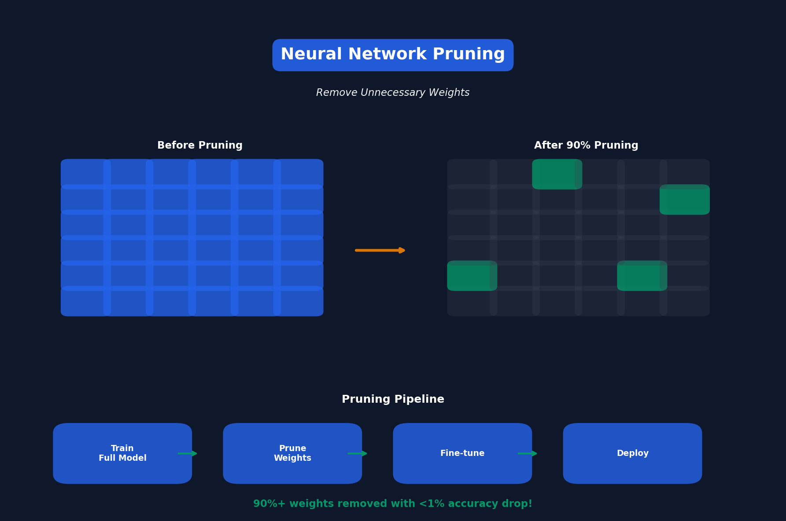

<!-- Animated Header -->
<p align="center">
  
</p>

<p align="center">
  
  
</p>

---


# Lecture 3: Pruning & Sparsity (Part I)

[← Back to Course](../README.md) | [← Previous](../02_basics/README.md) | [Next: Pruning II →](../04_pruning_sparsity_2/README.md)

📺 [Watch Lecture 3 on YouTube](https://www.youtube.com/playlist?list=PL80kAHvQbh-pT4lCkDT53zT8DKmhE0idB&index=3)

[](https://colab.research.google.com/github/Gaurav14cs17/ml-researcher-foundations/blob/main/09-efficient-ml/03_pruning_sparsity_1/demo.ipynb) ← **Try the code!**

---



## What is Pruning?

**Pruning** removes unnecessary weights from a neural network to make it smaller and faster.

> "Not all weights are created equal — many can be removed with minimal impact on accuracy."

---

## The Pruning Pipeline

```
Train Full Model → Prune Weights → Fine-tune → Deploy
     100%              30%           30%        30%
```

---

## Types of Pruning

### 1. Unstructured Pruning
Remove individual weights anywhere in the network.

```python
# Before: Dense weight matrix
W = [[0.1, 0.5, 0.2],
     [0.8, 0.3, 0.1],
     [0.2, 0.9, 0.4]]

# After: Sparse (zeros scattered)
W = [[0.1, 0.0, 0.2],
     [0.8, 0.0, 0.0],
     [0.0, 0.9, 0.4]]
```

**Pros:** High compression ratios
**Cons:** Needs sparse hardware/libraries

### 2. Structured Pruning
Remove entire channels, filters, or attention heads.

```python
# Before: 64 channels
# After: 32 channels (remove entire channels)
```

**Pros:** Works on standard hardware
**Cons:** Lower compression ratios

---

## Pruning Criteria

How do we decide which weights to remove?

| Criterion | Formula | Intuition |
|-----------|---------|-----------|
| **Magnitude** | \|w\| | Small weights matter less |
| **Gradient** | \|∂L/∂w\| | Low gradient = low impact |
| **Taylor** | \|w × ∂L/∂w\| | Combines both |

---

## Magnitude Pruning

The simplest and most common approach:

```python
def magnitude_prune(weights, sparsity=0.9):
    """Remove smallest 90% of weights"""
    threshold = np.percentile(np.abs(weights), sparsity * 100)
    mask = np.abs(weights) > threshold
    return weights * mask
```

---

## Iterative Pruning

Better results come from pruning gradually:

```
Iteration 1: 0% → 50% sparse, fine-tune
Iteration 2: 50% → 75% sparse, fine-tune
Iteration 3: 75% → 90% sparse, fine-tune
```

This works better than pruning 90% all at once!

---

## Results on ImageNet

| Model | Pruning Ratio | Top-1 Accuracy |
|-------|--------------|----------------|
| AlexNet (original) | 0% | 57.2% |
| AlexNet (pruned) | 89% | 57.2% |
| VGG-16 (original) | 0% | 68.5% |
| VGG-16 (pruned) | 92% | 68.3% |

**Key Insight:** Can remove 90%+ weights with <1% accuracy drop!

---

## Key Paper

📄 **[Learning both Weights and Connections for Efficient Neural Networks](https://arxiv.org/abs/1506.02626)** (Han et al., 2015)

This paper introduced the standard pruning pipeline used today.

---

## 📐 Mathematical Foundations

### Magnitude Pruning Criterion

The magnitude-based pruning removes weights below a threshold:

```
\mathcal{M}(W) = \{w_{ij} : |w_{ij}| > \tau\}
```

where τ is the threshold determined by sparsity target.

### Taylor Expansion Criterion

Approximates importance by first-order Taylor expansion of loss:

```
\Delta\mathcal{L}(w) \approx \frac{\partial\mathcal{L}}{\partial w} \cdot w
```

Weights with smallest |ΔL| are pruned first.

### Sparsity Pattern

For structured pruning, remove entire filters/channels:

```
\text{Filter Importance} = \sum_{c,h,w} |W_{f,c,h,w}|
```

---

## 🎯 Where Used

| Concept | Applications |
|---------|-------------|
| Magnitude Pruning | Edge deployment, Mobile inference |
| Structured Pruning | CNN acceleration on standard hardware |
| Iterative Pruning | Training efficient models from scratch |
| Lottery Ticket | Finding sparse subnetworks |

---

## 📚 References

| Type | Resource | Link |
|------|----------|------|
| 📄 | Learning Weights and Connections | [arXiv](https://arxiv.org/abs/1506.02626) |
| 📄 | Neural Network Pruning Survey | [arXiv](https://arxiv.org/abs/2102.00554) |
| 💻 | PyTorch Pruning Tutorial | [PyTorch](https://pytorch.org/tutorials/intermediate/pruning_tutorial.html) |
| 🎥 | MIT 6.5940 TinyML | [Course](https://hanlab.mit.edu/courses/2024-fall-65940) |
| 🇨🇳 | 知乎 - 模型剪枝详解 | [Zhihu](https://www.zhihu.com/topic/20084746) |


---

<p align="center">
  
</p>
