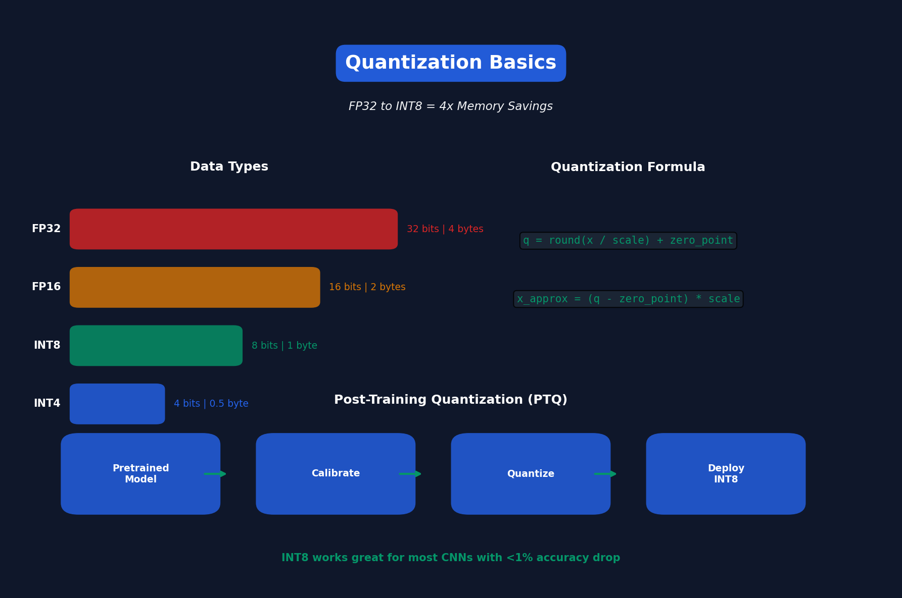

<!-- Animated Header -->
<p align="center">
  
</p>

<p align="center">
  
  
  
</p>

<p align="center">
  <i>MIT 6.5940 - Efficient ML Course</i>
</p>


---

**✍️ Author:** [Gaurav Goswami](https://github.com/Gaurav14cs17) • **📅 Updated:** December 2024

---

# Lecture 5: Quantization (Part I)

[← Back to Course](../README.md) | [← Previous](../04_pruning_sparsity_2/README.md) | [Next: Quantization II →](../06_quantization_2/README.md)

📺 [Watch Lecture 5 on YouTube](https://www.youtube.com/playlist?list=PL80kAHvQbh-pT4lCkDT53zT8DKmhE0idB&index=5)

[](https://colab.research.google.com/github/Gaurav14cs17/ml-researcher-foundations/blob/main/09-efficient-ml/05_quantization_1/demo.ipynb) ← **Try the code!**

---



## What is Quantization?

**Quantization** reduces the precision of weights and activations from FP32 to INT8/INT4.

```
FP32 (32 bits) → INT8 (8 bits) = 4x memory reduction
FP32 (32 bits) → INT4 (4 bits) = 8x memory reduction
```

---

## Data Types

| Type | Bits | Range | Use Case |
|------|------|-------|----------|
| FP32 | 32 | ±3.4e38 | Training |
| FP16 | 16 | ±65504 | Mixed precision |
| BF16 | 16 | ±3.4e38 | Training (wider range) |
| INT8 | 8 | -128 to 127 | Inference |
| INT4 | 4 | -8 to 7 | LLM inference |

---

## Quantization Formula

Map floating point to integer:

```
q = round(x / scale) + zero_point

# Dequantize:
x_approx = (q - zero_point) * scale
```

### Example
```python
# FP32 weights: [0.1, 0.5, 0.9, 1.2]
# Scale = 1.2 / 127 ≈ 0.0094
# INT8: [11, 53, 96, 127]
```

---

## Symmetric vs Asymmetric

### Symmetric Quantization
- Zero point = 0
- Range: [-α, α]
- Simpler computation

```
q = round(x / scale)
```

### Asymmetric Quantization
- Zero point ≠ 0
- Range: [β, α] (not centered)
- Better for ReLU outputs

```
q = round(x / scale) + zero_point
```

---

## Quantization Granularity

| Level | Description | Accuracy | Speed |
|-------|-------------|----------|-------|
| Per-tensor | One scale for entire tensor | Lower | Fastest |
| Per-channel | One scale per output channel | Higher | Fast |
| Per-group | One scale per N weights | Highest | Slower |

---

## Post-Training Quantization (PTQ)

Quantize a pre-trained model without retraining:

```python
# 1. Calibrate on sample data
model.eval()
with torch.no_grad():
    for batch in calibration_data:
        model(batch)  # Collect activation statistics

# 2. Compute scales from min/max values
scale = (max_val - min_val) / 255
zero_point = round(-min_val / scale)

# 3. Quantize weights
quantized_weights = round(weights / scale) + zero_point
```

### Pros & Cons

| Pros | Cons |
|------|------|
| No training needed | Accuracy drop at low bits |
| Fast (minutes) | Needs calibration data |
| Easy to implement | Sensitive to outliers |

---

## Calibration Methods

How to find the quantization range?

| Method | Description |
|--------|-------------|
| Min-Max | Use observed min/max |
| Percentile | Use 99.9th percentile (ignore outliers) |
| MSE | Minimize quantization error |
| Entropy | Minimize KL divergence |

---

## Results on ImageNet

| Model | FP32 Acc | INT8 Acc | Drop |
|-------|----------|----------|------|
| ResNet-50 | 76.1% | 75.9% | 0.2% |
| MobileNetV2 | 71.9% | 70.8% | 1.1% |
| EfficientNet-B0 | 77.3% | 76.8% | 0.5% |

**Key Insight:** INT8 works great for most CNNs!

---

## Hardware Support

| Hardware | INT8 Support | Speedup |
|----------|--------------|---------|
| NVIDIA GPU | TensorRT | 2-4x |
| Intel CPU | VNNI | 2-3x |
| ARM CPU | NEON | 2-4x |
| Apple Neural Engine | Native | 3-5x |

---

## Key Paper

📄 **[Quantization and Training of Neural Networks for Efficient Integer-Arithmetic-Only Inference](https://arxiv.org/abs/1712.05877)** (Jacob et al., Google)

---

## Code Example

```python
import torch

# Simple PTQ example
model = load_pretrained_model()
model.eval()

# Quantize to INT8
quantized_model = torch.quantization.quantize_dynamic(
    model,
    {torch.nn.Linear},  # Layers to quantize
    dtype=torch.qint8
)

# Compare sizes
original_size = get_model_size(model)
quantized_size = get_model_size(quantized_model)
print(f"Compression: {original_size/quantized_size:.1f}x")
```

---

---

## 📐 Mathematical Foundations

### Uniform Quantization

Map floating-point values to integers:

```
q = \text{round}\left(\frac{x}{s}\right) + z
```

where s is scale and z is zero-point.

### Scale Calculation

```
s = \frac{x_{\max} - x_{\min}}{2^b - 1}
```

where b is the bit-width.

### Quantization Error

```
\epsilon_q = x - \hat{x} = x - s(q - z)
```

Mean squared error: E[εq²] ≈ s²/12

---

## 🎯 Where Used

| Concept | Applications |
|---------|-------------|
| INT8 Quantization | CNN inference on edge devices |
| INT4 Quantization | LLM inference (GPTQ, AWQ) |
| Per-channel Quant | Accurate conv layer quantization |
| Calibration | Post-training quantization |

---

## 📚 References

| Type | Resource | Link |
|------|----------|------|
| 📄 | Google Quantization Paper | [arXiv](https://arxiv.org/abs/1712.05877) |
| 📄 | GPTQ: LLM Quantization | [arXiv](https://arxiv.org/abs/2210.17323) |
| 💻 | PyTorch Quantization | [PyTorch](https://pytorch.org/docs/stable/quantization.html) |
| 🎥 | MIT 6.5940 TinyML | [Course](https://hanlab.mit.edu/courses/2024-fall-65940) |
| 🇨🇳 | 知乎 - 模型量化入门 | [Zhihu](https://www.zhihu.com/topic/21006894) |

---

## Next Lecture

Part II covers **Quantization-Aware Training (QAT)** for better accuracy at low precision.


---

<p align="center">
  
</p>

---


<p align="center">
  
</p>
