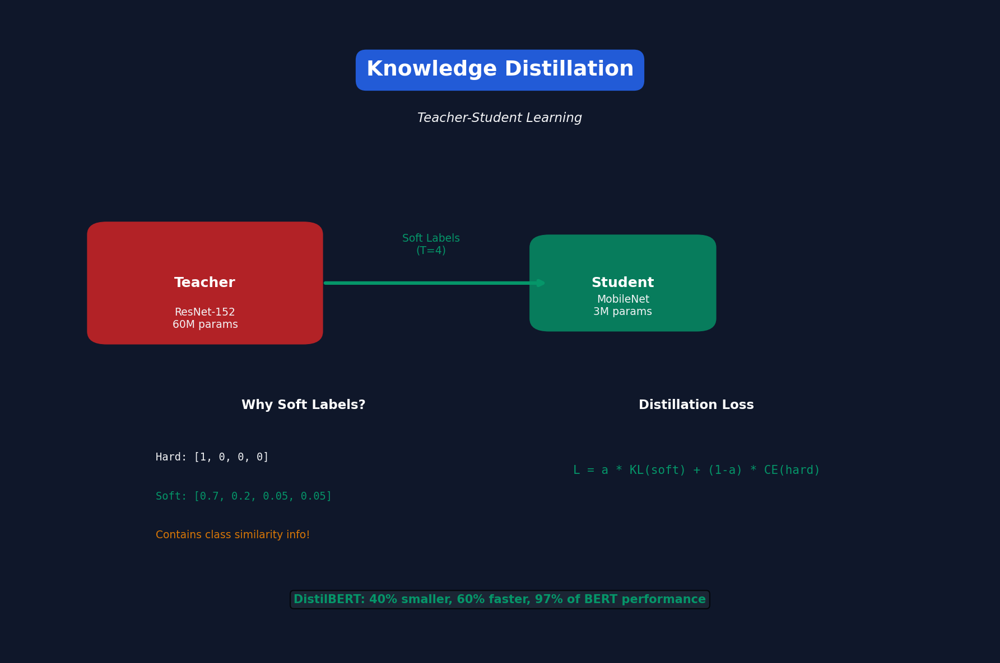

<!-- Animated Header -->
<p align="center">
  
</p>

<p align="center">
  
  
  
</p>

<p align="center">
  <i>MIT 6.5940 - Efficient ML Course</i>
</p>


---

**✍️ Author:** [Gaurav Goswami](https://github.com/Gaurav14cs17) • **📅 Updated:** December 2024

---

# Lecture 9: Knowledge Distillation

[← Back to Course](../README.md) | [← Previous](../08_neural_architecture_search_2/README.md) | [Next: MCUNet →](../10_mcunet_tinyml/README.md)

📺 [Watch Lecture 9 on YouTube](https://www.youtube.com/playlist?list=PL80kAHvQbh-pT4lCkDT53zT8DKmhE0idB&index=9)

[](https://colab.research.google.com/github/Gaurav14cs17/ml-researcher-foundations/blob/main/09-efficient-ml/09_knowledge_distillation/demo.ipynb) ← **Try the code!**

---



## What is Knowledge Distillation?

Transfer knowledge from a large "teacher" model to a small "student" model.

```
Teacher (Large): ResNet-152, 60M params, 78% acc
     ↓ Distill knowledge
Student (Small): MobileNet, 3M params, 76% acc (was 72% without distillation!)
```

---

## Why Does Distillation Work?

**Soft labels contain more information than hard labels!**

| Class | Hard Label | Soft Label (Teacher) |
|-------|-----------|---------------------|
| Cat | 1 | 0.75 |
| Dog | 0 | 0.15 |
| Car | 0 | 0.05 |
| ... | 0 | 0.05 |

The soft label says: "This is probably a cat, but it looks a bit like a dog."

---

## Distillation Loss

```python
def distillation_loss(student_logits, teacher_logits, labels, T=4, α=0.5):
    """
    T: Temperature (higher = softer probabilities)
    α: Balance between hard and soft targets
    """
    # Soft targets from teacher
    soft_targets = F.softmax(teacher_logits / T, dim=-1)
    soft_loss = F.kl_div(
        F.log_softmax(student_logits / T, dim=-1),
        soft_targets,
        reduction='batchmean'
    ) * (T ** 2)
    
    # Hard targets (ground truth)
    hard_loss = F.cross_entropy(student_logits, labels)
    
    return α * soft_loss + (1 - α) * hard_loss
```

---

## Temperature Scaling

Higher temperature → softer probability distribution:

```
T=1:  [0.9, 0.05, 0.05]  # Very confident
T=4:  [0.6, 0.2, 0.2]    # More uniform (more information)
T=20: [0.4, 0.3, 0.3]    # Very soft
```

---

## Types of Distillation

### 1. Response-Based (Logits)
```python
loss = KL_div(student_logits, teacher_logits)
```

### 2. Feature-Based
```python
loss = MSE(student_features, teacher_features)
```
Match intermediate layer activations.

### 3. Relation-Based
```python
# Match relationships between samples
loss = MSE(student_gram_matrix, teacher_gram_matrix)
```

---

## Feature Distillation

When student and teacher have different architectures:

```python
class FeatureDistillation(nn.Module):
    def __init__(self, student_channels, teacher_channels):
        # Adapter to match dimensions
        self.adapter = nn.Conv2d(student_channels, teacher_channels, 1)
    
    def forward(self, student_feat, teacher_feat):
        adapted = self.adapter(student_feat)
        return F.mse_loss(adapted, teacher_feat)
```

---

## Self-Distillation

Use the model as its own teacher!

```
Train model → Use as teacher → Train same architecture from scratch
```

Surprisingly, this improves accuracy by 1-2%!

---

## DistilBERT

Distill BERT into a smaller model:

| Model | Params | GLUE Score |
|-------|--------|------------|
| BERT-base | 110M | 79.5 |
| DistilBERT | 66M | 77.0 |

**40% smaller, 60% faster, 97% of performance!**

### DistilBERT Training
```
1. Initialize student from teacher (take every other layer)
2. Train with: MLM loss + Distillation loss + Cosine embedding loss
```

---

## LLM Distillation Challenges

| Challenge | Solution |
|-----------|----------|
| Teacher too large | Use API (GPT-4 → local model) |
| Distribution mismatch | Generate synthetic data |
| Task-specific | Distill on target task only |

### Alpaca / Vicuna Approach
```
1. Generate training data using GPT-4
2. Fine-tune LLaMA on this data
3. Result: Small model with GPT-4-like behavior
```

---

## Results Summary

| Task | Teacher | Student | Without KD | With KD |
|------|---------|---------|-----------|---------|
| ImageNet | ResNet-152 | MobileNet | 72.0% | 76.0% |
| GLUE | BERT-large | DistilBERT | 74.0% | 77.0% |
| CIFAR-100 | WRN-40-2 | WRN-16-2 | 73.3% | 75.5% |

---

## Key Papers

- 📄 [Distilling Knowledge in Neural Networks](https://arxiv.org/abs/1503.02531) (Hinton)
- 📄 [FitNets](https://arxiv.org/abs/1412.6550) - Feature distillation
- 📄 [DistilBERT](https://arxiv.org/abs/1910.01108)

---

## Practical Tips

1. **Temperature matters** — Try T=2,4,8,20
2. **Balance α carefully** — Usually 0.5-0.9 for soft loss
3. **Match capacity** — Don't distill to too-small student
4. **Feature distillation helps** — Especially for different architectures

---

## 📐 Mathematical Foundations

### Distillation Objective

```
\mathcal{L} = \alpha \cdot \mathcal{L}_{\text{soft}} + (1-\alpha) \cdot \mathcal{L}_{\text{hard}}
```

### Soft Target Loss (KL Divergence)

```
\mathcal{L}_{\text{soft}} = T^2 \cdot \text{KL}\left(\sigma\left(\frac{z_s}{T}\right) \| \sigma\left(\frac{z_t}{T}\right)\right)
```

where σ is softmax, T is temperature.

### Temperature Effect

```
p_i = \frac{\exp(z_i/T)}{\sum_j \exp(z_j/T)}
```

Higher T → softer probability distribution → more information transfer.

---

## 🎯 Where Used

| Concept | Applications |
|---------|-------------|
| Logit Distillation | Compressing CNNs, DistilBERT |
| Feature Distillation | FitNets, attention transfer |
| Self-Distillation | Improving single model accuracy |
| LLM Distillation | Alpaca, Vicuna from GPT-4 |

---

## 📚 References

| Type | Resource | Link |
|------|----------|------|
| 📄 | Hinton Distillation Paper | [arXiv](https://arxiv.org/abs/1503.02531) |
| 📄 | FitNets | [arXiv](https://arxiv.org/abs/1412.6550) |
| 📄 | DistilBERT | [arXiv](https://arxiv.org/abs/1910.01108) |
| 🎥 | MIT 6.5940 TinyML | [Course](https://hanlab.mit.edu/courses/2024-fall-65940) |
| 🇨🇳 | 知乎 - 知识蒸馏 | [Zhihu](https://www.zhihu.com/topic/20748211) |


---

<p align="center">
  
</p>

---


<p align="center">
  
</p>
