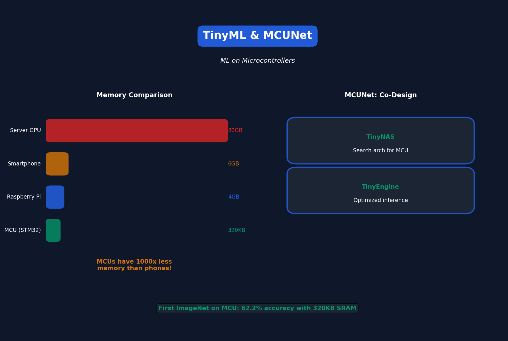

# Lecture 10: MCUNet & TinyML

[← Back to Course](../README.md) | [← Previous](../09_knowledge_distillation/README.md) | [Next: Efficient Transformers →](../11_efficient_transformers/README.md)

📺 [Watch Lecture 10 on YouTube](https://www.youtube.com/playlist?list=PL80kAHvQbh-pT4lCkDT53zT8DKmhE0idB&index=10)

[](https://colab.research.google.com/github/Gaurav14cs17/ml-researcher-foundations/blob/main/09-efficient-ml/10_mcunet_tinyml/demo.ipynb) ← **Try the code!**

---



## What is TinyML?

Running machine learning on **microcontrollers** (MCUs):

| Device | RAM | Flash | Compute |
|--------|-----|-------|---------|
| Server GPU | 80GB | TB | 312 TFLOPS |
| Smartphone | 6GB | 128GB | 10 TFLOPS |
| Raspberry Pi | 4GB | 32GB | 13 GFLOPS |
| **MCU (STM32)** | **320KB** | **1MB** | **0.1 GFLOPS** |

**MCUs have 1000x less memory than phones!**

---

## Why TinyML?

| Benefit | Why It Matters |
|---------|---------------|
| Privacy | Data never leaves device |
| Latency | No network round-trip |
| Cost | MCUs cost $1-5 |
| Power | Battery lasts months |
| Availability | Works offline |

---

## TinyML Challenges

1. **Memory** — Model + activations must fit in KB
2. **No OS** — Direct hardware access
3. **No floating point** — Many MCUs only support INT
4. **Limited compute** — 100MHz vs 3GHz

---

## MCUNet

Co-design network architecture AND inference engine for MCUs.

### Two-Stage Design

```
Stage 1: TinyNAS — Find optimal architecture for target MCU
Stage 2: TinyEngine — Efficient inference engine
```

---

## TinyNAS

Search for architectures that fit in MCU memory:

```python
# Constraint: peak memory < 320KB
for architecture in search_space:
    if peak_memory(architecture) > 320_000:
        skip  # Won't fit!
    else:
        evaluate(architecture)
```

### Memory-Optimized Search Space
- Depthwise separable convolutions
- Inverted bottleneck blocks
- Squeeze-and-excite (optional)
- Variable resolution (96-176 pixels)

---

## Peak Memory Optimization

Standard inference:
```
Layer1 → [Activation1] → Layer2 → [Activation2] → ...
Peak memory = max(Activation1, Activation2, ...)
```

TinyEngine optimizes layer order:
```
Reorder layers to minimize peak memory
Result: 4x memory reduction!
```

---

## Inference Scheduling

### Patch-Based Inference
Don't process entire feature map at once:

```
Instead of:
[Full 28x28 feature map] → Conv → [Full 28x28]

Do:
[7x7 patch] → Conv → [7x7] → [7x7 patch] → Conv → [7x7] → ...
```

Memory: 28×28 = 784 → 7×7 = 49 (16x reduction!)

---

## MCUNet Results

| Model | Flash | SRAM | ImageNet Acc |
|-------|-------|------|--------------|
| MobileNetV2 (0.35x) | 1.8MB | 1.2MB | 49.7% |
| ProxylessNAS | 1.5MB | 0.7MB | 57.0% |
| **MCUNet** | **0.9MB** | **0.3MB** | **62.2%** |

**First time ImageNet on MCU!**

---

## TinyEngine Optimizations

| Optimization | Memory Saved |
|--------------|-------------|
| In-place depthwise | 2x |
| Loop tiling | 2-4x |
| Im2col-free conv | 2x |
| SIMD vectorization | - (speed) |

---

## Code: TinyML Workflow

```python
# 1. Design/search for tiny model
model = TinyNAS.search(
    target_device="STM32F746",
    sram_constraint=320_000,  # 320KB
    flash_constraint=1_000_000  # 1MB
)

# 2. Quantize to INT8
model_int8 = quantize(model, calibration_data)

# 3. Export to TinyEngine format
export_tinyengine(model_int8, "model.tflite")

# 4. Flash to MCU
flash_to_device("model.tflite", device="STM32F746")
```

---

## TinyML Applications

| Application | MCU | Power |
|-------------|-----|-------|
| Wake word detection | $1 MCU | 1mW |
| Gesture recognition | Arduino | 5mW |
| Anomaly detection | ESP32 | 10mW |
| Visual wake words | STM32 | 100mW |

---

## Memory Hierarchy

```
Registers: ~1KB, fastest
    ↓
SRAM: 320KB, fast
    ↓
Flash: 1MB, slow (code + weights)
    ↓
External: SD card, very slow
```

**Goal: Keep activations in SRAM, weights in Flash**

---

## Key Papers

- 📄 [MCUNet](https://arxiv.org/abs/2007.10319)
- 📄 [MCUNetV2](https://arxiv.org/abs/2110.15352) - Patch-based inference
- 📄 [TinyML Book](https://www.oreilly.com/library/view/tinyml/9781492052036/)

---

---

## 📐 Mathematical Foundations

### Memory Constraint

$$\text{Peak Memory} = \max_l (\text{Input}_l + \text{Output}_l + \text{Weights}_l) \leq \text{SRAM}$$

### MCUNet Optimization

$$\max_\alpha \text{Acc}(\alpha) \quad \text{s.t.} \quad \text{Flash}(\alpha) \leq F_{max}, \quad \text{SRAM}(\alpha) \leq S_{max}$$

### Patch-Based Memory

$$\text{Memory}_{patch} = \frac{\text{Memory}_{full}}{(\text{patches})^2}$$

---

## 🎯 Where Used

| Concept | Applications |
|---------|-------------|
| MCUNet | Visual wake words, IoT |
| TinyNAS | Device-specific architecture |
| TinyEngine | Optimized MCU inference |
| Patch-based Inference | Memory-constrained vision |

---

## 📚 References

| Type | Resource | Link |
|------|----------|------|
| 📄 | MCUNet | [arXiv](https://arxiv.org/abs/2007.10319) |
| 📄 | MCUNetV2 | [arXiv](https://arxiv.org/abs/2110.15352) |
| 📖 | TinyML Book | [O'Reilly](https://www.oreilly.com/library/view/tinyml/9781492052036/) |
| 🌐 | TinyML Foundation | [Website](https://www.tinyml.org/) |
| 💻 | TensorFlow Lite Micro | [TF](https://www.tensorflow.org/lite/microcontrollers) |
| 💻 | Edge Impulse | [Website](https://www.edgeimpulse.com/) |
| 🎥 | MIT 6.5940 TinyML | [Course](https://hanlab.mit.edu/courses/2024-fall-65940) |
| 🇨🇳 | 知乎 - TinyML边缘AI | [Zhihu](https://www.zhihu.com/topic/21416862) |

