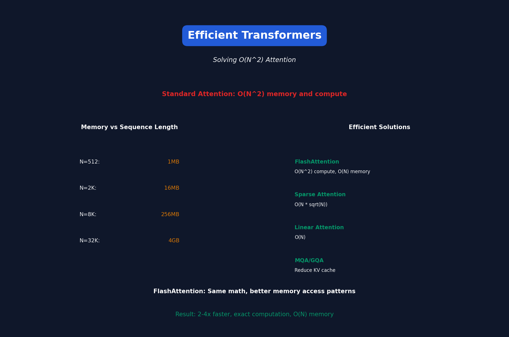

<!-- Animated Header -->
<p align="center">
  
</p>

<p align="center">
  
  
  
</p>


---

# Lecture 11: Efficient Transformers

[← Back to Course](../README.md) | [← Previous](../10_mcunet_tinyml/README.md) | [Next: Efficient Training →](../12_efficient_training/README.md)

📺 [Watch Lecture 11 on YouTube](https://www.youtube.com/playlist?list=PL80kAHvQbh-pT4lCkDT53zT8DKmhE0idB&index=11)

[](https://colab.research.google.com/github/Gaurav14cs17/ml-researcher-foundations/blob/main/09-efficient-ml/11_efficient_transformers/demo.ipynb) ← **Try the code!**

---



## The Transformer Efficiency Problem

Standard attention is O(N²) in sequence length:

| Sequence Length | Attention FLOPs | Memory |
|----------------|-----------------|--------|
| 512 | 0.26M | 1MB |
| 2048 | 4.2M | 16MB |
| 8192 | 67M | 256MB |
| 32768 | 1B | 4GB |

---

## Efficiency Techniques Overview

| Technique | Complexity | Trade-off |
|-----------|------------|-----------|
| Sparse Attention | O(N√N) | Misses some interactions |
| Linear Attention | O(N) | Approximation |
| FlashAttention | O(N²) | Exact, memory-efficient |
| KV Cache | O(N) per token | Memory for speed |

---

## Sparse Attention Patterns

### Local Attention (Sliding Window)
Only attend to nearby tokens:
```
Token i attends to: [i-w, i+w]
Complexity: O(N × w) instead of O(N²)
```

### Strided Attention
Attend to every k-th token:
```
Token i attends to: [0, k, 2k, 3k, ...]
```

### Longformer: Local + Global
```
Local attention for most tokens
+ Global attention for [CLS] and special tokens
```

---

## Linear Attention

Rewrite attention to avoid N×N matrix:

**Standard:**
```
Attention = softmax(QK^T/√d) × V
           \_________/
              N×N matrix
```

**Linear (Performer):**
```
Attention ≈ φ(Q) × (φ(K)^T × V)
                    \______/
                      d×d matrix (compute first!)
```

Complexity: O(N × d²) instead of O(N² × d)

---

## FlashAttention

**Key Insight:** Attention is memory-bound, not compute-bound!

Standard: Write full N×N matrix to GPU memory (slow)
FlashAttention: Compute in blocks, never write full matrix

```
For each block:
    1. Load Q, K, V blocks to SRAM
    2. Compute attention in SRAM
    3. Write output block to HBM
```

---

## FlashAttention Results

| Method | Memory | Speed | Exact? |
|--------|--------|-------|--------|
| Standard | O(N²) | 1x | Yes |
| FlashAttention | O(N) | 2-4x | Yes |
| FlashAttention-2 | O(N) | 5-7x | Yes |

**Same math, just better memory access patterns!**

---

## KV Cache

During autoregressive generation, cache K and V:

```
# Without cache (inefficient)
for each new token:
    K = [K_old, K_new]  # Recompute all!
    V = [V_old, V_new]

# With cache (efficient)  
for each new token:
    K = [cached_K, K_new]  # Just append
    V = [cached_V, V_new]
```

Memory cost: 2 × layers × seq_len × d_model × dtype

---

## Multi-Query Attention (MQA)

Share K, V across attention heads:

```
Standard: 8 heads × (Q + K + V) = 24 projections
MQA:      8 heads × Q + 1 × K + 1 × V = 10 projections
```

KV cache reduced by 8x!

### Grouped Query Attention (GQA)
Middle ground: Share KV within groups

```
8 heads, 2 KV groups → Each KV shared by 4 heads
```

---

## Speculative Decoding

Use small "draft" model to propose tokens, large model to verify:

```
Draft model: Proposes 5 tokens quickly
Main model:  Verifies in parallel (1 forward pass)

If 4/5 accepted: Generated 4 tokens in 1 main model pass!
```

Speedup: 2-3x without quality loss

---

## PagedAttention (vLLM)

Manage KV cache like virtual memory:

```
Instead of contiguous allocation:
[Request 1 KV: 2048 tokens][Request 2 KV: 1024 tokens]

Use paging:
[Page 1][Page 2][Page 3]... (non-contiguous OK)
```

Benefits:
- No memory fragmentation
- Efficient batching
- Memory sharing between requests

---

## Efficient Attention Comparison

| Method | Sequence Length | Use Case |
|--------|-----------------|----------|
| Standard | < 2K | Short sequences |
| FlashAttention | < 32K | Most LLMs |
| Sparse | < 100K | Long documents |
| Linear | Unlimited | Theoretical |
| State Space (Mamba) | Unlimited | Alternative to attention |

---

## Key Papers

- 📄 [FlashAttention](https://arxiv.org/abs/2205.14135)
- 📄 [FlashAttention-2](https://arxiv.org/abs/2307.08691)
- 📄 [Longformer](https://arxiv.org/abs/2004.05150)
- 📄 [Multi-Query Attention](https://arxiv.org/abs/1911.02150)
- 📄 [vLLM/PagedAttention](https://arxiv.org/abs/2309.06180)
- 📄 [Mamba](https://arxiv.org/abs/2312.00752)

---

## Practical Tips

1. **Always use FlashAttention** — Free speedup
2. **Use MQA/GQA** for inference-heavy workloads
3. **Consider sliding window** for very long sequences
4. **Profile memory** — Often the bottleneck

---

## 📐 Mathematical Foundations

### Standard Attention Complexity

```
\text{Attention}(Q, K, V) = \text{softmax}\left(\frac{QK^T}{\sqrt{d_k}}\right)V
```

Complexity: O(N^2 d) time, O(N^2) memory

### Linear Attention

```
\text{LinAttn}(Q, K, V) = \phi(Q) \cdot \left(\phi(K)^T V\right)
```

Complexity: O(N d^2) time, O(d^2) memory

### KV Cache Memory

```
\text{KV Memory} = 2 \times L \times N \times d \times \text{dtype\_bytes}
```

### FlashAttention IO Complexity

Standard: O(N^2 d) HBM reads/writes
FlashAttention: O(N^2 d^2 / M) where M is SRAM size

---

## 🎯 Where Used

| Concept | Applications |
|---------|-------------|
| FlashAttention | All modern LLM training |
| MQA/GQA | LLaMA 2, Mistral inference |
| Sliding Window | Long document processing |
| PagedAttention | vLLM serving |

---

## 📚 References

| Type | Resource | Link |
|------|----------|------|
| 📄 | FlashAttention | [arXiv](https://arxiv.org/abs/2205.14135) |
| 📄 | FlashAttention-2 | [arXiv](https://arxiv.org/abs/2307.08691) |
| 📄 | Longformer | [arXiv](https://arxiv.org/abs/2004.05150) |
| 📄 | Multi-Query Attention | [arXiv](https://arxiv.org/abs/1911.02150) |
| 📄 | vLLM/PagedAttention | [arXiv](https://arxiv.org/abs/2309.06180) |
| 📄 | Mamba | [arXiv](https://arxiv.org/abs/2312.00752) |
| 🎥 | MIT 6.5940 TinyML | [Course](https://hanlab.mit.edu/courses/2024-fall-65940) |
| 🇨🇳 | 知乎 - 高效Transformer | [Zhihu](https://www.zhihu.com/topic/20069893) |


---

---


<p align="center">
  
</p>
