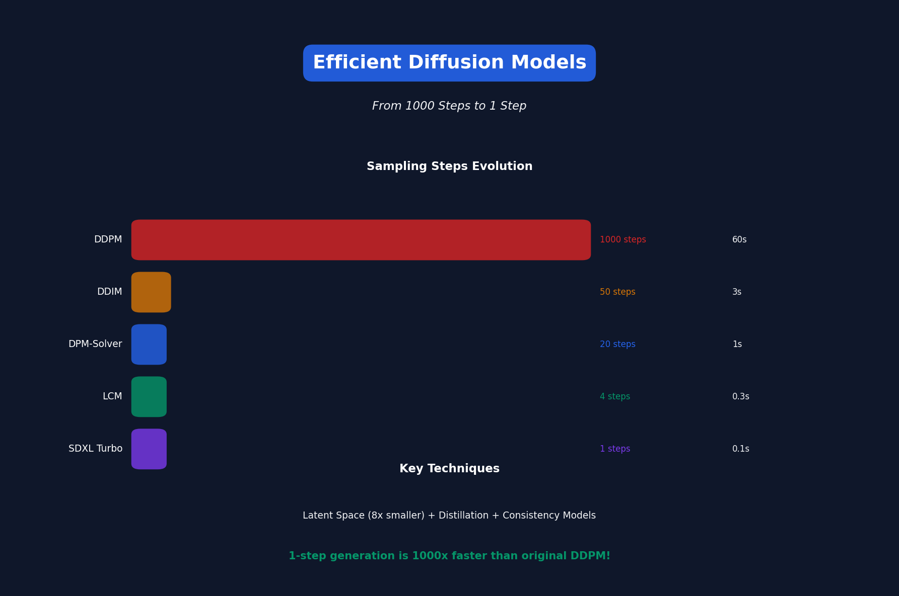

<!-- Animated Header -->
<p align="center">
  
</p>

<p align="center">
  
  
  
</p>


---

# Lecture 17: Efficient Diffusion Models

[← Back to Course](../README.md) | [← Previous](../16_efficient_llms/README.md) | [Next: Quantum ML →](../18_quantum_ml/README.md)

📺 [Watch Lecture 17 on YouTube](https://www.youtube.com/playlist?list=PL80kAHvQbh-pT4lCkDT53zT8DKmhE0idB&index=17)

[](https://colab.research.google.com/github/Gaurav14cs17/ml-researcher-foundations/blob/main/09-efficient-ml/17_efficient_diffusion_models/demo.ipynb) ← **Try the code!**

---



## Diffusion Model Basics

Diffusion models generate images by **denoising**:

```
Training: Image → Add noise step by step → Pure noise
Inference: Pure noise → Remove noise step by step → Image
```

**Problem:** Requires many steps (50-1000) = Slow!

---

## Why Are Diffusion Models Slow?

| Model | Steps | Time (A100) | Quality |
|-------|-------|-------------|---------|
| DDPM | 1000 | 60s | High |
| DDIM | 50 | 3s | High |
| LCM | 4 | 0.3s | Good |
| Turbo | 1 | 0.1s | Good |

Each step = one full neural network pass!

---

## Faster Samplers

### DDPM → DDIM
**DDIM** makes the process deterministic, allowing larger steps:

```
DDPM: Stochastic, needs 1000 steps
DDIM: Deterministic, works with 50 steps
```

### DPM-Solver
Higher-order ODE solver:

```
Euler: 1st order, needs 100 steps
DPM-Solver: 2nd-3rd order, needs 20 steps
```

---

## Latent Diffusion (Stable Diffusion)

Work in compressed latent space:

```
Image 512×512 → Encoder → Latent 64×64 → Diffusion → Decoder → Image
                  ↓
          8× smaller in each dimension
          64× fewer pixels to process!
```

---

## Distillation for Diffusion

Train student to match teacher in fewer steps:

### Progressive Distillation
```
Teacher: 1024 steps
Student 1: 512 steps (distill from teacher)
Student 2: 256 steps (distill from student 1)
...
Final: 4 steps
```

### Consistency Models
Train model to be **consistent** — same output regardless of starting noise level:

```
f(x_t) = f(x_{t'}) for any t, t' on same trajectory
```

Result: 1-2 step generation!

---

## SDXL Turbo / LCM

**Latent Consistency Models (LCM):**

```python
# Standard SD: 50 steps, classifier-free guidance
for t in reversed(range(50)):
    noise_pred = unet(latent, t, text_embed)
    latent = scheduler.step(noise_pred, t, latent)

# LCM: 4 steps, no CFG needed
for t in [999, 749, 499, 249]:
    noise_pred = lcm_unet(latent, t, text_embed)
    latent = lcm_scheduler.step(noise_pred, t, latent)
```

---

## Architecture Efficiency

### U-Net Optimization
| Technique | Speedup |
|-----------|---------|
| Fewer attention layers | 1.5x |
| Efficient attention (FlashAttention) | 2x |
| Channel pruning | 1.3x |
| Distillation | 2x |

### DiT (Diffusion Transformer)
Replace U-Net with Transformer:
- Better scaling properties
- Easier to parallelize
- Used in Sora, DALL-E 3

---

## Quantization for Diffusion

Diffusion models are sensitive to quantization:

| Method | Bits | Quality Impact |
|--------|------|----------------|
| FP16 | 16 | None |
| INT8 (weights) | 8 | Minor |
| INT8 (full) | 8 | Noticeable |
| INT4 | 4 | Significant |

**Best practice:** INT8 weights + FP16 activations

---

## Caching Techniques

### Prompt Embedding Cache
```python
# Don't recompute text embedding every step
text_embed = text_encoder(prompt)  # Cache this!
for step in steps:
    unet(latent, step, text_embed)  # Reuse
```

### Temporal Coherence (Video)
```python
# For video generation
# Cache features from previous frames
# Only compute delta
```

---

## On-Device Diffusion

Running SD on mobile:

| Device | Model | Time |
|--------|-------|------|
| iPhone 15 Pro | SD 1.5 (CoreML) | 20s |
| iPhone 15 Pro | SDXL Turbo (4 step) | 5s |
| Pixel 8 | SD 1.5 | 30s |

### Optimizations Needed
1. INT8 quantization
2. Reduced resolution (384 vs 512)
3. Fewer steps (LCM/Turbo)
4. Model pruning

---

## Text-to-Video Efficiency

Video is even more expensive:

```
Image: 512×512 = 262K pixels
Video: 512×512×30 frames = 7.8M pixels (30x more!)
```

### Techniques
1. **Temporal compression** — Latent space for time
2. **Frame interpolation** — Generate keyframes, interpolate
3. **Spatial-temporal factorization** — Process space and time separately

---

## Benchmark: Image Generation

| Model | Steps | Time (A100) | FID |
|-------|-------|-------------|-----|
| SD 1.5 | 50 | 2s | 9.5 |
| SD 1.5 | 25 | 1s | 10.2 |
| SDXL | 50 | 5s | 6.0 |
| SDXL Turbo | 1 | 0.2s | 8.5 |
| Pixart-α | 20 | 1.5s | 7.3 |

---

## Key Papers

- 📄 [DDIM](https://arxiv.org/abs/2010.02502) - Fast deterministic sampling
- 📄 [Latent Diffusion](https://arxiv.org/abs/2112.10752) - Stable Diffusion
- 📄 [Progressive Distillation](https://arxiv.org/abs/2202.00512)
- 📄 [Consistency Models](https://arxiv.org/abs/2303.01469)
- 📄 [LCM](https://arxiv.org/abs/2310.04378)

---

## Practical Recommendations

| Use Case | Model | Steps |
|----------|-------|-------|
| Quality first | SDXL | 30-50 |
| Balanced | SD 1.5 + DPM | 20 |
| Fast iteration | LCM/Turbo | 4 |
| Real-time | SDXL Turbo | 1-2 |
| Mobile | SD Turbo (INT8) | 1-4 |


---

## 📐 Mathematical Foundations

### Diffusion Forward Process

```
q(x_t | x_{t-1}) = \mathcal{N}(x_t; \sqrt{1-\beta_t} x_{t-1}, \beta_t I)
```

### DDIM Deterministic Sampling

```
x_{t-1} = \sqrt{\bar{\alpha}_{t-1}} \hat{x}_0 + \sqrt{1-\bar{\alpha}_{t-1}} \epsilon_\theta(x_t, t)
```

### Latent Space Compression

Compression ratio: 512²/64² = 64×

---

## 🎯 Where Used

| Concept | Applications |
|---------|-------------|
| DDIM/DPM++ | Fast image generation |
| LCM/Turbo | Real-time generation |
| Latent Diffusion | Stable Diffusion, SDXL |
| Consistency Models | Few-step generation |

---

## 📚 References

| Type | Resource | Link |
|------|----------|------|
| 📄 | DDIM | [arXiv](https://arxiv.org/abs/2010.02502) |
| 📄 | Latent Diffusion | [arXiv](https://arxiv.org/abs/2112.10752) |
| 📄 | LCM | [arXiv](https://arxiv.org/abs/2310.04378) |
| 📄 | Consistency Models | [arXiv](https://arxiv.org/abs/2303.01469) |
| 🎥 | MIT 6.5940 TinyML | [Course](https://hanlab.mit.edu/courses/2024-fall-65940) |
| 🇨🇳 | 知乎 - 扩散模型加速 | [Zhihu](https://www.zhihu.com/topic/20069893) |

---

---


<p align="center">
  
</p>
