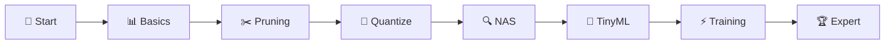
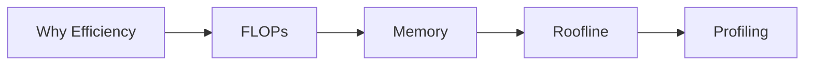
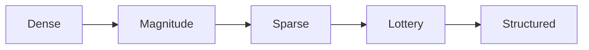
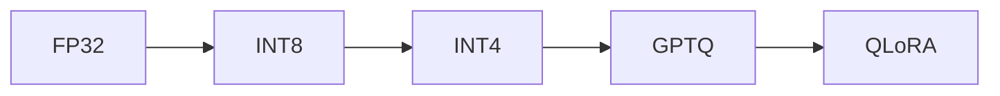
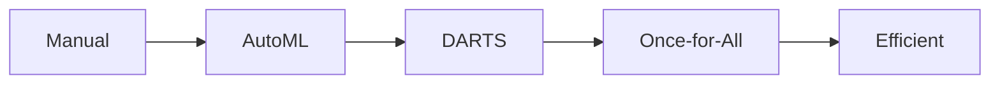
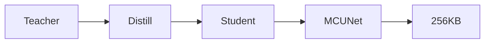
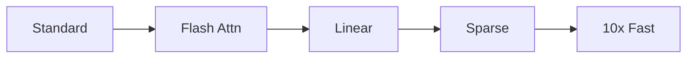
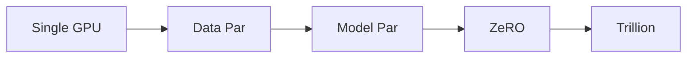
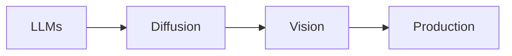

<!-- Animated Header -->
<p align="center">
  
</p>

<p align="center">
  
  
  
</p>


---

## 📊 Learning Path



## 🎯 What You'll Learn

> 🚀 **From Cloud to Edge**: Deploy AI on phones, microcontrollers, and edge devices

<table>
<tr>
<td align="center">

### ✂️ Pruning
50-90% sparse

</td>
<td align="center">

### 🔢 Quantization
GPTQ, AWQ, QLoRA

</td>
<td align="center">

### 📱 TinyML
256KB inference!

</td>
<td align="center">

### ⚡ Flash Attention
5x faster

</td>
</tr>
</table>

---

## 📚 Course Modules

### 📖 Lectures 1-2: Introduction & Basics




> 💡 **"Memory is the bottleneck, not compute"**

<a href="./01_introduction/"></a>
<a href="https://colab.research.google.com/github/Gaurav14cs17/ml-researcher-foundations/blob/main/09-efficient-ml/01_introduction/demo.ipynb"></a>

---

### ✂️ Lectures 3-4: Pruning & Sparsity




**Key:** Lottery Ticket Hypothesis, 50-90% sparsity

<a href="./03_pruning_sparsity_1/"></a>
<a href="https://colab.research.google.com/github/Gaurav14cs17/ml-researcher-foundations/blob/main/09-efficient-ml/03_pruning_sparsity_1/demo.ipynb"></a>

---

### 🔢 Lectures 5-6: Quantization ⭐

 



> 🔥 **QLoRA: Train 65B on single GPU**

<a href="./05_quantization_1/"></a>
<a href="https://colab.research.google.com/github/Gaurav14cs17/ml-researcher-foundations/blob/main/09-efficient-ml/05_quantization_1/demo.ipynb"></a>

---

### 🔍 Lectures 7-8: Neural Architecture Search




<a href="./07_neural_architecture_search_1/"></a>
<a href="https://colab.research.google.com/github/Gaurav14cs17/ml-researcher-foundations/blob/main/09-efficient-ml/07_neural_architecture_search_1/demo.ipynb"></a>

---

### 📱 Lectures 9-10: Distillation & TinyML




> 📱 **MCUNet: Run ML on 256KB microcontrollers**

<a href="./09_knowledge_distillation/"></a>
<a href="https://colab.research.google.com/github/Gaurav14cs17/ml-researcher-foundations/blob/main/09-efficient-ml/09_knowledge_distillation/demo.ipynb"></a>

---

### ⚡ Lectures 11-12: Efficient Transformers 🔥

 



> ⚡ **Flash Attention: 5x faster, O(n) memory** - In all modern LLMs

<a href="./11_efficient_transformers/"></a>
<a href="https://colab.research.google.com/github/Gaurav14cs17/ml-researcher-foundations/blob/main/09-efficient-ml/11_efficient_transformers/demo.ipynb"></a>

---

### 🌐 Lectures 13-14: Distributed Training




**Core:** ZeRO, FSDP, DeepSpeed, Megatron

<a href="./14_distributed_training/"></a>
<a href="https://colab.research.google.com/github/Gaurav14cs17/ml-researcher-foundations/blob/main/09-efficient-ml/14_distributed_training/demo.ipynb"></a>

---

### 🚀 Lectures 15-18: Efficient Models




**Covered:** LLaMA, Stable Diffusion, MobileNets, Edge Deployment

<a href="./16_efficient_llms/"></a>
<a href="./17_efficient_diffusion_models/"></a>
<a href="./15_efficient_vision_models/"></a>

---

## 💡 Key Takeaways

<table>
<tr>
<td>

### 📊 Roofline Model
```
Perf = min(Peak_Compute, 
           Peak_BW × Intensity)
```

</td>
<td>

### 🔢 Quantization
```
FP32 → INT8: 4x smaller
FP32 → INT4: 8x smaller
2-4x speedup
```

</td>
<td>

### ⚡ Flash Attention
```
Standard: O(N²) memory
Flash: O(N) memory
5x faster!
```

</td>
</tr>
</table>

---

## 🔗 Course Structure

| Week | Lectures | Topics | Lab |
|:----:|:--------:|--------|:---:|
| 1-2 | L1-L4 | Intro, Pruning | ✂️ |
| 3-4 | L5-L8 | Quantization, NAS | 🔢 |
| 5-6 | L9-L10 | Distillation, TinyML | 📱 |
| 7-8 | L11-L14 | Transformers, Training | ⚡ |
| 9-10 | L15-L18 | Production Models | 🚀 |

---

## 🛠️ Tools You'll Use

<p align="center">
  
  
  
  
</p>

---

## 📚 Official Resources

| Resource | Link |
|:--------:|------|
| 📺 **Course Website** | [hanlab.mit.edu](https://hanlab.mit.edu/courses/2023-fall-65940) |
| 📺 **YouTube Playlist** | [Watch Lectures](https://www.youtube.com/playlist?list=PL80kAHvQbh-pT4lCkDT53zT8DKmhE0idB) |
| 📝 **Lecture Slides** | [Download PDFs](https://hanlab.mit.edu/courses/2023-fall-65940) |

---

## 🗺️ Quick Navigation

| Previous | Current | Next |
|:--------:|:-------:|:----:|
| [🗜️ Compression](../08-model-compression/README.md) | **⚡ Efficient ML** | 🏆 **Production Ready!** |

---

<p align="center">
  <b>🎓 Ready to deploy AI anywhere?</b>
  <br/><br/>
  <a href="./01_introduction/"></a>
</p>

---

---


<p align="center">
  
</p>
